### ORIGINAL RESEARCH

# **Effcacy and Safety of a Fixed‑Dose Combination Gel with Adapalene 0.1% and Clindamycin 1% for the Treatment of Acne Vulgaris (CACTUS): A Randomized, Controlled, Assessor‑Blind, Phase III Clinical Trial**

Chao Luan · Wen Lin Yang · Jia Wen Yin · Lie Hua Deng · Bin Chen · Hong Wei Liu · Shou Min Zhang · Jian De Han · Zhi Jun Liu · Xiang Rong Dai · Qiu Ju Yin · Xiao Hui Yu · Kun Che[n](http://orcid.org/0000-0001-7501-4587) · Heng G[u](http://orcid.org/0000-0002-3282-1626) · Benjamin Xiao Yi L[i](http://orcid.org/0000-0002-1453-4359)

Received: July 21, 2024 / Accepted: September 24, 2024 / Published online: November 1, 2024 © The Author(s) 2024

## ABSTRACT

*Background***:** Combination therapy is required for the treatment of moderate acne vulgaris. However, patient compliance in applying multiple topical formulations is poor.

*Objective***:** To assess the effcacy and safety of a fxed-dose combination gel with adapalene 0.1% and clindamycin 1% (adapalene-clindamycin)

**Supplementary Information** The online version contains supplementary material available at [https://doi.org/10.1007/s13555-024-01286-x.](https://doi.org/10.1007/s13555-024-01286-x)

C. Luan · K. Chen (\*) · H. Gu (\*) Affliated Hospital for Skin Disease of Chinese Academy of Medical Sciences, Nanjing, No.12, Jiangwangmiao Street, Nanjing 210042, Jiangsu, People's Republic of China e-mail: kunchen181@aliyun.com

H. Gu e-mail: guheng@aliyun.com

W. L. Yang · J. W. Yin The Second Affliated Hospital of GuangZhou Medical University, Gangzhou, Guangdong, 250 Changgang East Road, Haizhu District, Guangzhou 510000, Guangdong, People's Republic of China

L. H. Deng Department of Dermatology, Jinan University First Affliated Hospital, Guangzhou, Guangdong, 613 Huangpu Avenue West, Tianhe District, Guangzhou 510630, Guangdong, People's Republic of China

relative to adapalene 0.1% monotherapy and clindamycin 1% monotherapy in patients with moderate facial acne vulgaris.

*Methods***:** This was a randomized, controlled, assessor-blind, phase III study conducted in patients with moderate facial acne vulgaris.

*Results***:** A total of 1617 patients were enrolled. At week 12, patients in the adapalene–clindamycin gel treatment group showed a signifcant reduction in the percentage change from baseline in total lesion count (−66.85%), compared with adapalene alone (−50.82%) or clindamycin gel alone (−57.61%). The difference in the least square means of the adapalene–clindamycin gel group and adapalene group, or clindamycin gel group was − 16.08% (95% CI − 19.95%

L. H. Deng Department of Dermatology, Jinan University Fifth Affliated Hospital, Heyuan, Guangdong, 892 Donghuan Road, Jiangdong New District, Heyuan 517000, Guangdong,

B. Chen

People's Republic of China

Sir Run Run Hospital, Nanjing Medical University, Nanjing, Jiangsu, 109 Longmian Avenue, Jiangning District, Nanjing 210000, Jiangsu, People's Republic of China

H. W. Liu · S. M. Zhang People's Hospital of Henan University: Henan Provincial People's Hospital, 7 Wei Wu Road, Zhengzhou 450003, Henan, People's Republic of China

to − 12.21%) and − 9.38% (95% CI − 13.25% to − 5.51%;), respectively. At week 12, 19.28% of participants who received adapalene–clindamycin gel achieved at least 2-grade improvement in IGA, versus 7.74% with adapalene gel (OR 3.05, 95% CI 1.93, 4.80) and 14.77% with clindamycin gel (OR 1.42, 95% CI 0.97, 2.07). The study also achieved all its secondary endpoints. Adverse event rates were mostly mild to moderate and comparable across the three treatment groups.

*Conclusion***:** Adapalene 0.1%–clindamycin 1% combination gel is well tolerated and demonstrated superior effcacy over 0.1% adapalene gel monotherapy and 1% clindamycin gel monotherapy for the treatment of moderate acne vulgaris.

*Trial Registration***:** ClinicalTrials.gov identifer NCT03615768.

**Keywords:** Acne vulgaris; Adapalene– clindamycin combination gel; Adapalene; Clindamycin

### **Key Summary Points**

Fixed-dose combination therapy of antibiotics and retinoids are recommended in guideline because they can target multifactorial pathogenesis of acne vulgaris.

This is the largest randomized, controlled, assessor-blind, phase III study to evaluate the effcacy and safety of a fxed-dose combination (FDC) of adapalene 0.1% and clindamycin 1% gel in patients 12 years and older with moderate facial acne vulgaris in China.

Adapalene 0.1%–clindamycin 1% combination gel demonstrated superior effcacy over 0.1% adapalene gel monotherapy and 1% clindamycin gel monotherapy in the treatment of moderate acne vulgaris, with statistical different in both two co-primary endpoints and all secondary endpoints.

Adapalene–clindamycin combination gel was safe and well tolerated.

### J. D. Han

The First Affliated Hospital of Sun Yatsen university, Guangzhou, Guangdong, No.58 Zhongshan Second Road, Yuexiu District, Guangzhou 510080, Guangdong, People's Republic of China

#### Z. J. Liu

University of South China Hengyang Medical School, No. 69 Chuanshan Road, Shigu District, Hengyang 421002, Hunan, People's Republic of China

X. R. Dai · X. H. Yu

Zhaoke Pharmaceutical (Hefei) Company Limited, No.30, Tianzhi Road, Economic Development Zone, Shushan District, Hefei 230088, Anhui, People's Republic of China

#### Q. J. Yin

Zhaoke (Guangzhou) Ophthalmology Pharmaceutical Ltd, No. 1 Meide 3rd Road, Pearl River Industrial Park, Nansha District, Guangzhou 511455, Guangdong, People's Republic of China

B. X. Y. Li (\*)

Zhaoke Ophthalmology Limited, Unit 716, 7/F, Building 12W, Phase 3, Hong Kong Science Park, Shatin 999077, Hong Kong SAR, China e-mail: drli@leespharm.com

### B. X. Y. Li

Lee's Pharmaceutical (Hong Kong) Limited, 1/F, Building 20E, Science Avenue East, Phase III, Hong Kong Science Park, New Territories, Shatin 999077, Hong Kong SAR, China

## INTRODUCTION

Acne vulgaris is one of the most prevalent diseases in the world. It is particularly common in teenagers and young adults [[1,](#page-14-0) [2\]](#page-14-1). It affects patients both mentally and physically and could have detrimental effects on their quality of life [\[3,](#page-14-2) [4\]](#page-14-3). The pathogenesis of acne vulgaris is multifactorial, characterized by excess sebum production, microbiome dysbiosis, hyperkeratinization, and release of infammatory mediators in the skin [[5,](#page-14-4) [6](#page-14-5)]. Treatment of acne vulgaris should target these known pathogenic factors.

According to the US and Chinese acne treatment guidelines, retinoids, benzoyl peroxide, and antibiotics recommended for mild-tomoderate acne treatment [[7,](#page-14-6) [8](#page-14-7)]. Retinoids are the frst-line topical therapy for the treatment and maintenance of mild acne owing to their dual comedolytic and anti-infammatory effects; topical antibiotics are not recommended as the standard treatment for acne because of the potential risk of resistance [\[7](#page-14-6), [8](#page-14-7)]. But, antibiotics are recommended when combined with retinoids [\[7](#page-14-6)]. Studies have revealed that fxed-dose combination therapy might be more effective than monotherapy for the treatment of acne [\[9,](#page-14-8) [10](#page-14-9)]. Moreover, superior effcacy of combinations of retinoids, benzoyl peroxide, and antibiotics has been observed in numerous studies [[9](#page-14-8), [11](#page-14-10)[–14\]](#page-14-11). The combinations might provide a synergistic effect by acting on different pathogenic factors, and effectively reduced both infammatory and non-infammatory acne lesions with a rapid onset of action.

When the two monotherapies of adapalene and clindamycin are used in combination, it might lead to side effects including increasing the likelihood of resistance because of uneven application and poor patient compliance because of the inconvenience. Furthermore, adapalene has been shown to increase follicular penetration of clindamycin [[15](#page-14-12)]. To date, several fxed-dose combinations including adapalene and clindamycin in nano-emulsion gel formulations have been approved in some countries like India and their efficacy and safety have been widely verified [[16–](#page-15-0)[19](#page-15-1)], but, adapalene and clindamycin gel is not available in China [\[19\]](#page-15-1). To improve patient compliance and lower the possibility of antibiotic resistance, a new combination gel of adapalene and clindamycin hydrochloride (adapalene–clindamycin gel) has been developed using patented technology, to minimize skin irritation and improve adherence to acne treatment.

The preliminary effcacy and safety of the combination of adapalene 0.1% and clindamycin 1% fxed-dose combination (FDC) were validated in a previous phase Ib + IIa study (CTR20140593) (data unpublished). In the current phase III trial, we further evaluated the effcacy and safety of adapalene 0.1% and clindamycin 1% FDC gel vs adapalene 0.1% monotherapy vs clindamycin 1% monotherapy in patients with moderate facial acne vulgaris.

## METHODS

#### **Study Design**

This study was a multicenter, randomized, assessor-blind, controlled, parallel-group phase III comparison study of the effcacy and safety of adapalene–clindamycin gel. This study was conducted in 28 sites across China from August 14, 2018 to June 15, 2020. The study was approved by the ethics committees and institutional review boards of all study sites.

The study was conducted in accordance with the Declaration of Helsinki. Written informed consent was obtained from all participants and/ or their parents or guardians. Male or female patients from 12 to 40 years old, whose facial acne scored as II or III with the Modifed Pillsbury Acne Grading Scale were enrolled in this study.

Key exclusion criteria included use of topical acne therapies within 2 weeks and use of systemic retinoids or antibiotics within 4 weeks. Patients who have known hypersensitivity to adapalene, clindamycin hydrochloride, clindamycin phosphate, lincomycin, or any ingredient of the study drug, or of allergic constitution were not enrolled in this study. Individuals with secondary acne, such as occupational acne or druginduced acne, were also excluded. In addition, patients with a dermatological condition of the face that could interfere with the clinical evaluations, such as sunburn, psoriasis, seborrheic dermatitis, or eczema, were excluded. Patients with a history of Crohn's disease, ulcerative colitis or antibiotic-associated colitis, or history of serious heart disease or hypertension, serious liver or kidney disease, aspartate transaminase (AST) or alanine transaminase (ALT) more than twice the upper limit of normal, or creatinine (Cr) above normal, serious endocrine, hematologic, or psychiatric disease, known immunocompromised conditions, or requiring long-term steroids or immunosuppressants were excluded. Women who are pregnant, lactating, or not willing to use effective contraception were not enrolled. Patients with drug or alcohol abuse, those who used any topical acne treatment within 2 weeks, or used any systemic retinoid, antibiotic, or other acne treatment were excluded. Patients who used any investigational drugs or device within 3 months or concurrently enrolled in another clinical trial were not enrolled. Patients who the investigator deemed to be unsuitable for any reason were also excluded.

Participants were randomized (1:1:1) into three groups and received the allocated treatment for 12 weeks. Subjects in the adapalene–clindamycin gel group received once daily adapalene–clindamycin gel at night, subjects in the adapalene gel group received once daily adapalene gel at night, and subjects in the clindamycin gel group received twice daily (at morning and night) clindamycin gel. Only investigators delegated as outcome assessors were blinded to treatment allocation.

#### **Safety Assessment**

The safety set included all participants who were randomized, received the study medication at least once, and had their safety assessed after receiving the study medication. The full analysis set (FAS) included all participants who were randomized and received the study medication at least once. The per protocol (PP) set included participants in the FAS who completed the study without any signifcant protocol deviations. The safety analysis was conducted on the safety set. The effcacy analysis was conducted on the FAS and PP set, with FAS as the primary set for statistical analysis.

At each visit, manual counting of infammatory and noninfammatory lesions and Investigator Global Assessment (IGA) score was performed by the blinded assessor. Vital signs, local skin reactions, and adverse events were assessed at each visit. The local skin reactions (erythema, scaling, itchiness, stinging, and burning) were assessed by a four-point scale (0, none; 1, mild; 2, moderate; 3, severe).

Investigators also assessed participants' treatment compliance by analyzing treatment diaries. The compliance rate is calculated as (number of days the participant used the study medication/number of days the participants was scheduled to use the study medication)×100%. Non-compliance was defned as a compliance rate lower than 80% or higher than 120%.

The two co-primary endpoints were the percentage change at week 12 from baseline in total lesion count and the proportion of participants achieving two-grade improvement in IGA. To reduce variability, each patient was matched with a specifc assessor for the duration of the study.

Secondary effcacy endpoints included the following observations at week 12: (i) percentage change from baseline in infammatory lesion and noninfammatory lesion counts; (ii) absolute change in infammatory, noninfammatory, and total lesion counts; (iii) change in IGA score; and (iv) treatment success rate. Treatment success was defned as an IGA score of clear (0) or almost clear (1); however, if the score at baseline was 2, success was only achieved with a score of 0 at week 12. Safety endpoints included adverse events, local skin reactions, vital signs, physical examinations, and laboratory tests.

### **Statistical Analysis**

The trial was designed so that both co-primary endpoints were expected to demonstrate statistical difference. The trial would be considered to have met its primary endpoint if either one of the co-primary endpoints demonstrated superiority with statistical difference of *p* < 0.025 (two-sided).

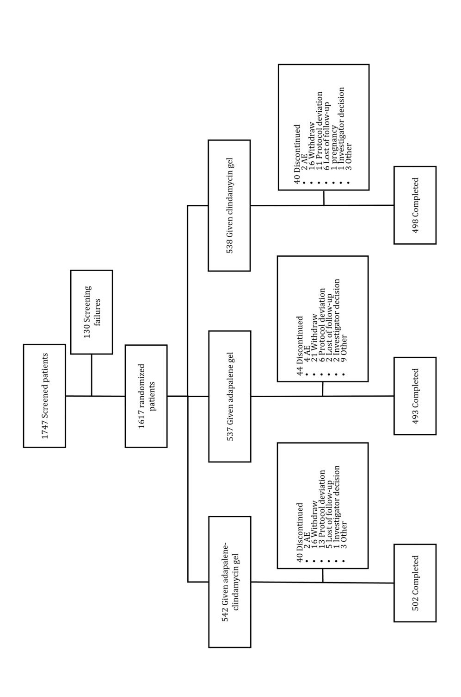

Fig. 1 CONSORT diagram. Te enrollment outcome of 1747 patients with acne. Patients were screened for study inclusion and a total of 1617 patients were rand- omized 1:1:1 in three treatment groups, receiving combination adapalene–clindamycin gel, adapalene, or clindamycin

Table 1 Patient demographic and baseline characteristics (FAS)

| Character istic                               | Patients aged 12–40                   |                  |                     |                 | Patients aged 12–18                   |                  |                     |                 |
|--------------------------------------------------|---------------------------------------|------------------|---------------------|-----------------|---------------------------------------|------------------|---------------------|-----------------|
|                                                  | Ada palene– clindamy cin gel | Adapalene gel | Clindamy cin gel | All             | Ada palene– clindamy cin gel | Adapalene gel | Clindamy cin gel | All             |
|                                                  | (N=534)                               | (N=530)          | (N=535)             | (N=1599)        | (N=31)                                | (N=37)           | (N=27)              | (N=95)          |
| Age                                              |                                       |                  |                     |                 |                                       |                  |                     |                 |
| Mean (SD)                                     | 22.1 (3.77)                           | 22.2 (3.89)      | 22.2 (3.75)         | 22.2 (3.80)     | 15.3 (1.72)                           | 15.2 (1.62)      | 14.9 (1.72)         | 15.2 (1.67)  |
| Median                                           | 21                                    | 22               | 22                  | 22              | 16                                    | 15               | 15                  | 15              |
| Age group, n (%)                                 |                                       |                  |                     |                 |                                       |                  |                     |                 |
| <18                                              | 31 (5.8%)                             | 37 (7.0%)        | 27 (5.0%)           | 95 (5.9%)       | NA                                    | NA               | NA                  | NA              |
| ≥18                                              | 503 (94.2%)                        | 493 (93.0%)   | 508 (95.0%)      | 1504 (94.1%) | NA                                    | NA               | NA                  | NA              |
| Sex                                              |                                       |                  |                     |                 |                                       |                  |                     |                 |
| Male                                             | 189 (35.4%)                        | 196 (37.0%)   | 219 (40.9%)      | 604 (37.8%)  | 14 (45.2%)                            | 15 (40.5%)       | 19 (70.4%)          | 48 (50.5%)   |
| Female                                           | 345 (64.6%)                        | 334 (63.0%)   | 316 (59.1%)      | 995 (62.2%)  | 17 (54.8%)                            | 22 (59.5%)       | 8 (29.6%)           | 47 (49.5%)   |
| IGA score                                        |                                       |                  |                     |                 |                                       |                  |                     |                 |
| 2                                                | 135 (25.3%)                        | 127 (24.0%)   | 99 (18.5%)          | 361 (22.6%)  | 7 (22.6%)                             | 11 (29.7%)       | 7 (25.9%)           | 25 (26.3%)   |
| 3                                                | 372 (69.7%)                        | 372 (70.2%)   | 400 (74.8%)      | 1144 (71.5%) | 22 (71.0%)                            | 25 (67.6%)       | 17 (63.0%)          | 64 (67.4%)   |
| 4                                                | 27 (5.1%)                             | 31 (5.8%)        | 36 (6.7%)           | 94 (5.9%)       | 2 (6.5%)                              | 1 (2.7%)         | 3 (11.1%)           | 6 (6.3%)        |
| Total lesion count, mean (SD)           | 51.9 (18.46)                       | 53.1 (18.81)  | 55.5 (19.69)        | 53.5 (19.04) | 58.0 (17.12)                       | 56.4 (20.74)  | 60.1 (20.10)        | 58.0 (19.30) |
| Infamma tory lesion count, mean (SD) | 20.6 (10.49)                       | 21.5 (11.46)  | 22.0 (10.99)        | 21.4 (10.99) | 20.1 (8.52)                           | 22.4 (11.38)  | 22.1 (12.76)        | 21.5 (10.90) |

Table 1 continued

| Character istic                                      | Patients aged 12–40                   |                  |                     |                 | Patients aged 12–18                   |                  |                     |              |  |
|---------------------------------------------------------|---------------------------------------|------------------|---------------------|-----------------|---------------------------------------|------------------|---------------------|--------------|--|
|                                                         | Ada palene– clindamy cin gel | Adapalene gel | Clindamy cin gel | All             | Ada palene– clindamy cin gel | Adapalene gel | Clindamy cin gel | All          |  |
|                                                         | (N=534)                               | (N=530)          | (N=535)             | (N=1599)        | (N=31)                                | (N=37)           | (N=27)              | (N=95)       |  |
| Non infamma tory lesion count, mean (SD) | 31.3 (15.69)                       | 31.6 (15.86)  | 33.5 (16.72)        | 32.2 (16.12) | 37.9 (16.43)                       | 34.0 (16.04)  | 38.1 (18.08)        | 36.4 (16.70) |  |

*FAS* full analysis set, *N* number of patients, *SD* standard deviation, *IGA* Investigator Global Assessment, *NA* not applicable

On the basis of the results from the unpublished phase Ia+IIb study, we estimated that at least 431 patients in each treatment group were required to provide 90% power. To account for a potential dropout rate of 20%, a total of 1617 patients were recruited. No interim analyses were planned. The statistical analysis was performed using SAS, version 9.4 (SAS Institute).

The analysis of the percentage change in total lesion count at week 12 was performed with an analysis of covariance (ANCOVA) model, with percentage change in total lesion count at week 12 as dependent variable, treatment group as independent variable, and total lesion count at baseline as covariate. Least square means with associated 97.5% CIs of difference from the analysis of covariance were analyzed. If both lower bounds of the 97.5% CI were less than 0%, it could be concluded that adapalene–clindamycin is superior to both control groups.

To compare the proportion of patients achieving two-grade IGA improvement at week 12, a Cochran–Mantel–Haenszel test, stratified by center, was used to analyze the odds ratio and the corresponding 97.5% CIs, between adapalene–clindamycin group and the two control groups.

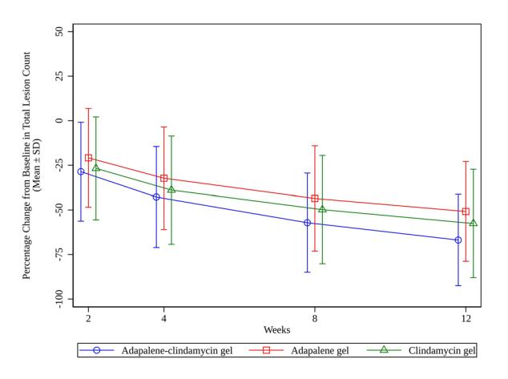

Fig. 2 Total lesion count changes (FAS). At weeks 2, 4, 8, and 12, reductions in total lesion count were measured in the adapalene–clindamycin combination gel, adapalene gel, or clindamycin gel group, respectively. Data are expressed as mean±SD

## RESULTS

#### **Patients and Exposure**

A total of 1617 patients were include and randomized 1:1:1 to receive three treatment: (i) 542 in the adapalene–clindamycin gel group, 534 participants (98.5%) had used the drug at least once; (ii) 537 in the adapalene gel group and 530 participants (98.7%) had used the drug at least once; and (iii) 538 in clindamycin gel group and

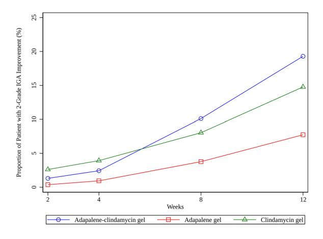

Fig. 3 Proportion of patients achieving two-grade IGA improvement (FAS). At weeks 2, 4, 8, and 12, numbers of patients achieving two-grade improvement in IGA in the adapalene–clindamycin combination gel group, adapalene gel group, and clindamycin gel group, respectively, were evaluated

535 participants (99.4%) had used the drug at least once. Figure [1](#page-4-0) shows the enrollment outcome of the study. Table [1](#page-5-0) shows the patient demographics and baseline characteristics. All characteristics were balanced across groups.

Overall, 99.4% patients demonstrate good compliance rate to the treatment. Only 10 (0.6%) patients had a compliance rate lower than 80%.

#### **Effcacy**

The primary efficacy endpoint was met. At week 12, the percentage change from baseline in total lesion count was 66.85% (SD 25.59%), 50.82% (SD 27.93%), and 57.61% (SD 30.40%) in the adapalene–clindamycin gel group, adapalene group, and clindamycin group, respectively (Fig. [2\)](#page-6-0). The difference between adapalene–clindamycin gel group and adapalene group was − 16.08% (97.5% CI − 19.95% to − 12.21%), *P* < 0.0001. The difference between

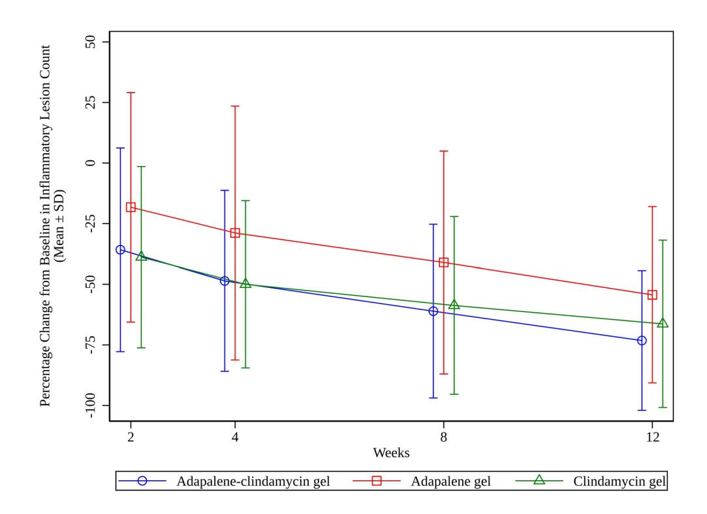

Fig. 4 Percentage change from baseline in infammatory lesion count (FAS). At weeks 2, 4, 8, and 12, the percentage change from baseline in infammatory lesion count was

measured in the adapalene–clindamycin combination gel, adapalene gel, or clindamycin gel group, respectively. Data are expressed as mean±SD

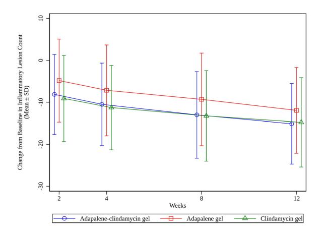

Fig. 5 Change from baseline in infammatory lesion count (FAS). At weeks 2, 4, 8, and 12, the change from baseline in infammatory lesion count was measured in the adapalene–clindamycin combination gel, adapalene gel, or clindamycin gel group, respectively. Data are expressed as mean±SD

adapalene–clindamycin group and clindamycin group was − 9.38% (97.5% CI − 13.25% to − 5.51%), *P* < 0.0001. The lower bounds of 97.5% CI were both lower than 0%, which demonstrated that adapalene–clindamycin gel was superior to both adapalene gel and clindamycin gel in percentage change of total lesion count at week 12. At week 12, 103 (19.28%)

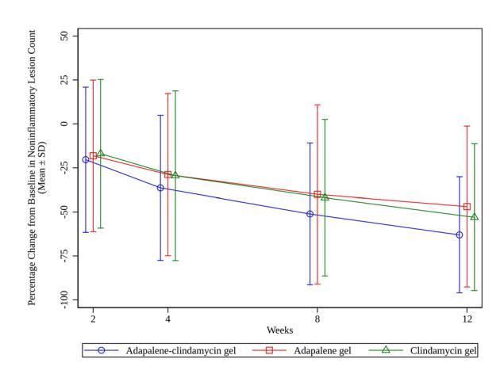

Fig. 6 Percentage change from baseline in noninfammatory lesion count (FAS). At weeks 2, 4, 8, and 12, the percentage change from baseline in noninfammatory lesion count was measured in the adapalene–clindamycin combination gel, adapalene gel, or clindamycin gel group, respectively. Data are expressed as mean±SD

patients in the adapalene–clindamycin gel group achieved two-grade improvement in IGA, whereas 41 (7.74%) and 79 (14.77%) achieved two-grade improvement in IGA in the adapalene gel group and clindamycin gel group, respectively (Fig. [3](#page-7-0)). The odds ratio between the adapalene–clindamycin gel group and adapalene group was 3.05 (97.5% CI 1.93 to 4.80), *P* < 0.0001. The odds ratio between adapalene–clindamycin gel group and clindamycin gel group was 1.42 (97.5% CI 0.97 to 2.07), *P* = 0.039. The 97.5% lower bound of the odds ratio between adapalene–clindamycin gel and adapalene gel was higher than 1, which showed that adapalene–clindamycin gel was superior to adapalene gel in achieving twograde IGA improvement at week 12. This was not the case between adapalene–clindamycin and clindamycin, since the lower bound of their odds ratio was lower than 1.

The study also met its secondary endpoint. At week 12, the percentage change from baseline in infammatory lesion was −73.20%, −54.33% ,and − 66.33% in the adapalene–clindamycin gel, adapalene gel, and clindamycin gel group, respectively (Fig. [4\)](#page-7-1). The adapalene–clindamycin gel group demonstrated statistically signifcant difference in reducing infammatory lesion counts when compared with the adapalene gel

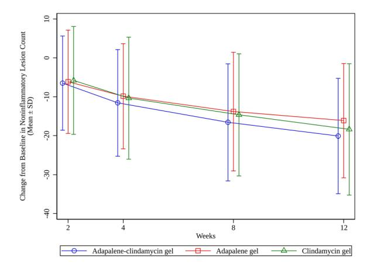

Fig. 7 Change from baseline in noninfammatory lesion count (FAS). At weeks 2, 4, 8, and 12, the change from baseline in noninfammatory lesion count was measured in the adapalene–clindamycin combination gel, adapalene gel, or clindamycin gel group, respectively. Data are expressed as mean±SD

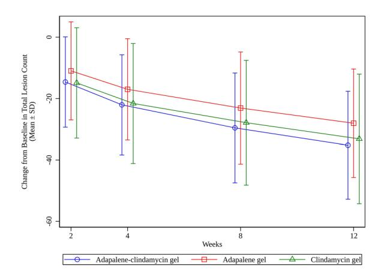

Fig. 8 Change from baseline in total lesion count (FAS). At weeks 2, 4, 8, and 12, the change from baseline in total lesion count was measured in the adapalene–clindamycin combination gel, adapalene gel, or clindamycin gel group, respectively. Data are expressed as mean±SD

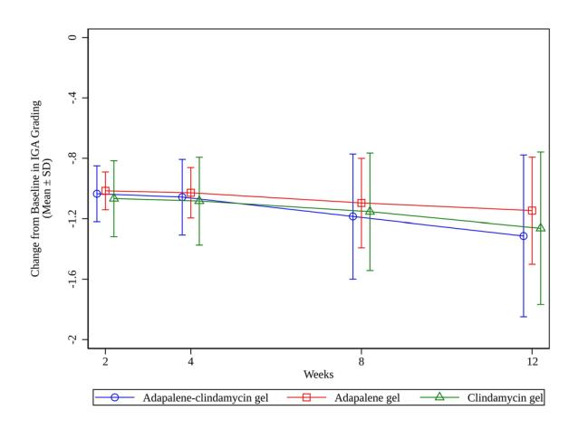

Fig. 9 Change from baseline in IGA grading (FAS). At weeks 2, 4, 8, and 12, the change from baseline in IGA grading was measured in the adapalene–clindamycin combination gel, adapalene gel, or clindamycin gel group, respectively. Data are expressed as mean±SD

and clindamycin gel group; the least squares mean difference and 95% CI were − 19.03% (− 23.17%, − 14.90%, *p* < 0.0001) and − 7.17% (− 11.31%, − 3.04%, *P* = 0.0007), respectively. The absolute changes in infammatory lesion counts were − 15.1 (9.60), − 11.9 (10.21), and − 14.8 (10.63) in the adapalene–clindamycin gel, adapalene gel, and clindamycin gel group, respectively (Fig. [5](#page-8-0)), when compared with the adapalene gel and clindamycin gel group; the least squares mean difference and 95% CI were − 3.8 (− 4.6, − 2.9, *p* < 0.0001) and − 1.4 (− 2.3, −0.6, *P*=0.0022), respectively.

At week 12, the percentage change from baseline in noninfammatory lesion was − 63.04%, − 46.93%, and − 53.02% in the adapalene–clindamycin gel, adapalene gel, and clindamycin gel group, respectively (Fig. [6\)](#page-8-1). The adapalene–clindamycin gel group demonstrated statistically signifcant difference in reducing noninfammatory lesion counts when compared with the adapalene gel and clindamycin gel group; the least squares mean difference and 95% CI were − 16.40% (− 21.38%, − 11.41%, *p* < 0.0001) and −10.74% (−15.72%, −5.75%, *P*<0.0001), respectively. The absolute change in noninfammatory lesion counts was −20.1 (14.82), −16.1 (14.67), and −18.4 (16.87) in the adapalene–clindamycin gel, adapalene gel, and clindamycin gel group, respectively (Fig. [7](#page-8-2)), when compared with the adapalene gel and clindamycin gel group, the least squares mean difference and 95% CI were − 4.6 (− 6.0, − 3.1, *p* < 0.0001) and − 3.1 (− 4.5, −1.6, *P*<0.0001), respectively.

The absolute change in total lesion counts was − 35.2 (17.58), − 28.1 (17.66), and − 33.1 (21.11) in the adapalene–clindamycin gel, adapalene gel, and clindamycin gel group, respectively (Fig. [8\)](#page-9-0), when compared with the adapalene gel and clindamycin gel group; the least squares mean difference and 95% CI were −8.2 (− 10.1, − 6.4, *p* < 0.0001) and − 4.4 (− 6.2, − 2.5, *P*<0.0001), respectively.

The change from baseline in IGA score at week 12 was − 1.3 (0.54), − 1.1 (0.35), − 1.3 (0.50) in the adapalene–clindamycin gel, adapalene gel, and clindamycin gel group, respectively (Fig. [9\)](#page-9-1). Figure [10](#page-10-0) shows photos of patients before and after treatment in the three groups. Among the three groups, the adapalene–clindamycin gel group demonstrated the highest treatment success rate at week 12, with a success rate of 16.5%, followed by the clindamycin phosphate gel group (success rate of 11.6%), and the lowest success rate was in the adapalene gel group (success rate of 4.3%), the difference between groups was statistically signifcant (vs adapalene gel, *P*<0.0001; vs clindamycin gel, *P* = 0.0213) (Fig. [11\)](#page-10-1).

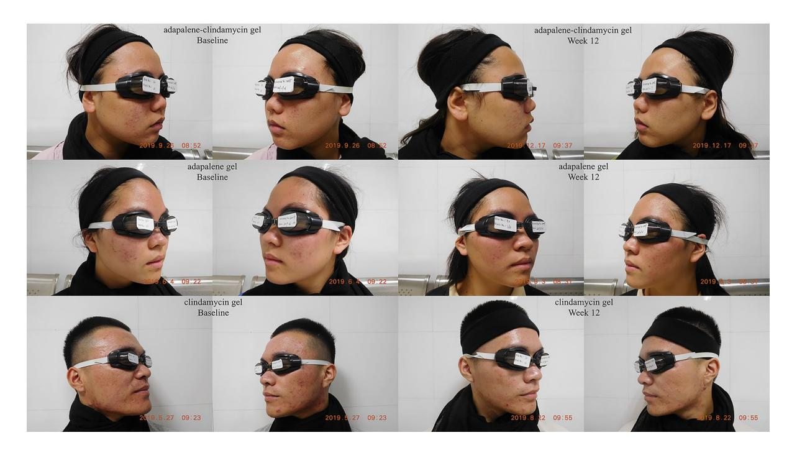

Fig. 10 Photos of patients prior to and afer 12 weeks of treatment in the three groups

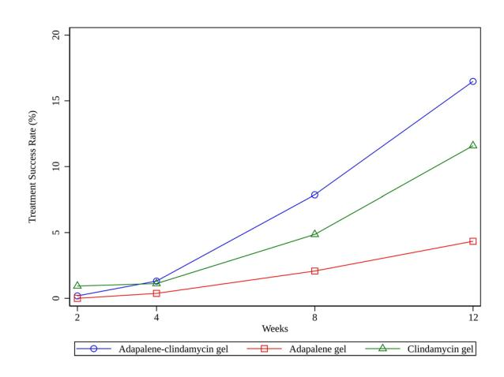

Fig. 11 Treatment success rate in the three groups (FAS). At weeks 2, 4, 8, and 12, the treatment success rate was calculated in the adapalene–clindamycin combination gel, adapalene gel, or clindamycin gel group, respectively

#### **Safety**

Overall, adapalene–clindamycin gel was safe and well tolerated and the combination of the two active ingredients did not cause any additional adverse reactions; 238 (44.74%) patients

in the adapalene–clindamycin gel group, 235 (44.51%) patients in the adapalene gel group, and 207 (38.69%) patients in the clindamycin gel group reported treatment-emergent adverse events (TEAE). Most TEAE were considered mild or moderate. The most common TEAE reported for all treatment groups was upper respiratory tract infection, with 40 (7.52%) patients in the adapalene–clindamycin gel group, 39 (7.39%) in the adapalene gel group, and 53 patients (9.91%) in the clindamycin gel group reporting such an event. Drug-related TEAE occurred in 83 (15.60%) patients in the adapalene–clindamycin gel group, 69 (13.07%) patients in the adapalene gel group, and 18 (3.36%) patients in the clindamycin gel group in which dry skin was the most frequently reported. Severe TEAE occurred in 5 (0.94%), 9 (1.70%), and 2 (0.37%) patients in the adapalene–clindamycin gel, adapalene gel, and clindamycin gel group, respectively. TEAEs that caused study drug discontinuation were reported in 48 (9.02%), 38 (7.20%), and 9 (1.68%) subjects in the adapalene–clindamycin gel, adapalene gel, and clindamycin gel groups, respectively. Four subjects (0.8%) in the adapalene–clindamycin gel

Table 2 Adverse event summary (SS)

| Event                                                         | Patients aged 12–40              |               |                 | Patients aged 12–18              |               |                 |  |
|---------------------------------------------------------------|----------------------------------|---------------|-----------------|----------------------------------|---------------|-----------------|--|
|                                                               | Adapalene– clindamycin gel | Adapalene gel | Clindamycin gel | Adapalene– clindamycin gel | Adapalene gel | Clindamycin gel |  |
|                                                               | (N=532)                          | (N=528)       | (N=535)         | (N=30)                           | (N=35)        | (N=22)          |  |
|                                                               | n (%)                            | n (%)         | n (%)           | n (%)                            | n (%)         | n (%)           |  |
| TEAE                                                          | 238 (44.7%)                      | 235 (44.5%)   | 207 (38.7%)     | 19 (63.3%)                       | 13 (35.1%)    | 7 (25.9%)       |  |
| Drug-related TEAE                                             | 83 (15.6%)                       | 69 (13.1%)    | 18 (3.4%)       | 5 (16.7%)                        | 3 (8.1%)      | 0               |  |
| Most frequently reported drug-related TEAE (≥3% in any group) |                                  |               |                 |                                  |               |                 |  |
| Dry skin                                                      | 28 (5.3%)                        | 29 (5.5%)     | 5 (0.9%)        | 1 (3.3%)                         | 1 (2.7%)      | 0               |  |
| Skin stripped                                                 | 28 (5.3%)                        | 29 (5.5%)     | 5 (0.9%)        | 2 (6.7%)                         | 2 (5.4%)      | 0               |  |
| Pruritus                                                      | 6 (1.1%)                         | 7 (1.3%)      | 0               | 2 (6.7%)                         | 1 (2.7%)      | 0               |  |
| Erythema                                                      | 13 (2.4%)                        | 5 (0.9%)      | 1 (0.2%)        | 1 (3.3%)                         | 0             | 0               |  |
| Paresthesia                                                   | 13 (2.4%)                        | 4 (0.8%)      | 1 (0.2%)        | 3 (10.0%)                        | 0             | 0               |  |
| Peri-orbit swollen                                            | 0                                | 0             | 0               | 1 (3.3%)                         | 0             | 0               |  |
| Serious adverse event                                      | 5 (0.9%)                         | 4 (0.8%)      | 1 (0.2%)        | 0                                | 0             | 0               |  |
| Drug-related SAE                                              | 0                                | 0             | 0               | 0                                | 0             | 0               |  |

*SS* safety set, *TEAE* treatment-emergent adverse efect, *N* number of patients enrolled, *n* number of event

group, 5 subjects (0.9%) in the adapalene gel group, and 1 subject (0.2%) in the clindamycin gel group reported TEAEs that led to permanent discontinuation of the study drug. Serious adverse events (SAE) occurred in 5 (0.94%, 1 case each of congenital aural fstula, congenital cerebral cysts, infectious pneumonia, nasal septal deviation, and threatened abortion) patients in the adapalene–clindamycin gel group, 4 (0.76%, 1 case each of biochemical pregnancy, spontaneous abortion, fbroadenoma breast, and hyperplasia of mammary glands) patients in the adapalene gel group and 1 (0.19%, 1 case of vascular and lymphatic diseases) patient in the clindamycin gel group. No drug-related SAE was reported. Safety of patients aged 12–18 years old was similar to the overall study population. Table [2](#page-11-0) shows a summary of the adverse events of this study.

The proportions of patients with local skin reactions were similar in all treatment groups. The reported local skin reactions were mostly mild or moderate. The proportions of patients who experienced severe local skin reaction were similar in all treatment groups. No substantial changes in laboratory values, vital signs, physical examinations, and ECG were observed in all treatment groups.

## DISCUSSION

The current study is designed as a randomized, controlled, assessor-blind phase III clinical trial to evaluate the effcacy and safety of adapalene–clindamycin gel. It has enrolled total 1617 patients, making it the largest dermatology clinical trial in China. The results showed that the study met the primary endpoint and demonstrated that adapalene–clindamycin gel applied once daily for 12 weeks was superior to adapalene gel monotherapy and clindamycin gel monotherapy, in reducing total lesion counts in patients with moderate facial acne. Although monotherapy, such as adapalene and clindamycin, can be applied separately to patients with acne vulgaris, the possibly uneven localized coat on the skin might increase the risk of developing bacterial resistance [[20](#page-15-2)]. In addition, applying multiple drugs frequently will reduce patient compliance. Hence, the new combination gel containing adapalene and clindamycin hydrochloride developed using a patented unique formulation minimizes skin irritation and optimizes adherence for acne treatment. The mean treatment compliance in this study is 98.37% (SD 4.72); only 5 (0.94%), 1 (0.19%), and 4 (0.75%) patients in the adapalene–clindamycin gel, adapalene gel, and clindamycin gel group showed a compliance rate lower than 80%, respectively. The unique and stable formulation of adapalene–clindamycin (once-daily) has demonstrated signifcant improvement in patient compliance.

Patients who used adapalene–clindamycin gel for 12 weeks achieved a mean reduction of 66.85% in their total lesion count. The result was consistent with previous studies using adapalene 0.1% gel and clindamycin 1% lotion in combination, with mean reduction ranging from 46.7% to 75.1% [[18–](#page-15-3)[20\]](#page-15-2). Although there was no signifcant difference in the proportion of patients achieving a two-grade IGA improvement between adapalene–clindamycin combination gel group and clindamycin group, more patients in the combination gel group reached the endpoint than those applying either adapalene 0.1% gel (q.n.) (103 vs 41) or clindamycin 1% (b.i.d.) (103 vs 79). In this study, the sample size is powered to detect the statistically signifcant difference in total lesion count, which could explain the failure to see statistical difference between combination gel and clindamycin in two-grade IGA improvement. The dosage of clindamycin in the adapalene–clindamycin combination group was half of that in the clindamycin monotherapy group, indicating that the adapalene–clindamycin gel with low dose of clindamycin might also be suffcient to achieve similar effects in treating infammatory lesions. Moreover, adapalene has been shown to increase follicular penetration of clindamycin, which might further reduce the effective dosage of clindamycin in the combination compared with the monotherapy [\[15](#page-14-12)]. The overuse of topical antibiotics like clindamycin and erythromycin has been reported to increase the risk of bacterial resistance by developing cross-resistant strains of Propionibacteria [\[21](#page-15-4)]. The guideline for treating acne in China and the USA has recommended not prescribing antibiotics as the monotherapy and reducing the possibility of antibiotic resistance [\[7,](#page-14-6) [8\]](#page-14-7). The long-term use of high-dose antibiotics has been recognized to develop resistance to antibiotics [\[21\]](#page-15-4). In fact, studies have shown that the clindamycin-resistant strains were frequently isolated from patients with moderate-to-severe acne [[22,](#page-15-5) [23](#page-15-6)]. Reduction in selection pressure, interference with the transmission of problematic genotypes, and multidrug approaches have been recommended as effective approaches to reduce bacterial resistance [[22](#page-15-5)]. The low dosage of clindamycin in the combination gel might reduce the risk of developing resistance by reduction of the selection pressure.

The results of the current phase III trial have also indicated that the adapalene–clindamycin combination gel is safe and well tolerated. The adapalene–clindamycin combination gel did not cause additional adverse reactions beyond those of the monotherapy. No drug-related serious adverse event was reported. Though the adverse event rate of the adapalene–clindamycin gel group (44.74%) was higher than that of the clindamycin gel group (38.69%), the adverse event rate was comparable to that of the adapalene gel group (44.51%). The rate of drug-related TEAE was also higher in the adapalene–clindamycin gel group (15.60%) and adapalene gel group (13.07%) than that of the clindamycin gel group (3.36%). The drug-related TEAEs reported were similar in the adapalene–clindamycin gel group and adapalene gel group. Although clindamycin gel appears to have fewer adverse effects, it is also less effcacious in the treatment of moderate acne vulgaris than the adapalene–clindamycin combination gel. Moreover, clindamycin is generally not recommended as a monotherapy for the treatment of acne because of potential development of antibiotic resistance. More importantly, acne usually occurs in adolescence and, therefore, the safety of adapalene–clindamycin gel is also important [\[2](#page-14-1), [7](#page-14-6)]. The clinical data showed that no SAE or drug-related SAE was reported in the patients aged 12–18 years old, indicating that the fxed-dose adapalene–clindamycin gel is also safe in adolescent patients. Taken together, by incorporating clindamycin into a fxed-dose combination with adapalene, the combination gel is more effcacious than using the individual drugs alone, while having a similar safety profle to the already marketed adapalene gel.

There are some limitations in this study. As a result of differences in the drug appearance and dosing frequency between adapalene–clindamycin gel and the two comparators, the patients and the investigators could not be blinded. By blinding the assessor, the possibility of bias in outcome assessment was reduced; however, there might be bias in the safety assessment. In theory, treatment compliance should be higher for patients using adapalene–clindamycin gel, as compared with using the two individual drugs at the same time. This study, however, only compared the compliance of using adapalene–clindamycin gel with adapalene or clindamycin monotherapy. The true compliance advantage of the once-daily administration in the real world was not determined in this study. Finally, the number of patients under 18 years old is small, limiting the statistical analysis of this subgroup of patients.

## CONCLUSIONS

This study evaluated the effcacy and safety of adapalene–clindamycin gel in patients 12 years and older with moderate facial acne vulgaris. Our results show that the fxed-dose combination with adapalene 0.1% and clindamycin 1% is more effcacious than using adapalene monotherapy or clindamycin monotherapy. The combination does not cause additional adverse reactions beyond those of the individual components. The less frequent oncedaily administration of a single gel product will increase convenience and further improve patient compliance. In summary, the adapalene–clindamycin combination gel provides multiple advantages over conventional treatments in the fght against acne vulgaris.

*Author Contributions.* Kun Chen, Heng Gu and Benjamin Xiao Yi Li conceived and designed the study and were responsible for administrative, technical, or material support. Wen Lin Yang, Jia Wen Yin, Lie Hua Deng, Bin Chen, Hong Wei Liu, Shou Min Zhang, Jian De Han and Zhi Jun Liu conducted the study, including acquisition, analysis, or interpretation of data. Chao Luan and Xiang Rong Dai were responsible for statistical analysis. Chao Luan, Kun Chen, Heng Gu, Qiu Ju Yin and Xiao Hui Yu drafted the manuscript. All authors critically revised the manuscript. All authors gave fnal approval of the manuscript. Kun Chen, Heng Gu and Benjamin Xiao Yi Li contributed equally to this work and are the joint corresponding authors. The corresponding author attests that all listed authors meet authorship criteria and that no others meeting the criteria have been omitted.

*Funding.* This study was funded by Lee's Pharmaceutical (Hong Kong) Limited and Zhaoke (Guangzhou) Ophthalmology Pharmaceutical Ltd., China. The study sponsor is also funding the journal's Rapid Service Fee.

*Data Availability.* The datasets generated during and/or analyzed during the current study are available from the corresponding author on reasonable request.

### *Declarations*

*Confict of Interest.* Dr. Benjamin Xiao Yi Li is the Chairman & CEO of Zhaoke Ophthalmology Limited, and Director of Zhaoke Pharmaceutical (Hefei) Company Limited and Lee's Pharmaceutical (Hong Kong) Limited. Xiang Rong DAI, and Xiao Hui YU are the staffs employed by Zhaoke Pharmaceutical (Hefei) Company Limited. Qiu Ju YIN is the staff employed by Zhaoke (Guangzhou) Ophthalmology Pharmaceutical Limited; The other authors declare no confict of interest.

*Ethics Approval.* The trial was conducted in accordance with the Good Clinical Practice guidelines and complies with the Declaration of Helsinki. The protocol and informed consent form were reviewed and approved by a properly constituted institutional review board/independent ethics committee/research ethics board before study commencement. The names of the approving ethics committees are listed in Supplementary Table 1.

*Open Access.* This article is licensed under a Creative Commons Attribution-NonCommercial 4.0 International License, which permits any non-commercial use, sharing, adaptation, distribution and reproduction in any medium or format, as long as you give appropriate credit to the original author(s) and the source, provide a link to the Creative Commons licence, and indicate if changes were made. The images or other third party material in this article are included in the article's Creative Commons licence, unless indicated otherwise in a credit line to the material. If material is not included in the article's Creative Commons licence and your intended use is not permitted by statutory regulation or exceeds the permitted use, you will need to obtain permission directly from the copyright holder. To view a copy of this licence, visit [http://creativeco](http://creativecommons.org/licenses/by-nc/4.0/) [mmons.org/licenses/by-nc/4.0/.](http://creativecommons.org/licenses/by-nc/4.0/)

## REFERENCES

- 1. Tan JK, Bhate K. A global perspective on the epidemiology of acne. Br J Dermatol. 2015;172:3–12.
- 2. Shen Y, Wang T, Zhou C, et al. Prevalence of acne vulgaris in Chinese adolescents and adults: a community-based study of 17,345 subjects in six cities. Acta Derm Venereol. 2012;92:40–4.
- 3. Magin P, Adams J, Heading G, et al. Psychological sequelae of acne vulgaris: results of a qualitative study. Can Fam Physician. 2006;52:978–9.
- 4. Al Robaee AA. Assessment of general health and quality of life in patients with acne using a validated generic questionnaire. Acta Dermatovenerol Alp Pannonica Adriat. 2009;18:157–64.
- 5. Thiboutot D, Gollnick H, Bettoli V, et al. New insights into the management of acne: an update

- from the Global Alliance to Improve Outcomes in Acne group. J Am Acad Dermatol. 2009;60:S1–50.
- 6. Thiboutot DM, Dréno B, Abanmi A, et al. Practical management of acne for clinicians: an international consensus from the Global Alliance to Improve Outcomes in Acne. J Am Acad Dermatol. 2018;78:1–23.
- 7. Working group for acne diseases, Chinese Society of Dermatology. Guideline for diagnosis and treatment of acne (the 2019 revised edition). J Clin Dermatol. 2019;48:583–588.
- 8. Zaenglein AL, Pathy AL, Schlosser BJ, et al. Guidelines of care for the management of acne vulgaris [published correction appears in J Am Acad Dermatol. 2020;82:1576]. J Am Acad Dermatol. 2016;74:945–73.
- 9. Langner A, Chu A, Goulden V, et al. A randomized, single-blind comparison of topical clindamycin + benzoyl peroxide and adapalene in the treatment of mild to moderate facial acne vulgaris. Br J Dermatol. 2008;158:122–9.
- 10. Jacobs A, Starke G, Rosumeck S, et al. Systematic review on the rapidity of the onset of action of topical treatments in the therapy of mild-to-moderate acne vulgaris. Br J Dermatol. 2014;170:557–64.
- 11. Dréno B, Kaufmann R, Talarico S, et al. Combination therapy with adapalene-benzoyl peroxide and oral lymecycline in the treatment of moderate to severe acne vulgaris: a multicentre, randomized, double-blind controlled study. Br J Dermatol. 2011;165:383–90.
- 12. Gonzalez P, Vila R, Cirigliano M. The tolerability profle of clindamycin 1%/benzoyl peroxide 5% gel vs. adapalene 0.1%/benzoyl peroxide 2.5% gel for facial acne: results of a randomized, single-blind, split-face study. J Cosmet Dermatol. 2012;11:251–60.
- 13. Gold MH, Baldwin H, Lin T. Management of comedonal acne vulgaris with fxed-combination topical therapy. J Cosmet Dermatol. 2018;17:227–31.
- 14. Ko HC, Song M, Seo SH, et al. Prospective, openlabel, comparative study of clindamycin 1%/benzoyl peroxide 5% gel with adapalene 0.1% gel in Asian acne patients: effcacy and tolerability. J Eur Acad Dermatol Venereol. 2009;23:245–50.
- 15. Jain GK, Ahmed FJ. Adapalene pretreatment increases follicular penetration of clindamycin: in vitro and in vivo studies. Indian J Dermatol Venereol Leprol. 2007;73:326–9.

- 16. Brand B, Gilbert R, Baker MD, et al. Cumulative irritancy comparison of adapalene gel 0.1% versus other retinoid products when applied in combination with topical antimicrobial agents. J Am Acad Dermatol. 2003;49:S227–32.
- 17. Ochsendorf F. Clindamycin phosphate 1.2% / tretinoin 0.025%: a novel fxed-dose combination treatment for acne vulgaris. J Eur Acad Dermatol Venereol. 2015;29:8–13.
- 18. Wolf JE Jr, Kaplan D, Kraus SJ, et al. Effcacy and tolerability of combined topical treatment of acne vulgaris with adapalene and clindamycin: a multicenter, randomized, investigator-blinded study. J Am Acad Dermatol. 2003;49:S211–7.
- 19. Prasad S, Mukhopadhyay A, Kubavat A, et al. Effcacy and safety of a nano-emulsion gel formulation of adapalene 0.1% and clindamycin 1% combination in acne vulgaris: a randomized, open label, active-controlled, multicentric, phase IV

- clinical trial. Indian J Dermatol Venereol Leprol. 2012;78:459–67.
- 20. Zhang JZ, Li LF, Tu YT, et al. A successful maintenance approach in infammatory acne with adapalene gel 0.1% after an initial treatment in combination with clindamycin topical solution 1% or after monotherapy with clindamycin topical solution 1%. J Dermatolog Treat. 2004;15:372–8.
- 21. Nakase K, Aoki S, Sei S, et al. Characterization of acne patients carrying clindamycin-resistant Cutibacterium acnes: a Japanese multicenter study. J Dermatol. 2020;47:863–9.
- 22. Ross JI, Snelling AM, Carnegie E, Cove JH, et al. Antibiotic-resistant acne: lessons from Europe. Br J Dermatol. 2001;148:467–78.
- 23. Leyden JJ. Antibiotic resistance in the topical treatment of acne vulgaris. Cutis. 2004;73:6–10.