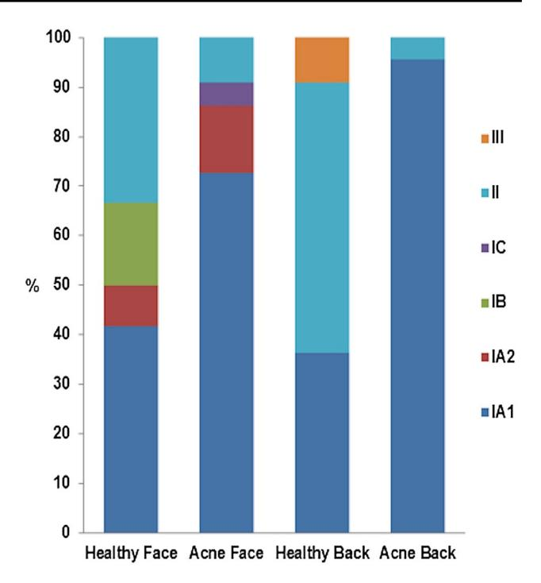
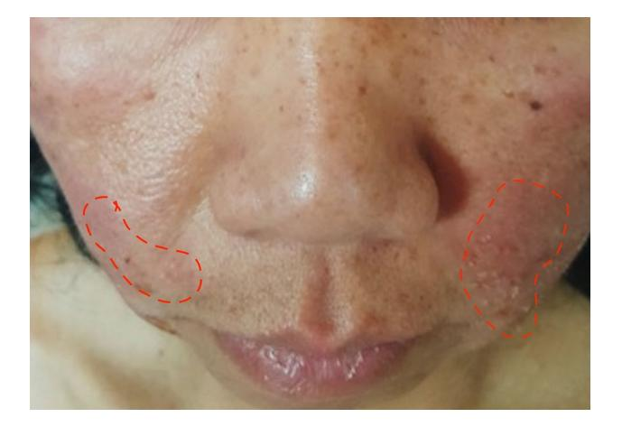

#### **REVIEW ARTICLE**

# **The Skin Microbiome: A New Actor in Infammatory Acne**

**Brigitte Dréno1,2 · Marie Ange Dagnelie2 · Amir Khammari1,2 · Stéphane Corvec3,[4](http://orcid.org/0000-0003-3176-8111)**

Published online: 10 September 2020 © The Author(s) 2020

#### **Abstract**

Our understanding of the role of *Cutibacterium acnes* in the pathophysiology of acne has recently undergone a paradigm shift: rather than *C. acnes* hyperproliferation, it is the loss of balance between the diferent *C. acnes* phylotypes, together with a dysbiosis of the skin microbiome, which results in acne development. The loss of diversity of *C. acnes* phylotypes acts as a trigger for innate immune system activation, leading to cutaneous infammation. A predominance of *C. acnes* phylotype IA1 has been observed, with a more virulent profle in acne than in normal skin. Other bacteria, mainly *Staphylococcus epidermis*, are also implicated in acne. *S. epidermidis* and *C. acnes* interact and are critical for the regulation of skin homeostasis. Recent studies also showed that the gut microbiome is involved in acne, through interactions with the skin microbiome. As commonly used topical and systemic antibiotics induce cutaneous dysbiosis, our new understanding of acne pathophysiology has prompted a change in direction for acne treatment. In the future, the development of individualized acne therapies will allow targeting of the pathogenic strains, leaving the commensal strains intact. Such alternative treatments, involving modifcations of the microbiome, will form the next generation of 'ecobiological' anti-infammatory treatments.

#### **Key Points**

Infammatory acne is related to a loss of the diversity of phylotypes of *Cutibacterium* acnes.

*C. acnes* and *Staphylococcus epidermidis* play a role in the process of infammation in the skin.

Treatments other than topical and systemic antibiotics are needed to restore the diversity and balance of bacterial species.

- \* Brigitte Dréno brigitte.dreno@atlanmed.fr Stéphane Corvec stephane.corvec@chu-nantes.fr
- 1 Dermatology Department, CHU Nantes, CIC 1413, CRCINA, University Nantes, Nantes, France
- 2 CIC 1413, CRCINA, U1232, Nantes, France
- 3 Bacteriology and Hygiene Unit, Biology Institute, Nantes, France
- 4 CRCINA, U1232, Nantes, France

# **1 Introduction**

Acne vulgaris (acne) is a highly prevalent infammatory skin condition, involving an interplay of several factors. Besides increased sebum production by the sebaceous glands and follicular keratinization of the pilosebaceous ducts [\[1,](#page-5-0) [2](#page-5-1)], a third main actor in acne development has recently been uncovered: the microbiome and its interactions with the innate immune system. The term 'microbiome' refers to microorganisms (bacteria, viruses and fungi) and their environment. Further understanding of the role of the skin microbiome in acne development has been gained by characterizing the skin bacteria, with equal levels of diversity being obtained regardless of whether the sampling method retrieved bacteria located at the skin surface (swabbing) or in the follicle (cyanoacrylate skin surface stripping) [\[3](#page-5-2)].

The skin microbiome is divided into 'normal' commensal skin microbes, which live in homeostasis with the host and form the resident microbiome, and pathogen microbes from the environment, which temporarily live on the skin and form the transient microbiome [[4\]](#page-5-3). In acne, the resident microbiome includes *Cutibacterium acnes* (formerly called *Propionibacterium acnes)* and *Staphylococcus epidermidis,* whereas the transient microbiome includes *Staphylococcus aureus* [[5\]](#page-5-4). A microbial imbalance or 'dysbiosis', compared with the normal distribution in healthy tissues, has been suggested to be involved in the pathophysiology of infammatory acne [[6\]](#page-5-5).

In this short review, we will first address the recent advances in our understanding of the impact of cutaneous microbiome imbalance on the development of acne lesions, in particular the loss of diversity of *C. acnes* phylotypes. We will then focus on the involvement of particular bacterial strains—including *S. epidermis*—and the interactions between the gut and skin microbiome, and fnally, based on this new understanding, we will explore new insights into acne treatments.

# **2 Dysbiosis in Acne Pathophysiology**

## **2.1** *Cutibacterium acnes* **and the Role of Microbiome Dysbiosis in Acne**

Although *C. acnes* is a major commensal of the normal skin fora*,* it also contributes to acne pathogenesis [[7\]](#page-5-6). Present at a low level on the skin surface, C*. acnes* constitutes the dominant resident bacterial species in the sebaceous follicles. Indeed, *C. acnes* is commonly found in sebum-rich areas. However, in contrast with previous thinking, acne is not associated with an over-proliferation of *C. acnes* [\[8](#page-5-7)[–10](#page-5-8)]. Indeed, the load of *C. acnes* [\[11](#page-5-9)] and the relative abundance of *C. acnes* reported in metagenomics studies has been found to be similar between patients with acne and healthy individuals [[7\]](#page-5-6), and slightly higher levels in healthy subjects have even been reported [[12\]](#page-5-10). Instead, a loss of microbial diversity and loss of balance between *C. acnes* phylotypes appears to play a role in the triggering of acne [\[7](#page-5-6)].

# **2.2 Severity of Infammatory Acne is not Related to the Proliferation of** *C. acnes* **But to the Loss of Diversity of** *C. acnes* **Phylotypes (IA1, CC18, A1)**

Several very recent studies have demonstrated that acne severity is associated with a loss of diversity of *C. acnes* strains compared with that in healthy individuals. This loss of diversity has been identifed on the face of patients with mild-to-moderate acne, as well as on the back of those with severe acne (Fig. [1\)](#page-1-0) [[13\]](#page-5-11). Acne might be triggered by the selection of a subset of *C. acnes* strains, including the acneassociated phylotype IA1, which is predominant in facial acne and probably enhanced by a hyperseborrheic environment. Depending on the method of molecular characterization, phylotype IA1 may also be referred to as the CC18 clonal complex or A1 SLST-type [\[14](#page-5-12)].

Advanced metagenomic sequencing revealed that the cutaneous microbiota in acne patients difers from that of acne-free individuals at the virulent-specifc lineage level

**Fig. 1** Dysbiosis is related to the loss of diversity of *C. acnes* phylotypes on the face and back of acne patients [\[13\]](#page-5-11). Phylotype IA1 (in dark blue) is abundant in acne skin. Reproduced from [13], with kind authorization from Acta-Dermato-Venerealogica, under the creative commons licence (Attribution-NonCommercial 4.0 International, CC BY-NC 4.0)

[[5,](#page-5-4) [7](#page-5-6)]. Acquired DNA sequences and bacterial immune elements may be involved in the virulence of *C. acnes* strains [[7\]](#page-5-6).

In contrast, loss of phylotype diversity cannot explain the diferences observed between teenage and adult acne, nor those observed between grades of acne severity. According to a very recent study, acne in adult women is not associated with a specifc type of *C. acnes* [\[15\]](#page-5-13). Moreover, the frequency of *C. acnes* resistance is similar among adult women and teenagers, suggesting that diferences in acne between these two groups are more likely related to nonmicrobial factors such as hormonal skin changes, stimulation of innate immunity, or environmental factors [\[15](#page-5-13)]. As regards the severity of acne, no signifcant diferences in the distribution of acne strains were found between patients with mild (*n*=29) and severe acne (*n*=34) [[16](#page-5-14)].

## **2.3 Loss of Diversity of Phylotypes of** *C. acnes* **Activates Innate Immunity and Cutaneous Infammation**

Loss of microbial diversity can lead to chronic infammatory skin diseases [[17](#page-5-15), [18\]](#page-5-16). Loss of *C. acnes* phylotype diversity has also been shown to act as a trigger for innate immune system activation and cutaneous infammation in acne. Indeed, incubation of a skin explant with phylotype IA1 alone has been shown to lead to up-regulation of innate immune markers (interleukin [IL]-6, IL-8, IL-10, IL-17), compared with incubation with the combination of phylotypes IA1+II+III [\[19\]](#page-5-17). Conversely, restoration of the microbiome diversity suppressed infammation via downregulation of innate immunity [[19](#page-5-17)]. In addition, the constitutive release of extracellular vesicles by *C. acnes* can induce an acne-like pattern, as shown in an in vitro reconstituted skin model. Six-day contact with *C. acnes*-derived extracellular vesicles was shown to lead to an increase in the proliferation of keratinocytes and modulation of their diferentiation, with dysregulation of the expression of epidermal markers such as the antigen Ki67, keratin 10 (KRT10), desmocollin 1 (DSC1) and flaggrin [[20\]](#page-5-18). Moreover, the vesicles induced a signifcant rise in infammatory cytokine IL-8 and granulocyte macrophage colony-stimulating factor (GM-CSF) levels [\[20\]](#page-5-18). Indeed, bacterial extracellular vesicles were recently shown to be implicated in intra- and interspecies cell-tocell communication and to play a pro-infammatory role in several human diseases, including acne [[21\]](#page-5-19). Consequently, inhibiting the release of *C. acnes* extracellular vesicles or targeting their signaling pathways could represent an alternative way of limiting acne development and severity [[20\]](#page-5-18).

Finally, *C. acnes* strains differentially modulate CD4+T-cell responses, leading to the generation of T helper (Th)-17 cells that may contribute either to homeostasis (IL-17/IL-10-producing) or to acne pathogenesis (IL-17/interferon [IFN]-gamma-producing) [[22\]](#page-5-20).

# **3 Involvement of Particular Strains and Interactions with the Gut Microbiome**

### **3.1** *C. acnes***IA1 has a More Virulent Profle in Acne than in Normal Skin**

Comparative genome analysis has shown that acne-related strains carry extra virulence genes compared with strains of the same phylotype functioning as commensals in skin health [[23](#page-5-21)]. In addition, acne-related strains produce signifcantly higher levels of the pro-infammatory metabolites, porphyrins, which generate reactive oxygen species and induce infammation in keratinocytes [[24](#page-5-22)]. Vitamin B12 supplementation further increases *C. acnes* production of porphyrins [\[25](#page-5-23)]. Finally, *C. acnes* types IA and IB were found to induce greater levels of production of the human antimicrobial peptide (AMP), β-defensin 2 (hBD2), from cultured sebocytes, and displayed higher levels of lipase activity than a type II isolate [[26](#page-5-24)].

#### **3.2 Other Bacteria and Fungi Involved in Acne**

Recent data show that *S. epidermidis* and *C. acnes* interact [[27\]](#page-5-25) and are critical for the regulation of skin homeostasis [\[28](#page-5-26)]. *S. epidermidis* can inhibit *C. acnes* growth [[28,](#page-5-26) [29](#page-5-27)] and *C. acnes*-induced infammation in the skin [[30](#page-5-28)]. *S. epidermidis* controls the proliferation of *C. acnes* by favoring the fermentation of glycerol produced naturally by the skin, and by releasing succinic acid, a fatty acid fermentation product [[31\]](#page-5-29). The anti-infammatory efects of *S. epidermidis* are mediated by lipoteichoic acid, which inhibits Toll-like receptor (TLR)-2 production. *S. epidermidis* can thus suppress *C. acnes*-induced IL-6 and tumor necrosis factor (TNF)-alpha production by keratinocytes [\[30](#page-5-28)].

Conversely, *C. acnes,* resident in the pilosebaceous follicles, inhibits development of *S. epidermidis* by maintaining the acidic pH of the pilosebaceous follicle, hydrolyzing sebum triglycerides, and secreting propionic acid [\[4](#page-5-3), [29](#page-5-27)]. As shown by Wang et al., incubation of *C. acnes* in a pH 5.5 bufer did not alter its survival [\[29](#page-5-27)].

Finally, Malassezia, the most abundant fungus in the skin, could be involved in refractory acne. Its lipase is 100-fold more active than that of *C. acnes* and it can attract neutrophils and promote the release of pro-infammatory cytokines from monocytes and keratinocytes. However, its exact role in the pathophysiology of acne remains to be explored [\[5](#page-5-4)].

### **3.3 Interactions Between Bacteria and the Host Cellular Mechanisms**

Resident and transient bacteria also interact with skin signaling molecules. Substance P is a major skin neuropeptide that is modulated by pain, stress and infection, and is involved in the pathogenesis of numerous skin diseases with multifactorial origins. Some of the efects of substance P are mediated through interactions with skin microfora [[32\]](#page-5-30). In particular, substance P can increase the virulence of staphylococci: it induces enterotoxin C2 secretion by *S. aureus* and bioflm formation by *S. epidermis*, and promotes the adhesion of both bacteria to the keratinocytes [[32](#page-5-30)].

Finally, bacteria that colonize the skin potentially play a role in the post-infammatory pigmentation of acne lesions. *C. acnes* and *S. epidermidis* diferentially modulate melanocyte survival [\[33](#page-5-31)]. Furthermore, strains of the *C. acnes* type III lineage have been shown to be associated with progressive macular hypomelanosis [[34\]](#page-6-0).

### **3.4 The Gut Microbiome Interacts with the Skin Microbiome in Acne**

The interactions between the bacteria involved in acne extend beyond the skin itself. Patients with acne also have a gut microbiota that is distinct from that of healthy controls. A study of 31 acne patients found that Actinobacteria were less abundant and Proteobacteria more abundant in the gut microbiota of individuals with moderate-to-severe acne compared with healthy controls [\[35](#page-6-1)]. Another study revealed decreased diversity and an increased ratio of Bacteroidetes to Firmicutes in acne patients, an alteration that has been reported to be the enterotype of the Western diet; thus confrming the impact of the Western diet on the development of acne [[36](#page-6-2)]. The consumption of dairy products, refned carbohydrates, chocolate, and saturated fats has indeed been shown to contribute to the development of acne through the activation of metabolic signals [\[36\]](#page-6-2). Moreover, the high ratio of omega-6 to omega-3 fatty acids in Western diets may also be implicated [\[37](#page-6-3)]: dietary supplementation with omega-3 fatty acids has been shown to help decrease lesions in patients with mild-to-moderate acne [\[38](#page-6-4)].

The connection between gut microbiota and acne development could be related to the fact that bacterial dysbiosis in the gut causes increased intestinal permeability, leading to the release of infammatory mediators, such as lipopolysaccharide endotoxins, into the circulation [\[39\]](#page-6-5).

# **4 New Insights in Acne Treatments**

## **4.1 Systemic and Topical Antibiotics Induce Cutaneous Dysbiosis**

Antibiotics and isotretinoin have long been the main treatments for acne. Isotretinoin has been shown to normalize aberrant TLR-2-mediated innate immune responses towards *C. acnes* and this immunomodulatory efect may be involved in the anti-infammatory response to isotretinoin [\[40](#page-6-6), [41](#page-6-7)]. However, systemic isotretinoin results in qualitative and quantitative changes in the highly diverse microbiome of the gut and in that of the skin, with marked increases in *S. aureus* [\[42](#page-6-8)]. Topical antibiotics induce a 'selective pressure' on the bacteria of the skin microbiome, leading to the selection of resistant *C. acnes, Streptococcus* and *Staphylococcus* strains [[8,](#page-5-7) [43](#page-6-9), [44](#page-6-10)]. The induction of antimicrobial resistance and dysbiosis thus provides a strong argument for limited use of both systemic and topical antibiotics as long term and monotherapy regimens in acne.

As regards alternative treatments to isotretinoin and antibiotics, a study by Ahluwalia et al. in 2019 indicated that the antiseptic benzoyl peroxide (BPO), an over-the-counter acne treatment with bactericidal, anti-infammatory, and comedolytic properties, did not afect microbial diversity [[45](#page-6-11)]. However, these data need to be confrmed as a smaller-sized study—including only fve preadolescent females with acne treated with BPO—found that microfora diversity decreased after treatment [[46](#page-6-12)]. According to a very recent Cochrane review, there may be little to no diference between treatment with long-term BPO and that with clindamycin or adapalene in terms of self-reported treatment success in mild-to-moderate acne management [\[47\]](#page-6-13).

Thus, we advocate the use of BPO alone, or in association with a cleanser (pH~5) and a moisturizing cream as adjunct treatments, to restore the skin barrier and microbiome. Indeed, intensive washing damages the skin barrier, leads to loss of AMPs and results in impaired innate immunity. Moreover, the pH of the skin is around 5.5. Using cleansers with a higher pH (~ 8) increases kallikrein 5 activity, leading to skin barrier dysfunction [\[48](#page-6-14)] and alters the skin and the microbiota (Fig. [2](#page-3-0)). In particular, Prakash et al. demonstrated that skin pH in patients with mild-to-moderate acne vulgaris in the absence of treatment was signifcantly higher than that in age- and sex-matched controls [\[49](#page-6-15)]. Indeed, the bactericidal activity of antimicrobial peptides is optimal at pH 5.5, and the population size and activity of *C. acnes* and *S. aureus* have been shown to increase as skin pH rises [\[50](#page-6-16)].

#### **4.2 Future of Treatments**

The objective of treatment in acne is not to kill *C. acnes* but rather to prevent or to treat dysbiosis, thus new ways of equilibrating the dysbiosis in acne have been investigated. One strategy relies on sucrose for selective augmentation of *S. epidermidis* fermentation over that of *C. acnes* [[51\]](#page-6-17). Another way of shifting the balance toward a healthy microbiome involves supplementing the skin microbiota with probiotics [[12](#page-5-10)]. Several clinical trials have shown that topical probiotics can directly alter the skin microbiome and immune response [\[52](#page-6-18)]. In addition, modulation of the intestinal microfora via oral probiotics can indirectly infuence skin diseases [[52](#page-6-18)]. Bifdobacteria and Lactobacilli, bacteria normally found in the gut, could be used as probiotics for

**Fig. 2** Acne lesions after intensive washing of the skin (left cheek) versus mild cleansing (right cheek) in an adult female with mild acne

the treatment of infammatory skin diseases such as acne [\[53](#page-6-19)]. Their efects on acne may be mediated by the ability of oral probiotics to reduce systemic oxidative stress, regulate cytokines, and reduce infammatory markers [[39\]](#page-6-5). The demonstrated impact of the Western diet on the development of acne also suggests that probiotic-based therapy and dietary management could be used in the prevention and treatment of acne [\[36](#page-6-2)].

Essential oils, such as Korean Citrus obovoides and Citrus natsudadai [[54\]](#page-6-20), may also be efective acne treatments: they have been shown in vitro to display action against acneinducing bacteria and have inhibitory efects on *C. acnes*induced secretion of IL-8 and TNF-α in human monocytic cells, suggesting anti-infammatory properties. Tea tree oil (TTO), one of the most widely used anti-acne botanical ingredients in the cosmetic industry, has shown comparable efcacy to benzoyl peroxide in several randomized controlled trials. However, skin irritation and late onset of efcacy have been reported [[55](#page-6-21)]. A substance acquired from solid state fermentation of the plant extract *Chamaecyparis obtusa* by *Lactobacillus fermentum* has been shown to be more efcient than TTO in a comparative study in 34 patients [\[56](#page-6-22)]. In an 8-week, double-blind, randomized, controlled split-face study comparing topical application of lactobacillus-fermented *C. obtusa* (LFCO) and TTO, infammatory acne lesions were reduced by 65.3% on the LFCO side and by 38.2% on the TTO side [\[56](#page-6-22)].

Alternatively, AMPs could act as new topical antibiotic modulators of cutaneous microbiota and innate immunity [[57\]](#page-6-23). The AMP pheromone, plantaricin A, increases the antioxidant defenses of human keratinocytes and modulates expression of flaggrin, involucrin, β-defensin and TNF-α genes in vitro [\[58](#page-6-24)]. Indeed, in addition to their antimicrobial activity, AMPs synthesized by mammals also regulate physiological functions such as infammation, angiogenesis and wound healing. They are abundant in mammalian skin, and alterations in their levels of synthesis were recently shown to play a role in skin diseases such as psoriasis, atopic dermatitis and rosacea [\[57](#page-6-23)].

Finally, another alternative therapy could involve bacteriophages. Both metagenomic analysis and other culturebased studies have shown that naturally occurring *C. acnes* bacteriophages on the skin are more prevalent in healthy individuals compared with acne patients. They are also more abundant in older individuals, which could be related to the decline in acne prevalence with increasing age. Finally, some *C. acnes* strains (from clades IB, II, and III) are resistant to the viral activity of bacteriophages, which could infuence *C. acnes* phylotype repartition [[59\]](#page-6-25).

These therapeutic approaches could lead to the development of vaccination strategies, through acne immunotherapy. Rather than using killed *C. acnes* [[60](#page-6-26)] or targeting a surface antigen, specifcally inhibiting secreted virulence factors should limit the risk of unwanted targeting of nonpathogenic bacteria and overcome the risk of selection of resistant bacteria [[61](#page-6-27)]. For instance, one such target could be Christie-Atkins-Munch-Peterson (CAMP) factor 2, a secreted virulence factor from *C. acnes* that triggers infammatory responses. Indeed, the anti-infammatory properties of antibodies to this virulence factor, demonstrated in a murine model and in ex vivo human acne explants, suggest that targeting of CAMP factor 2 in a vaccination approach could inhibit *C. acnes* pathogenicity [[62](#page-6-28)].

# **5 Conclusion**

In conclusion, our improved understanding of the genetic and phenotypic diversity of *C. acnes* strains and of the involvement of other bacterial species in acne physiopathology suggests that it may be feasible to develop individualized acne therapies, targeting only the pathogenic strains and leaving the commensal strains intact. Such alternative treatments, involving modifcations of the microbiome, may form the next generation of 'ecobiological' anti-infammatory treatments.

**Acknowledgements** We thank Francoise Nourrit-Poirette, Ph.D., Emma Pilling, Ph.D., and Marielle Romet, Ph.D. (Santé Active Edition) who provided medical writing assistance on behalf of Laboratoires dermatologiques Avène, Pierre Fabre Dermo-Cosmétique.

**Author contributions** BD had the idea for the article and BD, MAD, AK, and SC performed the literature search and data analysis and drafted and/or critically revised the work.

#### **Declarations**

**Conflict of Interest** No confict to be declared on this topic.

**Funding** Medical writing assistance was funded by Laboratoires dermatologiques Avène, Pierre Fabre Dermo-Cosmétique.

**Ethics approval** Not applicable.

**Consent to participate** Not applicable.

**Consent for publication** Not applicable.

**Availability of data and material** Not applicable.

**Code availability** Not applicable.

**Disclosure Statement** This article is published as part of a journal supplement wholly funded by Laboratoires dermatologiques Avène, Pierre Fabre Dermo-Cosmétique.

**Open Access** This article is licensed under a Creative Commons Attribution-NonCommercial 4.0 International License, which permits any non-commercial use, sharing, adaptation, distribution and reproduction in any medium or format, as long as you give appropriate credit to the original author(s) and the source, provide a link to the Creative Commons licence, and indicate if changes were made. The images or other third party material in this article are included in the article's Creative Commons licence, unless indicated otherwise in a credit line to the material. If material is not included in the article's Creative Commons licence and your intended use is not permitted by statutory regulation or exceeds the permitted use, you will need to obtain permission directly from the copyright holder. To view a copy of this licence, visit <http://creativecommons.org/licenses/by-nc/4.0/>.

# **References**

- 1. Suh DH, Kwon HH. What's new in the physiopathology of acne? Br J Dermatol. 2015;172(Suppl 1):13–9.
- 2. Dreno B. What is new in the pathophysiology of acne, an overview. J Eur Acad Dermatol Venereol. 2017;31(Suppl 5):8–12.
- 3. Hall JB, Cong Z, Imamura-Kawasawa Y, Kidd BA, Dudley JT, Thiboutot DM, et al. Isolation and identifcation of the follicular microbiome: implications for Acne research. J Invest Dermatol. 2018;138(9):2033–40.
- 4. Grice EA, Segre JA. The skin microbiome. Nat Rev Microbiol. 2011;9(4):244–53.
- 5. Lee YB, Byun EJ, Kim HS. Potential role of the microbiome in acne: a comprehensive review. J Clin Med. 2019;8(7):987.
- 6. Ramasamy S, Barnard E, Dawson TL Jr, Li H. The role of the skin microbiota in acne pathophysiology. Br J Dermatol. 2019;181(4):691–9.
- 7. Fitz-Gibbon S, Tomida S, Chiu BH, Nguyen L, Du C, Liu M, et al. Propionibacterium acnes strain populations in the human skin microbiome associated with acne. J Invest Dermatol. 2013;133(9):2152–60.
- 8. Dessinioti C, Katsambas A. Propionibacterium acnes and antimicrobial resistance in acne. Clin Dermatol. 2017;35(2):163–7.
- 9. Miura Y, Ishige I, Soejima N, Suzuki Y, Uchida K, Kawana S, et al. Quantitative PCR of Propionibacterium acnes DNA in samples aspirated from sebaceous follicles on the normal skin of subjects with or without acne. J Med Dent Sci. 2010;57(1):65–74.
- 10. Omer H, McDowell A, Alexeyev OA. Understanding the role of Propionibacterium acnes in acne vulgaris: The critical importance of skin sampling methodologies. Clin Dermatol. 2017;35(2):118–29.
- 11. Pecastaings S, Roques C, Nocera T, Peraud C, Mengeaud V, Khammari A, et al. Characterisation of cutibacterium acnes phylotypes in acne and in vivo exploratory evaluation of Myrtacine((R)). J Eur Acad Dermatol Venereol. 2018;32(Suppl 2):15–23.
- 12. Barnard E, Shi B, Kang D, Craft N, Li H. The balance of metagenomic elements shapes the skin microbiome in acne and health. Sci Rep. 2016;21(6):39491.
- 13. Dagnelie MA, Montassier E, Khammari A, Mounier C, Corvec S, Dreno B. Infammatory skin is associated with changes in the skin microbiota composition on the back of severe acne patients. Exp Dermatol. 2019;28(8):961–7.
- 14. Dréno B, Pécastaings S, Corvec S, Veraldi S, Khammari A, Roques C. Cutibacterium acnes (Propionibacterium acnes) and acne vulgaris: a brief look at the latest updates. J Eur Acad Dermatol Venereol. 2018;32:5–14.
- 15. Saint-Jean M, Corvec S, Nguyen JM, Le Moigne M, Boisrobert A, Khammari A, et al. Adult acne in women is not associated with a specifc type of *Cutibacterium acnes*. J Am Acad Dermatol. 2019;81(3):851–2.

- 16. Paugam C, Corvec S, Saint-Jean M, Le Moigne M, Khammari A, Boisrobert A, et al. Propionibacterium acnes phylotypes and acne severity: an observational prospective study. J Eur Acad Dermatol Venereol. 2017;31(9):e398–e399.
- 17. Szabo K, Erdei L, Bolla BS, Tax G, Biro T, Kemeny L. Factors shaping the composition of the cutaneous microbiota. Br J Dermatol. 2017;176(2):344–51.
- 18. Sanchez DA, Nosanchuk JD, Friedman AJ. The skin microbiome: is there a role in the pathogenesis of atopic dermatitis and psoriasis? J Drugs Dermatol. 2015;14(2):127–30.
- 19. Dagnelie MA, Corvec S, Saint-Jean M, Nguyen JM, Khammari A, Dreno B. Cutibacterium acnes phylotypes diversity loss: a trigger for skin infammatory process. J Eur Acad Dermatol Venereol. 2019;33(12):2340–8.
- 20. Choi EJ, Lee HG, Bae IH, Kim W, Park J, Lee TR, et al. Propionibacterium acnes-derived extracellular vesicles promote acne-like phenotypes in human epidermis. J Invest Dermatol. 2018;138(6):1371–9.
- 21. Dagnelie MA, Corvec S, Khammari A, Dreno B. Bacterial extracellular vesicles: a new way to decipher host-microbiota communications in infammatory dermatoses. Exp Dermatol. 2020;29(1):22-8.
- 22. Agak GW, Kao S, Ouyang K, Qin M, Moon D, Butt A, et al. Phenotype and antimicrobial activity of Th17 cells induced by propionibacterium acnes strains associated with healthy and acne skin. J Invest Dermatol. 2018;138(2):316–24.
- 23. Tomida S, Nguyen L, Chiu BH, Liu J, Sodergren E, Weinstock GM, et al. Pan-genome and comparative genome analyses of propionibacterium acnes reveal its genomic diversity in the healthy and diseased human skin microbiome. mBio. 2013;4(3):e00003–13.
- 24. Johnson T, Kang D, Barnard E, Li H. Strain-level diferences in porphyrin production and regulation in propionibacterium acnes Elucidate Disease Associations. mSphere. 2016;1(1):e00023-15.
- 25. Kang D, Shi B, Erfe MC, Craft N, Li H. Vitamin B12 modulates the transcriptome of the skin microbiota in acne pathogenesis. Sci Transl Med. 2015;7(293):293ra103.
- 26. Borrel V, Gannesen AV, Barreau M, Gaviard C, Duclairoir-Poc C, Hardouin J, et al. Adaptation of acneic and non acneic strains of Cutibacterium acnes to sebum-like environment. Microbiologyopen. 2019;8(9):e00841.
- 27. Christensen GJ, Scholz CF, Enghild J, Rohde H, Kilian M, Thurmer A, et al. Antagonism between *Staphylococcus epidermidis* and *Propionibacterium acnes* and its genomic basis. BMC Genom. 2016;29(17):152.
- 28. Dreno B, Martin R, Moyal D, Henley JB, Khammari A, Seite S. Skin microbiome and acne vulgaris: *Staphylococcus*, a new actor in acne. Exp Dermatol. 2017;26(9):798–803.
- 29. Wang Y, Kuo S, Shu M, Yu J, Huang S, Dai A, et al. *Staphylococcus epidermidis* in the human skin microbiome mediates fermentation to inhibit the growth of *Propionibacterium acnes*: implications of probiotics in acne vulgaris. Appl Microbiol Biotechnol. 2014;98(1):411–24.
- 30. Skabytska Y, Biedermann T. *Staphylococcus epidermidis* sets things right again. J Invest Dermatol. 2016;136(3):559–60.
- 31. Claudel JP, Aufret N, Leccia MT, Poli F, Corvec S, Dreno B. *Staphylococcus epidermidis*: a potential new player in the physiopathology of acne? Dermatology. 2019;235(4):287–94.
- 32. N'Diaye A, Mijouin L, Hillion M, Diaz S, Konto-Ghiorghi Y, Percoco G, et al. Efect of Substance P in *Staphylococcus aureus* and *Staphylococcus epidermidis* virulence: implication for skin homeostasis. Front Microbiol. 2016;7:506.
- 33. Wang Z, Choi JE, Wu CC, Di Nardo A. Skin commensal bacteria *Staphylococcus epidermidis* promote survival of melanocytes bearing UVB-induced DNA damage, while bacteria *Propionibacterium acnes* inhibit survival of melanocytes by

S24 B. Dréno et al.

increasing apoptosis. Photodermatol Photoimmunol Photomed. 2018;34(6):405–14.

- 34. Barnard E, Liu J, Yankova E, Cavalcanti SM, Magalhaes M, Li H, et al. Strains of the *Propionibacterium acnes* type III lineage are associated with the skin condition progressive macular hypomelanosis. Sci Rep. 2016;24(6):31968.
- 35. Yan HM, Zhao HJ, Guo DY, Zhu PQ, Zhang CL, Jiang W. Gut microbiota alterations in moderate to severe acne vulgaris patients. J Dermatol. 2018;45(10):1166–71.
- 36. Deng Y, Wang H, Zhou J, Mou Y, Wang G, Xiong X. Patients with acne vulgaris have a distinct gut microbiota in comparison with healthy controls. Acta Derm Venereol. 2018;98(8):783–90.
- 37. Cordain L. Implications for the role of diet in acne. Semin Cutan Med Surg. 2005;24(2):84–91.
- 38. Jung JY, Kwon HH, Hong JS, Yoon JY, Park MS, Jang MY, et al. Efect of dietary supplementation with omega-3 fatty acid and gamma-linolenic acid on acne vulgaris: a randomised, doubleblind, controlled trial. Acta Derm Venereol. 2014;94(5):521–5.
- 39. Clark AK, Haas KN, Sivamani RK. Edible plants and their infuence on the gut microbiome and acne. Int J Mol Sci. 2017;18(5) :1070.
- 40. Dispenza MC, Wolpert EB, Gilliland KL, Dai JP, Cong Z, Nelson AM, et al. Systemic isotretinoin therapy normalizes exaggerated TLR-2-mediated innate immune responses in acne patients. J Invest Dermatol. 2012;132(9):2198–205.
- 41. Borelli C, Merk K, Schaller M, Jacob K, Vogeser M, Weindl G, et al. In vivo porphyrin production by *P. acnes* in untreated acne patients and its modulation by acne treatment. Acta Derm Venereol. 2006;86(4):316–9.
- 42. Leyden JJ, McGinley KJ, Foglia AN. Qualitative and quantitative changes in cutaneous bacteria associated with systemic isotretinoin therapy for acne conglobata. J Invest Dermatol. 1986;86(4):390–3.
- 43. Dreno B. Bacteriological resistance in acne: a call to action. Eur J Dermatol. 2016;26(2):127–32.
- 44. Sardana K, Gupta T, Kumar B, Gautam HK, Garg VK. Crosssectional pilot study of antibiotic resistance in *Propionibacterium acnes* strains in indian acne patients using 16S-RNA polymerase chain reaction: a comparison among treatment modalities including antibiotics, benzoyl peroxide, and isotretinoin. Indian J Dermatol. 2016;61(1):45–52.
- 45. Ahluwalia J, Borok J, Haddock ES, Ahluwalia RS, Schwartz EW, Hosseini D, et al. The microbiome in preadolescent acne: assessment and prospective analysis of the infuence of benzoyl peroxide. Pediatr Dermatol. 2019;36(2):200–6.
- 46. Coughlin CC, Swink SM, Horwinski J, Sfyroera G, Bugayev J, Grice EA, et al. The preadolescent acne microbiome: a prospective, randomized, pilot study investigating characterization and efects of acne therapy. Pediatr Dermatol. 2017;34(6):661–4.
- 47. Yang Z, Zhang Y, Lazic Mosler E, Hu J, Li H, Zhang Y, et al. Topical benzoyl peroxide for acne. Cochrane Database Syst Rev. 2020;3:CD011154.
- 48. Jang H, Matsuda A, Jung K, Karasawa K, Matsuda K, Oida K, et al. Skin pH Is the master switch of Kallikrein 5-mediated skin

- barrier destruction in a murine atopic dermatitis model. J Investig Dermatol. 2016;136(1):127–35.
- 49. Prakash C, Bhargava P, Tiwari S, Majumdar B, Bhargava RK. Skin surface pH in acne vulgaris: insights from an observational study and review of the literature. J Clin Aesthet Dermatol. 2017;10(7):33–9.
- 50. Korting HC, Hubner K, Greiner K, Hamm G, Braun-Falco O. Differences in the skin surface pH and bacterial microfora due to the long-term application of synthetic detergent preparations of pH 5.5 and pH 7.0. Results of a crossover trial in healthy volunteers. Acta Derm Venereol. 1990;70(5):429–31.
- 51. Wang Y, Kao MS, Yu J, Huang S, Marito S, Gallo RL, et al. A precision microbiome approach using sucrose for selective augmentation of *Staphylococcus epidermidis* Fermentation against *Propionibacterium acnes*. Int J Mol Sci. 2016;17(11):1870.
- 52. Yu Y, Dunaway S, Champer J, Kim J, Alikhan A. Changing our microbiome: probiotics in dermatology. Br J Dermatol. 2020;182(1):39–46.
- 53. Hacini-Rachinel F, Gheit H, Le Luduec J-B, Dif F, Nancey S, Kaiserlian D. Oral probiotic control skin infammation by acting on both efector and regulatory t cells. PLoS ONE. 2009;4:e4903.
- 54. Kim SS, Baik JS, Oh TH, Yoon WJ, Lee NH, Hyun CG. Biological activities of Korean Citrus obovoides and Citrus natsudaidai essential oils against acne-inducing bacteria. Biosci Biotechnol Biochem. 2008;72(10):2507–13.
- 55. Bassett I, Pannowitz D, Barnetson R. A comparative study of teatree oil versus benzoyl peroxide in the treatment of acne. Med J Aust. 1990;153:455–8.
- 56. Kwon HH, Yoon JY, Park SY, Min S, Suh DH. Comparison of clinical and histological efects between lactobacillus-fermented Chamaecyparis obtusa and tea tree oil for the treatment of acne: an eight-week double-blind randomized controlled split-face study. Dermatology. 2014;229(2):102–9.
- 57. Nakatsuji T, Gallo RL. Antimicrobial peptides: old molecules with new ideas. J Invest Dermatol. 2012;132(3 Pt 2):887–95.
- 58. Marzani B, Pinto D, Minervini F, Calasso M, Di Cagno R, Giuliani G, et al. The antimicrobial peptide pheromone Plantaricin A increases antioxidant defenses of human keratinocytes and modulates the expression of flaggrin, involucrin, β-defensin 2 and tumor necrosis factor-α genes. Exp Dermatol. 2012;21(9):665–71.
- 59. O'Neill AM, Gallo RL. Host-microbiome interactions and recent progress into understanding the biology of acne vulgaris. Microbiome. 2018;6(1):177.
- 60. Nakatsuji T, Liu YT, Huang CP, Zoubouis CC, Gallo RL, Huang CM. Antibodies elicited by inactivated propionibacterium acnesbased vaccines exert protective immunity and attenuate the IL-8 production in human sebocytes: relevance to therapy for acne vulgaris. J Invest Dermatol. 2008;128(10):2451–7.
- 61. Contassot E. Vaccinating against acne: benefts and potential pitfalls. J Invest Dermatol. 2018;138(11):2304–6.
- 62. Wang Y, Hata TR, Tong YL, Kao MS, Zouboulis CC, Gallo RL, et al. The anti-inflammatory activities of *Propionibacterium acnes* CAMP factor-targeted acne vaccines. J Invest Dermatol. 2018;138(11):2355–64.