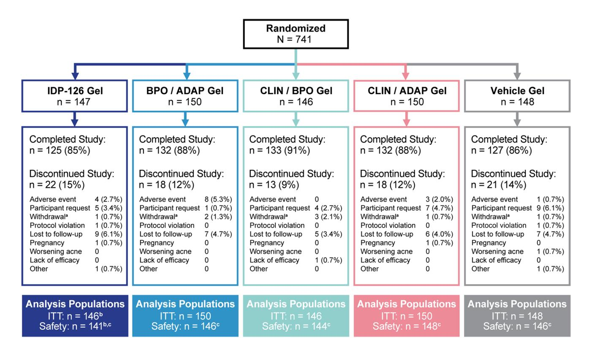
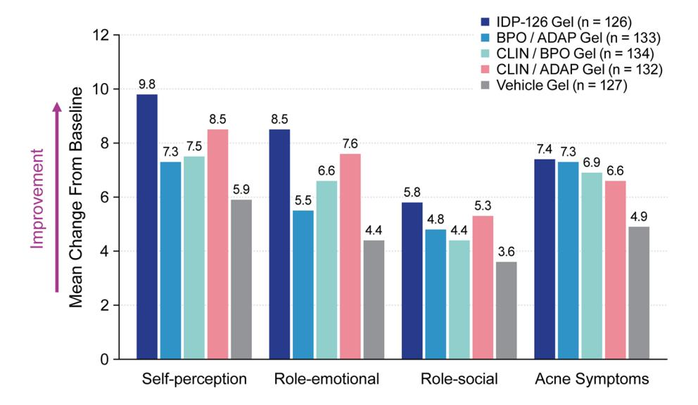

#### **ORIGINAL RESEARCH ARTICLE**

# **Efcacy and Safety of a Fixed‑Dose Clindamycin Phosphate 1.2%, Benzoyl Peroxide 3.1%, and Adapalene 0.15% Gel for Moderate‑to‑Severe Acne: A Randomized Phase II Study of the First Triple‑Combination Drug**

**Linda Stein Gold1 · Hilary Baldwin2,3 · Leon H. Kircik4,5,6 · Jonathan S. Weiss7,8 · David M. Pariser9,10 · Valerie Callender11,12 · Edward Lain13 · Michael Gold14 · Kenneth Beer15 · Zoe Draelos16 · Neil Sadick17,18 · Radhakrishnan Pillai19 · Varsha Bhatt19 · Emil A. Tanghetti20**

Accepted: 12 October 2021 / Published online: 21 October 2021 © The Author(s) 2021

#### **Abstract**

**Background** A three-pronged approach to acne treatment—combining an antibiotic, antibacterial, and retinoid—could provide greater efcacy and tolerability than single or dyad treatments, while potentially improving patient compliance and reducing antibiotic resistance.

**Objectives** We aimed to evaluate the efcacy and safety of triple-combination, fxed-dose topical clindamycin phosphate 1.2%/benzoyl peroxide (BPO) 3.1%/adapalene 0.15% (IDP-126) gel for the treatment of acne.

**Methods** In a phase II, double-blind, multicenter, randomized, 12-week study, eligible participants aged ≥ 9 years with moderate-to-severe acne were equally randomized to once-daily IDP-126, vehicle, or one of three component dyad gels: BPO/adapalene; clindamycin phosphate/BPO; or clindamycin phosphate/adapalene. Coprimary endpoints were treatment success at week 12 (participants achieving a ≥ 2-grade reduction from baseline in Evaluator's Global Severity Score and clear/almost clear skin) and least-squares mean absolute changes from baseline in infammatory and noninfammatory lesion counts to week 12. Treatment-emergent adverse events and cutaneous safety/tolerability were also assessed.

**Results** A total of 741 participants were enrolled. At week 12, 52.5% of participants achieved treatment success with IDP-126 vs vehicle (8.1%) and dyads (range 27.8–30.5%; *P* ≤ 0.001, all). IDP-126 also provided signifcantly greater absolute reductions in infammatory (29.9) and noninfammatory (35.5) lesions compared with vehicle or dyads (range infammatory, 19.6–26.8; noninfammatory, 21.8–30.0; *P* < 0.05, all), corresponding to > 70% reductions with IDP-126. IDP-126 was well tolerated, with most treatment-emergent adverse events of mild-to-moderate severity.

**Conclusions** Once-daily treatment with the novel fxed-dose triple-combination clindamycin phosphate 1.2%/BPO 3.1%/ adapalene 0.15% gel demonstrated superior efcacy to vehicle and all three dyad component gels, and was well tolerated over 12 weeks in pediatric, adolescent, and adult participants with moderate-to-severe acne.

**Clinical Trial Registration** ClinicalTrials.gov identifer NCT03170388 (registered 31 May, 2017).

# **1 Introduction**

The pathogenesis of acne, one of the most common dermatologic disorders, is a multifactorial process involving follicular proliferation of *Cutibacterium acnes* (formerly *Propionibacterium acne*s), abnormal keratinization, and increased sebum production and infammation [[1,](#page-9-0) [2\]](#page-9-1). Efective treatment, which requires pharmacologic targeting of one or more of these pathophysiologic mechanisms, includes various prescription oral and topical treatments such as benzoyl peroxide (BPO), retinoids (topical tretinoin, adapalene, tazarotene, trifarotene; oral isotretinoin), antibiotics (e.g., erythromycin, clindamycin, minocycline, doxycycline, sarecycline), and hormonal therapies [\[2](#page-9-1)]. Adherence rates to oral or topical acne treatments, however, are typically poor and reasons for low adherence include complex regimens, lack of efcacy, and adverse efects [[3,](#page-9-2) [4](#page-9-3)]. Combining treatments

\* Linda Stein Gold LSTEIN1@hfhs.org

Extended author information available on the last page of the article

#### **Key Points**

Combining three acne treatments (an antibiotic, antibacterial, and retinoid) within an easy-to-use topical formulation could improve efcacy, tolerability, and treatment adherence. This is the frst study of clindamycin phosphate 1.2%/benzoyl peroxide 3.1%/adapalene 0.15% (IDP-126) gel, which once approved will be the frst triple-combination, fxed-dose topical acne treatment.

Results from this multi-center, randomized, double-blind study in children, adolescents, and adults with moderateto-severe acne showed that over half of participants treated with IDP-126 gel achieved treatment success by week 12, with over 70% reductions in infammatory and noninfammatory lesions.

Overall, IDP-126 demonstrated signifcantly greater efcacy vs vehicle gel and the three component dyad gels and was well tolerated over 12 weeks of daily use making it a potential new treatment option in the acne armamentarium.

in an easy-to-use, fxed-dose formulation can improve treatment adherence by reducing complex drug regimens [\[3](#page-9-2), [5](#page-9-4)]. Furthermore, combining topical treatments that target multiple processes of acne pathogenesis may improve efcacy [[6\]](#page-9-5) and is a recommended treatment strategy for the majority of patients with acne per the US treatment guidelines published in 2016 [\[2](#page-9-1)].

Clindamycin phosphate 1.2%/BPO 3.1%/adapalene 0.15% gel (IDP-126), once approved, will be the frst triplecombination fxed-dose topical acne treatment. Formulated as an aqueous gel, with no alcohol, preservatives, occlusive agents, or surfactants, it is pH balanced for the skin and contains propylene glycol, a hydrating humectant. As a smaller particle size allows for better penetration of the pilosebaceous unit [[7,](#page-9-6) [8\]](#page-10-3), BPO and adapalene have been micronized. Additionally, all ingredients are contained within a polymeric gel to allow for even distribution on the skin. As vehicle formulation can afect the tolerability of topical treatments [[7](#page-9-6)], the use of micronized ingredients contained within a polymeric gel may also provide better tolerability. Although combining multiple acne treatments into one formulation can be difcult, as some retinoids, such as tretinoin, are more susceptible to oxidative breakdown in the presence of BPO, adapalene is more stable than tretinoin under such conditions [\[9](#page-10-4)].

Several dyad formulations containing BPO/adapalene or BPO/clindamycin have been approved in the USA [\[10](#page-10-5)], but IDP-126 will be the frst to combine all three ingredients. While the dyad combinations of BPO with adapalene or clindamycin result in greater lesion reductions than the individual treatments alone, irritation may be an issue with certain combinations [\[11–](#page-10-0)[14](#page-10-1)]. Improved efcacy has also been demonstrated following the use of BPO/clindamycin in the morning with the retinoid tazarotene in the evening [\[15](#page-10-2)], though complex regimens can impact patient adherence. The objective of this phase II study was to evaluate the efcacy, safety, and tolerability of IDP-126, a novel once-daily clindamycin phosphate 1.2%/BPO 3.1%/adapalene 0.15% fxeddose gel, in patients with moderate-to-severe acne.

# **2 Methods**

### **2.1 Study Design**

In this phase II, multicenter, randomized, double-blind, parallel-group, vehicle-controlled study, participants 9 years of age or older with moderate (Evaluator's Global Severity Score [EGSS] 3) or severe (EGSS 4) acne were enrolled from 31 study centers in the USA and four in Canada. Eligible participants also needed to have the following facial lesions: ≥ 30 to ≤ 100 infammatory (pustules, papules, and nodules), ≥ 35 to ≤ 150 noninfammatory (closed and open comedones), and two or fewer nodules. Ranges were selected to enroll patients with a baseline number of lesions while minimizing large variations across the treatment arms. CeraVe® hydrating cleanser, CeraVe® moisturizing lotion (L'Oreal, New York, NY, USA), and sunscreen were provided as needed for optimal moisturization/cleaning of the skin.

Participants were equally randomized to receive one of fve treatments to be applied to the face once daily for 12 weeks: clindamycin phosphate 1.2%/BPO 3.1%/adapalene 0.15% gel (IDP-126); one of the three component dyads formulated with the same active drug concentration and within the same vehicle as IDP-126 (BPO 3.1%/adapalene 0.15% gel; clindamycin phosphate 1.2%/BPO 3.1% gel; clindamycin phosphate 1.2%/adapalene 0.15% gel); or vehicle gel. Identically labeled/packaged study drug kits were dispensed to participants at baseline and weeks 4 and 8 by study center staf, based on a randomization code assigned by the central randomization system. This study was carried out in accordance with principles of Good Clinical Practice and the Declaration of Helsinki. At all investigational sites, the study protocol was approved by the relevant independent ethics committees or institutional review boards. All participants or their legal guardians provided written informed consent.

### **2.2 Study Assessments**

Efcacy evaluations comprised counts of infammatory and noninfammatory lesions and treatment success, defned as the proportion of participants achieving a ≥ 2-grade reduction from baseline in EGSS and a score of 0 (clear) or 1 (almost clear). Assessments were performed at screening, baseline, and weeks 2, 4, 8, and 12 (treatment end). The EGSS was scored as follows: 0 = Normal, clear skin with no evidence of acne; 1 = Rare noninfammatory lesions present, with rare noninfamed papules (papules must be resolving and may be hyperpigmented, though not pinkred); 2 = Some noninfammatory lesions are present, with few infammatory lesions (papules/pustules only; no nodulocystic lesions); 3 = Noninfammatory lesions predominate, with multiple infammatory lesions evident: several to many comedones and papules/pustules, and there may or may not be one nodulocystic lesion; 4 = Infammatory lesions are more apparent, many comedones and papules/ pustules, there may or may not be up to two nodulocystic lesions. Participants also completed an Acne-Specifc Quality of Life (Acne-QoL) questionnaire covering four domains (self-perception, role-emotional, role-social, and acne symptoms) at baseline and week 12; a higher score in any domain indicates improved health-related quality of life [[16](#page-10-6)]. Investigator-assessed cutaneous safety (scaling, erythema, hypopigmentation, and hyperpigmentation) and participantreported tolerability (itching, burning, and stinging) were evaluated via a 4-point scale where 0 = none and 3 = severe. Treatment compliance was defned as participants missing ≤ 5 consecutive days of dosing and applying 80–120% of expected applications. Adverse events (AEs) were evaluated throughout the study.

### **2.3 Statistical Analyses**

The coprimary endpoints were the percentage of participants achieving treatment success at week 12 and the absolute changes from baseline to week 12 in infammatory and noninfammatory lesion counts. Treatment success at week 12 was analyzed using a logistic regression test with factors of treatment group and analysis center. Signifcant skewness was observed in the change from baseline analyses of noninfammatory and infammatory lesions, and as such, a nonparametric method was used to rank transform the data prior to the analysis of covariance. For the analysis of covariance, treatment and analysis center were factors and the respective baseline lesion counts were a covariate.

Secondary and post hoc analyses included treatment success and a ≥ 2-grade reduction in EGSS by study visit, percent changes from baseline in infammatory and noninfammatory lesion counts by study visit, and quality-oflife assessments at week 12. For all post hoc analyses of treatment success and a ≥ 2-grade EGSS reduction, the Firth option was added (used to apply Firth's Penalized Likelihood to the logistic regression) because of convergence issues.

For all efcacy assessments, values were adjusted for multiple imputations and pairwise tests were performed to compare IDP-126 with the three component dyads (BPO/ adapalene, clindamycin/BPO, clindamycin/adapalene) and vehicle gel. Missing efcacy data were handled based on estimation using the Markov Chain Monte Carlo multiple imputation method. Acne-QoL questionnaire results and cutaneous safety and tolerability assessments were summarized using descriptive statistics with no imputation of missing values.

No formal sample size calculation was performed for this study as the sample size was based only on clinical considerations and the numbers of participants enrolled in each treatment arm were considered sufcient to evaluate the safety and tolerability of IDP-126 vs the dyads or vehicle. All statistical analyses were conducted using SAS® software, version 9.3 or later (Cary, NC, USA). Statistical signifcance was based on two-tailed tests of the null hypothesis resulting in *P* ≤ 0.05. Adverse events were classifed using the Medical Dictionary for Regulatory Activities terminology for the safety population. No interim analyses were performed. The intent-to-treat population consisted of all randomized participants who received the study drug. The safety population was defned as all randomized participants who used the study drug at least once and had at least one post-baseline safety evaluation.

# **3 Results**

### **3.1 Participants**

Screening began on 5 October, 2017 and the last study visit occurred on 23 April, 2019. A total of 741 participants were randomized to IDP-126, one of the three component dyad gels, or vehicle gel, with 740 comprising the intent-to-treat population (one excluded participant was not dispensed the study drug; Fig. [1](#page-3-0)). Of these, ≥ 85% participants in each treatment group completed the study. The most common reasons for study discontinuation were AEs, lost to followup, and participant request. Discontinuation because of AEs occurred in 0–5.3% of participants across treatments. A total of 725 participants were included in the safety population.

Baseline demographics and disease characteristics are shown in Table [1](#page-4-0). Participants were similar across treatment arms: the mean age was approximately 19.5 years, the majority were female (61.2%) and White (69.2%), and most had moderate (EGSS 3) disease (range 79.3–86.0%). Treatment compliance across treatment groups was ≥ 93%.

#### 3.2 Efficacy and Quality of Life

Across all 12 coprimary efficacy comparisons, IDP-126 gel was significantly more efficacious than each of its dyad components and vehicle (Table 2). Over half of participants (52.5%) achieved treatment success at week 12 with IDP-126, significantly greater than the three dyad gels (range 27.8–30.5%;  $P \le 0.001$ , all) and vehicle gel (8.1%; P < 0.001). Absolute mean reductions in inflammatory and noninflammatory lesions from baseline to week 12 were also significantly greater with IDP-126 vs all dyads and vehicle (Table 2).

In the by-study visit analyses, significant differences in treatment success were seen as early as week 4 with IDP-126 vs vehicle (P < 0.01) and maintained throughout the study (see eFig. 1 of the Electronic Supplementary Material [ESM]). By study end, over half of IDP-126-treated participants (58.7%) also achieved a  $\geq$  2-grade reduction from baseline in EGSS, significantly more than the three dyads (35.8–37.0%) and vehicle (12.5%;  $P \leq 0.001$ , all).

In terms of least-squares mean percent changes in acne lesion counts, IDP-126 had significantly greater reductions in inflammatory and noninflammatory lesions than vehicle gel at all study visits (P < 0.05, all), with over 70% reductions achieved by week 12 (Fig. 2). Additionally, significant

differences between IDP-126 and each of its component dyads were observed at week 12 (Fig. 2 footnote). Images depicting acne improvement in IDP-126-treated participants are shown in Fig. 3. Improvements in Acne-QoL scores at week 12 were numerically greater for the IDP-126 group vs all three dyad gels and vehicle in all four domains, with the largest improvements seen in the domains of self-perception and role-emotional (Fig. 4).

#### 3.3 Safety

A greater proportion of participants treated with IDP-126 and BPO/adapalene reported treatment-emergent AEs (TEAEs) compared with clindamycin/BPO, clindamycin/adapalene, or vehicle (Table 3). Treatment-emergent AEs were mostly mild or moderate in severity for all groups and more TEAEs were considered related to treatment in the IDP-126 and BPO/adapalene groups. The most commonly reported TEAEs related to treatment were application-site pain and dryness. A total of four participants experienced one serious AE each, none of which was considered related to treatment (n = 1 in IDP-126 group [sickle cell anemia with crisis]; n = 3 in clindamycin/adapalene [enteritis; hyperbilirubinemia; induced abortion]). Discontinuations because of TEAEs were highest in the BPO/adapalene group

**Fig. 1** Participant disposition. aWithdrawal by parent or guardian. bOne excluded participant was not dispensed the study drug. cExcluded participants had no post-baseline safety evaluations. *ADAP* 

adapalene 0.15%, *BPO* benzoyl peroxide 3.1%, *CLIN* clindamycin phosphate 1.2%, *IDP-126* clindamycin phosphate 1.2%/benzoyl peroxide 3.1%/adapalene 0.15%, *ITT* intent to treat

**Table 1** Baseline demographics and characteristics (ITT population)

|                                          | IDP-126 gel (n = 146) | BPO/ADAP gel (n = 150) | CLIN/BPO gel (n = 146) | CLIN/ADAP gel (n = 150) | Vehicle gel (n = 148) |
|------------------------------------------|-----------------------|---------------------------|---------------------------|----------------------------|-----------------------|
| Age, mean (SD), y                        | 19.9 (7.0)            | 19.2 (8.0)                | 19.6 (6.9)                | 19.4 (6.5)                 | 19.6 (7.1)            |
| Age, median (range), y                   | 17.0 (11–46)          | 17.0 (10–60)              | 17.0 (10–45)              | 17.0 (11–50)               | 17.0 (11–47)          |
| Female, n (%)                            | 94 (64.4)             | 86 (57.3)                 | 91 (62.3)                 | 93 (62.0)                  | 89 (60.1)             |
| Ethnicity, Hispanic/Latino, n (%)        | 33 (22.6)             | 30 (20.0)                 | 29 (19.9)                 | 27 (18.0)                  | 34 (23.0)             |
| Race, n (%)                              |                       |                           |                           |                            |                       |
| Black                                    | 24 (16.4)             | 26 (17.3)                 | 30 (20.5)                 | 20 (13.3)                  | 26 (17.6)             |
| White                                    | 98 (67.1)             | 109 (72.7)                | 101 (69.2)                | 109 (72.7)                 | 95 (64.2)             |
| Asian                                    | 10 (6.8)              | 6 (4.0)                   | 8 (5.5)                   | 9 (6.0)                    | 17 (11.5)             |
| Othera                                   | 14 (9.6)              | 9 (6.0)                   | 7 (4.8)                   | 12 (8.0)                   | 10 (6.8)              |
| Infammatory lesion count, mean (SD)      | 39.0 (11.8)           | 39.0 (10.2)               | 40.0 (12.8)               | 38.2 (7.9)                 | 38.2 (9.2)            |
| Noninfammatory lesion count, mean (SD)   | 51.8 (20.3)           | 48.0 (14.7)               | 49.2 (17.6)               | 51.1 (18.4)                | 50.7 (18.7)           |
| Evaluator's Global Severity Score, n (%) |                       |                           |                           |                            |                       |
| 3: moderate                              | 124 (84.9)            | 119 (79.3)                | 124 (84.9)                | 129 (86.0)                 | 127 (85.8)            |
| 4: severe                                | 22 (15.1)             | 31 (20.7)                 | 22 (15.1)                 | 21 (14.0)                  | 21 (14.2)             |

*ADAP* adapalene 0.15%, *BPO* benzoyl peroxide 3.1%, *CLIN* clindamycin phosphate 1.2%, *IDP-126* clindamycin phosphate 1.2%/benzoyl peroxide 3.1%/adapalene 0.15%, *ITT* intent to treat, *SD* standard deviation

**Table 2** Coprimary endpoints at week 12 (ITT population)

|                                                                        | IDP-126 gel (n = 146) | BPO/ADAP gel (n = 150) | CLIN/BPO gel (n = 146) | CLIN/ADAP gel (n = 150) | Vehicle gel (n = 148) |
|------------------------------------------------------------------------|--------------------------|---------------------------|---------------------------|----------------------------|-----------------------|
| Treatment successa , % Absolute change from baseline, LS mean | 52.5                     | 27.8***                   | 30.5***                   | 30.3***                    | 8.1***                |
| Infammatory lesions                                                    | − 29.9                   | − 26.7*                   | − 24.8**                  | − 26.8*                    | − 19.6***             |
| Noninfammatory lesions                                                 | − 35.5                   | − 29.9**                  | − 27.8***                 | − 30.0**                   | − 21.8***             |

Multiple imputation was used to impute missing values

*ADAP* adapalene 0.15%, *BPO* benzoyl peroxide 3.1%, *CLIN* clindamycin phosphate 1.2%, *EGSS* Evaluator's Global Severity Score, *IDP-126* clindamycin phosphate 1.2%/benzoyl peroxide 3.1%/adapalene 0.15%, *ITT* intent to treat, *LS* least squares

(Table [3\)](#page-8-0). A total of fve participants experienced a system organ class gastrointestinal disorder AE (one participant in the clindamycin/adapalene group had two AEs): one constipation (IDP-126); one gastritis (IDP-126); one dyspepsia (clindamycin/adapalene); one enteritis (clindamycin/adapalene); one vomiting (clindamycin/adapalene); and one diarrhea (vehicle). None of these AEs was considered by the investigator to be related to treatment and all were mild to moderate in severity with the exception of enteritis.

Across all active treatment groups, there were transient increases in severity from baseline at weeks 2 or 4 for several of the cutaneous safety and tolerability assessments (see eFig. 2 of the ESM). Mean scores for all treatments at all visits, however, were ≤ 0.6 (score of 1 = mild). By week 12, < 6% of participants in any treatment group experienced a severe rating on any cutaneous safety or tolerability assessment; participant-reported burning and stinging had the highest rates of severe events, both of which were highest in the BPO/adapalene group (Table [3\)](#page-8-0). In the IDP-126 group, there were no reports of severe scaling, erythema, hypopigmentation, and itching and < 5% of participants reported severe hyperpigmentation, burning, and stinging.

a American Indian/Alaska Native, Native Hawaiian/Other Pacifc Islander, and other/multiple

\**P* < 0.05; \*\**P* < 0.01; \*\*\**P* ≤ 0.001 vs IDP-126

a Defned as a ≥ 2-grade reduction from baseline in EGSS and a score of 0 (clear) or 1 (almost clear)

**Fig. 2** Least-squares (LS) mean percent reductions in **a** infammatory lesions and **b** noninfammatory lesions (intent-to-treat [ITT] population). Multiple imputation was used to impute missing values. \**P* < 0.05; \*\*\**P* < 0.001 vehicle vs clindamycin phosphate 1.2%/ benzoyl peroxide 3.1%/adapalene 0.15% (IDP-126). Data not shown: *P-*values for IDP-126 vs dyads were signifcant (*P* < 0.05) as follows: infammatory lesions: benzoyl peroxide 3.1%, (BPO)/adapalene 0.15% (ADAP) at weeks 2, 4, 8, and 12; clindamycin phosphate 1.2%, (CLIN)/BPO at weeks 4 and 12; CLIN/ADAP at weeks 4, 8, and 12. Noninfammatory lesions: BPO/ADAP at weeks 8 and 12; CLIN/BPO at weeks and weeks 4, 8, and 12; CLIN/ADAP at weeks 4, 8, and 12. All active dyad treatments were signifcant vs vehicle at weeks 8 and 12 for both infammatory and noninfammatory lesions (*P* < 0.01, all); additionally, CLIN/BPO and CLIN/ADAP were signifcant vs vehicle at weeks 2 and 4 for infammatory lesions (*P* < 0.05, all) and BPO/ADAP and CLIN/ADAP were signifcant vs vehicle at week 4 for noninfammatory lesions (*P* < 0.01, both)

# **4 Discussion**

In this phase II study, IDP-126, the novel fxed-dose triplecombination clindamycin phosphate 1.2%/BPO 3.1%/adapalene 0.15% gel, was evaluated over 12 weeks in participants with moderate-to-severe acne. IDP-126 demonstrated superior efcacy on all three coprimary endpoints compared with the three dyad component combinations and vehicle gel and was well tolerated.

The three drugs that make up IDP-126 were chosen in order to target the multiple processes of acne pathogenesis. Topical retinoids, such as adapalene, are a mainstay of acne treatment; they normalize keratinocyte proliferation, block several infammatory pathways, promote comedolysis, and reduce microcomedonal formation. While they are generally well tolerated, their use can be limited by dryness, irritation, and erythema [\[8](#page-10-3), [17\]](#page-10-7). Adapalene—a third-generation retinoid that modulates cellular keratinization, diferentiation, and proliferation [\[8](#page-10-3), [18\]](#page-10-8)—has the advantage of being one of the most tolerable retinoids [\[19](#page-10-9)] that also retains its stability in the presence of BPO [\[9](#page-10-4)]. Benzoyl peroxide is an antibacterial agent with mild comedolytic activity, keratolytic efects, and good efcacy and tolerability [\[2](#page-9-1), [20](#page-10-10)[–22\]](#page-10-11); it is unafected by *C. acnes* resistance, [[20\]](#page-10-10) and has been used in combination with topical and oral antibiotics because of its ability to reduce resistant *C. acnes* populations [\[23](#page-10-12)]. Topical or oral antibiotics reduce *C. acnes* colonization and proliferation [[24\]](#page-10-13), and clindamycin, a lincosamide, is a widely studied and commonly used antibiotic with anti-infammatory efects [\[1](#page-9-0)]. It has been used for acne treatment for over 30 years [\[1](#page-9-0)] and has shown better efcacy in comparison to erythromycin [[2\]](#page-9-1). The addition of clindamycin to BPO not only increases antibiotic activity [[22](#page-10-11)], but may also moderate the irritating efects or withdrawals from AEs observed with BPO [\[12,](#page-10-14) [14\]](#page-10-1). Altogether, the combination of these three acne treatments targets three of the four acne pathogenic pathways and may reduce the antibiotic resistance and adverse cutaneous efects observed with monotherapy.

In the present study, over half of IDP-126-treated participants achieved treatment success at week 12, with a rate that was 1.7–1.8 times greater than with the component dyads. The inclusion of all dyad combinations within the same vehicle formulation as IDP-126 was a strength in this study, in that it allowed for assessing the contribution of the active drug components while minimizing study arms. However, the exclusion of the component monads prevented the determination of the direct contributions of each active treatment to calculate the synergistic treatment efect. Though synergy cannot be directly assessed in this study, treatment success rates with IDP-126 appeared to be greater than the expected additive efect, as each of the dyad combinations had rates less than two-thirds of IDP-126.

At week 12, IDP-126 demonstrated over 70% reductions in acne lesions. Signifcantly greater percent reductions in infammatory and noninfammatory lesions were observed as early as week 2 with IDP-126 vs vehicle gel, suggesting a fast therapeutic action. As BPO, retinoids, and antibiotics act primarily as antibacterial and/or anti-infammatory agents, it would be expected that infammatory lesions would be reduced more than noninfammatory lesions with IDP-126. In this study, however, there were similar reductions in both infammatory and noninfammatory acne. This may be due to the comedolytic properties of BPO as well as the ability of clindamycin to reduce *C. acnes* populations. It is likely that using these products together with adapalene targets both infammatory and noninfammatory acne. Similar results were observed in a 12-week acne study where clindamycin/

**Fig. 3** Acne improvements with clindamycin phosphate 1.2%/benzoyl peroxide 3.1%/adapalene 0.15% (IDP-126). Individual results may vary. *EGSS* Evaluator's Global Severity Score (0 = clear, 1 = almost clear, 2 = mild, 3 = moderate, 4 = severe)

BPO gel was applied in the morning and tazarotene 0.1% cream was also applied at night [\[25](#page-10-15)].

In context with other 10-week to 12-week clinical studies that examined various combinations and dosages of commercially available dyads containing BPO and clindamycin or adapalene, IDP-126 had greater numeric percent changes in infammatory and noninfammatory lesions (− 76.4% and − 71.0%, respectively) than the other dyads (range − 42% to − 68.7% and − 21.9% to − 68.3%) [[11](#page-10-0)[–13](#page-10-16), [26](#page-10-17)[–31](#page-10-18)]. IDP-126 treatment success rates were also numerically greater than dyads in other 12-week clinical studies (52.5% vs a range of 21.5–33.7%) [\[13,](#page-10-16) [26](#page-10-17)–[29\]](#page-10-19). As expected, the component dyads in the present study performed comparably to other commercially available dyads, which further highlights the efcacy of the triple-combination IDP-126 gel. Direct comparisons, however, cannot be made between IDP-126 and other currently approved dyad treatments, as no headto-head or facial-splitting studies were conducted. Further, there were design diferences across the studies (phase II or phase III; difering percentages of participants with moderate or severe acne and other patient backgrounds; difering defnitions of treatment success), as well as diferences in the drug dosages, combinations, and vehicle formulations.

Limitations of this study and its design are similar to other clinical trials of acne. Assessments of acne severity via the EGSS may result in inter-observer bias or variation. Treatment duration in the study was limited to 12 weeks, and longer treatment would better refect real-world patient experiences. Finally, results from this study may not be generalizable to diverse real-world practice populations, which may difer in race, age, and sex. Future post hoc analyses evaluating these populations of interest can address this limitation.

In the past, there has not been a formulation containing BPO, a retinoid, and a topical antibiotic—possibly because of concerns regarding tolerability (BPO and retinoids) and/ or antibacterial resistance (antibiotics). In the present study, this triple combination demonstrated good tolerability with once-daily use. As expected, there were slight increases from 100 L. Stein Gold et al.

**Fig. 4** Acne-Specifc Quality of Life Questionnaire at week 12 (intent-to-treat population). No imputation of missing values. Higher scores for each domain refect improved health-related quality of life. Self-perception domain assesses the extent facial acne has afected a particular area of self-perception (e.g., feeling self-conscious, feeling unattractive, dissatisfaction with self-appearance). Role-emotional domain assesses the emotional efect or impact of facial acne (e.g., annoyance at spending time on face, worry/concern about medications working fast enough, bothersomeness of needing cover-up).

Role-social domain assesses the impact of facial acne on a respondent's intersocial relationships (e.g., going out in public, meeting new people, socializing). Acne symptoms assesses the physical symptoms experienced by facial acne (e.g., bumps on face, scabbing, worry about scarring); the acne symptom domain score correlates inversely with acne severity. *ADAP* adapalene 0.15%, *BPO* benzoyl peroxide 3.1%, *CLIN* clindamycin phosphate 1.2%, *IDP-126* clindamycin phosphate 1.2%/benzoyl peroxide 3.1%/adapalene 0.15%

baseline to week 12 in scaling, burning, and stinging mean scores with IDP-126. Transient increases at weeks 2 and 4, however, were lower with IDP-126 than the BPO/adapalene dyad. Furthermore, there were no instances of severe scaling, erythema, or itching with IDP-126, whereas the BPO/ adapalene or clindamycin/adapalene dyads had instances of severe ratings; IDP-126 also had fewer severe cases of burning and stinging than BPO/adapalene. Rates of discontinuations because of TEAEs were at least twofold higher with BPO/adapalene than any of the other treatment groups.

The combination of clindamycin, BPO, and adapalene in IDP-126 appears to have a slightly better safety and tolerability profle than the BPO/adapalene combination. This may be a result of the IDP-126 vehicle formulation, the combination of active ingredients, or both. In terms of vehicle formulation, as noted previously, IDP-126 is a gel that uses a polymeric technology to provide a more uniform distribution of all ingredients. It is also possible that the multiple antiinfammatory properties of clindamycin [[1](#page-9-0)] can provide a moderating efect on the cutaneous safety and tolerability of BPO and adapalene. This rationale is supported by a metaanalysis that showed clindamycin combined with BPO had lower odds of patient withdrawal/discontinuation because of AEs than BPO alone or BPO/adapalene combinations [\[14](#page-10-1)]. These results are supported by the AEs and AE-related discontinuations reported in this phase II study, as well as the cutaneous safety/tolerability data, as the lowest rates of related AEs were observed with clindamycin/BPO and the highest rates with BPO/adapalene. In addition, topical antibiotics such as clindamycin are an attractive treatment option as they may reduce the risk of systemic side efects that are seen with oral antibiotics [\[2](#page-9-1)]. Though cases of diarrhea, bloody diarrhea, and colitis have been reported with the use of clindamycin (oral or topical) [[32\]](#page-10-20), instances of gastrointestinal AEs were rare in the present study and none were deemed related to treatment.

An issue with common antibiotic acne treatments such as erythromycin, clindamycin, and tetracyclines is the development of *C. acnes* resistance [\[2](#page-9-1), [33](#page-10-21)]. While a topical minocycline 4% foam (approved in the USA for monotherapy) has been introduced as having a decreased risk for the development of resistance, more research is needed to determine the potential for the development of drug-resistant bacteria with this formulation [\[34\]](#page-10-22). To prevent the development of resistance, antibiotic monotherapy is not recommended [[2,](#page-9-1) [35](#page-10-23)]. However, combining an antibiotic with BPO is recommended, as studies have shown that BPO reduces the risk of antibiotic resistance [[2,](#page-9-1) [23\]](#page-10-12).

While there are many treatment options available, acne is a chronic disease that requires long-term treatment [[2,](#page-9-1) [4](#page-9-3)]. Regimens with side effects, low efficacy, or high complexity (e.g., using several treatments at one time, taking

**Table 3** Summary of AEs and safety/tolerability assessments

| Participants, n (%)                                                                                                               | IDP-126 gel (n = 141) | BPO/ADAP gel (n = 146) | CLIN/BPO gel (n = 144) | CLIN/ADAP gel (n = 148) | Vehicle gel (n = 146) |
|-----------------------------------------------------------------------------------------------------------------------------------|--------------------------|---------------------------|---------------------------|----------------------------|--------------------------|
| Reporting any TEAE                                                                                                                | 51 (36.2)                | 52 (35.6)                 | 26 (18.1)                 | 40 (27.0)                  | 22 (15.1)                |
| Reporting any SAEa                                                                                                                | 1 (0.7)                  | 0                         | 0                         | 3 (2.0)                    | 0                        |
| Discontinued study drug due to TEAEb                                                                                           | 4 (2.8)                  | 8 (5.5)                   | 0                         | 3 (2.0)                    | 2 (1.4)                  |
| Severity of TEAEs                                                                                                                 |                          |                           |                           |                            |                          |
| Mild                                                                                                                              | 26 (18.4)                | 25 (17.1)                 | 16 (11.1)                 | 20 (13.5)                  | 11 (7.5)                 |
| Moderate                                                                                                                          | 18 (12.8)                | 22 (15.1)                 | 10 (6.9)                  | 17 (11.5)                  | 10 (6.8)                 |
| Severe                                                                                                                            | 7 (5.0)                  | 5 (3.4)                   | 0                         | 3 (2.0)                    | 1 (0.7)                  |
| Relationship to study drug                                                                                                        |                          |                           |                           |                            |                          |
| Related                                                                                                                           | 28 (19.9)                | 32 (21.9)                 | 3 (2.1)                   | 18 (12.2)                  | 2 (1.4)                  |
| Unrelated                                                                                                                         | 23 (16.3)                | 20 (13.7)                 | 23 (16.0)                 | 22 (14.9)                  | 20 (13.7)                |
| Related TEAEs reported by ≥2% of participants in any treatment group                                                              |                          |                           |                           |                            |                          |
| AS pain                                                                                                                           | 11 (7.8)                 | 16 (11.0)                 | 1 (0.7)                   | 5 (3.4)                    | 1 (0.7)                  |
| AS dryness                                                                                                                        | 9 (6.4)                  | 8 (5.5)                   | 2 (1.4)                   | 9 (6.1)                    | 0                        |
| AS exfoliation                                                                                                                    | 5 (3.5)                  | 3 (2.1)                   | 0                         | 2 (1.4)                    | 1 (0.7)                  |
| AS irritation                                                                                                                     | 3 (2.1)                  | 4 (2.7)                   | 1 (0.7)                   | 3 (2.0)                    | 0                        |
| AS erythema                                                                                                                       | 2 (1.4)                  | 2 (1.4)                   | 1 (0.7)                   | 5 (3.4)                    | 0                        |
| AS dermatitis                                                                                                                     | 2 (1.4)                  | 3 (2.1)                   | 0                         | 2 (1.4)                    | 0                        |
| AS pruritus                                                                                                                       | 3 (2.1)                  | 2 (1.4)                   | 1 (0.7)                   | 1 (0.7)                    | 0                        |
| TEAEs leading to permanent withdrawal of study drug and/or early discontinuation (in ≥ 1% of participants in any treatment group) |                          |                           |                           |                            |                          |
| AS pain                                                                                                                           | 2 (1.4)                  | 5 (3.4)                   | 0                         | 2 (1.4)                    | 0                        |
| AS dermatitis                                                                                                                     | 0                        | 2 (1.4)                   | 0                         | 0                          | 0                        |
| Sunburn                                                                                                                           | 0                        | 2 (1.4)                   | 0                         | 0                          | 0                        |
| AS acne                                                                                                                           | 0                        | 0                         | 0                         | 0                          | 2 (1.4)                  |
| Grade 3 (severe) cutaneous safety and tolerability assessmentsc                                                                   |                          |                           |                           |                            |                          |
| Scaling                                                                                                                           | 0                        | 2 (1.4)                   | 0                         | 2 (1.4)                    | 0                        |
| Erythema                                                                                                                          | 0                        | 2 (1.4)                   | 0                         | 3 (2.0)                    | 0                        |
| Hypopigmentation                                                                                                                  | 0                        | 0                         | 0                         | 0                          | 0                        |
| Hyperpigmentation                                                                                                                 | 2 (1.4)                  | 3 (2.1)                   | 2 (1.4)                   | 3 (2.0)                    | 1 (0.7)                  |
| Itching                                                                                                                           | 0                        | 1 (0.7)                   | 0                         | 0                          | 1 (0.7)                  |
| Burning                                                                                                                           | 6 (4.3)                  | 8 (5.5)                   | 0                         | 1 (0.7)                    | 0                        |
| Stinging                                                                                                                          | 3 (2.1)                  | 6 (4.1)                   | 0                         | 0                          | 0                        |

*ADAP* adapalene 0.15%, *AE* adverse event, *AS* application site, *BPO* benzoyl peroxide 3.1%, *CLIN* clindamycin phosphate 1.2%, *IDP-126* clindamycin phosphate 1.2%/benzoyl peroxide 3.1%/adapalene 0.15%, *SAE* serious adverse event, *TEAE* treatment-emergent adverse event

multiple doses in a day) can adversely affect treatment adherence [[3](#page-9-2), [4\]](#page-9-3). The results from the present study have demonstrated that IDP-126 was not only well tolerated with low rates of discontinuations due to TEAEs, it was also efficacious and fast acting, providing significantly greater lesion reductions vs vehicle as early as week 2. Together with the simple once-daily treatment regimen, this fixed-dose triple-combination may also help improve treatment adherence.

# **5 Conclusions**

Once-daily treatment with the novel fxed-dose triple-combination clindamycin phosphate 1.2%/BPO 3.1%/adapalene 0.15% gel (IDP-126) in an elegant delivery system demonstrated superior efcacy to vehicle gel and three dyad component gels over 12 weeks in pediatric, adolescent, and adult participants with moderate-to-severe acne. IDP-126 was also fast acting, signifcantly reducing lesion counts vs

a None of the SAEs were considered related to the study drug

b One participant in the vehicle gel group discontinued the study drug, but not the study, because of a TEAE

c Investigator-assessed evaluations were scaling, erythema, hypopigmentation, and hyperpigmentation; participant-assessed evaluations were itching, burning, and stinging

102 L. Stein Gold et al.

vehicle as early as week 2 and was safe and well tolerated. The good efcacy and safety profles of the only fxed-dose triple-combination—containing three of the recommended acne treatments (benzoyl peroxide, a topical retinoid, and a topical antibiotic)—demonstrate that IDP-126 is a potential new treatment option in the acne armamentarium.

**Supplementary Information** The online version contains supplementary material available at<https://doi.org/10.1007/s40257-021-00650-3>.

**Acknowledgments** Medical writing support was provided by Lynn M. Anderson, Ph.D. and Jacqueline Benjamin, Ph.D. of Prescott Medical Communications Group (Chicago, IL, USA) with fnancial support from Ortho Dermatologics. Editorial support was provided by Susan Harris, MS (Bausch Health US, LLC, Bridgewater, NJ, USA). Ortho Dermatologics is a division of Bausch Health US, LLC.

### **Declarations**

**Funding** The study was funded by Ortho Dermatologics. Medical writing support for this article was also funded by Ortho Dermatologics.

**Conflict of interest** Linda Stein Gold has served as an investigator/consultant or speaker for Ortho Dermatologics, LEO Pharma, Dermavant, Incyte, Novartis, AbbVie, Pfzer, Sun Pharma, UCB, Arcutis, and Lilly. Hilary Baldwin has served as an advisor or investigator and on speakers' bureaus for Almirall, Cassiopea, Foamix, Galderma, Ortho Dermatologics, Sol Gel, and Sun Pharma. Leon H. Kircik has acted as an investigator, advisor, speaker, and consultant for Ortho Dermatologics. Jonathan S. Weiss is a consultant, speaker, advisor, and/or researcher for AbbVie, Ortho Dermatologics, Janssen Biotech, Dermira, Almirall, Brickell Biotech, DermTech, and Scynexis. David M. Pariser has served as a consultant to Atacama Therapeutics, Bickel Biotechnology, Biofrontera AG, Celgene, Dermira, LEO Pharma, Regeneron, Sanof, TDM SurgiTech, TheraVida, and Ortho Dermatologics; an investigator for Abbott Laboratories, Almirall, Amgen, AOBiome, Asana Biosciences, Bickel Biotechnology, Celgene, Dermavant, Dermira, Eli Lilly, LEO Pharma, Menlo Therapeutics, Merck & Co., Novartis, Novo Nordisk A/S, Ortho Dermatologics, Pfzer, Regeneron, and Stiefel; on the advisory board for Pfzer; and on the data monitoring board for BMS. Valerie Callender has served as an investigator, consultant, or speaker for AbbVie, Galderma, L'Oréal, Ortho Dermatologics, and Vyne. Edward Lain has nothing to disclose. Michael Gold has acted as an investigator, advisor, speaker, and consultant for Ortho Dermatologics. Kenneth Beer has received funding from Allergan, Galderma, Evolus, and Revance. Zoe Draelos received research funding from Ortho Dermatologics. Neil Sadick has served on advisory boards, as a consultant, investigator, speaker, and/or other and has received honoraria and/or grants/research funding from Almirall, Actavis, Allergan, Anacor Pharmaceuticals, Auxilium Pharmaceuticals, Bausch Health, Bayer, Biorasi, BTG, Carma Laboratories, Cassiopea, Celgene Corporation, Cutera, Cynosure, DUSA Pharmaceuticals, Eclipse Medical, Eli Lilly and Company, Endo International, EndyMed Medical, Ferndale Laboratories, Galderma, Gerson Lehrman Group, Hydropeptide, Merz Aesthetics, Neostrata, Novartis, Nutraceutical Wellness, Palomar Medical Technologies, Prescriber's Choice, Regeneron, Roche Laboratories, Samumed, Solta Medical, Storz Medical AG, Suneva Medical, Vanda Pharmaceuticals, and Venus Concept. Radhakrishnan Pillai and Varsha Bhatt are employees of Bausch Health US, LLC and may hold stock and/or stock options in its parent company. Emil A. Tanghetti has served as a speaker for Novartis, Ortho Dermatologics, Sun Pharma, Lilly, Galderma, AbbVie, and Dermira; served as a consultant in clinical studies for Hologic, Ortho Dermatologics, and Galderma; and is a stockholder for Accure.

**Ethics approval** This study was carried out in accordance with principles of Good Clinical Practice and the Declaration of Helsinki. At all investigational sites, the study protocol was approved by the relevant independent ethics committees or institutional review boards. All participants or their legal guardians provided written informed consent.

**Consent to participate** All participants or their legal guardians provided written informed consent before entering the clinical trial from which the data were derived.

**Consent for publication** Additional informed consent was obtained from all individual participants for whom identifying information/ photographs are included in this article.

**Availability of data and material** Available upon request.

**Code availability** Not applicable.

**Authors' contributions** All authors made substantial contributions to the conception or design of the work; drafted the work/revised it critically; approved the version to be published; and agree to be accountable for all aspects of this work.

**Open Access** This article is licensed under a Creative Commons Attribution-NonCommercial 4.0 International License, which permits any non-commercial use, sharing, adaptation, distribution and reproduction in any medium or format, as long as you give appropriate credit to the original author(s) and the source, provide a link to the Creative Commons licence, and indicate if changes were made. The images or other third party material in this article are included in the article's Creative Commons licence, unless indicated otherwise in a credit line to the material. If material is not included in the article's Creative Commons licence and your intended use is not permitted by statutory regulation or exceeds the permitted use, you will need to obtain permission directly from the copyright holder. To view a copy of this licence, visit <http://creativecommons.org/licenses/by-nc/4.0/>.

# **References**

- 1. Del Rosso JQ, Schmidt NF. A review of the anti-infammatory properties of clindamycin in the treatment of acne vulgaris. Cutis. 2010;85(1):15–24.
- 2. Zaenglein AL, Pathy AL, Schlosser BJ, Alikhan A, Baldwin HE, Berson DS, et al. Guidelines of care for the management of acne vulgaris. J Am Acad Dermatol. 2016;74(5):945–73.e33.
- 3. Brown MT, Bussell JK. Medication adherence: WHO cares? Mayo Clin Proc. 2011;86(4):304–14.
- 4. Moradi Tuchayi S, Alexander TM, Nadkarni A, Feldman SR. Interventions to increase adherence to acne treatment. Patient Prefer Adherence. 2016;10:2091–6.
- 5. Yentzer BA, Ade RA, Fountain JM, Clark AR, Taylor SL, Fleischer AB Jr, et al. Simplifying regimens promotes greater adherence and outcomes with topical acne medications: a randomized controlled trial. Cutis. 2010;86(2):103–8.
- 6. Kircik LH. Synergy and its clinical relevance in topical acne therapy. J Clin Aesthet Dermatol. 2011;4(11):30–3.
- 7. Kircik LH, Draelos ZD, Berson DS. Polymeric emulsion technology applied to tretinoin. J Drugs Dermatol. 2019;18(4):s148–54.

- 8. Baldwin H, Webster G, Stein Gold L, Callender V, Cook-Bolden FE, Guenin E. 50 years of topical retinoids for acne: evolution of treatment. Am J Clin Dermatol. 2021;22(3):315–27.
- 9. Shroot B. Pharmacodynamics and pharmacokinetics of topical adapalene. J Am Acad Dermatol. 1998;39(2 Pt 3):S17-24.
- 10. US Food and Drug Administration. Drugs@FDA: FDA-approved drugs. [https://www.accessdata.fda.gov/scripts/cder/daf/index.](https://www.accessdata.fda.gov/scripts/cder/daf/index.cfm?event=overview.process&ApplNo=016921) [cfm?event=overview.process&ApplNo=016921](https://www.accessdata.fda.gov/scripts/cder/daf/index.cfm?event=overview.process&ApplNo=016921). Accessed 9 Jul 2021.
- 11. Leyden JJ, Hickman JG, Jarratt MT, Stewart DM, Levy SF. The efcacy and safety of a combination benzoyl peroxide/clindamycin topical gel compared with benzoyl peroxide alone and a benzoyl peroxide/erythromycin combination product. J Cutan Med Surg. 2001;5(1):37–42.
- 12. Tschen EH, Katz HI, Jones TM, Monroe EW, Kraus SJ, Connolly MA, et al. A combination benzoyl peroxide and clindamycin topical gel compared with benzoyl peroxide, clindamycin phosphate, and vehicle in the treatment of acne vulgaris. Cutis. 2001;67(2):165–9.
- 13. Gold LS, Tan J, Cruz-Santana A, Papp K, Poulin Y, Schlessinger J, et al. A North American study of adapalene-benzoyl peroxide combination gel in the treatment of acne. Cutis. 2009;84(2):110–6.
- 14. Stuart B, Maund E, Wilcox C, Sridharan K, Sivaramakrishnan G, Regas C, et al. Topical preparations for the treatment of mildto-moderate acne vulgaris: systematic review and network metaanalysis. Br J Dermatol. 2021;185(3):512–25.
- 15. Del Rosso JQ, Tanghetti E. The clinical impact of vehicle technology using a patented formulation of benzoyl peroxide 5%/clindamycin 1% gel: comparative assessments of skin tolerability and evaluation of combination use with a topical retinoid. J Drugs Dermatol. 2006;5(2):160–4.
- 16. Martin AR, Lookingbill DP, Botek A, Light J, Thiboutot D, Girman CJ. Health-related quality of life among patients with facial acne: assessment of a new acne-specifc questionnaire. Clin Exp Dermatol. 2001;26(5):380–5.
- 17. Leyden J, Stein-Gold L, Weiss J. Why topical retinoids are mainstay of therapy for acne. Dermatol Ther (Heidelb). 2017;7(3):293–304.
- 18. Shroot B, Michel S. Pharmacology and chemistry of adapalene. J Am Acad Dermatol. 1997;36(6 Pt 2):S96–103.
- 19. Culp L, Moradi Tuchayi S, Alinia H, Feldman SR. Tolerability of topical retinoids: are there clinically meaningful diferences among topical retinoids? J Cutan Med Surg. 2015;19(6):530–8.
- 20. Dutil M. Benzoyl peroxide: enhancing antibiotic efcacy in acne management. Skin Therapy Lett. 2010;15(10):5–7.
- 21. Nguyen TA, Eichenfeld LF. Profle of clindamycin phosphate 1.2%/benzoyl peroxide 3.75% aqueous gel for the treatment of acne vulgaris. Clin Cosmet Investig Dermatol. 2015;8:549–54.
- 22. Blaskovich MAT, Elliott AG, Kavanagh AM, Ramu S, Cooper MA. In vitro antimicrobial activity of acne drugs against skinassociated bacteria. Sci Rep. 2019;9(1):14658.

- 23. Leyden JJ, Wortzman M, Baldwin EK. Antibiotic-resistant Propionibacterium acnes suppressed by a benzoyl peroxide cleanser 6%. Cutis. 2008;82(6):417–21.
- 24. Tan HH. Topical antibacterial treatments for acne vulgaris: comparative review and guide to selection. Am J Clin Dermatol. 2004;5(2):79–84.
- 25. Tanghetti E, Abramovits W, Solomon B, Loven K, Shalita A. Tazarotene versus tazarotene plus clindamycin/benzoyl peroxide in the treatment of acne vulgaris: a multicenter, doubleblind, randomized parallel-group trial. J Drugs Dermatol. 2006;5(3):256–61.
- 26. Thiboutot DM, Weiss J, Bucko A, Eichenfeld L, Jones T, Clark S, et al. Adapalene-benzoyl peroxide, a fxed-dose combination for the treatment of acne vulgaris: results of a multicenter, randomized double-blind, controlled study. J Am Acad Dermatol. 2007;57(5):791–9.
- 27. Stein Gold L, Weiss J, Rueda MJ, Liu H, Tanghetti E. Moderate and severe infammatory acne vulgaris efectively treated with single-agent therapy by a new fxed-dose combination adapalene 0.3%/benzoyl peroxide 2.5% gel: a randomized, doubleblind, parallel-group, controlled study. Am J Clin Dermatol. 2016;17(3):293–303.
- 28. Pariser DM, Rich P, Cook-Bolden FE, Korotzer A. An aqueous gel fxed combination of clindamycin phosphate 1.2% and benzoyl peroxide 3.75% for the once-daily treatment of moderate to severe acne vulgaris. J Drugs Dermatol. 2014;13(9):1083–9.
- 29. Thiboutot D, Zaenglein AL, Weiss J, Webster G, Calvarese B, Chen D. An aqueous gel fxed combination of clindamycin phosphate 1.2% and benzoyl peroxide 2.5% for the once-daily treatment of moderate to severe acne vulgaris: assessment of efcacy and safety in 2813 patients. J Am Acad Dermatol. 2008;59:792–800.
- 30. US Food and Drug Administration. Medical review addendum for BenzaClin. 2000. [https://www.accessdata.fda.gov/drugsatfda\\_](https://www.accessdata.fda.gov/drugsatfda_docs/nda/2000/50-756_Benzaclin_medr.pdf) [docs/nda/2000/50-756\\_Benzaclin\\_medr.pdf](https://www.accessdata.fda.gov/drugsatfda_docs/nda/2000/50-756_Benzaclin_medr.pdf). Accessed 6 Jul 2021.
- 31. Duac® [package insert]. Stiefel Laboratories, Inc., Research Triangle Park, NC; December 2013.
- 32. Clindamycin Gel [package insert]. Clindagel, LLC., Santa Rosa, CA; November 2000.
- 33. Song M, Seo SH, Ko HC, Oh CK, Kwon KS, Chang CL, et al. Antibiotic susceptibility of Propionibacterium acnes isolated from acne vulgaris in Korea. J Dermatol. 2011;38(7):667–73.
- 34. Amzeeq® [package insert]. VYNE Pharmaceuticals, Inc., Bridgewater, NJ; January 2021.
- 35. Karadag AS, Aslan Kayıran M, Wu CY, Chen W, Parish LC. Antibiotic resistance in acne: changes, consequences and concerns. J Eur Acad Dermatol Venereol. 2021;35(1):73–8.

# **Authors and Afliations**

**Linda Stein Gold1 · Hilary Baldwin2,3 · Leon H. Kircik4,5,6 · Jonathan S. Weiss7,8 · David M. Pariser9,10 · Valerie Callender11,12 · Edward Lain13 · Michael Gold14 · Kenneth Beer15 · Zoe Draelos16 · Neil Sadick17,18 · Radhakrishnan Pillai19 · Varsha Bhatt19 · Emil A. Tanghetti20**

- 1 Henry Ford Hospital, 6530 Farmington Rd, Ste 101, West Bloomfeld, Detroit, MI 48322, USA
- 2 The Acne Treatment and Research Center, Brooklyn, NY, USA
- 3 Robert Wood Johnson University Hospital, New Brunswick, NJ, USA
- 4 Indiana University School of Medicine, Indianapolis, IN, USA

L. Stein Gold et al.

- Physicians Skin Care, PLLC, Louisville, KY, USA
- Icahn School of Medicine at Mount Sinai, New York, NY, USA
- Georgia Dermatology Partners, Snellville, GA, USA
- Gwinnett Clinical Research Center, Inc., Snellville, GA, USA
- Eastern Virginia Medical School, Norfolk, VA, USA
- Virginia Clinical Research, Inc., Norfolk, VA, USA
- Callender Dermatology and Cosmetic Center, Glenn Dale, MD, USA
- Howard University College of Medicine, Washington, DC, USA

- Austin Institute for Clinical Research, Austin, TX, USA
- Tennessee Clinical Research Center, Nashville, TN, USA
- University of Miami Miller School of Medicine, Miami, FL, USA
- Dermatology Consulting Services, PLLC, High Point, NC, USA
- Weill Cornell Medical College, New York, NY, USA
- Sadick Dermatology, New York, NY, USA
- Bausch Health US, LLC, Petaluma, CA, USA
- Center for Dermatology and Laser Surgery, Sacramento, CA, USA