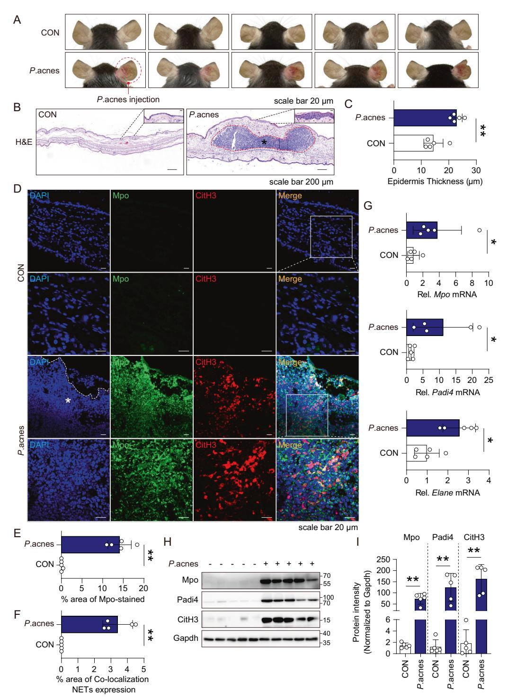
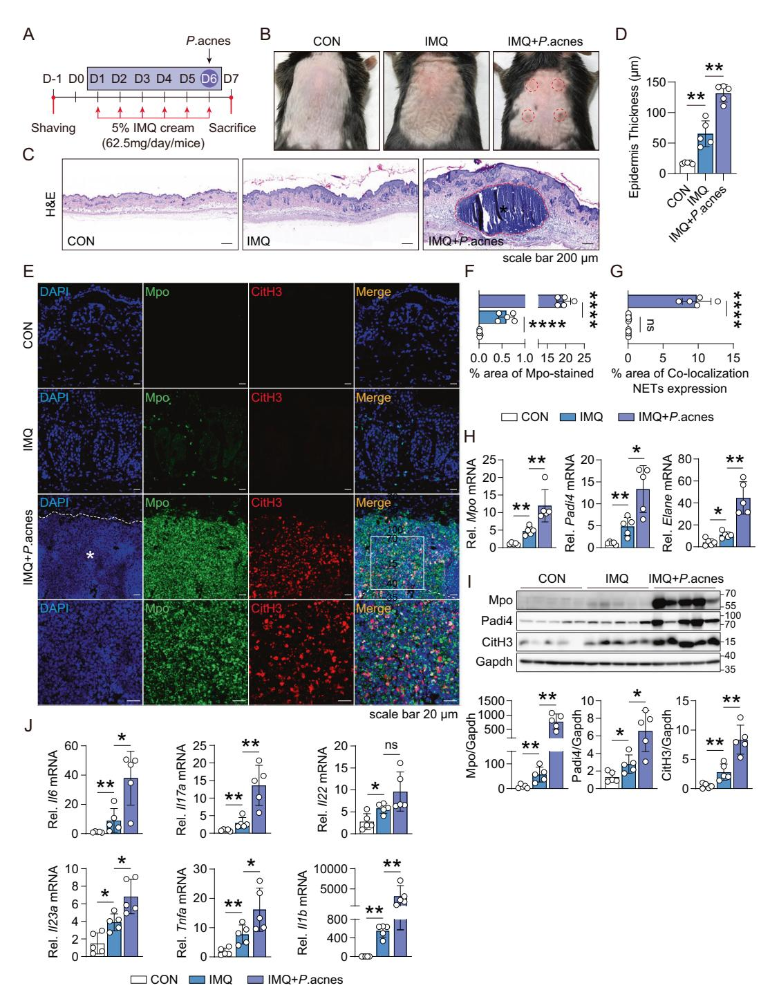
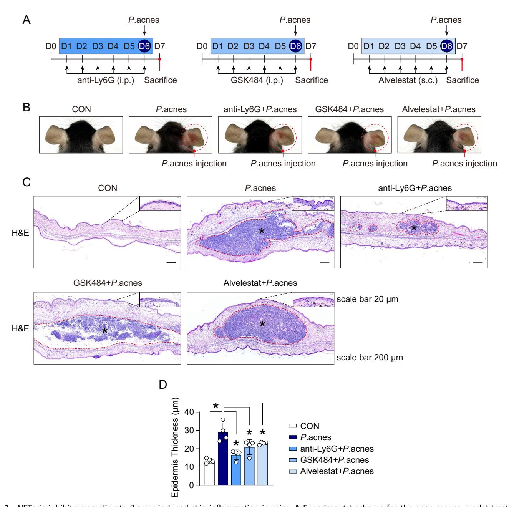
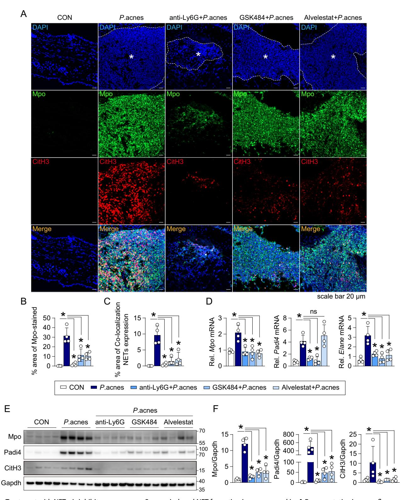
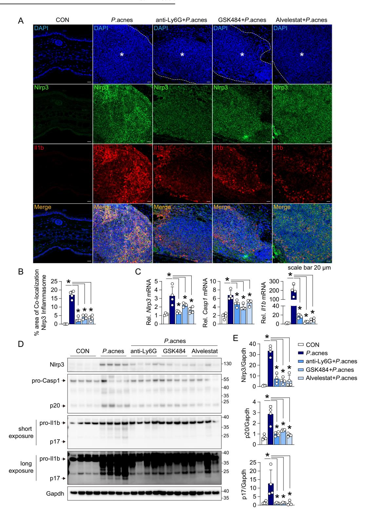
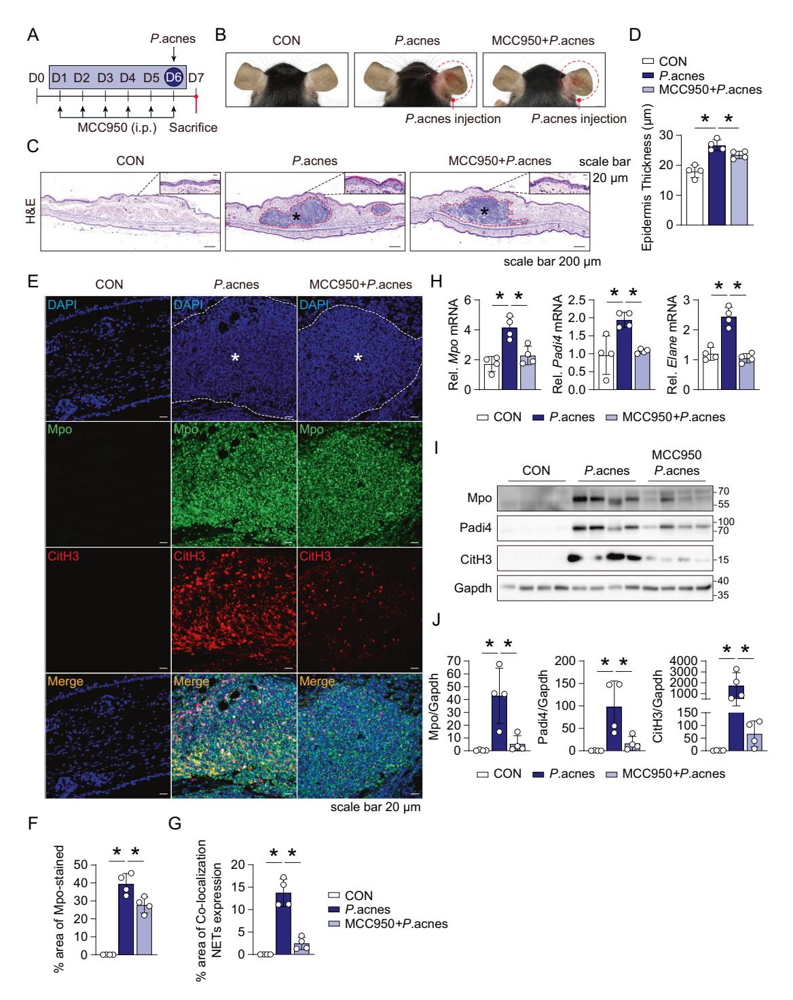
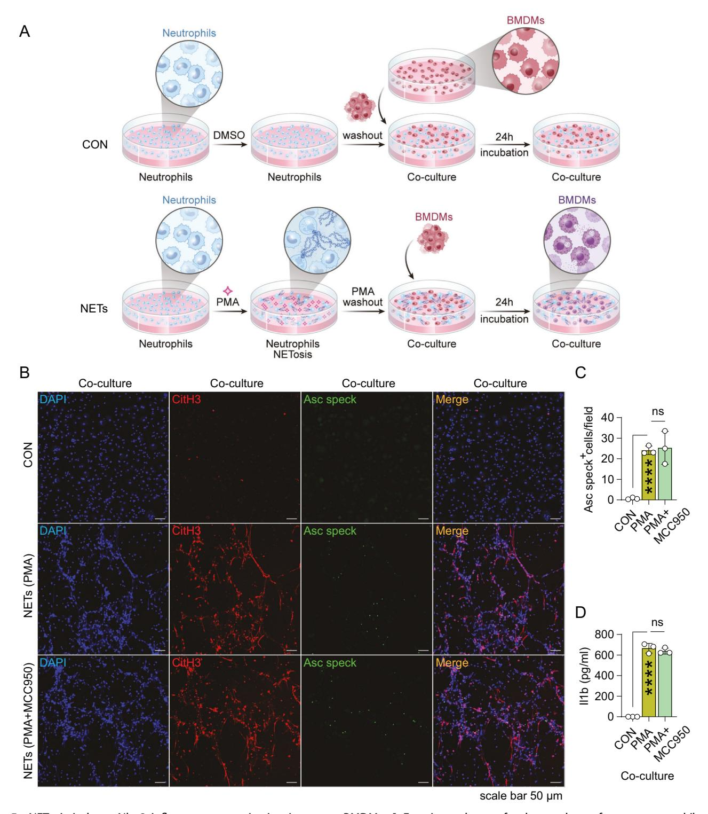
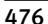
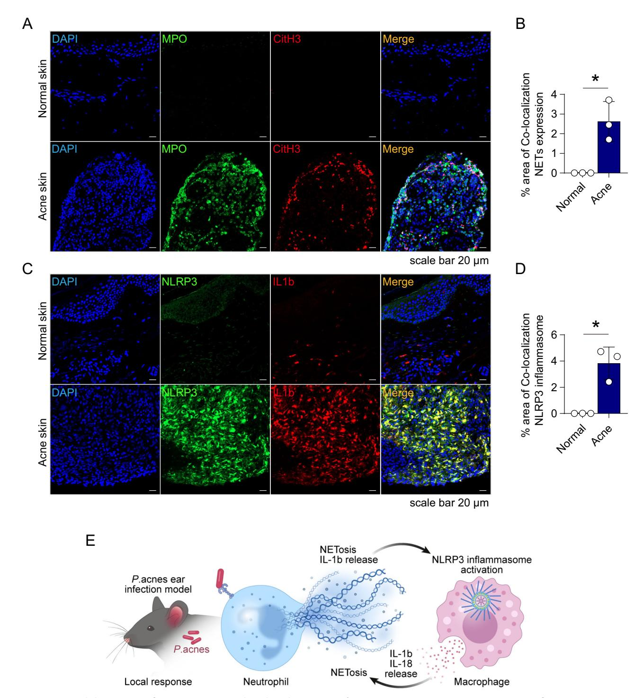

## **ARTICLE**

# NLRP3 inflammasome activation and NETosis positively regulate each other and exacerbate proinflammatory responses: implications of NETosis inhibition for acne skin inflammation treatment

Hyo Jeong Kim1,3, Yun Sang Lee1,3, Bok-Soon Lee1, Chang-Hak Han1,2, Sang Gyu Kim1,2 and Chul-Ho Kim1,2

© The Author(s), under exclusive licence to CSI and USTC 2024

Inflammasomes are multiprotein complexes involved in the host immune response to pathogen infections. Thus, inflammasomes participate in many conditions, such as acne. Recently, it was shown that NETosis, a type of neutrophil cell death, is induced by bacterial infection and is involved in inflammatory diseases such as delayed wound healing in patients with diabetes. However, the relationship between inflammasomes and NETosis in the pathogenesis of inflammatory diseases has not been well studied. In this study, we determined whether NETosis is induced in *P. acnes*-induced skin inflammation and whether activation of the nucleotide-binding domain, leucine-rich family, and pyrin domain-containing-3 (NLRP3) inflammasome is one of the key factors involved in NETosis induction in a mouse model of acne skin inflammation. We found that NETosis was induced in *P. acnes*-induced skin inflammation in mice and that inhibition of NETosis ameliorated *P. acnes*-induced skin inflammation. In addition, our results demonstrated that inhibiting inflammasome activation could suppress NETosis induction in mouse skin. These results indicate that inflammasomes and NETosis can interact with each other to induce *P. acnes*-induced skin inflammation and suggest that targeting NETosis could be a potential treatment for inflammasome-mediated diseases as well as NETosis-related diseases.

Keywords: P. acnes; NETosis; NLRP3 inflammasome; Skin inflammation

Cellular & Molecular Immunology (2024) 21:466-478; https://doi.org/10.1038/s41423-024-01137-x

## INTRODUCTION

Acne vulgaris (AV) is a common skin disease with a lifetime incidence of approximately 85% [1] and is associated with local scarring, depression, and anxiety, which reduce quality of life [2, 3]. Current treatments for AV include benzoyl peroxide or topical retinoids. However, side effects and unresponsiveness may lead to halting treatment [4]. Because AV affects quality of life, patients with AV prefer more effective treatment without side effects.

Acne is triggered by *Propionibacterium acnes* (*P. acnes*), an anaerobic and gram-positive bacterium frequently found on human skin [5, 6]. Stimulation of sebocytes with *P. acnes* significantly upregulated the expression of proinflammatory cytokines [7–9]. It is also known that *P. acnes* activates the nucleotide-binding domain, leucine-rich family, and pyrin domain-containing-3 (NLRP3) inflammasome in humans [10]. Clinically relevant inflammation in acne may be initiated by disruption of the follicular epithelium, followed by the spread of bacteria, including *P.* acnes, to the dermis, leading to the development of papules, pustules, and nodulocystic lesions [6]. Although *P.* acnes is a commensal bacterium of normal skin, it (together with the sebaceous gland) is considered to play an important role in acne development.

The innate immune system constitutes a highly efficient barrier to diverse organismal insults by rapidly detecting pathogens and tissue damage [11]. The activation of pattern recognition receptors (PRRs) by pathogen- and damage-associated molecular patterns (PAMPs and DAMPs) leads to early local detection of insults and the production of proinflammatory cytokines [12, 13]. NLRP3 is an important PRR involved in antiviral and antibacterial innate immunity, as well as in the response to adjuvants critical for adaptive immunity. Upon activation, NLRP3 assembles a typical multimeric inflammasome complex comprising the adaptor ASC and the effector procaspase-1 to mediate the activation of caspase-1 [13–15].

Recently, it has been suggested that bacteria can induce neutrophil cell death and NETosis, which traps and kills bacteria for host defense [16]. Thus, neutrophil extracellular traps (NETs), generated by a process termed NETosis, are a novel mechanism used by the innate immune system to eliminate and kill invading pathogens [17, 18]. NET formation begins with neutrophil activation through the recognition of stimuli and activation of the NADPH oxidase (NOX) complex through protein kinase C (PKC)-Raf/MERK/ERK [19–21], which in turn activates myeloperoxidase (MPO), neutrophil elastase (NE), and protein-arginine deiminase type 4

Received: 7 November 2022 Accepted: 18 January 2024

Published online: 26 February 2024

&lt;sup>1Department of Otolaryngology, School of Medicine, Ajou University, Suwon, Republic of Korea. 2Department of Molecular Science and Technology, Ajou University, Suwon, Republic of Korea. 3These authors contributed equally: Hyo Jeong Kim, Yun Sang Lee. ⊠email: ostium@ajou.ac.kr

(PADI4) [22, 23]. PADI4 catalyzes the citrullination of histones and promotes chromatin decondensation [24–26], whereas reactive oxygen species (ROS) promote NETosis by inducing the gradual separation and loss of the nuclear membrane and the release of chromatin from the cell through membrane pores.

NETs are also generated in response to a number of pathological, physiological and pharmacological stimuli [27]. These include microorganisms, inflammatory cytokines, pharmacological agents (phorbol esters or calcium ionophores), IL8 associated with placental microparticles, and antineutrophil cytoplasmic antibodies (ANCAs) [28]. Therefore, several studies have suggested that the induction of NETosis has detrimental effects and is involved in the pathogenesis of many diseases, such as metastatic tumors and delayed wound healing in diabetes [29]. Although NETs have a positive effect on clearing pathogens, they are also destructive due to the release of enzymes and other proteins that cause tissue injury. Thus, NETs are rapidly becoming a target for therapeutics in the management of various diseases.

Inflammasome activation and the induction of NETosis participate in many inflammatory diseases. However, the relationship between these two proinflammatory responses has not been well studied. In this study, we determined whether *P. acnes*-induced skin inflammation, the pathogenesis of which involves inflammasome activation, could induce NETosis and investigated the relationship between the NLRP3 inflammasome and NETosis in *P. acnes*-induced skin inflammation in mice.

#### RESULTS

## NETosis and NLRP3 inflammasomes are activated in *P. acnes*induced skin inflammation model mice

P. acnes-induced skin inflammation was induced as described in the Materials and Methods section. Fifteen microliters of P. acnes  $(1 \times 10^7 \text{ CFU/ml})$  was injected intradermally. Twenty-four hours after injection, ear tissue was collected after sacrifice. As shown in Fig. 1A, B, intradermal injections induced skin inflammation. Epidermal thickness and inflammatory cell infiltration were increased in model mice (Fig. 1C). To determine whether the NLRP3 inflammasome was activated, we followed a previously reported protocol [30], using confocal microscopy. Supplementary Fig. 1A-D shows that inflammasome activation was induced in the *P. acnes*-induced skin inflammation group. These results were confirmed by real-time PCR and western blot analysis. Consistent with the confocal microscopy results, the NIrp3, Casp1 and II1b transcript levels increased in P. acnes-injected tissues (Supplementary Fig. 1E). The protein levels of the inflammasome-related molecules Nlrp3, Casp1, and Il1b were also increased in *P. acnes*-injected tissues (Supplementary Fig. 1F, G), indicating that P. acnes injection induces inflammasome activation in mice.

To investigate whether NETosis was induced by P. acnes injection, we determined the levels of Mpo, a neutrophil marker, and citrullinated H3 (CitH3), a NETosis marker, using confocal microscopy. The levels of Mpo and CitH3 were increased, indicating that NETosis was induced by P. acnes injection (Fig. 1D). The Mpo and NET levels are shown in Fig. 1E, F. We also confirmed the induction of NETosis using real-time PCR and western blot analysis. The transcript and protein levels of Mpo, Padi4, and CitH3 in *P. acnes*-injected tissues were higher than those in control tissues (Fig. 1G-I). These results suggest that NETosis is induced by *P. acnes*-induced skin inflammation. Additionally, we determined which immune cells infiltrated P. acnes-induced inflamed skin tissues. As expected, the neutrophil marker Ly6g and the macrophage marker F4/80 were detected. However, CD4+, CD8+, and CD170+ cells were not detected, suggesting that T cells and eosinophils are not involved in P. acnes-induced skin inflammation (Supplementary Fig. 2A, B).

## P. acnes exacerbates imiquimod (IMQ)-induced psoriasis-like skin inflammation in mice

To investigate whether P. acnes can induce NETosis in other skin inflammatory diseases, we induced psoriasis-like skin inflammation using IMQ and injected P. acnes subcutaneously on Day 6. (Fig. 2A, B). H&E staining further confirmed that *P. acnes* injection induced an increase in epidermal thickness (Fig. 2C, D). We also investigated whether P. acnes injection could induce NETosis in psoriatic skin lesions. Confocal microscopy revealed that *P. acnes* induced NETosis (Fig. 2E–G). The mRNA levels of the NETosis markers Mpo, Padi4, and Elane also increased in P. acnes-injected skin (Fig. 2H). Concomitantly, the protein levels of Mpo, Padi4, and CitH3 were increased by P. acnes injection (Fig. 21). It was also determined that P. acnes could exacerbate psoriasis-like skin inflammation. The results of real-time PCR experiments showed that the transcript levels of the psoriasisassociated cytokines II6, II17a, II22, and II23a increased in response to P. acnes injection. In addition, the expression of the proinflammatory cytokines Tnfa and II1b was also increased in P. acnesinjected psoriatic mouse skin (Fig. 2J). These results suggest that P. acnes exacerbates psoriasis-like skin inflammation in mice.

## P. acnes induces NETosis in vitro

To determine whether *P. acnes* can induce NETosis, we isolated mouse neutrophils and stimulated them with *P. acnes*. As a positive control, isolated mouse neutrophils were stimulated with PMA or IL8. As shown in Supplementary Fig. 3A, SYTOX Green staining showed that stimulation with *P. acnes* induced NETosis, similar to stimulation with PMA or IL8. We confirmed these results using scanning electron microscopy. Consistently, the results showed that *P. acnes* could induce NETosis (Supplementary Fig. 3B). Western blot analysis also showed that stimulating mouse neutrophils with *P. acnes*, PMA, or IL8 induced CitH3 expression (Supplementary Fig. 3C), indicating that *P. acnes* could induce NETosis in vitro.

## NETosis inhibitors attenuate *P. acnes*-induced skin inflammation in mice

We showed that P. acnes could induce NETosis and skin inflammation. Therefore, we investigated whether NETosis inhibitors ameliorate P. acnes-mediated skin inflammation. Mice were intraperitoneally injected with an anti-Ly6G antibody (neutrophil depletion), GSK484 (a Padi4 inhibitor) or allostatin (elastase inhibitor) as described in the Methods section to inhibit NETosis (Fig. 3A). For neutrophil depletion, an anti-Ly6G antibody was injected once a day for 6 days. On Day 6, P. acnes was intradermally injected into the mouse ear, and the mice were sacrificed on Day 7 (Fig. 3A). The injection of the NETosis inhibitors GSK484 and allosterat, which are anti-Ly6G antibodies, suppressed P. acnesinduced skin inflammation (Fig. 3B). H&E staining experiments showed that proinflammatory cell infiltration was inhibited by injection of the anti-Ly6G antibody (Fig. 3C), and ear epidermal thickness was reduced (Fig. 3C, D). To confirm whether the NETosis inhibitor limited NETosis induction in the P. acnes-injected mouse ears, confocal microscopy was performed. Figure 4A shows that NET inhibitors suppressed P. acnes-induced NETosis, suggesting that intraperitoneally injected NETosis inhibitors could suppress NETosis in the ear tissues of skin inflammation model mice. The colocalization of Mpo and CitH3 was reduced by NETosis inhibitors (Fig. 4B, C). Consistently, real-time PCR and western blot analysis showed that treatment with NET inhibitors downregulated the NETosis markers Mpo, Padi4, and CitH3 (Fig. 4D–F).

# NET inhibitors suppress inflammasome activation in *P. acnes*-induced skin inflammation model mice

Because NET inhibitors suppressed *P. acnes*-induced skin inflammation, we determined whether treatment with NET inhibitors could suppress inflammasome activation in mice. Confocal microscopy showed that NET inhibitor treatment suppressed the

Fig. 1 The intradermal injection of *P. acnes* induces NETosis, suggesting that NETosis is involved in *P. acnes*-induced skin inflammation in mice. A Phenotype of *P. acnes*-induced skin inflammation in mice. C57BL/6 mice were injected intradermally with  $1 \times 10^7$  CFU of *P. acnes* or PBS, and inflammation-induced ear redness was imaged 24 h postinjection (n = 5 mice/group). **B** Representative H&E staining of ear tissue sections. In each frame, the red dotted lines and asterisks indicate the aggregation of inflammatory cells surrounding the injection site of *P. acnes*. The area within the black dotted lines represents the epidermis of the mouse ear and is magnified and displayed in the upper right corner. **C** Epidermal thickness increased following the intradermal injection of *P. acnes*. Epidermal thickness was measured at 17 randomly selected points (n = 5/ group, \*\*P < 0.01 by the Mann–Whitney t = 1.00 the NETosis markers Mpo (green) and citrullinated H3 (CitH3; red) were detected in the skin of mice injected with *P. acnes*. The average percentage of Mpo (**E**) and colocalization of Mpo and CitH3 areas (**F**) increased in the *P. acnes*-injected mouse ear skin. The values for each mouse ear skin sample represent the average of 6 fields of view imaged at 20× magnification. The data are presented as the mean Mpo or Mpo/CitH3 colocalization area over the ear skin area  $\pm$  standard deviation (SD) of individual ear skin in mice (n = 5/ group; \*\*P < 0.01 according to the Mann–Whitney t = 1.00 the Mann–Whitney t = 1.00 the Mann–Whitney t = 1.00 the Mann–Whitney t = 1.00 the Mann–Whitney t = 1.00 the Mann–Whitney t = 1.00 the Mann–Whitney t = 1.00 the Mann–Whitney t = 1.00 the Mann–Whitney t = 1.00 the Mann–Whitney t = 1.00 the Mann–Whitney t = 1.00 the Mann–Whitney t = 1.00 the Mann–Whitney t = 1.00 the Mann–Whitney t = 1.00 the Mann–Whitney t = 1.00 the Mann–Whitney t = 1.00 the Mann–Whitney t = 1.00 the Mann–Whitney t = 1.00 the Mann–Whitney t = 1.00 the Mann–W

**Fig. 2** *P. acnes* exacerbates IMQ-induced psoriasis-like skin inflammation. **A** Psoriasiform dermatitis was induced on the shaved back skin by applying IMQ for 6 consecutive days, and on the 6th day, IMQ cream was applied, and 4 h later, *P. acnes*  $(1 \times 10^7)$  CFU/point) was intradermally injected into back skin (n = 4 mice/group). **B** Phenotype of mouse back skin on Day 7. **C** Representative H&E staining of the dorsal lesions of the mice in the three experimental groups (Vaseline, IMQ, and IMQ + *P. acnes*). In each frame, the red dotted lines and asterisks indicate the aggregation of inflammatory cells surrounding the injection site of *P. acnes*. **D** Epidermal thickness in the IMQ + P. + P. + P. + P. + P. + P. + P. + P. + P. + P. + P. + P. + P. + P. + P. + P. + P. + P. + P. + P. + P. + P. + P. + P. + P. + P. + P. + P. + P. + P. + P. + P. + P. + P. + P. + P. + P. + P. + P. + P. + P. + P. + P. + P. + P. + P. + P. + P. + P. + P. + P. + P. + P. + P. + P. + P. + P. + P. + P. + P. + P. + P. + P. + P. + P. + P. + P. + P. + P. + P. + P. + P. + P. + P. + P. + P. + P. + P. + P. + P. + P. + P. + P. + P. + P. + P. + P. + P. + P. + P. + P. + P. + P. + P. + P. + P. + P. + P. + P. + P. + P. + P. + P. + P. + P. + P. + P. + P. + P. + P. + P. + P. + P. + P. + P. + P. + P. + P. + P. + P. + P. + P. + P. + P. + P. + P. + P. + P. + P. + P. + P. + P. + P. + P. + P. + P. + P. + P. + P. + P. + P. + P. + P. + P. + P. + P. + P. + P. + P. + P. + P. + P. + P. + P. + P. + P. + P. + P. + P. + P. + P. + P. + P. + P. + P. + P. + P. + P. + P. + P. + P. + P. + P. + P. + P. + P. + P. + P. + P. + P. + P. + P. + P. + P. + P. + P. + P. + P. + P. + P. + P. + P.

Fig. 3 NETosis inhibitors ameliorate *P.acnes*-induced skin inflammation in mice. A Experimental scheme for the acne mouse model treated with the NETosis inhibitors Ly6G, GSK484, or allvestestat (n=4 mice/group). **B** Representative images of PBS- or NETosis inhibitor-treated *P. acnes*-induced edema in the ears of mice. **C** Representative H&E staining of ear tissue sections. In each frame, the red dotted lines and asterisks indicate the aggregation of inflammatory cells surrounding the injection site of *P. acnes*. The area within the black dotted line represents the epidermis of the mouse ear and is magnified and displayed in the upper right corner. **D** The epidermal thickness of the ear skin of *P. acnes*-treated mice treated with NETosis inhibitors decreased. Epidermal thickness was measured at 17 randomly selected points (n=4/group; \*P<0.05 by the Mann–Whitney t test). The data are presented as the mean t SD

colocalization of Nlrp3 and Il1b (Fig. 5A, B). RNA levels of *Nlrp3*, *Casp1*, and *Il1b* were also inhibited by treatment with NET inhibitors in the ear tissues of *P. acnes*-injected mice (Fig. 5C). These results were confirmed by western blot analysis. Figure 5D shows that Nlrp3, Casp1, and Il1b expression was inhibited in the ear tissues of NET inhibitor-injected mice compared with the ear tissues of positive control mice, in which only *P. acnes* was injected (Fig. 5D, E). These results indicated that NET inhibition can inhibit inflammasome activation and inflammasome-mediated inflammation. Taken together, these results suggest that NETosis inhibitors can suppress *P. acnes*-induced skin inflammation through NET inhibition.

## An inflammasome inhibitor suppresses NETosis in *P. acnes*-induced skin inflammation model mice

To investigate the relationship between inflammasomes and NETosis, we treated mice with the Nlrp3 inhibitor MCC950 and determined whether NETosis could be suppressed in *P. acnes*-induced mouse ear skin. First, MCC950 treatment inhibited inflammasome activation in *P. acnes*-induced mouse ears. *P. acnes* was injected intradermally on Day 6, and MCC950 was injected intraperitoneally for 6 days. The mice were sacrificed on Day 7 (Fig. 6A). As expected, MCC950 suppressed *P. acnes*-induced skin inflammation (Fig. 6B, C). The epidermal thickness decreased in response to MCC950 treatment (Fig. 6D). We also confirmed that MCC950 treatment inhibited the

Fig. 4 Treatment with NETosis inhibitors suppresses P. acnes-induced NET formation in mouse ear skin. A Representative immunofluorescence staining of Mpo (green)- and CitH3 (red)-positive areas in mouse ear skin. In the DAPI frame, the white dotted lines and asterisks indicate the aggregation of inflammatory cells surrounding the injection site of P. acnes. The average percentage of Mpo (B) and colocalization of Mpo and CitH3 areas (C) were inhibited by NETosis inhibitor treatment. The values for each mouse ear skin sample represent the average of 6 fields of view imaged at  $20 \times$  magnification. The data are presented as the mean Mpo or Mpo/CitH3 colocalization area over the ear skin area  $\pm$  SD of individual ear skin in mice (n = 4/group; \*P < 0.05 according to the Mann–Whitney t test). D The mRNA expression of Mpo, Padi4, and Elane was suppressed by NETosis inhibitor treatment (n = 4/group; \*P < 0.05; Mann–Whitney t test). E western blot analysis revealed a decrease in the protein levels of Mpo, Padi4, and CitH3 in the skin of NETosis inhibitor-treated P. acnes-injected mice. F Graphs illustrating the protein levels of Mpo, Padi4, and CitH3 in mouse ear skin. (n = 4/group, \*P < 0.05 by the Mann–Whitney t test). The data are presented as the mean t = 1 SD

Fig. 5 NETosis inhibitors suppress the NLRP3 inflammasome in *P. acnes*-injected mouse ear skin. A Representative immunofluorescence staining of Nlrp3 (green)- and Il1b (red)-positive areas in mouse ear skin injected with *P. acnes*. **B** The average percentage of cells colocalized with Nlrp3 and Il1b was reduced by NETosis inhibitor treatment. The values for each mouse ear skin sample represent the average of 6 fields of view imaged at 20× magnification. The data are presented as the mean Nlrp3/Il1b colocalization area over the ear skin area  $\pm$  SD of individual ear skin in mice (n = 4/group; \*P < 0.05 according to the Mann–Whitney t test). In the DAPI frame, the white dotted lines and asterisks indicate the aggregation of inflammatory cells surrounding the injection site of P. acnes. **C** The mRNA expression of Nlrp3, Casp1, and Il1b was inhibited by NETosis inhibitor treatment (n = 4 mice/group; \*P < 0.05; Mann–Whitney t test). **D** western blot analysis revealed a decrease in the protein levels of Nlrp3, Casp1 (p20), and Il1b (p17) in the skin of NETosis inhibitor-treated P. acnes-injected mice. **E** Graphs illustrating the protein levels of Nlrp3, Casp1 (p20), and Il1b (p17) in mouse ear skin. (n = 4/group, \*P < 0.05 by the Mann–Whitney t test). The data are presented as the mean t SD

Fig. 6 Inhibition of the NIrp3 inflammasome suppresses NETosis induction in P. acnes-injected mouse ear skin. A Experimental scheme of the skin inflammation model mice treated with the NLRP3 inhibitor MCC950. **B** Representative images of PBS- or NIrp3 inhibitor-treated P. acnes-induced edemain the ears of mice. **C** Representative H&E staining of ear tissue sections. In each frame, the red dotted lines and asterisks indicate the aggregation of inflammatory cells surrounding the injection site of P. acnes. The area within the black dotted line represents the epidermis of the mouse ear and is magnified and displayed in the upper right corner. **D** The epidermal thickness of P. acnes-treated NIrp3 inhibitor-treated mouse ear skin decreased. Epidermal thickness was measured at 17 randomly selected points (n = 4/group; \*P < 0.05 by the Mann–Whitney t test). **E** Representative immunofluorescence staining of Mpo (green)- and CitH3 (red)-positive areas in mouse ear skin. In the DAPI frame, the white dotted lines and asterisks indicate the aggregation of inflammatory cells surrounding the injection site of P. acnes. The average percentage of Mpo (P) and colocalization of Mpo and CitH3 areas (P0 were reduced by NIrp3 inhibitor treatment. The values for each mouse ear skin sample represent the average of 6 fields of view imaged at 20× magnification. The data are presented as the mean Mpo or Mpo/CitH3 colocalization area over the ear skin area  $\pm$  SD of individual ear skin in mice (P1 and Elane was suppressed by NIrp3 inhibitor treatment (P2 and Elane was suppressed by NIrp3 inhibitor treatment (P3 and Elane was suppressed by NIrp3 inhibitor treatment (P4 and Elane was suppressed by NIrp3 inhibitor treatment (P5 acnes injected mice. P6 Graphs depicting the protein levels of Mpo, Padi4, and CitH3 in the ear skin of NIrp3 inhibitor-treated P6 acnes injected mice. P6 Graphs depicting the protein levels of Mpo, Padi4, and CitH3 in mouse ear skin. (P6 Agroup, P7 acnes inhibito

colocalization of Nlrp3 and Il1b (Supplementary Fig. 4A, B). The protein and mRNA levels of Nlrp3, Casp1, and Il1b were also determined. Treatment with MCC950 decreased the transcript levels of *Nlrp3*, *Casp1*, and *Il1b* (Supplementary Fig. 4C). Western blot analysis also showed that MCC950 inhibited Nlrp3, Casp1, and Il1b expression (Supplementary Fig. 4D, E). These results indicate that MCC950 suppresses inflammasome- and *P. acnes*-induced skin inflammation in mice.

Next, we determined whether NETosis was inhibited in MCC950-treated mouse ear tissue. MCC950 treatment inhibited *P. acnes*-induced NETosis activation. The expression of Mpo and CitH3, which are NETosis markers, was inhibited by MCC950 treatment (Fig. 6E–G). Real-time PCR also showed that the mRNA levels of *Mpo, Padi4*, and *Elane* were decreased in the ear skin of MCC950-treated mice (Fig. 6H). In addition, we determined that the protein levels of Mpo, Padi4, and CitH3 were reduced by MCC950 treatment (Fig. 6I, J). These results suggest that inflammasome inhibitors could suppress the induction of NETosis in *P. acnes*-induced skin inflammation in mice.

## NETosis induces NIrp3 inflammasome activation in mouse BMDMs

To determine whether NETosis could induce Nlrp3 inflammasome activation in vitro, we isolated mouse neutrophils and cultured them with PMA to induce NETosis. After NETosis induction, the media was replaced with new media, and mouse BMDMs were subsequently added. After 24 h, the cocultured cells were stained with CitH3 and apoptosis-associated speck-like protein (Asc) antibodies (Fig. 7A). NETosis activation was confirmed by confocal microscopy, which showed increased CitH3 levels (Fig. 7B), and we observed that inflammasome activation in BMDMs could be induced by coculture with NETs from neutrophils (Fig. 7B–D). These results indicate that inflammasomes can be activated by NETs. We also confirmed that MCC950 does not inhibit the induction of NETosis. Treatment of neutrophils with MCC950 and PMA did not suppress NET formation (Fig. 7B–D; Supplementary Fig. 5A, B).

# NETosis and inflammasome activation are induced in acne patient skin tissues

Finally, we determined whether NETosis was activated in human acne skin samples using confocal microscopy. Figure 8A, B show that the NET markers Mpo and CitH3 were colocalized in acne patient skin tissue, suggesting that NETosis is activated in human acne skin tissues. Inflammasome activation was also detected in human acne skin samples (Fig. 8C, D). Taken together, our results suggest that NET formation can induce inflammasome activation and that activated inflammasomes can also induce NETosis (Fig. 8E). These results suggested that NETosis inhibition could be a suitable therapy for the treatment of inflammasomemediated diseases, such as acne-related skin inflammation.

The treatment of inflammatory acnes is challenging. A lack of response, side effects, and recurrence frequently occur [31]. Therefore, more effective therapies for acne are needed. Previous clinical reports suggest the therapeutic effect of drugs targeting IL1b signaling in patients with autoinflammatory syndromes, in which acne is a symptom, indicating that the inflammasome is involved in the pathogenesis of acne [32–34]. Therefore, targeting IL1b production and secretion might be an effective therapeutic strategy for treating AV.

NETs are known to function as a host defense mechanism. However, NETs are also involved in blood coagulation, tumor metastasis, inflammation, and autoimmune diseases. Therefore, although NETs are necessary for host defense, inhibiting NETs could be a possible therapeutic strategy because of their detrimental effects. NETosis and inflammasome activation are involved in proinflammatory responses. However, whether NETosis is activated in AV and how it influences NETosis and inflammasome activation in proinflammatory disease conditions have not been reported.

Our current experiments demonstrated that NETosis is activated in *P. acnes*-mediated skin inflammation and that the activated inflammasome could induce NETosis. We also demonstrated that *P. acnes* induces NETosis and exacerbates IMQ-induced psoriasis-like skin inflammation, suggesting that *P. acnes* can promote proinflammatory disease by inducing NET formation. Additionally, treatment with an inflammasome inhibitor suppressed the induction of NETosis. Furthermore, the inhibition of NETosis reduced inflammasome activation and ameliorated *P. acnes*-induced skin inflammation.

In this study, NETosis inhibitors were administered intraperitoneally. To investigate the efficacy of these agents when they were injected through different routes, we administered intradermal injections of the inhibitors. However, NETosis inhibitors should be injected 3-6 times before *P. acnes* injection. Thus, intradermal injections of NETosis inhibitors spilled out of the previously injected site, so we could not inject NETosis inhibitors intradermally. Instead, we intravenously injected NETosis inhibitors (Supplementary Fig. 6A), and the results showed that i.v. injection of NETosis inhibitors ameliorated P. acnes-induced skin inflammation in mice (Supplementary Fig. 6B). The intravenously injected NETosis inhibitors decreased ear thickness (Supplementary Fig. 6C, D). In addition, the inhibition of NETosis was assessed through confocal microscopy and western blot analysis (Supplementary Fig. 6E-I). These findings indicate that i.v. injection of NETosis inhibitors or the inflammasome inhibitor MCC950 could inhibit the induction of NETosis and inflammasome activation and alleviate P. acnes-induced skin inflammation in mice.

These results imply that inflammasome activation might induce NETosis, which may exacerbate inflammasome-mediated diseases, including acne. Moreover, NETosis might induce inflammasome activation. Therefore, inflammasome activation and NETosis activation positively influence each other to induce an inflammatory response, and inhibition of one of both suppresses the activation of the other. These results also provide insights into the involvement of NETosis in inflammasome-mediated diseases. Thus, treatment with NET inhibitors could alleviate other inflammasome-mediated diseases or vice versa. Although further studies on the interaction between inflammasome activation and NETosis are necessary, our results suggest that compounds targeting NETosis might ameliorate not only NETosis-related but also inflammasome-mediated diseases.

Taken together, the results of our study suggest that the inhibition of NETosis could ameliorate inflammasome-mediated diseases and imply that combination therapy with inflammasome and NETosis inhibitors might be an attractive way to treat AV more effectively.

## **METHODS**

## Preparation of neutrophils and bone marrow-derived macrophages (BMDMs)

All the mice were analyzed between 7 and 9 weeks of age. Bone marrow cells were collected by flushing the femur with 10 ml of 5% FBS in PBS using a 26-gauge needle and filtering through a sterile 70-µm mesh nylon cell strainer. Mouse bone marrow-derived neutrophils were isolated using a neutrophil isolation kit (Miltenyi Biotec) following the manufacturer's protocol. Neutrophils were cultured in X-VIVOTM15 serum-free hematopoietic cell medium (Lonza) supplemented with 1% antibiotic-antimycotic agent. Bone marrow cells were differentiated into BMDMs in X-VIVOTM15 medium supplemented with murine GM-CSF (25 ng/ml; PeproTech) for 7 days. All cells were cultured at 37 °C in a 5% CO2 incubator.

#### **Bacterial** culture

*P. acnes* (KCTC3314T) was obtained from the Korean Collection for Type Cultures (KCTC, Daejeon, Korea). Reinforced Clostridial Medium (RCM; KisanBio, Seoul, Korea) was used to grow *P. acnes* for 72 h at 37 °C under anaerobic conditions using a Gas-Pak jar system (BD Bioscience). The bacteria were grown in the RCM until the culture reached the log-phase. *P. acnes* was collected by centrifugation at 4500 rpm for 20 min at 4 °C, after which the pellets were washed with sterile endotoxin-free PBS.

**Fig. 7** NETosis induces NIrp3 inflammasome activation in mouse BMDMs. **A** Experimental setup for the coculture of mouse neutrophils and macrophages. **B** Representative immunofluorescence staining of CitH3 (red; neutrophils) and Asc speck (green; macrophages) cells. **C** The average number of Asc speck-positive BMDMs was quantified (n = 10 fields). The average number of Asc specimens and SD for three independent experiments are plotted. \*\*\*\*P < 0.0001; CON vs. PMA, ns nonsignificant; PMA vs. PMA + MCC950 by unpaired t test. **D** The secretion of II1b in BMDMs from the supernatant collected during coculture was measured via ELISA. The data are expressed as the mean  $\pm$  SD. \*\*\*\*P < 0.0001; CON vs. PMA, ns nonsignificant; PMA vs. PMA + MCC950 by unpaired t test. All the experiments were performed in triplicate and repeated three times

#### **Animal experiments**

We used 7-week-old C57BL/6 mice (Orient Bio, Gyeonggi, Korea) in these experiments. The mice were housed in an environmentally controlled room with a 12-h/12-h light/dark cycle and free access to laboratory chow and water. The procedures were performed in biosafety level BSL-2

laboratory facilities in accordance with the Guide for the Care and Use of Laboratory Animals (published by the US National Institutes of Health). The protocol for animal use was approved by the Committee for Ethics in Animal Experiments of Ajou University School of Medicine (AUMC, IACUC No. 2021-0058).

**Fig. 8** NETosis and the NLRP3 inflammasome are induced in skin tissues of acne patients. **A** Representative immunofluorescence staining of Mpo (green) and CitH3 (red) was performed to evaluate NETosis in human acne skin tissues and normal skin tissues. **B** The average percentage of areas colocalized with MPO and CitH3 increased in the acne patient tissues. The values for each human acne skin sample represent the average of 10 fields of view imaged at 20× magnification. \*P < 0.05 according to an unpaired t test. **C** Representative immunofluorescence staining of NLRP3 (green) and IL1b (red) was performed to evaluate NLRP3 inflammasome activation in human acne skin tissues and normal skin tissues. **D** The average percentage of areas in which NLRP3 and IL1b were colocalized increased in acne patient tissues. The values for each human acne skin sample represent the average of 10 fields of view imaged at 20× magnification. \*P < 0.05 according to an unpaired t test. **E** Schematic diagram illustrating the interplay between NETosis and NLRP3 inflammasome activation. Both processes can mutually activate each other, leading to the exacerbation of inflammatory diseases

## P. acnes-induced skin inflammation mouse model

Seven-week-old C57BL/6 mice were intradermally injected with live P.  $acnes~(1 \times 10^7~\text{CFU}/15~\mu\text{l} \text{ in PBS})$  in the right ear, while the control group received an equal volume of PBS. The mice were sacrificed at 24 h after the injection, and ear tissues were then collected for further analysis.

InVivoPlus anti-mouse Ly6G (50  $\mu$ g/mouse; BioXcell) was diluted in 100  $\mu$ l of InVivoPure pH 7.0 dilution buffer (BioXcell), and GSK484 (5  $\mu$ g/kg; Selleckchem), allvelestat (5  $\mu$ g/kg; Selleckchem), and MCC950 sodium (10  $\mu$ g/kg; Selleckchem) diluted in 100  $\mu$ l of PBS were administered intraperitoneally every day for 6 days. On the 6th day, NETosis inhibitors or

an NLRP3 inhibitor MCC950 was intraperitoneally administered, and 4 h later, *P. acnes* was intradermally injected into the right ear. At the end of the experiment, the mice were sacrificed, and the ears were sampled for H&E staining, immunofluorescence staining, real-time PCR, and western blot analysis.

## Imiquimod (IMQ)-induced psoriasis-like skin inflammation mouse model

Seven-week-old C57BL/6 mice were subjected to a daily topical dose of 62.5 mg of IMQ cream (5%) (Aldara; 3 M Pharmaceuticals) on the shaved back for 6 consecutive days, resulting in a daily dose of 3.125 mg of the active compound. The control mice were treated similarly with a control vehicle cream (Vaseline Lanette cream). On the 6th day, IMQ cream was applied, and 4 h later, *P. acnes* was intradermally injected into the back skin.

## **NET formation assay**

Isolated neutrophils were resuspended in X-VIVOTM 15 medium (Lonza) at  $2.5 \times 10^6$  cells/ml and stimulated with 250 nM phorbol myristate acetate (PMA) (InvivoGen), 200 ng/ml recombinant IL8 (R&D Systems) for 24 h, or *P. acnes* (1  $\times$  107 CFU) for 6 h. Then, Sytox Green dye (Thermo) was added to the culture, and the cells were incubated for 15 min. The samples were imaged by a Nikon A1R Spectral Confocal Laser Dual Scanning Microscope (Nikon).

## Scanning electron microscopy (SEM)

Isolated mouse neutrophils were added to poly-L-lysine (Sigma)-pretreated coverslips and treated with 500 nM PMA (InvivoGen), 500 ng/ml recombinant IL8 (R&D Systems), or *P. acnes* for 6 h. The cells were fixed with 2.5% glutaraldehyde (Merck), postfixed via repeated incubations with 1% osmium tetraoxide (Merck)/1% tannic acid (Merck), and dehydrated with a graded ethanol series (30%, 50%, 70%, 100%). After dehydration and critical-point drying, the specimens were coated with 2 nm platinum and analyzed with scanning electron microscope (SNE-4550 M Plus; SEC).

#### Western blot analysis

Total protein was extracted from mouse neutrophils or mouse ear tissues with RIPA buffer (Sigma) supplemented with protease inhibitor cocktail (Roche) and phosphatase inhibitor tablets (Roche) on ice for 30 min. The cell or tissue lysates were centrifuged at  $13,000 \times g$  for 15 min to harvest the protein supernatant, and the concentrations were determined via a BCA assay (Thermo Fisher Scientific). Equal amounts of proteins were subjected to SDS-PAGE and transferred to PVDF membranes (Merck). The PVDF membranes were blocked in 5% milk dissolved in TBST (0.1% Tween-20 in TBS) for 1 h and incubated with the indicated primary antibodies (1:1000) overnight at 4 °C, including anti-Mpo (AF3667, R&D Systems), anti-Padi4 (ab214810, Abcam), anti-CitH3 (ab5103, Abcam), anti-F4/80 (14-4801-82, Thermo Fisher Scientific), anti-Nlrp3 (AG-20B-0014, Adipogen), anti-Casp1 (AG-20B-0042, Adipogen), anti-Il1b (ab9722, Abcam), anti-Gapdh (2118, Cell Signaling Technology), and anti-Actb (4970, Cell Signaling Technology). After washing three times, the membranes were incubated with an HRP-conjugated secondary rabbit antibody (1:5,000; 7074; Cell Signaling Technology), secondary mouse antibody (1:5000; 7076; Cell Signaling Technology), secondary rat antibody (1:5000; 7077; Cell Signaling Technology), or secondary goat antibody (1:10,000; ab6741; Abcam) for 1 h at RT. Proteins were visualized using enhanced chemiluminescence (ECL) reagents (GE Healthcare Life Sciences) and detected with an Amersham™ ImageQuant™ 650 imager (Cytiva). Densitometric values were determined and quantified via western blotting after nonsaturating exposure using ImageJ software (NIH, Bethesda, Maryland, USA; Java 1.8.0 112) and normalized against Gapdh or Actb, which served as internal loading controls. Using ImageJ, we recorded the target intensity for each lane and plotted the intensity against the protein load. Using spiked proteins allowed us to control the amount of total protein per lane while only changing the amount of spiked proteins. These procedures were performed as described above for all the western blot studies.

## Immunofluorescence

For tissue immunofluorescence, paraffin-embedded sections of acne patient skin tissue and ear tissues from mice infected with *P. acnes* were heated at 60 °C for 30 min, followed by deparaffinization and rehydration using xylene and graded ethanol. Then, the sections were subjected to

heat-mediated antigen retrieval with citrate buffer (pH 6.0; Abcam) for 20 min. The tissue samples were blocked with the Image-iTTM FX Signal Enhancer (Thermo Fisher Scientific) for 30 min and 10% normal donkey/ goat serum for 1 h at RT. Next, the slides were incubated with primary antibodies (1:200) overnight at 4 °C, including anti-Mpo (AF3667; R&D Systems), anti-CitH3 (ab5103; Abcam), anti-Cd11b (17800; Cell Signaling Technology), anti-Cd4 (ab183685; Abcam), anti-Cd8 (14-0081-82; Thermo Fisher Scientific), anti-Ly6g (14-5931-82; Thermo Fisher Scientific), anti-F4/80 (14-4801-82; Thermo Fisher Scientific), anti-Cd170 (14-1702-82; Thermo Fisher Scientific), anti-Nlrp3 (MA5-23919; Thermo Fisher Scientific), anti-II1b (ab9722; Abcam), and anti-Asc (sc-514414; Santa Cruz) antibodies. The slides were washed with PBST (0.1% Tween-20, PBS) three times and labeled with the secondary antibodies (1:300): donkey anti-goat IgG (H+L), Alexa Fluor Plus 488 (A32814, Thermo Fisher Scientific), donkey anti-rabbit IqG (H + L), Alexa Fluor Plus 555 (A32794, Thermo Fisher Scientific), goat anti-rat IgG (H + L), Alexa Fluor Plus 488 (A48269, Thermo Fisher Scientific), goat anti-rabbit IgG (H + L), Alexa Fluor Plus 555 (A32732, Thermo Fisher Scientific), and goat antimouse IgG (H+L), Alexa Fluor Plus 488 (A32723, Thermo Fisher Scientific) for 2 h at RT. After washing in PBST, a Vector® TrueVIEW® Autofluorescence Quenching Kit (Vector laboratories) was used to quench spontaneous fluorescence for 20 min at RT, followed by washing twice. The slides were mounted with ProLongTM Gold Antifade Mountant and DAPI (Thermo Fisher Scientific). Confocal images were taken on Zeiss LSM 900 and Airyscan 2 confocal laser scanning microscopes and analyzed with ZEN 2.3 software.

## RNA isolation and real-time PCR

Total RNA was isolated from mouse ear or back skin samples using TRIzol reagent (Thermo Fisher Scientific). Five micrograms of total RNA was converted into cDNA using ReverTra AceTM qPCR RT Master Mix (Toyobo) according to the manufacturer's instructions and subjected to real-time PCR. QuantiTech Primer Assays were purchased from Qiagen and included mouse *Mpo* (QT01065687), *Padi4* (QT01052065), *Elane* (QT00494872), *Nlrp3* (QT00122458), *Casp1* (QT00199458), *Il1b* (QT01048355), and *Gapdh* (QT01658692). Real-time PCR was performed using the StepOne Plus Real-Time PCR master kit (Toyobo). The relative expression levels (Rq) of the indicated genes were compared with the Gapdh expression level using the ΔΔCt method (StepOne Plus Software v2.3; Applied Biosystems).

## **NET and BMDM coculture**

Mouse neutrophils were suspended in X-VIVO $^{TM}15$  serum-free hematopoietic cell medium (Lonza) at  $2.5 \times 10^6$  cells/ml. Subsequently, the cells were stimulated with 500 nM PMA for 24 h on coverslips pretreated with poly-L-lysine (Sigma–Aldrich). The media containing PMA was subsequently changed to fresh X-VIVO $^{TM}15$  media. BMDMs were cocultured with NETosis-induced neutrophils for 24 h. The supernatant was collected and quantified with a commercially available mouse II1b ELISA kit (DY401-05, R&D Systems). The cells were fixed with 4% paraformal-dehyde for 15 min and permeabilized with 0.2% Triton X-100 for 10 min. The slides were blocked with 10% goat serum in PBS. NETosis and inflammasome activation were confirmed by staining with anti-CitH3 (1:200, ab5103, Abcam) and anti-Asc (1:200, sc-514414, Santa Cruz) antibodies. The slides were mounted with ProLongTM Gold Antifade Mountant and DAPI (Thermo Fisher Scientific). Confocal images were taken on Zeiss LSM 900 and Airyscan 2 confocal laser scanning microscopes.

## Skin samples from human acne patients

The skin samples from the acne patients were obtained from the Ajou University School of Medicine, Department of Dermatology. Approval for use of their samples was obtained from the Ajou University Medical Science Committee (AJOUIRB-KSP-20220142).

#### Statistical analysis

The statistical analyses were performed with the Prism software package (Prism 9.0, GraphPad Software). Statistical significance was determined with the Mann–Whitney two-tailed unpaired t test for nonparametric values and the Student two-tailed unpaired t test for parametric values. All of the graphs depict the means  $\pm$  standard deviations (SDs) unless otherwise indicated. \*, \*\*, \*\*\*, and \*\*\*\* denote P values < 0.05, 0.01, 0.001, and 0.0001, respectively; ns nonsignificant.

## REFERENCES

- 1. Bhate K, Williams HC. Epidemiology of acne vulgaris. Br J Dermatol. 2013;168:474–85.
- 2. Cunliffe WJ. Acne and unemployment. Br J Dermatol. 1986;115:386–386.
- 3. Ramos-e-Silva M, Ramos-e-Silva S, Carneiro S. Acne in women. Br J Dermatol. 2015;172:20–26.
- 4. Dikicier BS. Topical treatment of acne vulgaris: efficiency, side effects, and adherence rate. J Int Med Res. 2019;47:2987–92.
- 5. Quanico J, Gimeno J-P, Nadal-Wollbold F, Casas C, Alvarez-Georges S, Redoules D, et al. Proteomic and transcriptomic investigation of acne vulgaris microcystic and papular lesions: Insights in the understanding of its pathophysiology. Biochim Biophys Acta Gen Subj. 2017;1861:652–63.
- 6. Zouboulis CC. Acne and sebaceous gland function. Clin Dermatol. 2005;22:360–6.
- 7. Nagy I, Pivarcsi A, Kis K, Koreck A, Bodai L, McDowell A, et al. Propionibacterium acnes and lipopolysaccharide induce the expression of antimicrobial peptides and proinflammatory cytokines/ chemokines in human sebocytes. Microbes Infect. 2006;8:2195–205.
- 8. Clarke SB, Nelson AM, George RE, Thiboutot DM. Pharmacologic modulation of sebaceous gland activity: mechanisms and clinical applications. Dermatol Clin. 2007;25:137–46.
- 9. Kurokawa I, Danby FW, Ju Q, Wang X, Xiang LF, Xia L, et al. New developments in our under- standing of acne pathogenesis and treatment. Exp Dermatol. 2009;18:821–32.
- 10. Li ZJ, Choi DK, Sohn KC, Seo MS, Lee HE, Lee Y, et al. Propionibacterium acnes activates the NLRP3 inflammasome in human sebocytes. J Inves Dermatol. 2014;134:2747–65.
- 11. Thaiss CA, Zmora N, Levy M, Elinav E. The microbiome and innate immunity. Nature. 2016;535:65–74.
- 12. Kieser KJ, Kagan JC. Multi-receptor detection of individual bacterial products by the innate immune system. Nat Rev Immunol. 2017;17:376–90.
- 13. He Y, Hara H, Nunez G. Mechanism and regulation of NLRP3 inflammasome activation. Trends Biochem Sci. 2016;41:1012–21.
- 14. Guo H, Callaway JB, Ting JP-Y. Inflammasomes: mechanism of action, role in disease, and therapeutics. Nat Med. 2015;21:677–87.
- 15. Broz P, Dixit VM. Inflammasomes: mechanism of assembly, regulation and signaling. Nat Rev Immunol. 2016;16:407–20.
- 16. Brinkmann V, Reichard U, Goosmann C, Fauler B, Uhlemann Y, Weiss DS, et al. Neutrophil extracellular traps kill bacteria. Science. 2004;303:1532–5.
- 17. Papayannopoulos V. Neutrophil extracellular traps in immunity and disease. Nat Rev Immunol. 2018;18:134–47.
- 18. Bonaventura A, Vecchie A, Abbate A, Montecucco F. Neutrophil extracellular traps and cardiovascular diseases an update. Cells. 2020;9:231.
- 19. Papayannopoulos V, Metzler KD, Hakkim A, Zychlinsky A. Neutrophil elastase and myeloperoxidase regulate the formation of neutrophil extracellular traps. J Cell Biol. 2010;191:677–91.
- 20. Reeves EP, Lu H, Jacobs HL, Messina CGM, Bolsover S, Gabella G, et al. Killing activity of neutrophils is mediated through activation of proteases by K+ flux. Nature. 2002;416:291–7.
- 21. Smith CK, Vivekanandan-Giri A, Tang C, Knight JS, Mathew A, Padilla RL, et al. Neutrophil extracellular trap-derived enzymes oxidize high-density lipoprotein: an additional proatherogenic mechanism in systemic lupus erythematosus. Arthritis Rheum. 2014;66:2532–44.
- 22. Parker H, Winterbourn CC. Reactive oxidants and myeloperoxidase and their involvement in neutrophil extracellular traps. Front Immunol. 2013;3:424.
- 23. Hawez A, Al-Haidari A, Madhi R, Rahman M, Thorlacius H, et al. MiR-155 regulates PAD4 dependent formation of neutrophil extracellular traps. Front Immunol. 2019;10:2462.
- 24. Lewis HD, Liddle J, Coote JE, Atkinson SJ, Barker MD, Bax BD, et al. Inhibition of PAD4 activity is sufficient to disrupt mouse and human NET formation. Nat Chem Biol. 2015;11:189–91.
- 25. Wang Y, Li M, Stadler S, Correll S, Li P, Wang D, et al. Histone hypercitrullination mediates chromatin decondensation and neutrophil extracellular trap formation. J Cell Biol. 2009;184:205–13.

- 26. Martinod K, Demers M, Fuchs TA, Wong SL, Brill A, Gallant M, et al. Neutrophil histone modification by peptidylarginine deiminase 4 is critical for deep vein thrombosis in mice. Proc Natl Acad Sci USA. 2013;110:8674–9.
- 27. Kaplan MJ, Radic M. Neutrophil extracellular traps: double-edged swords of innate immunity. J Immunol. 2012;189:2689–95.
- 28. Hahn S, Giaglis S, Chowdury CS, Hosli I, Hasler P. Modulation of neutrophil NETosis: interplay between infectious agents and underlying host physiology. Semin Immunopathol. 2013;35:439–53.
- 29. Wong SL, Demers M, Martinod K, Gallant M, Wang Y, Goldfine AB, et al. Diabetes primes neutrophils to undergo NETosis, which impairs wound healing. Nat Med. 2015;21:815–9.
- 30. Li ZJ, Choi DK, Sohn KC, Seo MS, Lee HE, Lee Y, et al. Propionibacterium acnes activates the NLRP3 inflammasome in human sebocytes. J Invest Dermatol. 2014;134:2747–56.
- 31. James WD. Clinical practice. Acne N. Engl J Med. 2005;352:1463–72.
- 32. Brenner M, Ruzicka T, Plewig G, Thomas P, Herzer P. Targeted treatment of pyoderma gangrenosum in PAPA (pyogenic arthritis, pyoderma gangrenosum and acne) syndrome with the recombinant human interleukin-1 receptor antagonist anakinra. Br J Dermatol. 2009;161:1191–201.
- 33. Braun-Falco M, Kovnerystyy O, Lohse P, Ruzicka T. Pyoderma gangrenosum, acne, and suppurative hidradenitis (PASH)—a new autoinflammatory syndrome distinct from PAPA syndrome. J Am Acad Dermatol. 2012;66:409–15.
- 34. Wendling D, Prati C, Aubin F. Anakinra treatment of SAPHO syndrome: short-term results of an open study. Ann Rheum Dis. 2012;71:1098–100.

## ACKNOWLEDGEMENTS

This study was supported by a grant from the Korea Health Technology R&D Project through the Korea Health Industry Development Institute (KHIDI), funded by the Ministry of Health & Welfare, Republic of Korea (Grant No: HR21C1003) and Basic Science Research Program through the National Research Foundation of Korea (NRF) funded by the Ministry of Science, ICT, and Future Planning (2023R1A2C3002835).

## AUTHOR CONTRIBUTIONS

HJK, B-SL, SGK and C-HH performed the experiments. HJK, YSL and C-HK designed the research and analyzed the results. YSL, HJK and C-HK wrote the manuscript.

## COMPETING INTERESTS

The authors declare no competing interests.

## ADDITIONAL INFORMATION

Supplementary information The online version contains supplementary material available at [https://doi.org/10.1038/s41423-024-01137-x.](https://doi.org/10.1038/s41423-024-01137-x)

Correspondence and requests for materials should be addressed to Chul-Ho Kim.

Reprints and permission information is available at [http://www.nature.com/](http://www.nature.com/reprints) [reprints](http://www.nature.com/reprints)

Springer Nature or its licensor (e.g. a society or other partner) holds exclusive rights to this article under a publishing agreement with the author(s) or other rightsholder(s); author self-archiving of the accepted manuscript version of this article is solely governed by the terms of such publishing agreement and applicable law.