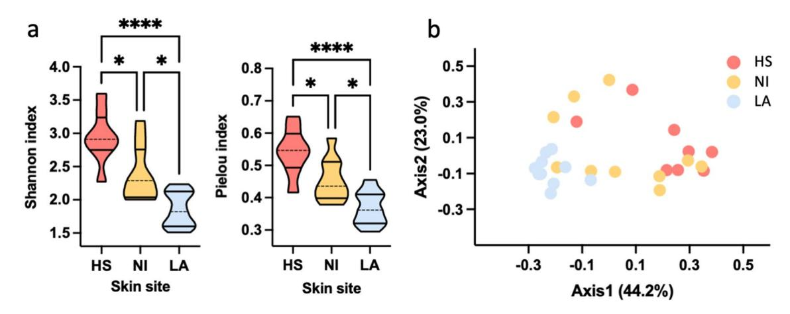
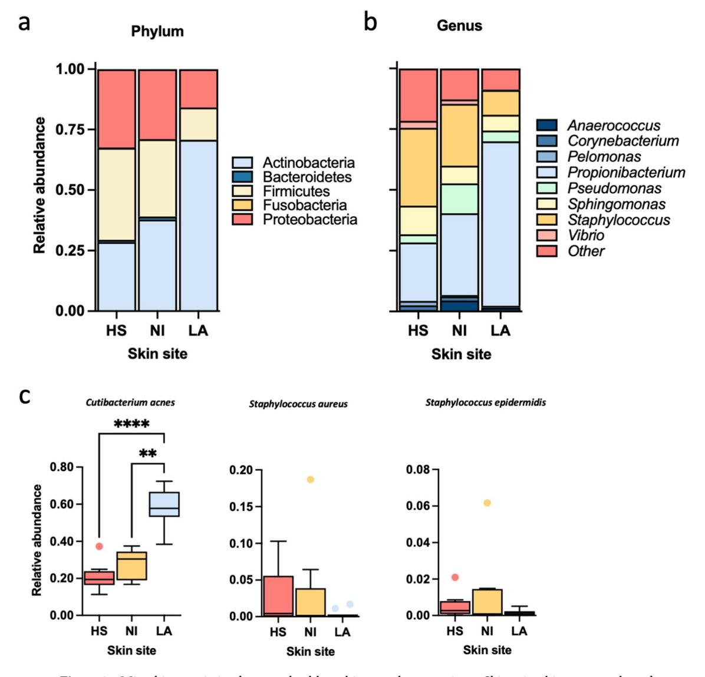
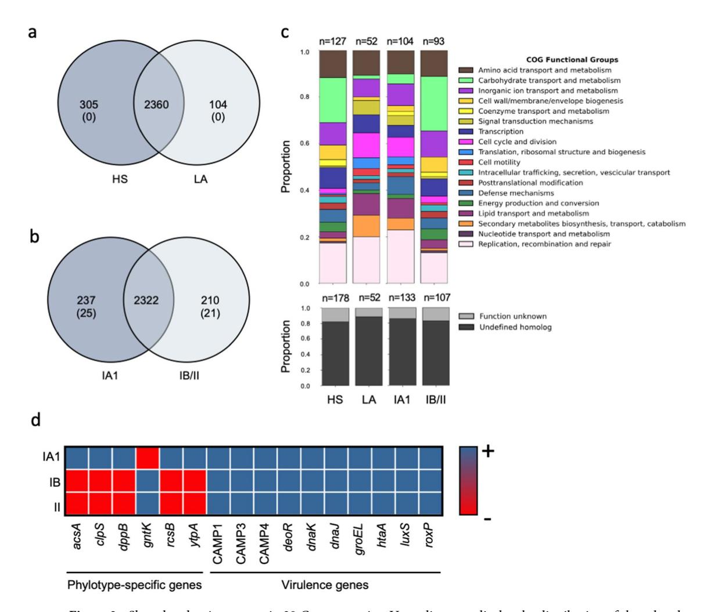
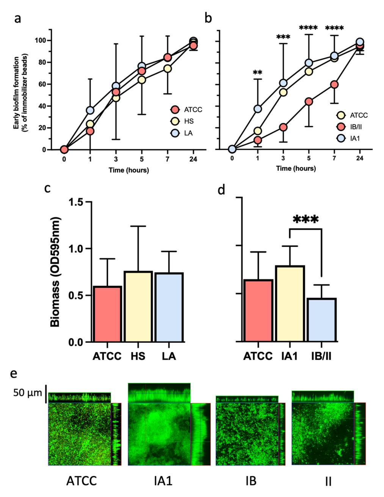
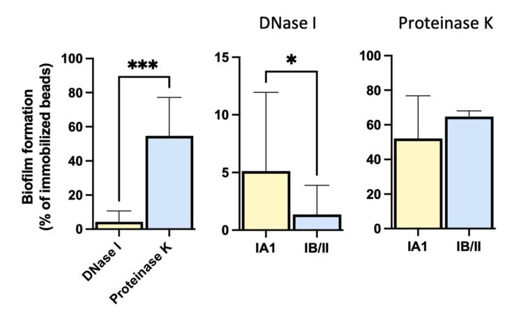

## **OPEN**

# **Skin dysbiosis and** *Cutibacterium acnes* **bioflm in infammatory acne lesions of adolescents**

**Ilaria Cavallo1 , Francesca Sivori1 , MauroTruglio2 , Flavio De Maio3 , Federica Lucantoni4 , Giorgia Cardinali2 , Martina Pontone1 , Thierry Bernardi5 , Maurizio Sanguinetti3,6, Bruno Capitanio7 , Antonio Cristaudo7 , FiorentinaAscenzioni4 , Aldo Morrone8 , Fulvia Pimpinelli1 & EneaGino Di Domenico4**\*

**Acne vulgaris is a common infammatory disorder afecting more than 80% of young adolescents.**  *Cutibacterium acnes* **plays a role in the pathogenesis of acne lesions, although the mechanisms are poorly understood. The study aimed to explore the microbiome at diferent skin sites in adolescent acne and the role of bioflm production in promoting the growth and persistence of** *C. acnes* **isolates. Microbiota analysis showed a signifcantly lower alpha diversity in infammatory lesions (LA) than in non-infammatory (NI) lesions of acne patients and healthy subjects (HS). Diferences at the species level were driven by the overabundance of** *C. acnes* **on LA than NI and HS. The phylotype IA1 was more represented in the skin of acne patients than in HS. Genes involved in lipids transport and metabolism, as well as potential virulence factors associated with host-tissue colonization, were detected in all IA1 strains independently from the site of isolation. Additionally, the IA1 isolates were more efcient in early adhesion and biomass production than other phylotypes showing a signifcant increase in antibiotic tolerance. Overall, our data indicate that the site-specifc dysbiosis in LA and colonization by virulent and highly tolerant** *C. acnes* **phylotypes may contribute to acne development in a part of the population, despite the universal carriage of the microorganism. Moreover, new antimicrobial agents, specifcally targeting bioflm-forming** *C. acnes***, may represent potential treatments to modulate the skin microbiota in acne.**

Acne vulgaris is a chronic infammatory skin disorder of the pilosebaceous unit, afecting 67–95% of adolescents worldwide[1–](#page-11-0)[3](#page-11-1) . In adults, its prevalence and incidence have grown, especially among women[4–](#page-11-2)[6](#page-11-3) . Te psychological impact of acne is substantial, causing a detrimental impact on life quality[7,](#page-11-4)[8](#page-11-5) . Acne is characterized by increased sebum production, leading to non-infammatory (NI) comedones and infammatory lesions (LA) such as papules, pustules, or nodules, mainly on the face and on the back and ches[t9](#page-11-6) . Te etiology is associated with changes in sebum production under androgen control, an altered keratinization process, and an increased release of infammatory mediators[10–](#page-11-7)[13.](#page-11-8) Dysbiosis and follicular colonization by *Cutibacterium acnes* have been linked to the pathophysiology of infammatory acn[e14](#page-11-9)[,15.](#page-12-0) However, the role of *C. acne* remains unclear due to its ubiquitous distribution both in the sebaceous areas of healthy skin and infammatory acne lesions and its highly variable density in the skin of diferent individual[s15.](#page-12-0) Although generally regarded as a low-virulence bacterium and a human skin commensal, *C. acnes* can be considered an opportunistic pathogen associated with invasive skin and sof tissue infections and implant-associated infection[s16–](#page-12-1)[18](#page-12-2). Indeed, C*. acnes*, by producing multiple virulence factors such as lipases, proteases, and the Christine Atkins Munch-Petersen (CAMP) factors, can trigger infammation and host tissue damage[19–](#page-12-3)[24](#page-12-4). Besides, *C. acnes* proliferation in the pilosebaceous unit can induce the upregulation of diferent proinfammatory cytokines by keratinocytes, sebocytes, or peripheral blood mononuclear cells[25–](#page-12-5)[28](#page-12-6). *C. acnes* strains are categorized into the six phylotypes IA1, IA2, IB, IC, II, and III, correlated with a variable body

1 Microbiology and Virology, IRCCS San Gallicano Institute, Rome, Italy. 2 Cutaneous Physiopathology, San Gallicano Dermatological Institute, IRCCS, Rome, Italy. 3 Dipartimento di Scienze di Laboratorio e Infettivologiche, Fondazione Policlinico Universitario "A. Gemelli" IRCSS, Rome, Italy. 4 Department of Biology and Biotechnology Charles Darwin, Sapienza University of Rome, Rome, Italy. 5 Bioflm Pharma SAS, Saint‑Beauzire, France. 6 Dipartimento di Scienze Biotecnologiche di Base, Cliniche Intensivologiche e Perioperatorie ‑ Sezione di Microbiologia, Università Cattolica del Sacro Cuore, Rome, Italy. 7 Clinical Dermatology, San Gallicano Dermatological Institute, IRCCS, Rome, Italy. 8 Scientifc Direction, IRCCS San Gallicano Institute, Rome, Italy. \*email: enea.didomenico@uniroma1.it

| Baseline demographic and clinical characteristics of acne patients | N=10                     |
|--------------------------------------------------------------------|--------------------------|
| Sex, Female/Male                                                   | 6/4                      |
| Age (years), Mean±SD; Median [Min–Max]                             | 14.1±2; 14 [11–18]       |
| Dermatological examination                                         | No signs apart from acne |
| Facial acne severity with the GEA scale Grade 4–5 (Severe)      | 10                       |

**Table 1.** Demographic and clinical characteristics of acne patients at inclusion.

distribution, clinical conditions, antimicrobial susceptibility profle, and infammatory properties[29](#page-12-7)[–32.](#page-12-8) *C. acnes* IA1 is the predominant phylotype isolated from moderate to severe acne. In contrast, IB, II, and III phylotypes are more commonly isolated from sof tissues and medical implant infections[33](#page-12-9)[–35.](#page-12-10) Notably, IA1 isolates exhibit a more virulent profle, including a greater production of β-defensin 2 from cultured keratinocytes and higher lipase activity levels than other phylotypes associated with healthy skin[36](#page-12-11),[37](#page-12-12). Tese observations suggest that the apparent loss of phylotype diversity in acne patients and the dominance of IA1 virulent strains may refect a dysbiotic shif within a follicle linked to microenvironmental changes[38.](#page-12-13) In particular, bioflm production has been linked to specifc *C. acnes* phylotypes, thus suggesting a possible association with the chronic colonization of the pilosebaceous unit observed in acne patients[39](#page-12-14)[–42](#page-12-15). Previous works have demonstrated that *C. acnes* form bioflms in the follicles of acne patient[s43,](#page-12-16) suggesting that this condition may lead to a homeostatic imbalance of the microbiot[a15.](#page-12-0) Indeed, the chronic bacterial persistence and relapse following antibiotic therapy are strongly indicative of bioflm-related colonization[44](#page-12-17). Although bioflm is considered a primary factor that ensures *C. acnes* persistence during acne antibiotic treatment [45,](#page-12-18) factors that promote early bacteria adhesion and bioflm formation have not been identifed ye[t46.](#page-12-19) Tis study analyzed the process of *C. acnes* colonization and its relation to the skin microbiota in patients with severe acne from NI and LA and healthy subjects (HS). Besides, using a metagenomic approach, we characterized the genetic background and the phylotype-dependent bioflm production of *C. acnes* isolates with regard to the dynamics of early adherence, the overall amount of bioflm biomass, and morphology. Finally, we also investigated the contribution of bioflm to antibiotic tolerance of *C. acnes* isolates.

### **Results**

**Demographic and baseline data.** A total of ten patients afected by severe acne vulgaris, and ten healthy control subjects (HS), with no history of acne were included in the study. Te two groups were matched for age and sex. Te demographic and clinical characteristics are summarized in Table [1.](#page-1-0)

**Skin surface microbiota of healthy subjects and acne patients.** Analysis of 2,275,010 reads (min. number of reads: 43,111; max. number of reads: 187,496) grouped into 2037 taxa. Specifcally, 2,139,830 reads grouped into 916 taxa were collected afer fltering out singletons and taxa with a prevalence lower than 5%. Afer rarefaction at a sample depth of 40,000 reads, 880 taxa were recovered, and alpha and beta diversity were evaluated. Two samples were excluded from the 10 healthy controls due to low quality and library size.

Alpha diversity of the skin of ten healthy subjects (HS) and non-infammatory (NI) and infammatory lesions (LA) of ten acne patients was evaluated using the Shannon diversity index and Pielou evenness index. Interestingly, a signifcant (*P*=0.0002) decrease in Shannon index was observed in both NI (Mean±SD=2.39±0.41) and LA (Mean ± SD = 1.86 ± 0.26) compared to HS (Mean ± SD = 2.95 ± 0.39), (Fig. [1a](#page-2-0)). Similarly, a signifcant (*P* = 0.0004) decrease in Pielou index was reported in NI (Mean± SD = 0.45 ± 0.07) and LA (Mean ± SD, 0.37 ± 0.05) samples than in HS (Mean ± SD, 0.54 ± 0.07), (Fig. [1](#page-2-0)a). Bray Curtis beta diversity, represented as principal coordinate analysis (PCoA), corroborated previous fndings showing a distinctive spatial clusterization of HS samples and subjects with LA (PERMANOVA test: *P*=0.001, R2=0.3522) (Fig. [1](#page-2-0)b).

Important site-dependent diferences were identifed in bacterial abundance at phylum and genus level (Fig. [2\)](#page-3-0). Te relative abundance of *Actinobacteria* increased in LA specimens compared to what was observed for *Firmicutes* and *Proteobacteria* (Fig. [2a](#page-3-0)). Accordingly, the relative abundance of *Actinobacteria* accounted for 30% of the microbial community in HS, 38% in NI, and increased to 71%in LA (*P*<0.001). Diferently, *Firmicutes* and *Proteobacteria* appeared more abundant in HS (38% and 32%) and NI (32% and 29%) compared to LA (13%, 5%).

A point worth noting is that NI appeared more variable than HS and LA specimens, especially regarding *Firmicutes* and *Proteobacteria* abundances. Te inverse relationship observed for *Firmicutes* and *Actinobacteria* phyla was confrmed by analyzing the top ten genera (Fig. [2](#page-3-0)b). Te most dramatic diference was the dominance of *Propionibacterium* and the reduction in the relative abundance of *Staphylococcus* genus in LA compared to HS and NI. At the species level (Fig. [2](#page-3-0)c), *Cutibacterium acnes* showed a signifcant diference between diferent sites (*P*<0.0001). Conversely, the relative abundance of *Staphylococcus aureus* and *Staphylococcus epidermidis* did not change signifcantly in HS, NI, and LA.

**Typing and whole‑genome sequencing of** *C. acnes* **isolates.** To determine the characteristics of the culturable *C. acnes,* bacterial colonies were isolated from site-matched skin in healthy controls (N10) and patients with acne (N10). Te WGS results of *C. acnes* isolates are reported in Table [2](#page-4-0). Te 20 strains were distributed among fve clonal complexes (CCs), with the most frequent being CC1 (n=9; 45.0%), followed by CC3 (n=5; 25%) and CC4, CC5 and CC6 (n=2; 10% each). Te overall distribution of CCs showed a signifcant

**Figure 1.** Loss of diversity characterizes infammatory acne. Skin microbiota was evaluated on samples collected from the skin of ten healthy subjects (HS) and non-infammatory (NI), and infammatory lesions (LA) of ten acne patients. (**a**) Alpha diversity was calculated using the Shannon diversity index (HS vs. NI, *P*=0.0209; HS vs. LA, *P*<0.0001; LA vs. NI, *P*=0.0118) and Pielou Evenness index (HS vs. NI, *P*=0.0241; HS vs. LA, *P*<0.0001; LA vs. NI, *P*=0.0136). Statistical diferences were determined using the Kruskal–Wallis test. (**b**) Bray Curtis beta diversity was calculated at the genus level and represented as principal coordinate analysis (PCoA). PERMANOVA test was used to assess signifcance. \*, *P*<0.05; \*\*, *P*<0.01; \*\*\*, *P*<0.001, \*\*\*\*, *P*<0.0001.

diference between HS and LA (*P*=0.03). Te most represented *C. acnes* phylotype was IA1 (n=16; 80%) followed by type IB (n=2; 10%) and II (n=2; 10%) strains. Te phylotype analysis revealed a signifcant diference in the distribution between HS and LA (*P*=0.03), with the IA1 signifcantly more abundant in LA than in HS (*P*=0.03).

Te number of putative protein-coding sequences in diferent genomes varied between 2332 and 2427, with an average of 2380. To assess genomic conservation across *C. acnes* isolates, the coding sequences were used to determine the pan-genome. Tis analysis revealed a total of 2769 genes representing the pan-genome of 20 *C. acnes* strains. To investigate the genetic determinants diferentiating between diferent *C. acnes* isolates, unique genes were identifed by querying the set for group-specifc genes. Specifcally, 305 genes occurred uniquely in *C. acnes* strains isolated from HS, whereas 104 unique genes were identifed in *C. acnes* isolated from LA (Fig. [3a](#page-5-0)).

Nevertheless, no unique genes were present in all the strains isolated from diferent skin sites.

Te unique and core genes within phylotypes were identifed to investigate further the possible clustering in *C. acnes* isolates (Fig. [3](#page-5-0)b). Te genetic analysis revealed that the IA1 phylotype contained a higher number of unique genes (2559) than the IB/II (2532). Te unique gene analyses showed that 237 genes occurred uniquely in the IA1 phylotype while 210 characterized the IB/II group (Fig. [3](#page-5-0)b). Of the 237 unique genes, 25 were present in all the type IA1 strains and 21 in the IB/II strains, representing the key genetic content distinguishing type IA1 strains from the IB/II clades (Fig. [3b](#page-5-0)). Functional categories were analyzed and reported in Fig. [3](#page-5-0)c. Notably, of the 237 unique genes present in IA1, 43.9% were assigned to specifc functions, while 56.1% remained with unknown functions. Similarly, in IB/II 44.3% of the 210 unique genes were assigned to particular functions, and 55.7% had unknown functions (Fig. [3c](#page-5-0)). Interestingly, for the phylotype IA1, fve unique genes with known functions were identifed (*acsA, clpS, dppB, rcsB, ytpA*). In particular, AcsA and RcsB are positively involved in bioflm formation in diferent bacterial species. ClpS is an essential gene product involved in a highly conserved mechanism that targets specifc proteins for destruction in prokaryotes and eukaryotes; DppB is a dipeptide ABC transporter required for bacterial growth, and the lysophospholipase YtpA is a virulence factor in *C. acnes* contributing to host-tissue degradation and infammation. Te type IB/II clades only displayed one unique gene with known function shared across all strains, the Shikimate kinase *gntK*. Putative virulence factor genes, coding for the iron acquisition protein (HtaA), the heat shock proteins (DnaK, DnaJ, and GroEL), the *luxS* gene, which is involved in the synthesis of the autoinducer 2, the radical oxygenase RoxP and the Christie–Atkins–Munch–Petersen (CAMP) factors 1, CAMP 2, and CAMP 4 were ubiquitous in every *C. acnes* strain, and not associated with specifc genotypes (Fig. [3](#page-5-0)d). Te co-hemolytic activity of the CAMP factor was further confrmed on blood agar plates for all *C. acnes* isolates. To further decipher the relationship among the phylotype IA1 strains, we generated a phylogenomic tree based on the core genome variants alignment and a phylogenetic tree based on the core pangenome allelic variations (supplemental information). Te trees showed the samples clustered by clonal complex and sequence typing but not by the skin site (HS vs. LA).

*Cutibacterium acnes* **adhesion and bioflm formation.** *Cutibacterium acnes* bioflms are frequently observed in patients with acn[e47.](#page-12-20) Moreover, the hierarchical clustering analysis indicated that the bioflm-related genes AcsA and RcsB were present in IA1 isolates but not in IB/II, suggesting possible diferences in bioflm production. Terefore, the bioflm-forming ability of diferent *C. acnes* isolates was investigated. First, the early bacterial adhesion kinetics was measured at 0, 1, 3, 5, 7, and 24 h. No signifcant diferences in the early bioflm formation of the *C. acnes* strains from HS and LA were observed during all the periods analyzed (Fig. [4](#page-6-0)a). Moreover, since IA1 colonized both HS and LA, the kinetics of early bioflm formation were analyzed on the

**Figure 2.** Microbiota variation between healthy subjects and acne patients. Skin microbiota was evaluated on samples collected from the skin of ten healthy subjects (HS) and non-infammatory (NI) and infammatory lesions (AL) of 10 acne patients. Relative abundances at the phylum level (**a**) and top eight genera (**b**) were represented in a stacked bar plot. (**c**). Relative abundance was evaluated at the species level for *Cutibacterium acnes*, *Staphylococcus aureus,* and *Staphylococcus epidermidis* relative abundances. Signifcance was assessed by using the Kruskal Wallis static test. \*, *P*<0.05; \*\*, *P*<0.01; \*\*\*, *P*<0.001, \*\*\*\*, *P*<0.0001.

phylotypes groups. In particular, the *C. acnes* strains belonging to the phylotypes IA1 were signifcantly faster in the early bioflm formation, than the phylotypes IB/II, afer 1 (*P*=0.0016), 3 (*P*=0.0004), 5 (*P*<0.0001) and 7 (*P*<0.0001) hours. Nevertheless, afer 24 h, all the strains analyzed achieved a comparable inhibition of the magnetic microparticles independently from the phylotype.

Bioflm formation was further quantifed by determining the biomass with crystal violet (CV) 72 h afer incubation (Fig. [4b](#page-6-0)). Te strains isolated from LA produced a comparable biomass level to those from HS and *C. acnes* 11827 ATCC (Fig. [4c](#page-6-0),d). Notably, IA1 isolates formed signifcantly (*P*=0.0004) more bioflm than the IB/II strains, suggesting that the phylotype impacted biomass production rather than the isolation site (Fig. [4](#page-6-0)d).

Te morphology of bioflms was also investigated using confocal microscopy (Fig. [4e](#page-6-0)) for the reference strains *C. acnes* 11827 ATCC and the phylotypes IA1, IB, and II. Most of the *C. acnes* isolates produced a thick bioflm afer 72 h, as indicated by the presence of cell aggregates and pillars of more than 20 µm (z projection). Consistent with the results obtained by microtiter plate tests, the IA1 isolates exhibited increased biomass and thickness compared to the IB and II isolates.

Te bioflm matrix of *C. acnes* is composed of carbohydrates, proteins, and eDNA[48](#page-12-21). Te impact of DNase I and proteinase K on bioflms has been used to investigate the contribution of eDNA and proteins in early adhesion and bioflm formation[49.](#page-12-22) Te treatment with DNase I and proteinase K caused a substantial reduction in the initial attachment to abiotic surfaces of *C. acnes* strains of all phylotypes (Fig. [5](#page-7-0)). However, DNase I treatment showed a signifcant (*P*<0.001) reduction compared with proteinase K in the initial attachment of *C. acnes* strains

| Source     | Sequence typing | Clonal complex | Phylotype |
|------------|-----------------|----------------|-----------|
| HS         | 6               | CC6            | II        |
| HS         | 4               | CC4            | IA1       |
| HS         | 5               | CC5            | IB        |
| HS         | 1               | CC1            | IA1       |
| HS         | 3               | CC3            | IA1       |
| HS         | 1               | CC1            | IA1       |
| HS         | 1               | CC1            | IA1       |
| HS         | 5               | CC5            | IB        |
| HS         | 7               | CC6            | II        |
| HS         | 4               | CC4            | IA1       |
| LA         | 1               | CC1            | IA1       |
| LA         | 3               | CC3            | IA1       |
| LA         | 3               | CC3            | IA1       |
| LA         | 115             | CC3            | IA1       |
| LA         | 1               | CC1            | IA1       |
| LA         | 3               | CC3            | IA1       |
| LA         | 1               | CC1            | IA1       |
| LA         | 1               | CC1            | IA1       |
| LA         | 1               | CC1            | IA1       |
| LA         | 1               | CC1            | IA1       |
| ATCC 11827 | 1               | CC1            | IA1       |

**Table 2.** Multilocus sequence typing (MLST) and phylotype profles of the *C. acnes* strains isolated from the skin of healthy subjects (HS) and the lesional area of acne patients (LA).

suggesting that eDNA is critical for the initial adhesion. In particular, the reduction in the initial attachment to abiotic surfaces of *C. acnes* is signifcantly more pronounced in the phylotypes IB/II compared to IA1 (Fig. [5](#page-7-0)).

**Assessment of the antimicrobial susceptibility profles.** Te activity of diferent antibiotics by the minimum inhibitory concentration (MIC) and minimal bioflm eradication concentration (MBEC) was measured in planktonic and bioflm growth on the ten *C. acnes* phylotype IA1 strains isolated from LA. Te MIC values for each antibiotic are summarized in Fig. [6.](#page-7-1) Te susceptibility profles apparently contradicted the lack of response to several anti-*C. acnes* agents during acne treatment[44](#page-12-17). Since all strains were substantial bioflm producers, we next evaluated the potential correlation with the increased antibiotic tolerance. To this end, the antimicrobial susceptibility profles were assessed in microbial isolates growing in bioflms.

Carbapenems, amoxicillin/clavulanic acid, piperacillin/tazobactam, and vancomycin were the most efective antibiotics against *C. acnes* bioflms with an MBEC comparable to the MIC values. However, bioflm-growing *C. acnes* exhibited a signifcant increase in the tolerance for ampicillin (*P*=0.003), benzylpenicillin (*P*<0.001), clindamycin (*P*<0.001), and doxycycline (*P*<0.001). Tus, the MBEC/MIC ratio, which indicates the fold increase in the antimicrobial dose needed to inhibit or kill *C. acnes* cells in bioflms compared to planktonic growth, was used to quantify the bioflm tolerance (BT) score (Fig. [6](#page-7-1)b). Te maximum BT values were 32.1 and 17.6 reported for clindamycin, and the median BT values for the tested antimicrobials were between 2 (benzylpenicillin) and 4 (clindamycin and doxycycline).

#### **Discussion**

*Cutibacterium* is one of the most abundant genera in the skin, particularly in sebum reach area[s50,](#page-12-23) and its proliferation has been largely associated with acn[e51](#page-12-24)[,52](#page-12-25). Although, the specifc role in the pathophysiology of acne vulgaris remains uncertain. To account for the complexity of the skin microbial environment, we analyzed the microbiota in diferent skin districts of healthy and acne patients. Our study demonstrated statistically signifcant diferences in alpha and beta diversity between the skin of the healthy subjects and infammatory lesions of acne patients. Specifcally, mean alpha diversity was signifcantly reduced in LA compared with HS. Tis data suggests that the anaerobic and lipid-rich conditions within the pilosebaceous unit of infammatory acne lesions may provide an optimal microenvironment for *C. acnes* growth, thus limiting potential competitors[53,](#page-13-0)[54.](#page-13-1) Previous metagenomic studies revealed that the relative abundances of *C. acnes* do not difer signifcantly between acne and healthy subjects[55](#page-13-2)[–57](#page-13-3). However, the diference in *C. acnes* distribution could be ascribed to several variables, including the sequencing procedures and sampling methods[56](#page-13-4). Te sequencing strategy and primer selection for 16S rRNA gene analysis are critical factors in characterizing the compositions of bacterial skin communitie[s58](#page-13-5). For example, the V1–V3 regions of the 16S RNA gene had greater accuracy than the V4 region in defning genus and species level classifcation of major skin bacteria[59](#page-13-6). In particular, V4 sequencing resulted in an inaccurate assessment of prominent skin bacteria showing lower relative abundances of *S. epidermidis* and *C. acnes* and higher relative abundance of *S. aureus* compared with V1–V3 sequencin[g59.](#page-13-6) Based on these data, we selected the

**Figure 3.** Shared and unique genes in 20 *C. acnes* strains. Venn diagrams display the distribution of shared and unique genes between (**a**) *C. acnes* strains from healthy subjects (HS) and the lesional area of acne patients (LA) and (**b**) phylotypes IA1 and IB/II. Overlapping regions show the genes conserved within strains. Te number between brackets represents the unique genes present in all the strains of a particular group. (**c**) Te stacked bar chart of Cluster of Orthologous Genes (COGs) functional category proportions is based on the unique genes in all groups. Te n above each group indicates the absolute count of COGs identifed in each group. (**d**) Similarity matrix categories represent the presence (blue;+) or the absence (red, -) of *C. acnes* virulence genes and phylotype-specifc genes.

V1-V3 region, which allowed us to efectively recover *Cutibacterium* and *Staphylococcus* species defning unbiased skin microbial community profles and identifying potential microbial biomarkers associated with acne. Te site and sampling technique can also afect the outcome of the sequencing-based analysis of the skin microbiom[e60](#page-13-7). Previous studies reported that a swab is a reliable technique to analyze the skin microbiome comparable to the tape-stripping method[61](#page-13-8),[62](#page-13-9). In our study, microbiome samples were collected by the swab technique directly on LA and NI sites for each patient and compared with the same area of HS, providing a narrowed characterization of the local microbial population. Te possibility of collecting microbiome samples from the lesional skin may have yielded more targeted results compared to other studies applying diferent sampling techniques. Indeed, others collected samples from the nose microcomedones of acne patients using adhesive strips. Tis sampling technique is ideal for identifying a homogeneous microbial population; however, it may not specifcally refect the microbial distribution present in the diferent microenvironments of acn[e55](#page-13-2). In our study, the *Cutabacterium* genus was more abundant in LA and NI compared to HS. Accordingly, a signifcant increase in *C. acnes* was observed in LA compared to NI and HS. Tese results suggest that, although highly prevalent in the skin of HS and patients with acne, the relative abundance of *C. acnes* signifcantly increases in infamed LA compared to NI. Terefore, the overgrowth of *C. acnes* in LA can potentially explain the prevalence of the disease in a part of the population, despite the universal carriage of the microorganism. Tese observations support previous fndings suggesting that pilosebaceous unit obstruction and increasing *C. acnes* proliferation are likely central factors in the onset of infammatory acne lesion[s63](#page-13-10),[64](#page-13-11). Tis is consistent with the increase of *C. acnes* counts found in acne, which, in turn, correlates with the acne fares in adolescents, with high levels of hormones and sebum production[65](#page-13-12). Indeed, teenagers with acne have signifcantly higher *C. acnes* counts than age-matched controls, demonstrating a marked increase in this microorganism, promoting inflammation through various

**Figure 4.** Bioflm formation of *C. acnes* strains. **a** Kinetic of bacterial adhesion was measured using the BioFilm Ring Test for *C. acnes* strains isolated from healthy subjects (HS) and the lesional skin of acne patients (LA) and (**b**) according to the phylotypes IA1, IB, II. *C. acnes* ATCC 1182 was used as a reference control strain. Te mean and corresponding standard errors for three independent experiments of duplicate samples for each time point are shown. (**c**,**d**) Te amount of bioflm biomass afer 72 h was measured by the crystal violet assays (optical density (OD) at 595 nm). Te mean and corresponding standard errors for three independent experiments of duplicate samples for each time point are shown. (**e**) Confocal microscopy image of bioflm formation of diferent *C. acnes* isolates and the *C. acnes* ATCC 1182 afer 72 h of incubation in BHI at 37 °C. Signifcance was assessed by using the Kruskal Wallis static test. \*, *P*<0.05; \*\*, *P*<0.01; \*\*\*, *P*<0.001, \*\*\*\*, *P*<0.0001.

mechanisms[64](#page-13-11),[66](#page-13-13),[67](#page-13-14). Specifc host factors, such as sebum production, hormone level, the infammatory milieu, and physical changes in the pilosebaceous unit, may contribute to acne pathogenesis, indicating that certain strains can become pathogenic in diferent conditions or under specifc environmental stimuli[16](#page-12-1). It has been suggested that infammatory acne results from an imbalance in the skin microbiota associated with specifc *C. acnes* phylotype[s35](#page-12-10)[,68.](#page-13-15) Our study found that the clonal complexes CC1 and CC3 were more abundant in LA than in HS; instead, CC4, CC5, and CC6 were present only in HS. In addition, IA1 was signifcantly more represented in LA than in HS, and the phylotypes IB and II were found only in the skin of HS. Data from this study are

**Figure 5.** DNase I and Proteinase K reduce *C. acnes* adhesion. Comparison of extracellular DNA and proteins on early surface adhesion for the IA1 and IB/II phylotypes. Results are expressed as relative diferences (Eq. [1\)](#page-10-0) in the amounts of bioflm as measured by the BioFilm Ring Test afer 6 h of incubation in the presence of DNase and Proteinase K compared with untreated control strains. Data represent means and the corresponding standard errors of two independent experiments analyzed in duplicate; \*, *P*<0.05; \*\*, *P*<0.01; \*\*\*, *P*<0.001, \*\*\*\*, *P*<0.0001 using the Mann–Whitney test.

**Figure 6.** Antimicrobial tolerance in *C. acnes* isolates. (**a**) Antimicrobial susceptibility testing against ten *C. acnes* strains (phylotype IA1) isolated from the lesional skin of acne patients in planktonic and bioflm growth measured as minimum inhibitory concentration (MIC) and minimal bioflm eradication concentration (MBEC) for the indicated antibiotics. (**b**) Heat map showing the bioflm tolerance (BT), calculated as the ratio MBEC/ MIC for ampicillin, benzylpenicillin, clindamycin, and doxycycline. Yellow indicates high BT values, and blue represents low BT for the indicated antibiotics. Statistical diferences were determined using the Kruskal–Wallis test, followed by Dunn's post hoc test for multiple comparisons.

consistent with previous reports revealing that severe infammatory acne lesions of both the face and back are associated with loss of diversity in *C. acnes* phylotypes, with a high predominance of phylotype IA1 compared to healthy controls[38,](#page-12-13)[69,](#page-13-16)[70.](#page-13-17) Fitz-Gibbon et al., analyzed the distribution of *C. acnes* ribotypes (RT1, RT2, RT3) among both acne and normal follicles[55](#page-13-2), reporting that CC3 and CC4 of the phylotype IA1 were signifcantly enriched in patients with acne but rarely found in individuals with healthy skin. In contrast, RT6, which represents a subpopulation of phylotype II, was 99% associated with healthy skin. Interestingly, the non-acneassociated IB, types II and III, are also commonly recovered from deep tissue infections and retrieved from medical device[s16.](#page-12-1) Te loss of diversity between the six phylotypes, characterized by a dominance of IA1 rather than *C. acnes* proliferation, may play a key role in triggering acne[69](#page-13-16)[–73.](#page-13-18) As *C. acnes* is the major skin colonizer, the strain-level analysis is important to help understand the role of this bacterium in acne pathogenesis and skin health. Full genome sequencing of diferent strains from variable environmental sources, such as acne vulgaris and implant-associated infection, has revealed the pan-genome and the genetic repertoire of *C. acnes*[31](#page-12-26),[74](#page-13-19)[–76](#page-13-20). Moreover, metagenomic analyses showed that several distinct virulence-associated gene elements that encode antimicrobial peptides, cytotoxins, and proteases were enriched in *C. acnes* strains associated with acne[12](#page-11-10). Te accessory genome of *C. acnes* is relatively small, and non-core genes frequently code for a variety of phylotypespecifc functions[31](#page-12-26),[74](#page-13-19),[75](#page-13-21). Te variability at the phylotype level may correlate with the commensal or pathogenic phenotype of *C. acnes* and its contribution to acne[69.](#page-13-16) In our study, the WGS analyses showed the CAMP factors were detected across all strains. Moreover, in accordance with previous observations, we reported that major virulence determinants are widespread among *C. acnes* and not specifcally associated with any site of isolation or the phylotyp[e77](#page-13-22). Likewise, we observed that *luxS* and *roxP,* essential for adherence to and colonization of the skin, were ubiquitous in every *C. acnes* strain and not associated with specifc genotypes. Te high distribution of virulence genes across *C. acnes* isolates was previously described suggesting that transcription regulation may be critical in the diferential virulence expression among phylotype[s78](#page-13-23)[–80.](#page-13-24) Nevertheless, the functional group analysis showed that the phylotype IA1 was characterized by a reduced number of carbohydrate metabolism and sugar transporters genes compared with phylotypes IB/II. Tis data suggests that carbohydrate transport and metabolism may confer to *C. acnes* an ecological advantage in healthy skin but are not strictly required for the selective colonization of infammatory acne lesions. Indeed, previous studies hypothesized a connection between high sebum levels and *C. acnes* colonization in acne patients[81](#page-13-25). Accordingly, we observed that lipid transport and metabolism genes are increased in phylotype IA1 strains, compared with phylotypes IB/II, independently from the isolation site. Indeed, it is unlikely that phylotype IA1 strains isolated from LA have, per se, diferent properties than the same phylotype strains from healthy skin. In agreement with previous publications, we found no diferences in the genomes and bioflm production of phylotype IA1 strains isolated from acne and healthy skin[82](#page-13-26). Future studies are required to defne how virulence genes are expressed in diferent phylotypes. Previous imaging analysis showed that microcomedones' structure in acne patients resembles a pouch containing lipids with clusters of bacteria, whose outer shell comprises corneocyte layers[83](#page-13-27). Te extensive bacteria colonization is visible using TE[M83.](#page-13-27) Te metabolism of *C. acnes* modifes the skin's lipid composition, and bacterial lipases release free fatty acids from triglycerides. Free fatty acids being more viscous than triglycerides, can obstruct the pilosebaceous unit, which in turn becomes anaerobic, promoting the selective proliferation of phylotype IA1 that better exploits the lipid-rich microenvironments of the pilosebaceous unit during acne compared to other phylotype[s83](#page-13-27)[–85.](#page-13-28) Te analyses of the unique genes present in diferent phylotypes allowed us to identify that of 2769 genes, fve genes with known functions were univocally present on all IA1 isolates (*acs*A, *clp*S, *dpp*B, *rcs*B, and *ytp*A). Notably, the *ytpA* gene, which encodes for a lysophospholipase that contributes to host-tissue degradation and infammation, was present in all IA1 isolates.

To overcome these difculties, a better understanding of the pathogenic potential of the individual sub-populations is needed. Additionally, others speculated that the persistent nature of acne vulgaris is linked to *C. acnes*'s colonization of the pilosebaceous unit in a bioflm, thereby eluding antibiotic eradication[40](#page-12-27),[86](#page-13-29). Tis theory was supported by observing that the genome of IA1 isolates contains genes such as *rcsB, acsA* that have a positive role in bioflm formation in other bacterial specie[s41,](#page-12-28)[87–](#page-13-30)[89.](#page-13-31) Specifcally, transcriptomic analysis of *Helicobacter pylori* revealed that several acetone metabolism genes, including *acsA*, are upregulated in bioflm cell[s89](#page-13-31). Te RcsCDB phosphorelay pathway coordinates the expressions of a large number of genes essential for maintaining cell wall integrity, cell division, stationary-phase sigma factor activity, bioflm development, motility, and virulence in Enterobacteriaceae[90](#page-14-0),[91.](#page-14-1) RcsB upregulates genes promoting bioflm formation while downregulating diferent metabolic functions in *Escherichia coli*[87,](#page-13-30)[88.](#page-13-32) Te comparative analysis of in vitro bioflm formation showed that the phylotype IA1 was signifcantly faster in early bioflm formation than IB and II strains in inhibiting the magnetic microparticles.

Moreover, bioflm quantifcation showed that IA1 strains produced signifcantly more mature bioflm than the other phylotypes confrming that both DNA and proteins are required for the early adhesion and bioflm formation in *C. acnes*[39](#page-12-14). In addition, our fndings suggest that independently from the site of isolation, all the strains produce bioflm; however, phylotype IA1, which is the most prevalent in AP, resulted in the most efective. Tis notion is indirectly reinforced by confocal microscopy results, which clearly show the development of a thick and structurally complex bioflm matrix in the phylotype IA1. Furthermore, DNase I- and Proteinase K-sensitivity assays revealed that eDNA and proteins are central for early surface adhesion to abiotic surfaces, with eDNA playing a major role. Besides, an increased DNase I-sensitivity of phylotypes IB/II could be observed. Tus, in acne patients, a hyperseborrheic microenvironment, characterized by high availability of sebum, may result in an increased proportion of metabolically active bioflm-producing strains, providing a selective advantage to a subset of acne-associated phylotypes or sub-types, thus contributing to the proinfammatory milieu of acne lesions[54](#page-13-1)[,65](#page-13-12).

Although antibiotics can reduce or eliminate *C. acnes*, recolonization frequently occurs within a few weeks, with limited clinical efcac[y44.](#page-12-17) Te high tolerance of *C. acnes* to antimicrobial treatments does not depend on the expression of multidrug-resistant genes since *C. acnes* are generally susceptible to most antimicrobial[s44](#page-12-17)[,92](#page-14-2). Conversely, the *C. acnes* capability of chronic persistence and relapse following antibiotic therapy is strongly suggestive of bioflm-related colonizatio[n9](#page-11-6)[,93](#page-14-3). Tese fndings align with our results showing that all *C. acnes* isolates were highly susceptible to most antibiotics, with MIC values largely below the clinical breakpoints. However, the susceptibility profle of bioflm-growing *C. acnes* strains indicated a signifcant increase in antimicrobial tolerance against ampicillin, benzylpenicillin clindamycin, and doxycycline. For systemic treatment, oral tetracyclines (doxycycline, minocycline, oxytetracycline, or tetracycline) are the most recommended antibiotics for treating severe acne, followed by clindamycin due to relevant adverse efect[s9](#page-11-6) ; while, topical antibiotic treatments mainly rely on clindamycin, erythromycin, and tetracyclin[e9](#page-11-6) . Tese observations may explain the high tolerance of *C. acnes* to antimicrobial treatment and the conficting evidence about the clinical beneft of using anti-*C. acnes* agents, even in cases where therapy was based on MIC results[44.](#page-12-17) Besides, we found that vancomycin, piperacillin/tazobactam, and amoxicillin/clavulanic acid could efectively eradicate mature *C. acnes* bioflms, with BMIC similar to MIC. Te most common and efective antibiotic against *C. acnes* in patients with prosthetic valve endocarditis was vancomyci[n94,](#page-14-4)[95.](#page-14-5) In addition, we found that *C. acnes* isolates were highly susceptible to carbapenems in both planktonic and bioflm states. Previous research showed that carbapenems were highly active in vitro and in vivo against *C. acnes* strains isolated from postsurgical endophthalmitis[96.](#page-14-6)

Our study sufers from some limitations. Indeed, the analysis herein was performed on a small group of patients. In addition, the in vitro condition for bioflm testing may not be fully representative of the real in vivo conditions of the pilosebaceous unit of acne patients. Moreover, only a single *C. acnes* isolate was selected from each patient. Tis procedure may not have captured the entire *C. acnes* phylotypes diversity in the facial region. However, a recent publication demonstrates that *C. acnes* colonies from the skin of adult subjects without acne vulgaris are ofen very closely related, suggesting the presence of person-specifc populations[97.](#page-14-7) Tus, further research will be required to elucidate whether these observations can be transferred in vivo*,* and any clinical fndings should be interpreted with caution.

Overall, the results presented in this study indicate that the infammatory lesions of acne patients are characterized by dysbiosis and decreased bacterial diversity. At the species level, *C. acnes* is signifcantly more abundant in LA than in NI and HS. Signifcant genotypic and phenotypic diferences among *C. acnes* isolates were primarily dictated by the phylotype rather than the anatomical site of isolation. In particular, IA1 isolates were more efcient in early adhesion, biomass production, and antibiotic tolerance than other phylotypes. Tus, we hypothesize that in adolescent acne, the biochemical and physical changes of the pilosebaceous unit may promote dysbiosis, thus providing a selective advantage to a subset of metabolically active bioflm-producing phylotypes, such as IA1, that have the potential and the virulence, to outcompete commensals exacerbating the infammatory respons[e98.](#page-14-8) Accordingly, adolescent acne pathogenesis may not be caused by the mere presence of a disease-associated phylotype but rather by the response of the overall microbial community to microenvironmental changes of the pilosebaceous unit. Factors contributing to *C. acnes* growth compared to competitors during the progression from the non-infamed to the infamed acne lesions remain to be elucidated. Nevertheless, new antimicrobial agents targeting *C. acnes* bioflm matrix components may represent potential treatments to modulate the skin microbiota in adolescent acne.

#### **Methods**

**Study design and patients' enrolment.** Patients with severe acne lesions were recruited among subjects at their frst access to the Acne Unit at the San Gallicano Dermatological Institute. Te control group was enrolled among HS undergoing mole checks in the same Institution. Informed consent was obtained from all the participants and their legal representative. Two dermatologists assessed the acne severity scores and the clinical grading. Te intensity of clinical manifestations was evaluated on the face areas according to the Global European Acne severity (GEAS) criteria[99](#page-14-9). Briefy, subjects were classifed as non-afected (clear) when no or very few lesions were clinically observable (0≤GEAS<1). GEA scores between 1 and 2 were referred to as the mild group, GEA scores 3 as the moderate group, and patients with GEAS 4–5 were classifed as severe groups. Participants were asked to maintain their skincare routines except for prohibiting the use of cosmetics and moisturizing skincare products on the day of the enrolment. Criteria of inclusion were the absence of systemic diseases and skin disorders other than acne. Te exclusion criteria were oral or topic pharmacological treatments at the frst visit or up to 2 weeks before the examination, smoking, and use of sunbeds. Te study was conducted according to the Helsinki declaration, and all enrolled patients signed informed consent. Te Central Ethics Committee I.R.C.C.S. Lazio, the section of the Istituti Fisioterapici Ospitalieri in Rome, approved this study (Protocol 7679—21.06.2016, trials registry number 821/16).

**Sample collection.** Te samples were collected by dermatologists with commercially available sterile swabs (COPAN swabs, Brescia, Italy) from the skin of 10 HS and the unafected skin and pustule of 10 acne patients in duplicate to assess the presence of C*. acnes* and for microbiome analysis. Swabs were brought to the Microbiology and Virology Laboratory of San Gallicano Institute for culture analysis and processed immediately in an anaerobic atmosphere. Schaedler Agar plates with 5% Sheep Blood (bioMérieux) were used to isolate and cultivate *C. acnes*. Plates were monitored for bacterial growth afer 5–7 days of anaerobic incubation at 37 °C. Up to seven representative colonies of *C. acnes* were preliminarily identifed by colony morphology and Gram staining. Further identifcation of *C. acnes* isolates was performed by MALDI-TOF mass spectrometry. Positive isolates were subcultured on Schaedler agar plates to obtain a pure culture of *C. acnes*. From each culture, bacterial DNA was obtained, and sequence analysis (ABI PRISM 3130xl Genetic Analyzer) of the 16SrRNA gene was used to confrm bacterial identifcation[100](#page-14-10). At the same time, the phylotype was preliminarily identifed by Touch-down PCR[101.](#page-14-11) Each sample's most common phylotype (detected in 85–100% of the colonies) was considered the dominant type. A single representative isolate of each dominant phylotype was selected for further analysis. *C. acnes* isolates were frozen and stored at−80 °C. Te co-hemolytic reaction of the CAMP factor on blood agar plates (bioMérieux) was performed using *S. aureus* strain ATCC 25923, according to the previous metho[d23.](#page-12-29)

**Sequencing and analysis.** Extracted DNA was amplifed by PCR with dual-index primers targeting the V1-V3 regions of the bacterial 16S rRNA gene, using the ARROW for NGS Microbiota solution A kit (ARROW

Diagnostics) according to the manufacturer's instruction. A sterile sample tube that had undergone the same DNA extraction and PCR amplification procedures was used for quality control102. Before sequencing, amplicons were purified using the Agencourt\* AMPure XP PCR purification system (Beckman Coulter, Milan, Italy), and equal amounts (10 nM) of the sample's DNA were pooled and diluted to reach a 4-nM concentration. Finally, a 5 pM of the denatured library was used to generate sequences using the 2×250 cycles MiSeq Reagent kit (Illumina) on an Illumina MiSeq instrument. Sequencing data were analyzed using the MicrobAT system102,103. During MicrobAT processing, demultiplexed sequences showing reads of length less than 200 nucleotides, an average Phred quality score below 25, and at least one ambiguous base were discarded 104. The resulting sequences were aligned at a 97% sequence similarity and assigned to taxonomic (e.g., species) levels at an 80% classification threshold using the Ribosomal Database Project (RDP) classifier (release 11.5)105. Species that did not meet these criteria were assigned to the corresponding group, "unclassified [genus]". The Biological Observation Matrix (BIOM) was obtained, and the following analysis was carried out in R studio (https://www. rstudio.com/; version 4.0.2) using the phyloseq package106. Microbial community differences were measured in terms of alpha and beta diversity after reading depth rarefaction. Shannon index and Pielou index were used to evaluate alpha diversity, and significance was assessed by the Kruskal Wallis test. Bray Curtis beta diversity was calculated, and the distance matrix was represented as Principal coordinate analysis (PCoA)107. Significance was assessed by Permutational multivariate analysis of variance (PERMANOVA)108. Bacterial relative abundances at phylum and genus level between selected groups were examined.

**Cutibacterium** *acnes* **typing.** FASTQ files, including Quality Control, trimming, assembly, and gene annotation, were elaborated using the Bactopia suite109. The pan-genome was obtained using Roary110 on the annotated assemblies. Functional annotation was performed using EggNOG v5.0111 on the protein sequences. The Phylotypes and Clonal Complexes were determined by querying the API of PubMLST (www.pubmlst.org) using custom Python scripts. Whole-genome analysis of variants (SNPs/indels) on the IA1 strains and the phylogenomic tree was obtained as described previously112. The independent analysis of the core genome was performed using PIRATE113 on the IA1 strains to build a phylogenomic tree.

**Biofilm Ring Test® (BRT).** Biofilm production was evaluated using the clinical BioFilm Ring Test (cBRT) with some modifications 114. Briefly, overnight bacterial cultures grown on Schaedler agar plates + 5% sheep blood (bioMérieux, France) was used to inoculate 2 mL of 0.45% saline solution (AirLife, Carefusion, CA, USA) to the equivalent of  $2.5 \pm 0.3$  McFarland turbidity standard. The bacterial suspension was used to inoculate a 96-well polystyrene plate with 200 μL/well. The test was performed using toner solution (TON) (Biofilm Control, Saint Beauzire, France) containing magnetic beads 1% (v/v) mixed in Brain Heart Infusion medium (BHI, Difco, Detroit, MI, USA). Sample dilutions (tenfold serial dilutions, from  $1 \times 10^{-1}$  to  $1 \times 10^{-3}$ ) were performed in a volume of 200 μL BHI/TON mix. The laboratory strain *C. acnes* ATCC 11827 was included in each test as standard reference and quality control. A well containing the BHI/TON mix without microbial cells was used in each experiment as a negative control. Plates were incubated at 37 °C without shaking (static culture) under anaerobic conditions. Biofilm formation was assessed at different time points. After incubation, wells were covered with few drops of contrast liquid (inert opaque oil used), placed for 1 min on the block carrying 96 minimagnets (Block test), and scanned with a specifically designed plate reader (Pack BIOFILM, Biofilm Control, Saint Beauzire, France)115. Each strain was analyzed in duplicate, and experiments were repeated three times.

**Assessment of** *C. acnes* **biofilm composition.** The Biofilm Ring Test method was used to evaluate the early attachment in the presence of DNase I ( $100 \, \mu g/mL$ ) and proteinase K ( $50 \, \mu g/mL$ ). Standardized bacterial suspensions containing 1 vol % magnetic beads were supplemented with DNase ( $100 \, \mu g/mL$ ) and proteinase K ( $50 \, \mu g/mL$ ) and incubated at 37 °C in a 96-well microplate ( $200 \, \mu L/well$ ). Negative controls contained  $200 \, \mu L$  of sterile BHI with magnetic beads and enzymes. The plate was read after 6 h of incubation, as described above. The early adhesion in the presence of DNase and proteinase K was expressed using the relative difference (RD):

$$RD = [(Pmb \text{ without enzyme} - Pmb \text{ with enzyme})/Pmb \text{ without enzyme}] \times 100$$
 (1)

The analysis was performed three times in duplicate for each sample.

**Evaluation of the biofilm formation with the crystal violet staining.** Sterile 96-well polystyrene plates were inoculated with 200  $\mu$ L of an initial bacterial suspension (105 CFU/mL) in BHI broth incubated at 37 °C for 72 h in anaerobic conditions without shaking. As described previously, biofilm formation was assayed using crystal violet staining in 96-well microtitre plates114.

**Susceptibility testing.** *Minimum biofilm inhibitory concentration (MIC).* MICs were determined for each strain using the broth microdilution method described previously116 and adapted to the specific growth conditions of *C. acnes.* Specifically, *C. acnes* strains grown on Schaedler agar plates were inoculated into 2 mL of 0.45% saline solution (Air Life, Carefusion, CA, USA) to obtain turbidity of  $0.5 \pm 0.1$  McFarland turbidity standard (approximately  $10^8$  CFU/mL). Samples were diluted at 1:100 in BHI, and  $100~\mu$ L of bacterial suspension, were seeded into a sterile 96-multiwell polystyrene plate containing different antibiotics at variable concentrations (Corning Inc., Corning, NY, USA). Serial two-fold dilutions of the amoxicillin/clavulanic acid, ampicillin, benzylpenicillin, clindamycin, doxycycline, ertapenem, imipenem, meropenem, moxifloxacin, piperacillin/tazobactam, tigecycline, vancomycin were prepared. After the antibiotic treatment, viable cells were determined

by plate counting for the CFU/mL determination. Te MIC was defned as the lowest concentration of an antibiotic preventing bacterial growth. Experiments were conducted in triplicate.

*Minimal bioflm eradication concentration (MBEC) assays.* For each experiment, an overnight culture of *C. acnes* grown on a blood agar plate was used to inoculate 2 mL of 0.45% saline solution to 0.5±0.1 McFarland turbidity standard. For bioflm cultures, diluted cell suspensions (approximately 106 CFU/mL) were used to inoculate a 96-well polystyrene fat-bottom plate with 100 mL BHI. Afer 24 h at 37 °C, in anaerobic conditions, the wells were rinsed with 0.45% saline solution to remove nonadherent bacteria. Te plate was washed three times with distilled water, and the adherent cells were resuspended in 100 mL of BHI supplemented with twofold serial dilutions of amoxicillin/clavulanic acid, ampicillin, benzylpenicillin, clindamycin, doxycycline, ertapenem, imipenem, meropenem, moxifoxacin, piperacillin/tazobactam, tigecycline, vancomycin. Afer overnight treatment, antibiotics were removed, and the plate was washed twice with 200 μL of sterile distilled water. Bioflms were scraped thoroughly, and the total number of viable cells was determined by serial dilution and plating on Schaedler agar plates to estimate the CFU number. Te MBEC was defned as the lowest concentration of an antibiotic agent preventing bacterial growth.

MBEC/MIC-ratios were calculated to assess the bioflm tolerance (BT) score, which indicates the fold increase in the antimicrobial dose needed to inhibit or kill *C. acnes* cells in bioflm compared to planktonic growth[116](#page-14-26).

**Bioflm Imaging.** *Cutibacterium acnes* colonies, grown overnight on Schaedler agar plates, were used to inoculate 3 mL of 0.45% saline solution (Air Life, Carefusion, CA, USA) to obtain turbidity of 2.5±0.3 McFarland turbidity standard corresponding approximately to 1× 108 CFU/mL. Samples were diluted 1:1000 and resuspended in 1 mL of BHI in a μ-Slide, 8 well glass bottom chamber slides (Ibidi, Germany). Te bacterial suspension was incubated at 37 °C for 72 h to allow bioflm formation. Subsequently, the medium was removed, and samples were washed in a 0.45% saline solution. According to supplier specifcations, the bioflm cells were stained using the LIVE/DEAD BacLight kit (Life Technologies, New York, NY, USA[\)116](#page-14-26) and examined with a Zeiss LSM5 Pascal Laser Scan Microscope (Zeiss, Oberkochen, Germany) Sofware Release 2.8 (Zeiss).

**Statistics.** Data were expressed as the mean±standard error of the mean. Statistical analysis was performed using either ANOVA with Tukey post-hoc or Kruskal–Wallis with Dunn's post-hoc tests, followed by appropriate *p*-value correction. For Beta diversity, PERMANOVA was used on Bray–Curtis distance matrices. *P*-values of 0.05 or less were considered statistically signifcant. IBM SPSS v.21 statistics sofware (IBM, Chicago, IL, USA) was used for all statistical analyses.

#### **Data availability**

Te authors declare that the data supporting the fndings of this study are available within the paper or from the corresponding author upon reasonable request. Te data for this study have been deposited in the European Nucleotide Archive (ENA) at EMBL-EBI under accession number PRJEB55087 ([https://www.ebi.ac.uk/ena/](https://www.ebi.ac.uk/ena/browser/view/) [browser/view/](https://www.ebi.ac.uk/ena/browser/view/) PRJEB55087).

Received: 25 July 2022; Accepted: 29 November 2022

#### **References**

- 1. Tuchayi, M. S. *et al.* Acne vulgaris. *Nat. Rev. Dis. Primer.* **1**, 15029.<https://doi.org/10.1038/nrdp.2015.29> (2015).
- 2. Yentzer, B. A. *et al.* Acne vulgaris in the United States: Descriptive epidemiology. *Cutis* **86**, 94–99 (2010).
- 3. McConnell, R. C., Fleischer, A. B., Williford, P. M. & Feldman, S. R. Most topical tretinoin treatment is for acne vulgaris through the age of 44 years: An analysis of the National Ambulatory Medical Care Survey, 1990–1994. *J. Am. Acad. Dermatol.* **38**, 221–226 (1998).
- 4. Dreno, B., Bagatin, E., Blume-Peytavi, U., Rocha, M. & Gollnick, H. Female type of adult acne: Physiological and psychological considerations and management. *J. Dtsch. Dermatol. Ges. J. Ger. Soc. Dermatol.* **16**, 1185–1194. [https://doi.org/10.1111/ddg.](https://doi.org/10.1111/ddg.13664) [13664](https://doi.org/10.1111/ddg.13664) (2018).
- 5. Bagatin, E. *et al.* Adult female acne: A guide to clinical practice. *An. Bras. Dermatol.* **94**, 62–75. [https://doi.org/10.1590/abd18](https://doi.org/10.1590/abd1806-4841.20198203) [06-4841.20198203](https://doi.org/10.1590/abd1806-4841.20198203) (2019).
- 6. Perkins, A. C., Cheng, C. E., Hillebrand, G. G., Miyamoto, K. & Kimball, A. B. Comparison of the epidemiology of acne vulgaris among Caucasian, Asian, Continental Indian and African American women. *J. Eur. Acad. Dermatol. Venereol.* **2**, 1054–1060. <https://doi.org/10.1111/j.1468-3083.2010.03919.x> (2011).
- 7. Rocha, M. A. & Bagatin, E. Skin barrier and microbiome in acne. *Arch. Dermatol. Res.* **310**, 181–185. [https://doi.org/10.1007/](https://doi.org/10.1007/s00403-017-1795-3) [s00403-017-1795-3](https://doi.org/10.1007/s00403-017-1795-3) (2018).
- 8. Kubota, Y. *et al.* Community-based epidemiological study of psychosocial efects of acne in Japanese adolescents. *J. Dermatol.* **37**, 617–622.<https://doi.org/10.1111/j.1346-8138.2010.00855.x> (2010).
- 9. Williams, H. C., Dellavalle, R. P. & Garner, S. Acne vulgaris. *Lancet Lond. Engl.* **379**, 361–372. [https://doi.org/10.1016/S0140-](https://doi.org/10.1016/S0140-6736(11)60321-8) [6736\(11\)60321-8](https://doi.org/10.1016/S0140-6736(11)60321-8) (2012).
- 10. Bernales Salinas, A. Acne vulgaris: Role of the immune system. *Int. J. Dermatol.* **60**, 1076–1081. [https://doi.org/10.1111/ijd.](https://doi.org/10.1111/ijd.15415) [15415](https://doi.org/10.1111/ijd.15415) (2021).
- 11. Cong, T. X. *et al.* From pathogenesis of acne vulgaris to anti-acne agents. *Arch. Dermatol. Res.* **311**, 337–349. [https://doi.org/10.](https://doi.org/10.1007/s00403-019-01908-x) [1007/s00403-019-01908-x](https://doi.org/10.1007/s00403-019-01908-x) (2019).
- 12. Barnard, E., Shi, B., Kang, D., Craf, N. & Li, H. Te balance of metagenomic elements shapes the skin microbiome in acne and health. *Sci. Rep.* **6**, 39491. <https://doi.org/10.1038/srep39491>(2016).
- 13. Suh, D. H. & Kwon, H. H. What's new in the physiopathology of acne?. *Br. J. Dermatol.* **172**, 13–19. [https://doi.org/10.1111/bjd.](https://doi.org/10.1111/bjd.13634) [13634](https://doi.org/10.1111/bjd.13634) (2015).
- 14. Dréno, B., Dagnelie, M. A., Khammari, A. & Corvec, S. Te skin microbiome: A new actor in infammatory acne. *Am. J. Clin. Dermatol.* **21**, 18–24.<https://doi.org/10.1007/s40257-020-00531-1>(2020).

- 15. Ramasamy, S., Barnard, E., Dawson, T. L. & Li, H. Te role of the skin microbiota in acne pathophysiology. *Br. J. Dermatol.* **181**, 691–699. <https://doi.org/10.1111/bjd.18230> (2019).
- 16. Achermann, Y., Goldstein, E. J. C., Coenye, T. & Shirtlif, M. E. *Propionibacterium acnes*: From commensal to opportunistic bioflm-associated implant pathogen. *Clin. Microbiol. Rev.* **27**, 419–440.<https://doi.org/10.1128/CMR.00092-13>(2014).
- 17. Zappe, B., Graf, S., Ochsner, P. E., Zimmerli, W. & Sendi, P. *Propionibacterium* spp. in prosthetic joint infections: A diagnostic challenge. *Arch. Orthop. Trauma Surg.* **128**, 1039–1046. <https://doi.org/10.1007/s00402-007-0454-0>(2008).
- 18. Zeller, V. *et al. Propionibacterium acnes*: An agent of prosthetic joint infection and colonization. *J. Infect.* **55**, 119–124. [https://](https://doi.org/10.1016/j.jinf.2007.02.006) [doi.org/10.1016/j.jinf.2007.02.006](https://doi.org/10.1016/j.jinf.2007.02.006) (2007).
- 19. Li, Z. J. *et al. Propionibacterium acnes* activates the NLRP3 infammasome in human sebocytes. *J. Investig. Dermatol.* **134**, 2747–2756. <https://doi.org/10.1038/jid.2014.221>(2014).
- 20. Brüggemann, H. *et al.* Te complete genome sequence of *Propionibacterium acnes*, a commensal of human skin. *Science* **305**, 671–673. <https://doi.org/10.1126/science.1100330>(2004).
- 21. Valanne, S. *et al.* CAMP factor homologues in *Propionibacterium acnes*: A new protein family diferentially expressed by types I and II. *Microbiol. Read Engl.* **151**, 1369–1379. <https://doi.org/10.1099/mic.0.27788-0>(2005).
- 22. Lwin, S. M., Kimber, I. & McFadden, J. P. Acne, quorum sensing and danger. *Clin. Exp. Dermatol.* **39**, 162–167. [https://doi.org/](https://doi.org/10.1111/ced.12252) [10.1111/ced.12252](https://doi.org/10.1111/ced.12252) (2014).
- 23. Nakatsuji, T. *et al. Propionibacterium acnes* CAMP factor and host acid sphingomyelinase contribute to bacterial virulence: Potential targets for infammatory acne treatment. *PLoS ONE* **6**, e14797.<https://doi.org/10.1371/journal.pone.0014797> (2011).
- 24. Bek-Tomsen, M., Lomholt, H. B., Scavenius, C., Enghild, J. J. & Brüggemann, H. Proteome analysis of human sebaceous follicle infundibula extracted from healthy and acne-afected skin. *PLoS ONE* **9**, e107908. [https://doi.org/10.1371/journal.pone.01079](https://doi.org/10.1371/journal.pone.0107908) [08](https://doi.org/10.1371/journal.pone.0107908) (2014).
- 25. Tiboutot, D. M., Layton, A. M. & Anne, E. E. IL-17: A key player in the *P. acnes* infammatory cascade?. *J. Investig. Dermatol.* **134**, 307–310.<https://doi.org/10.1038/jid.2013.400> (2014).
- 26. Dessinioti, C. & Katsambas, A. D. Te role of *Propionibacterium acnes* in acne pathogenesis: Facts and controversies. *Clin. Dermatol.* **28**, 2–7. <https://doi.org/10.1016/j.clindermatol.2009.03.012> (2010).
- 27. Kim, J. Review of the innate immune response in acne vulgaris: Activation of Toll-like receptor 2 in acne triggers infammatory cytokine responses. *Dermatol. Basel Switz.* **211**, 193–198.<https://doi.org/10.1159/000087011> (2005).
- 28. Kistowska, M. *et al.* IL-1β drives infammatory responses to *Propionibacterium acnes* in vitro and in vivo. *J. Investig. Dermatol.* **134**, 677–685.<https://doi.org/10.1038/jid.2013.438> (2014).
- 29. Dagnelie, M. A., Khammari, A., Dréno, B. & Corvec, S. *Cutibacterium acnes* molecular typing: Time to standardize the method. *Clin. Microbiol. Infect.* **24**, 1149–1155. <https://doi.org/10.1016/j.cmi.2018.03.010>(2018).
- 30. McDowell, A. *et al.* An expanded multilocus sequence typing scheme for *Propionibacterium acnes*: Investigation of «pathogenic», «commensal» and antibiotic resistant strains. *PLoS ONE* **7**, e41480.<https://doi.org/10.1371/journal.pone.0041480> (2012).
- 31. Scholz, C. F. P., Jensen, A., Lomholt, H. B., Brüggemann, H. & Kilian, M. A novel high-resolution single locus sequence typing scheme for mixed populations of *Propionibacterium acnes* in vivo. *PLoS ONE* **9**, e104199. [https://doi.org/10.1371/journal.pone.](https://doi.org/10.1371/journal.pone.0104199) [0104199](https://doi.org/10.1371/journal.pone.0104199) (2014).
- 32. Mayslich, C., Grange, P. A. & Dupin, N. *Cutibacterium acnes* as an opportunistic pathogen: An update of its virulence-associated factors. *Microorganisms.* **9**, 303. <https://doi.org/10.3390/microorganisms9020303> (2021).
- 33. Salar-Vidal, L. *et al.* Genomic analysis of *Cutibacterium acnes* strains isolated from prosthetic joint infections. *Microorganisms.* **9**, 1500. <https://doi.org/10.3390/microorganisms9071500> (2021).
- 34. Dréno, B. *et al. Cutibacterium acnes* (*Propionibacterium acnes*) and acne vulgaris: A brief look at the latest updates. *J. Eur. Acad. Dermatol. Venereol.* **2**, 5–14. <https://doi.org/10.1111/jdv.15043> (2018).
- 35. Paugam, C. *et al. Propionibacterium acnes* phylotypes and acne severity: An observational prospective study. *J. Eur. Acad. Dermatol. Venereol.* **31**, e398–e399.<https://doi.org/10.1111/jdv.14206> (2017).
- 36. Borrel, V. *et al.* Adaptation of acneic and non acneic strains of *Cutibacterium acnes* to sebum-like environment. *MicrobiologyOpen.* **8**, e00841. <https://doi.org/10.1002/mbo3.841>(2019).
- 37. O'Neill, A. M. & Gallo, R. L. Host–microbiome interactions and recent progress into understanding the biology of acne vulgaris. *Microbiome.* **6**, 177. <https://doi.org/10.1186/s40168-018-0558-5> (2018).
- 38. McDowell, A., Nagy, I., Magyari, M., Barnard, E. & Patrick, S. Te opportunistic pathogen *Propionibacterium acnes*: Insights into typing, human disease, clonal diversifcation and CAMP factor evolution. *PLoS ONE* **8**, e70897. [https://doi.org/10.1371/](https://doi.org/10.1371/journal.pone.0070897) [journal.pone.0070897](https://doi.org/10.1371/journal.pone.0070897) (2013).
- 39. Kuehnast, T. *et al.* Comparative analyses of bioflm formation among diferent *Cutibacterium acnes* isolates. *Int. J. Med. Microbiol.* **308**, 1027–1035. <https://doi.org/10.1016/j.ijmm.2018.09.005> (2018).
- 40. Brandwein, M., Steinberg, D. & Meshner, S. Microbial bioflms and the human skin microbiome. *NPJ Bioflms Microbiomes* **2**, 3.<https://doi.org/10.1038/s41522-016-0004-z> (2016).
- 41. Jahns, A. C., Eilers, H., Ganceviciene, R. & Alexeyev, O. A. Propionibacterium species and follicular keratinocyte activation in acneic and normal skin. *Br. J. Dermatol.* **172**, 981–987.<https://doi.org/10.1111/bjd.13436> (2015).
- 42. Jahns, A. C. & Alexeyev, O. A. Tree dimensional distribution of *Propionibacterium acnes* bioflms in human skin. *Exp. Dermatol.* **23**, 687–689.<https://doi.org/10.1111/exd.12482> (2014).
- 43. Alexeyev, O. A. *et al.* Pattern of tissue invasion by *Propionibacterium acnes* in acne vulgaris. *J. Dermatol. Sci.* **67**, 63–66. [https://](https://doi.org/10.1016/j.jdermsci.2012.03.004) [doi.org/10.1016/j.jdermsci.2012.03.004](https://doi.org/10.1016/j.jdermsci.2012.03.004) (2012).
- 44. Zaenglein, A. L. *et al.* Guidelines of care for the management of acne vulgaris. *J. Am. Acad. Dermatol.* **74**, 945-973.e33. [https://](https://doi.org/10.1016/j.jaad.2015.12.037) [doi.org/10.1016/j.jaad.2015.12.037](https://doi.org/10.1016/j.jaad.2015.12.037) (2016).
- 45. Dessinioti, C. & Katsambas, A. *Propionibacterium acnes* and antimicrobial resistance in acne. *Clin. Dermatol.* **35**, 163–167. <https://doi.org/10.1016/j.clindermatol.2016.10.008>(2017).
- 46. Mongaret, C. *et al. Cutibacterium acnes* bioflm study during bone cells interaction. *Microorganisms.* **8**, E1409. [https://doi.org/](https://doi.org/10.3390/microorganisms8091409) [10.3390/microorganisms8091409](https://doi.org/10.3390/microorganisms8091409) (2020).
- 47. Brandwein, M., Steinberg, D. & Meshner, S. Microbial bioflms and the human skin microbiome. *NPJ Bioflms Microbiomes.* **2**, 3.<https://doi.org/10.1038/s41522-016-0004-z> (2016).
- 48. Jahns, A. C., Eilers, H. & Alexeyev, O. A. Transcriptomic analysis of *Propionibacterium acnes* bioflms in vitro. *Anaerobe* **42**, 111–118. <https://doi.org/10.1016/j.anaerobe.2016.10.001>(2016).
- 49. Tasse, J. *et al.* Association between bioflm formation phenotype and clonal lineage in Staphylococcus aureus strains from bone and joint infections. *PLoS ONE* **13**, e0200064.<https://doi.org/10.1371/journal.pone.0200064> (2018).
- 50. Mukherjee, S. *et al.* Sebum and hydration levels in specifc regions of human face signifcantly predict the nature and diversity of facial skin microbiome. *Sci. Rep.* **6**, 36062. <https://doi.org/10.1038/srep36062>(2016).
- 51. Nakatsuji, T. *et al.* Antibodies elicited by inactivated *Propionibacterium acnes*-based vaccines exert protective immunity and attenuate the IL-8 production in human sebocytes: Relevance to therapy for acne vulgaris. *J. Investig. Dermatol.* **128**, 2451–2457. <https://doi.org/10.1038/jid.2008.117> (2008).
- 52. Kim, J. Acne vaccines: Terapeutic option for the treatment of acne vulgaris?. *J. Investig. Dermatol.* **128**, 2353–2354. [https://doi.](https://doi.org/10.1038/jid.2008.221) [org/10.1038/jid.2008.221](https://doi.org/10.1038/jid.2008.221) (2008).

- 53. Brown, S. K. & Shalita, A. R. Acne vulgaris. *Lancet Lond. Engl.* **351**, 1871–1876. [https://doi.org/10.1016/S0140-6736\(98\)01046-0](https://doi.org/10.1016/S0140-6736(98)01046-0) (1998).
- 54. Liu, P. F. *et al. Propionibacterium acnes* in the pathogenesis and immunotherapy of acne vulgaris. *Curr. Drug Metab.* **16**, 245–254. <https://doi.org/10.2174/1389200216666150812124801> (2015).
- 55. Fitz-Gibbon, S. *et al. Propionibacterium acnes* strain populations in the human skin microbiome associated with acne. *J. Investig. Dermatol.* **133**, 2152–2160.<https://doi.org/10.1038/jid.2013.21>(2013).
- 56. Omer, H., McDowell, A. & Alexeyev, O. A. Understanding the role of *Propionibacterium acnes* in acne vulgaris: Te critical importance of skin sampling methodologies. *Clin. Dermatol.* **35**, 118–129. <https://doi.org/10.1016/j.clindermatol.2016.10.003> (2017).
- 57. Li, C. X., You, Z. X., Lin, Y. X., Liu, H. Y. & Su, J. Skin microbiome diferences relate to the grade of acne vulgaris. *J. Dermatol.* **46**, 787–790.<https://doi.org/10.1111/1346-8138.14952> (2019).
- 58. Kong, H. H. Details matter: Designing skin microbiome studies. *J. Investig. Dermatol.* **136**, 900–902. [https://doi.org/10.1016/j.](https://doi.org/10.1016/j.jid.2016.03.004) [jid.2016.03.004](https://doi.org/10.1016/j.jid.2016.03.004) (2016).
- 59. Meisel, J. S. *et al.* Skin microbiome surveys are strongly infuenced by experimental design. *J. Investig. Dermatol.* **136**, 947–956. <https://doi.org/10.1016/j.jid.2016.01.016> (2016).
- 60. Boxberger, M., Cenizo, V., Cassir, N. & La Scola, B. Challenges in exploring and manipulating the human skin microbiome. *Microbiome* **9**, 125.<https://doi.org/10.1186/s40168-021-01062-5>(2021).
- 61. Bjerre, R. D. *et al.* Efects of sampling strategy and DNA extraction on human skin microbiome investigations. *Sci. Rep.* **9**, 17287. <https://doi.org/10.1038/s41598-019-53599-z>(2019).
- 62. Ogai, K. *et al.* A comparison of techniques for collecting skin microbiome samples: Swabbing versus tape-stripping. *Front. Microbiol.* **9**, 2362.<https://doi.org/10.3389/fmicb.2018.02362> (2018).
- 63. Lavker, R. M., Leyden, J. J. & McGinley, K. J. Te relationship between bacteria and the abnormal follicular keratinization in
- acne vulgaris. *J. Investig. Dermatol.* **77**, 325–330 (1981). 64. Leyden, J. J., McGinley, K. J. & Vowels, B. *Propionibacterium acnes* colonization in acne and nonacne. *Dermatology (Basel, Switzerland)* **196**, 55–58.<https://doi.org/10.1159/000017868> (1998).
- 65. Sardana, K., Gupta, T., Garg, V. K. & Ghunawat, S. Antibiotic resistance to *Propionibacterium acnes*: Worldwide scenario, diagnosis and management. *Expert Rev. Anti Infect. Ter.* **13**, 883–896. <https://doi.org/10.1586/14787210.2015.1040765> (2015).
- 66. Leyden, J. J., McGinley, K. J., Mills, O. H. & Kligman, A. M. Propionibacterium levels in patients with and without acne vulgaris. *J. Investig. Dermatol.* **65**, 382–384. <https://doi.org/10.1111/1523-1747.ep12607634>(1975).
- 67. Miura, Y. *et al.* Quantitative PCR of *Propionibacterium acnes* DNA in samples aspirated from sebaceous follicles on the normal
- skin of subjects with or without acne. *J. Med. Dent. Sci.* **57**, 65–74 (2010). 68. Dreno, B. *et al.* Skin microbiome and acne vulgaris: *Staphylococcus*, a new actor in acne. *Exp. Dermatol.* **26**, 798–803. [https://](https://doi.org/10.1111/exd.13296) [doi.org/10.1111/exd.13296](https://doi.org/10.1111/exd.13296) (2017).
- 69. McLaughlin, J. *et al. Propionibacterium acnes* and acne vulgaris: New insights from the integration of population genetic, multiomic, biochemical and host-microbe studies. *Microorganisms* **7**, E128.<https://doi.org/10.3390/microorganisms7050128> (2019).
- 70. Dagnelie, M. A. *et al.* Decrease in diversity of *Propionibacterium acnes* Phylotypes in patients with severe acne on the back. *Acta*
- *Derm. Venereol.* **98**, 262–267.<https://doi.org/10.2340/00015555-2847> (2018). 71. Pécastaings, S. *et al.* Characterisation of *Cutibacterium acnes* phylotypes in acne and in vivo exploratory evaluation of Myrtacine®.
- *J. Eur. Acad. Dermatol. Venereol. JEADV* **32**, 15–23. <https://doi.org/10.1111/jdv.15042> (2018). 72. Corvec, S., Dagnelie, M. A., Khammari, A. & Dréno, B. Taxonomy and phylogeny of *Cutibacterium* (formerly *Propionibacterium*)
- *acnes* in infammatory skin diseases. *Ann. Dermatol. Venereol.* **146**, 26–30.<https://doi.org/10.1016/j.annder.2018.11.002> (2019). 73. Dagnelie, M. A. *et al. Cutibacterium acnes* phylotypes diversity loss: A trigger for skin infammatory process. *J. Eur. Acad. Der-*
- *matol. Venereol. JEADV* **33**, 2340–2348. <https://doi.org/10.1111/jdv.15795>(2019). 74. Tomida, S. *et al.* Pan-genome and comparative genome analyses of *Propionibacterium acnes* reveal its genomic diversity in the
- healthy and diseased human skin microbiome. *MBio* **4**, e00003-13 (2013). 75. Scholz, C. F. *et al.* Genome stability of *Propionibacterium acnes*: A comprehensive study of indels and homopolymeric tracts.
- *Sci Rep.* **6**, 20662. <https://doi.org/10.1038/srep20662>(2016). 76. Brüggemann, H., Salar-Vidal, L., Gollnick, H. & Lood, R. A janus-faced bacterium: Host-benefcial and -detrimental roles of
- *Cutibacterium acnes*. *Front. Microbiol.* **12**, 673845.<https://doi.org/10.3389/fmicb.2021.673845>(2021). 77. Cobian, N., Garlet, A., Hidalgo-Cantabrana, C. & Barrangou, R. Comparative genomic analyses and CRISPR-Cas characterization of *Cutibacterium acnes* provide insights into genetic diversity and typing applications. *Front. Microbiol.* **12**, 758749. [https://](https://doi.org/10.3389/fmicb.2021.758749) [doi.org/10.3389/fmicb.2021.758749](https://doi.org/10.3389/fmicb.2021.758749) (2021).
- 78. Valanne, S. *et al.* CAMP factor homologues in *Propionibacterium acnes*: A new protein family diferentially expressed by types I and II. *Microbiology* **151**, 1369–1379. <https://doi.org/10.1099/mic.0.27788-0>(2005).
- 79. Nakatsuji, T., Tang, D. C., Zhang, L., Gallo, R. L. & Huang, C. M. *Propionibacterium acnes* CAMP factor and host acid sphingomyelinase contribute to bacterial virulence: Potential targets for infammatory acne treatment. *PLoS ONE* **6**, e14797. [https://](https://doi.org/10.1371/journal.pone.0014797) [doi.org/10.1371/journal.pone.0014797](https://doi.org/10.1371/journal.pone.0014797) (2011).
- 80. Andersson, T. *et al.* Common skin bacteria protect their host from oxidative stress through secreted antioxidant RoxP. *Sci. Rep.* **9**, 3596. <https://doi.org/10.1038/s41598-019-40471-3> (2019).
- 81. Leyden, J. J., McGinley, K. J., Mills, O. H. & Kligman, A. M. Age-related changes in the resident bacterial fora of the human face. *J. Investig. Dermatol.* **65**, 379–381.<https://doi.org/10.1111/1523-1747.ep12607630> (1975).
- 82. Lomholt, H. B., Scholz, C. F. P., Brüggemann, H., Tettelin, H. & Kilian, M. A comparative study of *Cutibacterium* (*Propionibacterium*) *acnes* clones from acne patients and healthy controls. *Anaerobe* **47**, 57–63. [https://doi.org/10.1016/j.anaerobe.2017.04.](https://doi.org/10.1016/j.anaerobe.2017.04.006) [006](https://doi.org/10.1016/j.anaerobe.2017.04.006) (2017).
- 83. Josse, G. *et al.* High bacterial colonization and lipase activity in microcomedones. *Exp. Dermatol.* **29**, 168–176. [https://doi.org/](https://doi.org/10.1111/exd.14069) [10.1111/exd.14069](https://doi.org/10.1111/exd.14069) (2020).
- 84. Zouboulis, C. C. *Propionibacterium acnes* and sebaceous lipogenesis: A love–hate relationship?. *J. Investig. Dermatol.* **129**, 2093–2096. <https://doi.org/10.1038/jid.2009.190>(2009).
- 85. Huang, Y. C., Yang, C. H., Li, T. T., Zouboulis, C. C. & Hsu, H. C. Cell-free extracts of *Propionibacterium acnes* stimulate cytokine production through activation of p38 MAPK and Toll-like receptor in SZ95 sebocytes. *Life Sci.* **139**, 123–131. [https://doi.org/](https://doi.org/10.1016/j.lfs.2015.07.028) [10.1016/j.lfs.2015.07.028](https://doi.org/10.1016/j.lfs.2015.07.028) (2015).
- 86. Burkhart, C. N. & Burkhart, C. G. Microbiology's principle of bioflms as a major factor in the pathogenesis of acne vulgaris. *Int. J. Dermatol.* **42**, 925–927.<https://doi.org/10.1111/j.1365-4632.2003.01588.x>(2003).
- 87. Lehti, T. A., Heikkinen, J., Korhonen, T. K. & Westerlund-Wikström, B. Te response regulator RcsB activates expression of Mat fmbriae in meningitic *Escherichia coli*. *J. Bacteriol.* **194**, 3475–3485. <https://doi.org/10.1128/JB.06596-11> (2012).
- 88. Sharma, V. K. *et al.* Disruption of rcsB by a duplicated sequence in a curli-producing *Escherichia coli* O157:H7 results in differential gene expression in relation to bioflm formation, stress responses and metabolism. *BMC Microbiol.* **17**, 56. [https://doi.](https://doi.org/10.1186/s12866-017-0966-x) [org/10.1186/s12866-017-0966-x](https://doi.org/10.1186/s12866-017-0966-x) (2017).
- 89. Hathroubi, S., Hu, S. & Ottemann, K. M. Genetic requirements and transcriptomics of *Helicobacter pylori* bioflm formation on abiotic and biotic surfaces. *NPJ Bioflms Microbiomes* **6**, 56.<https://doi.org/10.1038/s41522-020-00167-3> (2020).

- 90. Latasa, C. *et al.* Salmonella bioflm development depends on the phosphorylation status of RcsB. *J. Bacteriol.* **194**, 3708–3722. <https://doi.org/10.1128/JB.00361-12> (2012).
- 91. Howery, K. E., Clemmer, K. M. & Rather, P. N. Te Rcs regulon in Proteus mirabilis: Implications for motility, bioflm formation, and virulence. *Curr. Genet.* **62**, 775–789.<https://doi.org/10.1007/s00294-016-0579-1> (2016).
- 92. Oprica, C., Nord, C. E., ESCMID Study Group on Antimicrobial Resistance in Anaerobic Bacteria. European surveillance study on the antibiotic susceptibility of *Propionibacterium acnes*. *Clin. Microbiol. Infect.* **11**, 204–213. [https://doi.org/10.1111/j.1469-](https://doi.org/10.1111/j.1469-0691.2004.01055.x) [0691.2004.01055.x](https://doi.org/10.1111/j.1469-0691.2004.01055.x) (2005).
- 93. Coenye, T., Spittaels, K. J. & Achermann, Y. Te role of bioflm formation in the pathogenesis and antimicrobial susceptibility of *Cutibacterium acnes*. *Bioflm* **4**, 100063. [https://doi.org/10.1016/j.biofm.2021.100063](https://doi.org/10.1016/j.bioflm.2021.100063) (2022).
- 94. Banzon, J. M. *et al. Propionibacterium acnes* endocarditis: A case series. *Clin. Microbiol. Infect.* **23**, 396–399. [https://doi.org/10.](https://doi.org/10.1016/j.cmi.2016.12.026) [1016/j.cmi.2016.12.026](https://doi.org/10.1016/j.cmi.2016.12.026) (2017).
- 95. Verkaik, N. J., Schurink, C. A. M. & Melles, D. C. Antibiotic treatment of *Propionibacterium acnes* endocarditis. *Clin. Microbiol. Infect. Dis.* **24**, 209.<https://doi.org/10.1016/j.cmi.2017.07.024> (2018).
- 96. Shames, R., Satti, F., Vellozzi, E. M. & Smith, M. A. Susceptibilities of *Propionibacterium acnes* ophthalmic isolates to ertapenem, meropenem, and cefepime. *J. Clin. Microbiol.* **44**, 4227–4228.<https://doi.org/10.1128/JCM.00722-06> (2006).
- 97. Conwill, A. *et al.* Anatomy promotes neutral coexistence of strains in the human skin microbiome. *Cell Host Microbe.* **30**, 171- 182.e7.<https://doi.org/10.1016/j.chom.2021.12.007> (2022).
- 98. Smith, R. N., Braue, A., Varigos, G. A. & Mann, N. J. Te efect of a low glycemic load diet on acne vulgaris and the fatty acid composition of skin surface triglycerides. *J. Dermatol. Sci.* **50**, 41–52. <https://doi.org/10.1016/j.jdermsci.2007.11.005> (2008).
- 99. Dréno, B. *et al.* Development and evaluation of a Global Acne Severity Scale (GEA Scale) suitable for France and Europe. *J. Eur. Acad. Dermatol. Venereol.* **25**, 43–48. <https://doi.org/10.1111/j.1468-3083.2010.03685.x>(2011).
- 100. Di Domenico, E. G. *et al.* Misidentifcation of Streptococcus uberis as a human pathogen: A case report and literature review. *Int. J. Infect. Dis. IJID.* **33**, 79–81.<https://doi.org/10.1016/j.ijid.2015.01.002>(2015).
- 101. Barnard, E. *et al.* Multiplex touchdown PCR for rapid typing of the opportunistic pathogen *Propionibacterium acnes*. *J. Clin. Microbiol.* **53**, 1149–1155. <https://doi.org/10.1128/JCM.02460-14>(2015).
- 102. Posteraro, P. *et al.* First bloodstream infection caused by Prevotella copri in a heart failure elderly patient with Prevotella-
- dominated gut microbiota: A case report. *Gut Pathog.* **11**, 44. <https://doi.org/10.1186/s13099-019-0325-6>(2019). 103. Cutuli, S. L. *et al.* COVID-19 infuences lung microbiota dynamics and favors the emergence of rare infectious diseases: A case
- report of Hafnia Alvei pneumonia. *J. Crit. Care* **64**, 173–175.<https://doi.org/10.1016/j.jcrc.2021.04.008> (2021). 104. Ewing, B., Hillier, L., Wendl, M. C. & Green, P. Base-calling of automated sequencer traces usingPhred. I. Accuracy assessment.
- *Genome Res.* **8**, 175–185.<https://doi.org/10.1101/gr.8.3.175>(1998). 105. Cole, J. R. *et al.* Ribosomal Database Project: Data and tools for high throughput rRNA analysis. *Nucleic Acids Res.* **42**, 633–642.
- <https://doi.org/10.1093/nar/gkt1244> (2014). 106. McMurdie, P. J. & Holmes, S. phyloseq: An R package for reproducible interactive analysis and graphics of microbiome census
- data. *PLoS ONE* **8**, e61217.<https://doi.org/10.1371/journal.pone.0061217> (2013). 107. Lozupone, C. A., Hamady, M., Kelley, S. T. & Knight, R. Quantitative and qualitative beta diversity measures lead to diferent insights into factors that structure microbial communities. *Appl. Environ. Microbiol.* **73**, 1576–1585. [https://doi.org/10.1128/](https://doi.org/10.1128/AEM.01996-06) [AEM.01996-06](https://doi.org/10.1128/AEM.01996-06) (2007).
- 108. Anderson, M. J. *Permutational Multivariate Analysis of Variance (PERMANOVA)*. Wiley StatsRef: Statistics Reference Online <https://doi.org/10.1002/9781118445112.stat07841> (2017).
- 109. Petit, R. A. & Read, T. D. Bactopia: A fexible pipeline for complete analysis of bacterial genomes. *mSystems* **5**, e00190-20. [https://](https://doi.org/10.1128/mSystems.00190-20) [doi.org/10.1128/mSystems.00190-20](https://doi.org/10.1128/mSystems.00190-20) (2020).
- 110. Page, A. J. *et al.* Roary: Rapid large-scale prokaryote pan genome analysis. *Bioinform. Oxf. Engl.* **31**, 3691–3693. [https://doi.org/](https://doi.org/10.1093/bioinformatics/btv421) [10.1093/bioinformatics/btv421](https://doi.org/10.1093/bioinformatics/btv421) (2015).
- 111. Huerta-Cepas, J. *et al.* eggNOG 5.0: A hierarchical, functionally and phylogenetically annotated orthology resource based on 5090 organisms and 2502 viruses. *Nucleic Acids Res.* **47**, 309–314.<https://doi.org/10.1093/nar/gky1085> (2019).
- 112. Seemann, T. snippy: Fast bacterial variant calling from NGS reads (Access 29 September 2022); [https://github.com/tseemann/](https://github.com/tseemann/snippy) [snippy](https://github.com/tseemann/snippy) (2015).
- 113. Bayliss, S. C. *et al.* PIRATE: A fast and scalable pangenomics toolbox for clustering diverged orthologues in bacteria. *Gigascience.* **8**, giz119. <https://doi.org/10.1093/gigascience/giz119> (2019).
- 114. Di Domenico, E. G. *et al.* Development of an in vitro assay, based on the BioFilm Ring Test®, for rapid profling of bioflm-growing bacteria. *Front. Microbiol.* **7**, 1429. <https://doi.org/10.3389/fmicb.2016.01429> (2016).
- 115. Di Domenico, E. G. *et al.* Te impact of bacterial bioflms on end-organ disease and mortality in patients with hematologic malignancies developing a bloodstream infection. *Microbiol. Spectr.* **9**, e0055021. <https://doi.org/10.1128/Spectrum.00550-21> (2021).
- 116. Sivori, F. *et al.* Role of extracellular DNA in dalbavancin activity against methicillin-resistant *Staphylococcus aureus* (MRSA) bioflms in patients with skin and sof tissue infections. *Microbiol. Spectr.* **10**, e0035122. [https://doi.org/10.1128/spectrum.](https://doi.org/10.1128/spectrum.00351-22) [00351-22](https://doi.org/10.1128/spectrum.00351-22) (2022).

#### **Author contributions**

E.D. designed the study and wrote the paper. M.T., F.D., M.S., F.P., T.B., F.A., A.M., and F.P., discussed the results and implications and wrote the manuscript. F.S., I.C., G.C., F.L., M.P., B.C., and E.D. performed the experiments. M.T. and F.D. carried out the statistical analysis. B.C., A.M., A.C., and F.P. collected, supervised, and interpreted the clinical data. All authors analyzed the data, revised the manuscript critically, and approved the submitted version.

#### **Competing interests**

Te authors declare no competing interests.

#### **Additional information**

**Supplementary Information** Te online version contains supplementary material available at [https://doi.org/](https://doi.org/10.1038/s41598-022-25436-3) [10.1038/s41598-022-25436-3](https://doi.org/10.1038/s41598-022-25436-3).

**Correspondence** and requests for materials should be addressed to E.G.D.D.

**Reprints and permissions information** is available at [www.nature.com/reprints.](www.nature.com/reprints)

**Publisher's note** Springer Nature remains neutral with regard to jurisdictional claims in published maps and institutional afliations.

**Open Access** Tis article is licensed under a Creative Commons Attribution 4.0 International License, which permits use, sharing, adaptation, distribution and reproduction in any medium or format, as long as you give appropriate credit to the original author(s) and the source, provide a link to the Creative Commons licence, and indicate if changes were made. Te images or other third party material in this article are included in the article's Creative Commons licence, unless indicated otherwise in a credit line to the material. If material is not included in the article's Creative Commons licence and your intended use is not permitted by statutory regulation or exceeds the permitted use, you will need to obtain permission directly from the copyright holder. To view a copy of this licence, visit<http://creativecommons.org/licenses/by/4.0/>.

© Te Author(s) 2022