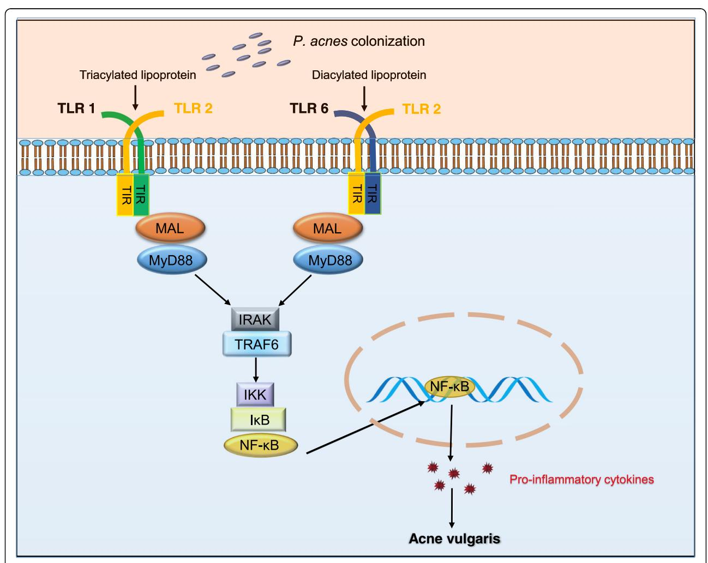

REVIEW Open Access

# Toll-like receptor 2 plays a critical role in pathogenesis of acne vulgaris

Bo Zhang1, Yeong Min Choi2, Junwoo Lee1,2, In Sook An2, Li Li3, Congfen He3, Yinmao Dong3, Seunghee Bae1\* and Hong Meng3\*

# **Abstract**

**Background:** Acne vulgaris is a common inflammatory skin disease, affecting adolescents across the globe. Recent evidences underline that *Propionibacterium acnes* (*P. acnes*) promotes acne through Toll-like receptor (TLR) activation. Especially, Toll-like receptor 2 (TLR2) has emerged as one of the major classes of pattern recognition receptors (PRRs) that are recognizing *P. acnes* in the epidermis and responsible for inflammation.

**Conclusions:** Although *P. acnes* has been known to be one of the major causes of acne vulgaris, an appropriate drug to alleviate acne pathogenesis is poorly developed. This review focuses on the molecular structure of TLR2 as well as mechanism how TLR2 recognize *P. acnes* to induce inflammatory cytokines, which is related to acne vulgaris pathogenesis. Rigorous study about *P. acnes* mediated by TLR2 activation may provide insight into novel therapeutic targets of acne vulgaris.

**Keywords:** TLR2, Acne vulgaris, *Propionibacterium acnes* 

# **Background**

Acne is a chronic disease of the pilosebaceous unit, which characterized by non-inflammatory lesions of open/closed comedones, and inflammatory lesions of papules, pustules nodules, and cysts of human beings (Lynn et al. 2016; Qidwai et al. 2017; Kumar et al. 2016; Pochi 1990). Acne vulgaris is the most common inflammatory skin disease that affects over 80% of adolescents (Lynn et al. 2016; Qidwai et al. 2017). Although acne is not life-threatening, it causes physical, psychological, and social impacts by an exhibition of diverse lesions on the face, chest, shoulders, and back (Kumar et al. 2016). The mechanism of inducing acne vulgaris remains unclear; however, recent studies revealed that Propionibacterium acnes (P. acnes) implicated in the inflammatory acne (Kumar et al. 2016; Pochi 1990). P. acnes is grampositive, facultative, anaerobic rod-shaped bacteria that is generally present within the sebaceous follicles of the human skin accounting for 87% of the clones with other

These substances are recognized by pattern recognition receptors (PRRs) which can detect a broad range of pathogen-associated molecular patterns (PAMPs) and conserved microbial structures, including lipopolysaccharide (LPS), peptidoglycan (PGN), flagellin, and nucleic acid ligands (Medzhitov 2001; Medzhitov and Janeway 2000). Interaction between PRRs and PAMPs initiates early immune responses, which influence subsequent adaptive immune responses (Medzhitov 2001; Medzhitov and Janeway 2000; Kupper and Fuhlbrigge 2004). Especially, Toll-like receptors (TLRs) have emerged as one of the major classes of PRRs. In fact, the skin is indispensable for maintaining physical barrier function as well as innate immune response (Kupper and Fuhlbrigge 2004). Different types of cells expressing TLRs, including keratinocytes and Langerhans cells (LCs), are present in the epidermis. In the dermis, resident and trafficking cells express TLRs. In particular, immune cells including monocytes, macrophages, dendritic

Full list of author information is available at the end of the article

Staphylococcus, Corynebacterium, Streptococcus, and Pseudomonas spp. (Ghodsi et al. 2009). These cutaneous pathogens are harboring virulence genes and secreting inflammatory substances such as lipase, porphyrins, hyaluronate lyase, and endoglycoceramidase that may progress acne vulgaris pathogenesis (Kumar et al. 2016).

\* Correspondence: sbae@konkuk.ac.kr; menghong2000@163.com

1Research Institute for Molecular-Targeted Drugs, Department of Cosmetics Engineering, Konkuk University, Seoul 05029, Republic of Korea

3Beijing Key Laboratory of Plant Resources Research and Development, Beijing Technology and Business University, Beijing 100048, People's Republic of China

cells (DCs), lymphocytes, and mast cells express TLRs. Moreover, endothelial cells of skin microvasculature and stromal cells such as fibroblasts and adipocytes also express TLRs (Kawai [2003](#page-5-0); Miller et al. [2005;](#page-5-0) Miller [2008](#page-5-0); Miller and Modlin [2007\)](#page-5-0).

Recent reports indicated that PAMPs induce TLR activation, which induces the expression of an immune responsive gene as well as cellular apoptosis. Subsequently, inflammatory cytokines induce recruitment of host immune cells for antimicrobial activity and regeneration of a damaged tissue. TLR-mediated cellular apoptosis and its corresponding robust inflammation often accompany with concomitant tissue diseases (Miller [2008;](#page-5-0) Miller and Modlin [2007](#page-5-0); Valins et al. [2010\)](#page-5-0), for instance, nerve damage in leprosy, myocardial ischemia/reperfusion injury, the manifestations of septic shock, and the pathogenesis of inflammatory acne, atopic dermatitis, and psoriasis (Kang et al. [2006;](#page-5-0) McInturff et al. [2005](#page-5-0)).

TLRs interact with different ligands, which, in turn, are located on different types of organisms or structures. Heterodimer formation of TLR is often required for binding to ligands. For example, lipoproteins or lipopeptides are recognized by TLR2 in complex with TLR1 or TLR6, viral double-stranded RNA is recognized by TLR3, lipopolysaccharide is recognized by TLR4, flagellin is recognized by TLR5, single-stranded RNA is recognized by TLR7 or TLR8, and microbial DNAs are recognized by TLR9 (McInturff et al. [2005](#page-5-0); Jin and Lee [2008](#page-5-0); Gao and Li [2017](#page-5-0); Song and Lee [2012\)](#page-5-0). Previous studies have demonstrated TLR2 mediates the response of several ligands by gram-positive bacteria including P. acnes. Targeting TLR2-P. acnes interaction may provide a fundamental strategy for future therapies or vaccine development for acne vulgaris.

# TLR2 interacts with P. acnes

TLR2 is a type I transmembrane glycoprotein receptor, composed with an extracellular domain (ECD), a single transmembrane domain, and an intracellular Toll/interleukin-1 receptor (TIR) domain (Jin and Lee [2008;](#page-5-0) Akira and Takeda [2004](#page-4-0)). The horseshoe-shaped ECD of TLR2 is comprised of 19 multiple LRR modules. LRR is a 20–30 amino acid residue length module containing a conserved "LxxLxLxxN" motif (Jin and Lee [2008](#page-5-0); Botos et al. [2011](#page-4-0)). Because TLR2 has two sharp structural transitions in the β sheet, LRR domains can be split into three subdomains which are the N-terminal, central, and C-terminal (Jin and Lee [2008](#page-5-0)). What is more, ECD of TLR2 is indispensable for recognition of PAMPs derived from P. acnes (Song and Lee [2012\)](#page-5-0). ECD interacts with P. acnes-secreted lipoproteins though attaching these lipoproteins to N-terminal cysteine of TLR2 covalently and forms "m"-shaped heterodimer with TLR1 either TLR6 (Jin and Lee [2008](#page-5-0); Gao and Li [2017;](#page-5-0) Song and Lee [2012\)](#page-5-0). To be specific, TLR2-TLR1 complex is a primary receptor for triacylated lipoproteins (Song and Lee [2012](#page-5-0)). The three lipid chains of ligand bridge TLR2 and TLR1, allowing TLR heterodimer by interacting simultaneously; two lipid chains bind to the large hydrophobic pocket in TLR2, and the third amide-bound chain binds to the narrow hydrophobic channel in TLR1 (Song and Lee [2012](#page-5-0); Botos et al. [2011;](#page-4-0) Kawai and Akira [2011](#page-5-0)). On the other hand, diacylated lipoproteins are usually recognized by TLR2-TLR6 heterodimer. The two ester-bound lipid chains are only inserted into the same TLR2 pocket. Unlike with TLR1, due to two phenylalanine residues of TLR6, the third amide-bound chain of the ligand is not able to bind with TLR6. This structural feature provides selectivity for diacylated over triacylated lipopeptides by TLR6. Furthermore, due to the ligand-binding pocket of TLR1/ TLR6 and TLR2 located at the boundary of central and Cterminal domain in the convex region, the formation of ECD dimerization would become further stabilized (Jin and Lee [2008;](#page-5-0) Gao and Li [2017;](#page-5-0) Song and Lee [2012;](#page-5-0) Akira and Takeda [2004](#page-4-0)).

Subsequently, ECD dimerization activates intracellular signal through the transmembrane domain to induce TIR dimerization. Intracellular TIR domain is comprised of 150 amino acid residues and has a common fold containing a five-stranded β sheet surrounded by five α helices. The connecting region between second β-strand (βB) and second α-helix (αB), referred as BB loop, is essential for TIR dimerization (Jenkins and Mansell [2010](#page-5-0); Botos et al. [2011\)](#page-4-0).

Intracellular TIR domains are found not only in the TLRs but also in adaptor proteins that are binding with the intracellular domain of TLRs. There are five adaptor proteins including myeloid differentiation factor 88(MyD88), MyD88 adapter-like protein (MAL), TIR-domain-containing adapterinducing interferon-β (TRIF), translocating chain-associating membrane protein (TRAM), and sterile-α and Armadillo motif-containing protein (SARM) are present in human (Song and Lee [2012](#page-5-0); Kawai and Akira [2011\)](#page-5-0). Mutagenesis experiments have shown that recruitment of adapters to the intracellular domain of TLR heterodimer is mediated by TIR dimerization between TLR and adaptor proteins. Mutation Pro681His in the TLR2 BB loop abolishes signal transduction in response to gram-positive bacteria stimulation (Underhill et al. [1999](#page-5-0)). Pro681His mutation does not alter TIR structural changes but disrupts TIR dimerization between TLR2 and MyD88 (Xu et al. [2000\)](#page-5-0). This research suggests that ECD dimerization of TLRs leads to proper orientation of the TIRs, recruitment of adaptor proteins, and initiation of intracellular signaling that culminates in activation of transcription factors such as nuclear factor-κB (NF-κB), AP-1, interferon regulatory factor (IRF)-3, and the MAP kinase family (Jin and Lee [2008;](#page-5-0) Gao and Li [2017;](#page-5-0) Song and Lee [2012](#page-5-0); Akira and Takeda [2004](#page-4-0); Jenkins and Mansell [2010](#page-5-0); Botos et al. [2011;](#page-4-0) Kim et al. [2002](#page-5-0); Kawai and Akira [2011](#page-5-0)).

P. acnes-bridged TLR2-TLR1 and TLR2-TLR6 heterodimers interact with MAL (also called TIRAP) and MyD88 to initiate signaling cascades that are required for activation key transcription factors, including NF-κB (Kawai and Akira [2011](#page-5-0)). The bridging adapter, MAL, is necessary for MyD88-dependent signaling which is triggered by TLR2 and TLR4 activation (Song and Lee [2012](#page-5-0); Jenkins and Mansell [2010;](#page-5-0) Kawai and Akira [2011\)](#page-5-0). In particular, MyD88 is a central adapter, which covers all TLR activations except TLR3. MyD88 is composed of three domains, N-terminal death domain, interdomain, and C-terminal TIR domain (Song and Lee [2012;](#page-5-0) Jenkins and Mansell [2010](#page-5-0)). MyD88 recruits IRAK family members via homotypic death domain interaction (Jenkins and Mansell [2010](#page-5-0); Wesche et al. [1997\)](#page-5-0). IRAK-4 is crucial for NF-κB activation in response to TLR ligands and is responsible for IRAK-1 recruitment and phosphorylation (Jenkins and Mansell [2010](#page-5-0); Suzuki et al. [2002](#page-5-0); Li et al. [2002](#page-5-0)). Phosphorylation of IRAK-1 leads to recruitment of tumor necrosis factor receptor-associated factor 6 (TRAF6) (Jenkins and Mansell [2010](#page-5-0); Chen [2005\)](#page-5-0). Once activated TRAF6 recruits transforming growth factoractivated kinase 1 (TAK1) and TAK1-binding protein 2 (TAB2), this complex interacts with upstream kinases of p38, JNK, and inhibitor of NF-κB kinase (IKK) complex inducing NF-κB activation and subsequent transcription of NF-κB responsive genes, including proinflammatory cytokines IL-1, IL-6, and TNF-α (Jenkins and Mansell [2010](#page-5-0); Kawai and Akira [2011](#page-5-0)). From the above, TR2 interacts with P. acnes that can motivate complicated but interesting cascade reactions in response to invasion from the cytomembrane to the cell nucleus.

# P. acnes activates canonical NF-κB pathway via TLR2

NF-κB is one of the significant transcription factors, which transcribes numerous inflammatory genes that are related to acne vulgaris pathogenesis. NF-κB transcribes cytokines including TNF-α, IL-1, IL-6, and IL-8 (Miller [2008](#page-5-0); Akira and Takeda [2004](#page-4-0); Jenkins and Mansell [2010](#page-5-0); Kim et al. [2002](#page-5-0); Chen [2005\)](#page-5-0). NF-κB is negatively regulated by interaction with IκB in the cytosol. Once serinespecific IκB kinase (IKK) complex leads to disassociate NF-κB from IκB by phosphorylation and degradation of IκB, NF-κB translocates to the nucleus and serves as a transcription factor (Chen [2005](#page-5-0); Murphy et al. [1995](#page-5-0); Kunsch and Rosen [1993\)](#page-5-0).

When TLR2 interacts with P. acnes, NF-κB acts as essential TLR2 downstream signal that has a nonnegligible impact on inflammatory acne vulgaris via the release of abundant proinflammatory cytokines (Kunsch and Rosen [1993](#page-5-0); Pivarcsi et al. [2003](#page-5-0); Kim [2005](#page-5-0)). Kim J et al. used TLR2 negative human embryonic kidney (HEK) 293 cells, which were transfected with TLR2, CD14, and NF- κB responsive endothelial leukocyte adhesion molecule (ELAM) enhancer luciferase (pGL3) reporter gene. P. acnes induces NF-κB activation in HEK 293 cells (expressing TLR2, CD14, and a NF-κB responsive ELAM enhancer), but it does not activate NF-κB in BaF3 cells (expressing TLR4, CD14, MD2, and ELAM) (Kim et al. [2002\)](#page-5-0). Selway JL et al. determined NF-κB activation from PGN (the primary toxicant from gram-positive bacteria) stimulated keratinocytes. Interestingly, TLR inhibition by TLR2 antibody to those cells restores IκB degradation as well as IL-1α induction (Selway et al. [2013](#page-5-0)). Zhu et al. examined the expression IκBα and NF-κB p65 in HaCat cells by western blotting after P. acnes treatment, and phosphorylated IκBα and NF-κB p65 expression levels were obviously upregulated with 3 fold changes and 1.6 fold changes more than control, respectively (Zhu et al. [2018](#page-5-0)). In addition, immunofluorescence staining was used to detect the location of NF-κB p65 in HaCaT cells and NF-κB p65-positive staining was predominately discovered in control cytoplasm and shifted to the nuclei upon P. acnes treatment (Zhu et al. [2018\)](#page-5-0). The same as previous findings from extensive experiments, Lee WR et al. also determined that following the stimulation of heat-killed P. acnes, increased expressions of cytosolic phosphorylated IKK, IκB, and nuclear NF-κB were detected in HaCat cells via western blotting (Lee et al. [2014](#page-5-0)). Furthermore, Lee WR et al. evaluated expression levels of cytosolic phospho-IKK, phospho-IκB, and nuclear NF-κB by heatkilled P. acnes-treated mice model. Gel mobility shift assays were performed that the DNA binding activity of NF-κB was upregulated in P. acnes-treated mice group (Lee et al. [2014](#page-5-0)).

In conclusion, the interaction between TLR2 with P. acnes activates NF-κB signal pathway subsequently through phosphorylation of IKK, the release of IκB in the cytoplasm, and the translocation of NF-κB in the nucleus.

# P. acnes induces cytokine expression through TLR2

NF-κB is responsible for the induction of various cytokine expressions against bacterial infection. For example, IL-12 could excite Th1 T cell in response to colonization of gram-positive organisms. Cytokines trigger inflammation by recruitment of host immune cells and an antimicrobial defense that cause tissue injury or unwanted disease sometimes (Plevy et al. [1997\)](#page-5-0).

In this aspect, many researchers have been investigated whether P. acnes-induced cytokine production is associated with TLR2 activation. Selway demonstrated that 146% IL-1α is secreted from infundibular keratinocytes compared to control in response to P. acnes mediated by ELISA, and this IL-1α increase is downregulated in the presence a TLR2 neutralizing antibody in the media (Selway et al. [2013](#page-5-0)). P. acnes induces production of IL-8, TNF-α, IL-1β, and IFN-γ from keratinocytes (Stein and Baldwin Jr. [1993;](#page-5-0) Zhu et al. [2018](#page-5-0); Graham et al. [2004](#page-5-0); Song et al. [2002](#page-5-0); Pivarcsi et al. [2003\)](#page-5-0). Furthermore, TNFα, IL-1β, and TLR2 were transcribed from keratinocytes that were exposed to heat-killed P. acnes (Graham et al. [2004](#page-5-0)). Interestingly, similar results were observed from inflammatory animal model studies: TNF-α and IL-1β are barely found in the normal skin tissue from the control mice group, whereas a significant upregulation of these cytokine expression levels is observed from mice that topically treated with heat-killed P. acnes (Lee et al. [2014](#page-5-0)). IL-12 and IL-8 levels are increased in a dosedependent manner of P. acnes treatment. P. acnes-mediated IL-12 and IL-8 increase were attenuated by antiTLR2 antibody (Kim et al. [2002;](#page-5-0) Jarrousse et al. [2007\)](#page-5-0). It was demonstrated that peritoneal macrophages from TLR6 knockout and TLR1 knockout mice, but not TLR2 knockout mice, produced IL-6 in response to P. acnes infection (Kim et al. [2002](#page-5-0); Takeuchi et al. [2001](#page-5-0), [2002](#page-5-0); Ozinsky et al. [2000\)](#page-5-0). There are numerous reports that P. acnes contributes cytokine production which is pivotal for the induction of inflammatory acne vulgaris through a TLR2-dependent pathway in the skin (Kim [2005\)](#page-5-0).

# Discussion

Several in vivo and in vitro studies have demonstrated that TLR2 is overexpressed in acne vulgaris (Rocha et al. [2017](#page-5-0); Kim [2005;](#page-5-0) Shibata et al. [2009](#page-5-0); Ma et al. [2016](#page-5-0); Bakry et al. [2014](#page-4-0); Taylor et al. [2011\)](#page-5-0). P. acnes-derived

Fig. 1 TLR-mediated inflammatory cytokine induction. P. acnes secreted lipases, proteases, and hyaluronidases which can be recognized by TLR2 of keratinocytes nearby sebaceous follicles primarily. Next, the invading signals are transported from ECD dimerization of TLR2 and TLR1/6 to TIR dimerization of TLR2 and TLR1/6. TIR dimerization recruits adaptor proteins including MAL and MyD88. Adaptor proteins initiate phosphorylation of IRAK and promote TRAF6 activation that facilitates the phosphorylation of IKK and release of IκB. NF-κB translocates to the nucleus after disassociation with IκB and transcribes cytokines. As a result, cytokines induce inflammatory acne in the sebum-clogged pore and lasting cytokine levels may contribute to progress acute acne into chronic disease

Zhang et al. Biomedical Dermatology (2019) 3:4

PAMPs are recognized by TLR2, which leads to cytokine expression and inflammation (Fig. 1). P. acnes is regarded as a resident flora in human sebaceous follicles and colonize in excessive sebum. *P. acnes* releases lipases, proteases, and hyaluronidases which can be recognized by TLR2 of keratinocytes nearby sebaceous follicles firstly. PAMPs derived from P. acnes interact with the extracellular domain of TLR2 in keratinocyte cytomembrane. TLR2 and TLR1/TLR6 form a heterodimeric interface via hydrophobic and hydrophilic interactions of their surfaceexposed residues. Following heterodimerization of the extracellular domain, dimerization of their cytoplasmic TIR domains will come up spontaneously. A shortage of range heterodimers is believed to trigger recruitment of adaptor proteins including MAL (also known as TIRAP), MyD88 to the intracellular TIR domains (Botos et al. 2011; O'Neill and Bowie 2007). MyD88 is responsible for IRAK phosphorylation and promotes TRAF6 activation, which facilitates IKK phosphorylation and IkB degradation. Subsequently, the invaded signal will be transmitted to the nucleus and expressed from mRNA to protein via activation of transcriptional nuclear factors, such as NFκB. Upon interaction between P. acnes and TLR2 of keratinocytes nearby sebaceous follicles, inflammatory cytokines are secreted and recruit immune cells, such as Langerhans cells, dendritic cells, macrophages, natural killer (NK), and neutrophils.

To alleviate *acne vulgaris*, many drugs have been used. Some of the drugs are reported to inhibit TLR2 activity. For example, a third-generation topical synthetic retinoid, adapalene had been treated for acne patients. Adapalene induces dose-dependent inhibition of TLR2 expression and downregulates IL-10 expression from keratinocytes in perifollicular space (Nguyen et al. 2018; Grange et al. 2009). A main steroidal saponin extraction from Paris polyphylla rhizomes, referred as Polyphyllin I (PPI), attenuates TLR2 expression as well as IL-6, IL-8, and  $TNF-\alpha$  expression (Zhu et al. 2018). A major component of honeybee venom, melittin, attenuates  $TNF\alpha$ , IL-8, IL-1β, and IFN-γ secretion as well as phosphorylation of IKK, IkB from TLR2-induced cells, which activated by P. acnes treatment (Lee et al. 2014). Durational treatment of isotretinoin for 1 week eliminates TLR2 expression and subsequent inflammatory cytokine response to P. acnes (Dispenza et al. 2012). These general anti-acne treatments accompany with downregulation of the TLR2 signaling pathway. Thus, future research on TLR2-specific inhibitor would be beneficial for acne therapeutics.

# **Conclusions**

TLR2 plays a crucial role in *P. acnes* recognition and initiation of inflammatory response. Excessive *P. acnes* can result in promoting inflammation and tissue destruction

by TLR2-mediated proinflammatory cytokines. TLR2 is an effective target for therapeutic intervention to block inflammatory responses in *P. acnes* invasion. Therefore, targeting with TLR2 will provide new insights into novel therapeutic targets of acne vulgaris.

Page 5 of 6

#### Abbreviations

CAT: Chloramphenicol acetyltransferase; COC: Oral contraceptive; DCs: Dendritic cells; ELAM: Endothelial leukocyte adhesion molecule; HEK: Human embryonic kidney; IKK: Inhibitor of NF-kB kinase; IRF: Interferon regulatory factor; LCs: Langerhans cells; LPS: Lipopolysaccharide; LRR: Leucine-rich repeat; MAL: MyD88-adapter-like protein; MyD88: Myeloid differentiation factor 88; NF-kB: Nuclear factor-kB; NK: Natural killer; *P. acnes: Propionibacterium acnes*; PAMPs: Pathogen-associated molecular patterns; PGN: Peptidoglycan; PPI: Polyphyllin I; PRRs: Pattern recognition receptors; SARM: Sterile-a and Armadillo motif-containing protein; TICAM: TIR-containing adapter molecule; TIR: Toll/interleukin-1 receptor; TIRAP: TIR domain-containing adapter protein; TLR2 dn1: TLR2 dominant negative mutant; TLRs: Toll-like receptors; TNF: Tumor necrosis factor; TRAF6: TNF receptor-associated factor 6; TRAM: Translocating chain-associating membrane protein; TRIF: TIR-domain-containing adapter-inducing interferon-B

### Acknowledgements

This work was supported by a grant from the Marine Biotechnology Program (20150184) funded by the Ministry of Oceans and Fisheries, Republic of Korea

#### Authors' contributions

BZ, YMC, JL, ISA, LL, CH, YD, SB, and HM analyzed the data and reviewed the literatures. BZ, YMC, JL, SB, and HM wrote the manuscript. All authors read and approved the final manuscript.

## Fundina

This work was supported by a grant from the Marine Biotechnology Program (20150184) funded by the Ministry of Oceans and Fisheries, Republic of Korea

## Availability of data and materials

Not applicable

## Ethics approval and consent to participate

Not applicable

# Consent for publication

Not applicable

# Competing interests

Yinmao Dong is an Editor-in-Chief of Biomedical Dermatology. In Sook An is a Managing Editor of Biomedical Dermatology.

## Author details

1Research Institute for Molecular-Targeted Drugs, Department of Cosmetics Engineering, Konkuk University, Seoul 05029, Republic of Korea. 2Korea Institute for Dermatological Sciences, Gene Cell Pharm Corporation, Seoul, Republic of Korea. 3Beijing Key Laboratory of Plant Resources Research and Development, Beijing Technology and Business University, Beijing 100048, People's Republic of China.

Received: 15 January 2019 Accepted: 7 June 2019 Published online: 28 June 2019

# References

Akira S, Takeda K. Toll-like receptor signalling. Nat Rev Immunol. 2004;4(7):499–511.

Bakry OA, Samaka RM, Sebika H, Seleit I. Toll-like receptor 2 and P. acnes: do they trigger initial acne vulgaris lesions? Anal Quant Cytopathol Histpathol. 2014; 36(2):100–10.

Botos I, Segal DM, Davies DR. The structural biology of Toll-like receptors. Structure. 2011;19(4):447–59.

- Chen ZJ. Ubiquitin signalling in the NF-kappaB pathway. Nat Cell Biol. 2005;7(8): 758–65.
- Dispenza MC, Wolpert EB, Gilliland KL, Dai JP, Cong Z, Nelson AM, et al. Systemic isotretinoin therapy normalizes exaggerated TLR-2-mediated innate immune responses in acne patients. J Invest Dermatol. 2012;132(9):2198–205.
- Gao D, Li W. Structures and recognition modes of Toll-like receptors. Proteins. 2017;85(1):3–9.
- Ghodsi SZ, Orawa H, Zouboulis CC. Prevalence, severity, and severity risk factors of acne in high school pupils: a community-based study. J Invest Dermatol. 2009;129(9):2136–41.
- Graham GM, Farrar MD, Cruse-Sawyer JE, Holland KT, Ingham E. Proinflammatory cytokine production by human keratinocytes stimulated with Propionibacterium acnes and P. acnes GroEL. Br J Dermatol. 2004; 150(3):421–8.
- Grange PA, Raingeaud J, Calvez V, Dupin N. Nicotinamide inhibits Propionibacterium acnes-induced IL-8 production in keratinocytes through the NF-kappaB and MAPK pathways. J Dermatol Sci. 2009;56(2):106–12.
- Jarrousse V, Castex-Rizzi N, Khammari A, Charveron M, Dréno B. Zinc salts inhibit in vitro Toll-like receptor 2 surface expression by keratinocytes. Eur J Dermatol. 2007;17(6):492–6.
- Jenkins KA, Mansell A. TIR-containing adaptors in Toll-like receptor signalling. Cytokine. 2010;49(3):237–44.
- Jin MS, Lee JO. Structures of the Toll-like receptor family and its ligand complexes. Immunity. 2008;29(2):182–91.
- Kang SS, Kauls LS, Gaspari AA. Toll-like receptors: applications to dermatologic disease. J Am Acad Dermatol. 2006;54(6):951–83.
- Kawai K. Expression of functional Toll-like receptors on cultured human epidermal keratinocytes. J Invest Dermatol. 2003;121(1):217–8.
- Kawai T, Akira S. Toll-like receptor and their crosstalk with other innate receptors in infection and immunity. Immunity. 2011;34(5):637–50.
- Kim J. Review of the innate response in acne vulgaris: activation of Toll-like receptor 2 in acne triggers inflammatory cytokine responses. Dermatology. 2005;211(3):193–8.
- Kim J, Ochoa MT, Krutzik SR, Takeuchi O, Uematsu S, Legaspi AJ, et al. Activation of Toll-like receptor 2 in acne triggers inflammatory cytokine responses. J Immunol. 2002;169(3):1535–41.
- Kumar B, Pathak R, Mary PB, Jha D, Sardana K, Gautam HK. New insights into acne pathogenesis: exploring the role of acne-associated microbial populations. Dermatol Sin. 2016;34(2):67–73.
- Kunsch C, Rosen CA. NF-κB subunit-specific regulation of the interleukin-8 promoter. Mol Cell Biol. 1993;13(10):6137–46.
- Kupper TS, Fuhlbrigge RC. Immune surveillance in the skin: mechanisms and clinical consequences. Nat Rev Immunol. 2004;4(3):211–22.
- Lee WR, Kim KH, An HJ, Kim JY, Chang YC, Chung H, et al. The protective effects of melittin on Propionibacterium acnes-induced inflammatory responses in vitro and in vivo. J Invest Dermatol. 2014;134(7):1922–30.
- Li S, Strelow A, Fontana EJ, Wesche H. IRAK-4: a novel member of the IRAK family with the properties of an IRAK-kinase. Proc Natl Acad Sci U S A. 2002;99(8): 5567–72.
- Lynn DD, Umari T, Dunnick CA, Dellavalle RP. The epidemiology of acne vulgaris in late adolescence. Adolesc Health Med Ther. 2016;7:13–25.
- Ma Y, Chen Q, Liu Y, Wang Q, Huang Z, Xiang L. Effects of 5-aminolevulinic acid photodynamic therapy on TLRs in acne lesions and keratinocytes co-cultured with P. acnes. Photodiagn Photodyn Ther. 2016;15:172–81.
- McInturff JE, Modlin RL, Kim J. The role of Toll-like receptors in the pathogenesis and treatment of dermatological disease. J Invest Dermatol. 2005;125(1):1–8.
- Medzhitov R. Toll-like receptors and innate immunity. Nat Rev Immunol. 2001; 1(2):135–45.
- Medzhitov R, Janeway C Jr. Innate immunity. N Engl J Med. 2000;343(5):338–44. Miller LS. Toll-like receptors in skin. Adv Dermatol. 2008;24:71–87.
- Miller LS, Modlin RL. Toll-like receptors in the skin. Semin Immunopathol. 2007; 29(1):15–26.
- Miller LS, Sørensen OE, Liu PT, Jalian HR, Eshtiaghpour D, Behmanesh BE, et al. TGF-alpha regulates TLR expression and function on epidermal keratinocytes. J Immunol. 2005;174(10):6137–43.
- Murphy TL, Cleveland MG, Kulesza P, Magram J, Murphy KM. Regulation of interleukin 12 p40 expression through an NF-κB half-site. Mol Cell Biol. 1995; 15(10):5258–67.
- Nguyen CT, Sah SK, Zouboulis CC, Kim TY. Inhibitory effects of superoxide dismutase 3 on Propionibacterium acnes-induced skin inflammation. Sci Rep. 2018;8(1):4024.

- O'Neill LA, Bowie AG. The family of five: TIR-domain-containing adaptors in Tolllike receptor signalling. Nat Rev Immunol. 2007;7(5):353–64.
- Ozinsky A, Underhill DM, Fontenot JD, Hajjar AM, Smith KD, Wilson CB, et al. The repertoire for pattern recognition of pathogens by the innate immune system is defined by cooperation between Toll-like receptors. Proc Natl Acad Sci U S A. 2000;97(25):13766–71.
- Pivarcsi A, Bodai L, Réthi B, Kenderessy-Szabó A, Koreck A, Széll M, et al. Expression and function of Toll-like receptors 2 and 4 in human keratinocytes. Int Immunol. 2003;15(6):721–30.
- Plevy SE, Gemberling JH, Hsu S, Dorner AJ, Smale ST. Multiple control elements mediate activation of the murine and human interleukin 12 p40 promoters: evidence of functional synergy between C/EBP and Rel proteins. Mol Cell Biol. 1997;17(8):4572–88.
- Pochi PE. The pathogenesis and treatment of ACNE. Annu Rev Med. 1990;41: 187–98.
- Qidwai A, Pandey M, Pathak S, Kumar R, Dikshit A. The emerging principles for acne biogenesis: a dermatological problem of puberty. Hum Microbiome J. 2017;4:7–13.
- Rocha MAD, Guadanhima LRS, Sanudo A, Bagatin E. Modulation of Toll like receptor-2 on sebaceous gland by the treatment of adult female acne. Dermatoendocrinol. 2017;9(1):e1361570.
- Selway JL, Kurczab T, Kealey T, Langlands K. Toll-like receptor 2 activation and comedogenesis: implications for the pathogenesis of acne. BMC Dermatol. 2013;13:10.
- Shibata M, Katsuyama M, Onodera T, Ehama R, Hosoi J, Tagami H. Glucocorticoids enhance Toll-like receptor 2 expression in human keratinocytes stimulated with Propionibacterium acnes or proinflammatory cytokines. J Invest Dermatol. 2009;129(2):375–82.
- Song DH, Lee JO. Sensing of microbial molecular patterns by Toll-like receptors. Immunol Rev. 2012;250(1):216–29.
- Song PI, Park YM, Abraham T, Harten B, Zivony A, Neparidze N, et al. Human keratinocytes express functional CD14 and Toll-like receptor 4. J Invest Dermatol. 2002;119(2):424–32.
- Stein B, Baldwin AS Jr. Distinct mechanisms for regulation of the interleukin-8 gene involve synergism and cooperativity between C/EBP and NF-κB. Mol Cell Biol. 1993;13(11):7191–8.
- Suzuki N, Suzuki S, Duncan GS, Millar DG, Wada T, Mirtsos C, et al. Severe impairment of interleukin-1 and Toll-like receptor signalling in mice lacking IRAK-4. Nature. 2002;416(6882):750–6.
- Takeuchi O, Kawai T, Mühlradt PF, Morr M, Radolf JD, Zychlinsky A, et al. Discrimination of bacterial lipoproteins by Toll-like receptor 6. Int Immunol. 2001;13(7):933–40.
- Takeuchi O, Sato S, Horiuchi T, Hoshino K, Takeda K, Dong Z, et al. Cutting edge: role of TLR1 in mediating immune response to microbial lipoproteins. J Immunol. 2002;169(1):10–4.
- Taylor M, Gonzalez M, Porter R. Pathways to inflammation: acne pathophysiology. Eur J Dermatol. 2011;21(3):323–33.
- Underhill DM, Ozinsky A, Hajjar AM, Stevens A, Wilson CB, Bassetti M, et al. The Toll-like receptor 2 is recruited to macrophage phagosomes and discriminates between pathogens. Nature. 1999;401(6755):811–5.
- Valins W, Amini S, Berman B. The expression of Toll-like receptors in dermatological diseases and the therapeutic effect of current and newer topical Toll-like receptor modulators. J Clin Aesthet Dermatol. 2010;3(9):20–9.
- Wesche H, Henzel WJ, Shillinglaw W, Li S, Cao Z. MyD88: an adaptor that recruits IRAK to the IL-1 receptor complex. Immunity. 1997;7(6):837–47.
- Xu Y, Tao X, Shen B, Horng T, Medzhitov R, Manley JL, et al. Structural basis for signal transduction by the Toll/interleukin-1 receptor domains. Nature. 2000; 408(6808):111–5.
- Zhu T, Wu W, Yang S, Li D, Sun D. Polyphyllin I inhibits Propionibacterium acnesinduced inflammation in vitro. Inflammation. 2018.

# Publisher's Note

Springer Nature remains neutral with regard to jurisdictional claims in published maps and institutional affiliations.