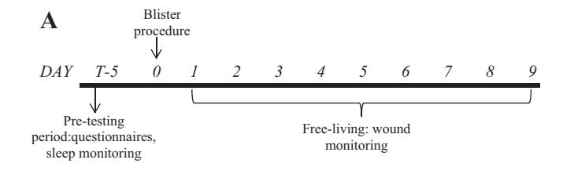
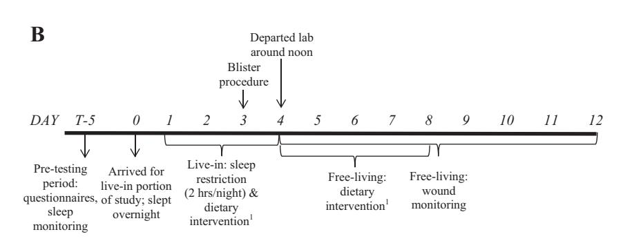
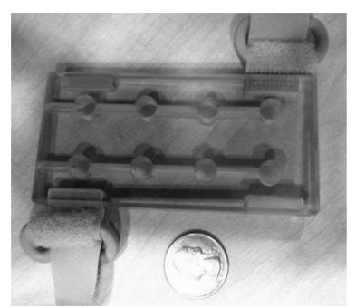
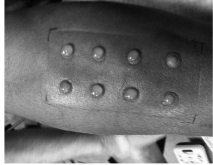
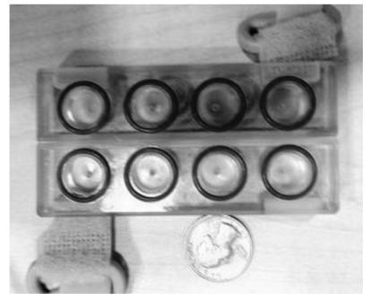
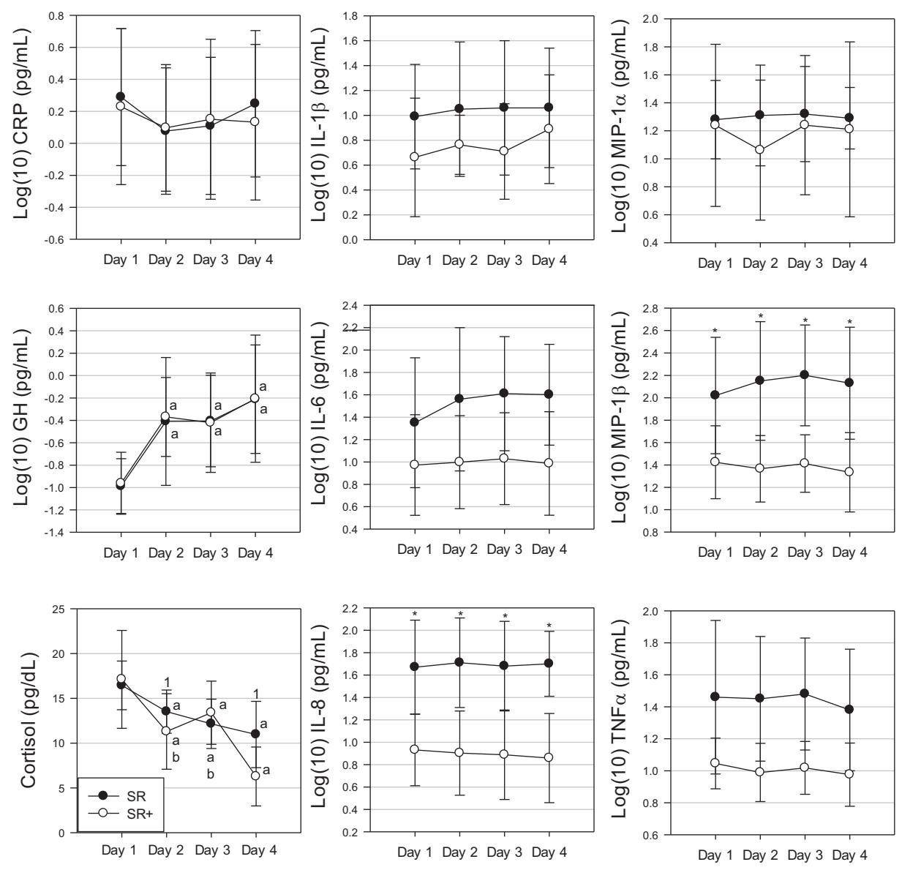
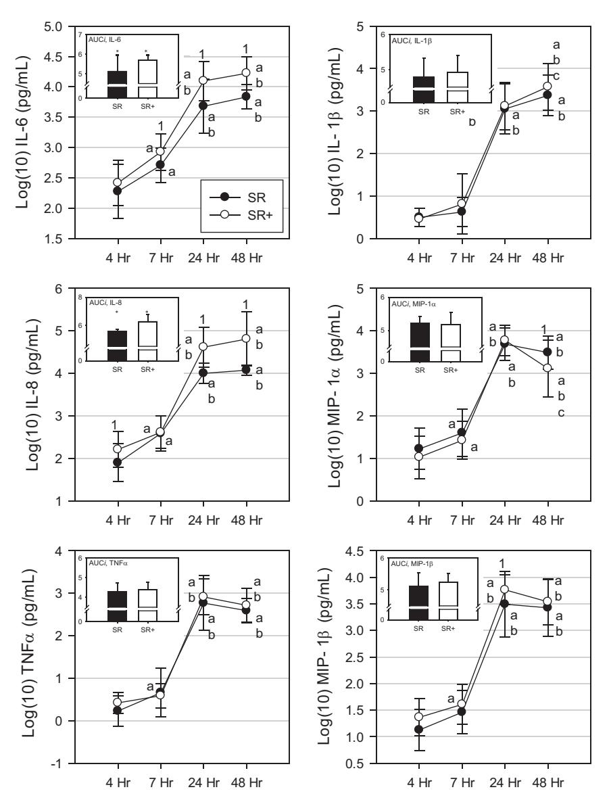

# RESEARCH ARTICLE

# Impact of sleep restriction on local immune response and skin barrier restoration with and without "multinutrient" nutrition intervention

Tracey J. Smith, Marques Wilson, J. Philip Karl, Jeb Orr, Carl Smith, Adam Cooper, Kristin Heaton, Andrew J. Young, and Scott J. Montain

1Military Nutrition Division, United States Army Research Institute of Environmental Medicine, Natick, Massachusetts;

2Military Performance Division, United States Army Research Institute of Environmental Medicine, Natick, Massachusetts;

3Naval Health Research Center, San Diego, California; and 4Department of Environmental Health, Boston University School of Public Health, Boston, Massachusetts

Submitted 14 June 2017; accepted in final form 8 September 2017

Smith TJ, Wilson M, Karl JP, Orr J, Smith C, Cooper A, Heaton K, Young AJ, Montain SJ. Impact of sleep restriction on local immune response and skin barrier restoration with and without "multinutrient" nutrition intervention. J Appl Physiol 124: 190–200, 2018. First published September 14, 2017; doi:10.1152/japplphysiol. 00547.2017.—Systemic immune function is impaired by sleep restriction. However, the impact of sleep restriction on local immune responses and to what extent any impairment can be mitigated by nutritional supplementation is unknown. We assessed the effect of 72-h sleep restriction (2-h nightly sleep) on local immune function and skin barrier restoration of an experimental wound, and determined the influence of habitual protein intake (1.5 g·kg-1·day-1) supplemented with arginine, glutamine, zinc sulfate, vitamin C, vitamin D3, and omega-3 fatty acids compared with lower protein intake (0.8 g·kg-1·day-1) without supplemental nutrients on these outcomes. Wounds were created in healthy adults by removing the top layer of less than or equal to eight forearm blisters induced via suction, after adequate sleep (AS) or 48 h of a 72-h sleep restriction period (SR; 2-h nightly sleep). A subset of participants undergoing sleep restriction received supplemental nutrients during and after sleep restriction (SR+). Wound fluid was serially sampled 48 h postblistering to assess local cytokine responses. The IL-8 response of wound fluid was higher for AS compared with SR [area-under-the-curve (log10),  $5.1 \pm 0.2$  and  $4.9 \pm 0.2$  pg/ml, respectively; P = 0.03]; and both IL-6 and IL-8 concentrations were higher for SR+ compared with SR (P <0.0001), suggestive of a potentially enhanced early wound healing response. Skin barrier recovery was shorter for AS  $(4.2 \pm 0.9 \text{ days})$ compared with SR  $(5.0 \pm 0.9 \text{ days})$  (P = 0.02) but did not differ between SR and SR+ (P = 0.18). Relatively modest sleep disruption delays wound healing. Supplemental nutrition may mitigate some decrements in local immune responses, without detectable effects on wound healing rate.

**NEW & NOTEWORTHY** The data herein characterizes immune function in response to sleep restriction in healthy volunteers with and without nutrition supplementation. We used a unique skin wound model to show that sleep restriction delays skin barrier recovery, and nutrition supplementation attenuates decrements in local immune responses produced by sleep restriction. These findings support the beneficial effects of adequate sleep on immune function. Additional studies are necessary to characterize practical implications for populations where sleep restriction is unavoidable.

Address for reprint requests and other correspondence: T. J. Smith, Military Nutrition Division, US Army Research Institute of Environmental Medicine, 10 General Greene Ave., Bldg. 42, Natick, MA 01760 (e-mail: Tracey.smith10.civ@mail.mil).

Army; cytokines; first responders; immune function; military personnel; skin barrier recovery; sleep deprivation; stress; wound healing

### INTRODUCTION

Immune responsiveness is degraded by short-term sleep restriction. The effect is mediated by hypothalamic-pituitaryadrenal axis and sympathetic nervous system activation (26), and characterized in part by decrements in natural killer cell activity and interleukin-2 production and increased levels of circulating proinflammatory cytokines (12, 27, 58). Collectively these effects are thought to increase risk of illness and infection (12, 43), and impair wound healing. For example, the risk of acquiring the "common cold" was approximately fourfold higher in volunteers who slept <6 h/night, compared with those who sleep more than 7 h/night, for 7 days (12, 43), and 42-h total sleep deprivation delayed initial recovery of the skin barrier following an experimental wound. As such, developing strategies for maintaining immune function is of interest to populations in which short-term sleep restriction is sometimes unavoidable, such as military and emergency service person-

Optimal immune function is dependent on nutrient availability and underlying nutritional status (39, 53). Clinical nutrition support guidelines for adults recommend enteral formulations containing arginine, glutamine, omega-3 fatty acids, and antioxidants for immune enhancement and faster recoveries in patients undergoing major elective surgery (35, 37, 39, 53). For example, vitamin C plays an important role in collagen synthesis, fibroblast proliferation, capillary formation, and neutrophil activity (53), while omega-3 fatty acids enhance T-cell and natural killer cell activity and have been shown to reduce systemic inflammation (11, 41). Furthermre, studies indicate that certain nutrients improve wound healing indexes in healthy adults (3, 32, 61). For example, arginine contributes to collagen deposition and cellular growth and impacts microcirculation by increasing the production of nitric oxide (10, 39, 61), while glutamine stimulates the proliferation of fibroblasts, subsequently contributing to wound closure (39). The efficacy of nutrient interventions for modulating immune function and promoting healing in healthy individuals who are immune compromised consequent to physical or cognitive stressors (e.g., sleep restriction) has received less attention.

190 http://www.jappl.org

The suction blister model is useful tool for studying immune responsiveness of populations exposed to a variety of stressors and the efficacy of countermeasures to promote or enhance recovery. Traditionally, circulating blood-derived markers of immune function have been assessed to study the systemic immune response (12, 27, 58), but these markers do not fully characterize functional status (e.g., the ability to heal from a wound or defend against an infection) (20). In contrast, wound healing models directly assess functional status of the innate immune system (i.e., the ability to heal from a wound) and can also provide insight into the local proinflammatory response and tissue remodeling processes. The suction blister model is a wound healing model that allows study of the functional immune response to include immune response at a wound site along with skin barrier restoration as a proxy measure of wound healing rate. Our group has shown that this method is sufficiently reliable for assessing skin barrier restoration and local immune responsiveness of experimental skin wounds (50) (i.e., strong correlations were observed between the left and right arm in terms of skin barrier restoration rate and local cytokine response). Furthermore, the method has been used in humans to study how stress affects in vivo immune responsiveness (20, 30, 45). For example, skin barrier restoration was delayed by approximately 1 day following a 30-min adverse social interaction (i.e., verbal disagreement), compared with a 30-min positive social interaction, with their spouse (30), and college examination stress delayed suction blister wound healing time by ~2 days (45). In addition to demonstrating decrements in the immune response, delayed wound closure has practical implications, i.e., the potential for infection is heightened while the skin barrier is perturbed. This is relevant for military trainees, wherein cellulitis and purulent skin abscesses are a common problem (29).

The primary aims of this study were twofold. We first sought to demonstrate that the suction blister wound model is sensitive enough to detect decrements in local immune response and skin barrier restoration rate in response to a stress model (i.e., 72-h sleep restriction with 2 h of nightly sleep in a laboratory environment) by examining effects of the stress model on skin

barrier restoration. After successfully demonstrating acceptable sensitivity, we sought to determine if dietary supplementation with arginine, glutamine, vitamin C, vitamin D, zinc, and omega-3 fatty acids could mitigate decrements in local immune response and skin barrier restoration. We hypothesized that immune responses would be degraded and skin barrier recovery would be delayed in participants following sleep restriction compared with free-living participants who were adequately rested. We further hypothesized that immune function would be preserved and skin barrier recovery would be shorter in participants who consumed 1.5 g protein/kg body wt (i.e., the higher end of the military dietary reference intake (MDRI), which was consistent with participants' habitual protein intake) and a twice-daily, multinutrient beverage during and after sleep restriction compared with participants who received a placebo beverage and 0.8 g protein/kg body wt (i.e., the low end of the MDRI).

### MATERIALS AND METHODS

Study Design

This was a two-phase study. *Phase 1* determined the effect of sleep restriction and controlled living conditions (i.e., residing in the laboratory) on local immune responses and skin barrier restoration. Phase 2 determined the effect of a nutrition intervention on local immune response and skin barrier restoration in response to sleep restriction under controlled living conditions. In phase 1, the impact of shortterm sleep restriction (i.e., ~72 h of sleep restriction with 2 h of sleep per night in a laboratory environment) on skin barrier restoration and immune response at the wound site was assessed by comparing free-living participants with adequate sleep (AS) to a group of sleep restricted participants who resided in the laboratory during the sleep restriction period (SR) (Fig. 1). In phase 2, we determined if a diet providing 1.5 g protein·kg-1·body wt-1 combined with a multinutrient supplement during and after sleep restriction (SR+) attenuated the decrements in local immune function and skin barrier restoration observed in response to sleep restriction when compared with a diet providing 0.8 g protein/kg body wt combined with a placebo beverage (SR) (Fig. 1). Dietary protein levels were selected to represent the lower and higher ends of the MDRIs (0.8-1.6 g protein-kg body wt-1·day-1) (56), and the higher level of 1.5 g protein·kg body

Fig. 1. Timeline of activities during adequate sleep (*A*) and sleep restriction (*B*) phases. Dietary intervention during sleep restriction consisted of 0.8 g protein/kg body wt plus placebo beverage (SR) or 0.8 g protein/kg body wt plus multinutrient beverage (SR+).

wt-1 ·day-1 was consistent with participants' reported habitual protein intakes. Blisters were applied to all three study groups (AS, SR, and SR), and the main measures of immune function included skin barrier restoration (measured by skin vapor permeability) and wound inflammatory responses.

# *Participants*

Participants were military and civilian personnel assigned to Natick Soldier Systems Center (Natick, MA). Eighty-five percent (*n* 56) of the 66 participants who began the study completed data collection and were included in the data analyses (AS, *n* 16; SR, *n* 20; and SR; *n* 20). One participant withdrew before study participation due to scheduling conflicts, seven volunteers withdrew during baseline testing (i.e., *n* 3 due to relocation from the geographical area; and *n* 4 due to noncompliance with the sleep requirements leading up to SR), and three participants left the study during the sleep restriction period (i.e., SR, *n* 2 due to gastrointestinal virus or migraine; and SR, *n* 1 due to inability to stay awake).

Data collection occurred from September 2012 to May 2016 at the U.S. Army Research Institute of Environmental Medicine (Natick, MA). Each volunteer gave his or her written, informed consent after an oral explanation of the study. Individuals were included if they were between the ages of 19 and 35 yr, were generally healthy and not taking medications (including nonsteroidal anti-inflammatory drugs and aspirin), were not pregnant or lactating, had no history of psychiatric disorder requiring hospitalization or psychiatric medication usage, and slept between 7 and 9 h/night at least 5 days/wk. All subjects completed an initial screening and were medically cleared for participation. The study was approved by the Institutional Review Board, U.S. Army Research Institute of Environmental Medicine. The investigators adhered to the policies for protection of human subjects as prescribed Department of Defense Instruction 3216.02, and the research was conducted in adherence with the provisions of 32 CFR Part 219. The Clinicaltrials.gov identifier is NCT02053506.

*Research Procedures Applicable to All Experimental Groups (AS, SR, and SR)*

*Assessment of general sleep patterns.* Participants confirmed that they regularly slept 7–9 h/night before the baseline testing period. General sleep patterns were assessed during the baseline testing period via the morningness/eveningness questionnaire, actigraphy, and a paper-and-pencil sleep diary. The morningness/eveningness questionnaire (23) is a 19-item questionnaire that assesses respondent's circadian preference, sleep-wake pattern for activity, and morning and evening alertness and was used as an initial screener wherein participants needed to score between 31 and 69 to remain in the study, thus avoiding extremes in "morningness" or "eveningness". Participants wore an actigraphy monitor (Actical, Philips Respironics, Murrysville, PA or an equivalent) for 5 days before the blister induction (AS) or live-in portion of the study (SR and SR) to verify that they slept between 7 and 9 h/night. Participants also maintained a paperbased sleep diary, in which they recorded the time they went to bed (with the intent to sleep) and the time they awoke.

*Assessment of life stressors.* The perceived stress scale (13) was administered to all participants either within a week of the blister induction (AS) or upon arriving to the laboratory for the live-in portion of the study (SR and SR) to assess life stressors in the previous month. This scale is a reliable and valid 14-item, widely used self-report measure of perceived stress, wherein respondents rate the stressfulness of their life during the previous month. The items are answered on a 0 (never) to 4 (very) scale, with higher sum scores indicating greater perceived stress.

*Anthropometrics.* Standing height was measured at baseline, in duplicate using an anthropometer (Seritex, Carlstadt, NJ or similar). Body weight was measured in shorts, t-shirt, stocking feet at baseline and either the morning of the blister induction (AS) or each day of the live-in portion of the study (SR and SR) using a calibrated electronic scale (Tanita WB-110A Class III, Tokyo, Japan).

*Suction blister induction and fluid sampling.* Venous blood was drawn from the forearm on the morning of the blister induction, and ~3.0 ml of serum were used to prepare an autologous fluid mixture to be used in the suction blister model [30% serum and 70% Hanks() buffer solution]. C-reactive protein (CRP) was assessed from serum and analyzed in duplicate using Multiplex bead based on Luminex technology.

Suction blisters were induced according to previously described methods (50). Briefly, a vacuum pressure was applied to a polycarbonate template on the forearm to form a series of eight blisters (Fig. 2). Blister fluid was subsequently sampled, and the top of each blister was removed. Polycarbonate wells (Fig. 2) were secured over the blisters, and the autologous fluid mixture, which acts as a soluble chemotactic substance (62), was syringed into the polycarbonate wells. The concentration of inflammatory cytokines [IL-1, IL-6, IL-8, TNF-, macrophage inflammatory protein-1 (MIP-1), and MIP-1] was assessed by removing fluid from distinct wells at 4 h (AS, SR, and SR), 7 h (AS, SR, and SR), 24 h (AS, SR, and SR), and 48 h (SR and SR) following blister formation.

*Transepidermal water loss to assess skin barrier restoration.* The time to skin barrier restoration was assessed by measuring transepidermal water loss (TEWL) from individual blisters using the VapoMeter (Delfin Technologies, Stamford, CT). Beginning ~24 h after blister formation, TEWL was measured twice each morning from the lower four wound sites and an adjacent, nonwounded, control site, and the paired measurements were averaged. If values were not within 10% of each other, a third measurement was taken and the two closest values were averaged. The TEWL measurements from wound number six were used to assess skin barrier restoration, since the majority of participants developed a blister at this location (i.e., all participants in AS and SR, and 18 of 20 participants in SR) and our prior work indicated that blister size was consistent between participants at this site. A "Standard of Recovery'" was established using the TEWL values ~24 h after blister induction (30):

Fig. 2. Photographs of the suction blister template, the subsequent blisters, and the wound fluid collection template.

[TEWL measurement from wound site – TEWL measurement from control site (both measured ~24 h after blister induction)]'0.10

The skin barrier was considered "restored" when a subsequent daily TEWL value (i.e., wound site measurement minus control site measurement) met or exceeded the Standard of Recovery. Participant's daily TEWL values, from 24 h postblistering thru the day they reached the Standard of Recovery, were then exponentially regressed to better identify the precise moment of skin barrier restoration.

Additional Research Procedures Applicable Only to Sleep-Restricted Participants (SR and SR+)

Participants underwent ~72 h of sleep restriction with 2 h of sleep per night in the laboratory to induce decrements in immune responsiveness and delay skin barrier restoration and to identify if additional protein combined with a multinutrient beverage could mitigate these decrements (SR compared with SR+, Fig. 1). Suction blisters were induced after 48 h of the sleep restriction protocol. The 72-h duration of sleep restriction with limited nightly sleep was selected based on the somewhat typical wake-restricted sleep that military personnel encounter during training (8) and combat missions (34). The sleepwake pattern in this study is also relevant to nonmilitary emergency service personnel and medical interns, who may also encounter short-term scenarios where sleep restriction is unavoidable (4, 55, 59), and endurance athletes who may self-impose sleep restriction during short-term, multiday events (24, 33, 42).

Study participants arrived to the laboratory the day before the sleep restriction period began and slept overnight at the laboratory. During the ~72-h sleep restriction period, participants slept only 2 h/night and engaged in a variety of activities to maintain wakefulness (e.g., exercise, video games, television, and movies), similar to the activities that were performed by participants in the free-living group that received adequate sleep (AS).

Determination of total daily energy expenditure. Total energy expenditure (TEE) (5) during the sleep restriction period was estimated to determine the level of energy intake required to maintain body weight for each participant during the nutrition intervention experiment. TEE was estimated from approximate time spent sleeping, participating in miscellaneous activities (e.g., eating, watching TV, playing video games, personal care, moving about the dorm area, etc...), and exercising (46).

Physical activity. The purpose of including mild to moderate physical activity during the sleep restriction period was to maintain wakefulness and sustain the participants' habitual level of energy expenditure. As such, exercise energy expenditure (EEE; kcal/day), derived from exercise recall interviews and added to the TEE equation, was used to determine the amount of mild to moderate physical activity that participants performed during the sleep restriction period. Exercise consisted of treadmill walking, outdoor walking and cycle ergometry. The American College of Sports Medicine's Metabolic Equations for steady-state exercise conditions were used to estimate exercise workloads and subsequent energy expenditure (2a). Trained study staff confirmed that all physical activity was performed at light intensity (self-reported using the 20-point Borg rate of perceived exertion scale (7).

Assessment of dietary intake. Intake of omega-3 fatty acid-rich foods, probiotics, and other dietary supplements (including multivitamin/minerals) was assessed at baseline by questionnaire, along with oral antibiotic use, and participants were asked to refrain from consuming these items for the duration of the study. Participants recorded all foods and beverages consumed for 3 days before each sleep restriction period and for 5 days following each sleep restriction period to quantify intake of energy and macronutrients, as well as nutrients affecting immune function. Food records were reviewed daily and finalized for accuracy by registered dietitians and analyzed

for nutrient content using computer-based nutrient analysis software (Food Processor; ESHA Research, Salem, OR).

Study diet. DURING SLEEP RESTRICTION PERIOD. Participants consumed measured and provided diets designed to maintain energy balance (Fig. 1). Study diets included commercially available food items and water was allowed ad libitum. Diets were designed by registered dietitians to provide either ~0.8 g·kg body wt-1·day- which is the low end of the MDRI (SR) or ~1.5 g-kg body  $wt^{-1}$ ·day-1, which is the higher end of the MDRI (SR+). The higher level of protein was chosen for the intervention diet based on general recommendations for immune-supporting diets, since proteins are a vital component of collagen synthesis (10, 37, 39, 53). Some of the food items provided by the study diet were chemically analyzed (Covance or equivalent) to confirm their composition of macronutrients and select micronutrients (i.e., vitamin C, vitamin D, n-3 fatty acids, and/or zinc). Registered dietitians prepared each participant's daily meals and snacks, and food consumption was monitored by trained study staff. Dietary intake was analyzed for nutrient content using computer-based nutrient analysis software (Food Processor; ESHA Research). Participants were instructed to refrain from caffeine 3 days before the sleep restriction period to avoid the effects of caffeine withdrawal during the sleep restriction period and were not allowed to consume any other food or beverages other than those provided.

POSTSLEEP RESTRICTION PERIOD (*DAYS 4–8*). Upon leaving the laboratory on *day 4*, participants were instructed to consume a protein-controlled (SR: ~0.8 g·kg body wt-1·day-1; SR+: 1.5 g·kg body wt-1·day-1), ad libitum diet (Fig. 1). Participants were given detailed instructions regarding protein-containing food, beverages, and portion sizes to meet the study's protein guidelines, and food records were reviewed daily by trained registered dietitians to confirm compliance.

Multinutrient beverage. The multinutrient beverage contained L-arginine (20 g/day), L-glutamine (30 g/day), omega-3 fatty acids (1 g/day), zinc sulfate (24 mg/day), vitamin D3 (800 IU/day), and vitamin C (400 g/day). The content of the multinutrient beverage was based on formulas used in clinical settings that have shown benefits related to postsurgical infectious complications (9, 14, 15, 49, 51) and wound healing disorders (17). Nutrients were purchased from DSM Nutrition Products (Parsippany, NJ). The nutrient "premix" (containing the arginine, glutamine, zinc, vitamin D, and vitamin C) was added to an artificially sweetened, commercially available beverage powder using good manufacturing practices (4C Totally Light, Brooklyn, NY), and the omega-3s (i.e., 500 mg docosahexaenoic acid, 300 mg eicosapentaenoic acid, and 150 mg short-chain omega-3 fatty acids) were packaged separately. The placebo beverage was composed of the same commercially-available, artificially sweetened beverage powder (4C Totally Light) and 0.03 g of naringen and 0.004 g of quinine (both from Penta Manufacturing, Livingston, NJ) to impart a slightly bitter taste to match the taste of the "multinutrient" beverage. The powders were stored in the refrigerator (omega-3 powder) or freezer (multinutrient and placebo beverage powders) and were added to containers and reconstituted with water before consumption. The beverages were consumed twice per day during the sleep restriction period (days 1-3) and the postsleep restriction period (days 4-8). Study team members witnessed beverage consumption during the sleep restriction period and on each morning of the postsleep restriction period, and participants consumed the beverage, on their own, each afternoon of the postsleep restriction period and returned the empty container the following morning.

Systemic markers of inflammation and immune function. Whole blood was drawn from a forearm vein daily, upon waking, during the live-in portion of the study. Cortisol, growth hormone (GH), CRP, and cytokines were assessed from serum. Cytokines and CRP were measured, in duplicate, using Multiplex bead based on Luminex technology. Cortisol and GH were measured using the Immulite immunoas-

say system (Siemens Healthcare, Erlangen, Germany). Vitamin C and 25-hydroxyvitamin D were measured from blood on the morning of *day 1* before sleep restriction to determine background micronutrient status, using colorimetric (BioVision, San Francisco, CA) and enzyme-linked immunosorbent assay kits (R&D Systems, Minneapolis, MN) respectively.

*Calculations and statistical analyses.* The primary dependent variable of interest was skin barrier restoration rate, and secondary variables of interest were cytokine concentrations from the wound fluid. Mean and variance data from our prior work (50) were used for sample size calculations, and indicated that 20 participants were required to detect a 0.75 day (or 15%) difference in skin barrier restoration time between groups ( 0.05, power 0.80). Sample size calculations using 24-h concentrations of IL-8, IL-6, and TNF from our prior work (50) indicated that ~20 participants were required to detect a ~40% difference in cytokine response ( 0.05, power 0.80).

Area under the curve (AUC) values were calculated for each participant using data obtained from autologous wound fluid sampled following blister formation (i.e., wound cytokines concentrations). Briefly, area under the curve with respect to the increase (AUC*i*) (44) represents the total AUC*i* for all measurements with consideration for the time difference between each measurement and their distance from the baseline value. In the few cases (*n* 3) when no autologous wound fluid was available at the designated time point(s) due to leakage from the well(s), the group mean was substituted in place of the missing value to calculate AUC*i*. In cases where values were either more than 3 SDs from the mean or below the limits of detection, either the group mean or zeros, respectively, were substituted to calculate AUC*i*.

Statistical analyses were conducted using the IBM SPSS statistical package version 19.0 (IBM, Armonk, New York). Data were examined for outliers both quantitatively and graphically, and normal distribution of data was confirmed via the Shapiro-Wilk test. Data that were not normally distributed (i.e., cytokine serum and wound concentrations, CRP, and GH) were log transformed (log10). Repeatedmeasures ANOVA was used to assess changes in body weight over time. Independent samples *t*-test was used to determine differences between AS and SR, and SR and SR for skin barrier restoration rate, cytokine concentrations from postblister wound fluid (AUCs), and baseline measures (i.e., morningness/eveningness questionnaire and perceived stress scale scores, CRP, 25-hydroxyvitamin D status, vitamin C status, and average sleep). The study was not powered to compare AS vs. SR, because this comparison was not of interest. Additionally, linear mixed models with first order autoregressive covariance type was used to determine main effects of time and condition and their interactive effects with regard to cytokine concentrations in blister wound fluid and serum, and GH, CRP, and GH concentrations. When significant main effects or interactions were observed, all possible *t*-tests were conducted and the Bonferroni correction was used to control the familywise error rate. Results are presented as means SD, unless otherwise noted. A two-tailed *P* 0.05 was considered statistically significant.

#### **RESULTS**

# *Baseline Measurements*

The dietary intake survey confirmed that participants did not habitually consume omega-3 fatty acid-rich foods, probiotics, or other dietary supplements prohibited by the study protocol. There were no significant differences in any baseline measures between AS and SR or SR and SR, with the exception of higher 25-hydroxyvitamin D concentrations for SR compared with SR (Table 1).

*Effect of Sleep Restriction on Local Inflammation and Skin Barrier Restoration (AS vs. SR)*

Time to skin barrier restoration was significantly higher for SR (5.0 0.9 days) compared with AS (4.2 0.9 days, *P* 0.02). The analysis was repeated without females to ensure that the sex imbalance between groups was not a confounder, and results were unchanged (AS, 4.1 1.0, and SR, 5.0 0.9, *P* 0.02). These results confirmed the usefulness of the suction blister model for detecting immune function decrements in response to sleep restriction and controlled living conditions. This finding provided rationale supporting *phase 2*, to determine if a nutrition intervention could mitigate immune function decrements in response to sleep restriction under controlled living conditions. Cytokine values from 13% of the 288 wells (AS and SR combined) were excluded from calculations, since 70% of autologous serum added to the cham-

Table 1. *Baseline characteristics for study participants*

| Baseline Data                    | AS (n  16) | 72-h SR (n  20) | 72-h SR with nutrition intervention (n  20) | P Value AS vs. SR | P Value SR vs. SR |
|----------------------------------|------------|-----------------|---------------------------------------------|----------------------|----------------------|
| Age                              | 23.2  4.7  | 21.2  3.9       | 21.0  3.2                                   | 0.17                 | 0.83                 |
| Gender                           |            |                 |                                             |                      |                      |
| Male                             | 12         | 20              | 20                                          |                      |                      |
| Female                           | 4          | 0               | 0                                           |                      |                      |
| Race                             |            |                 |                                             |                      |                      |
| Hispanic/Latino                  | 2          | 3               | 8                                           |                      |                      |
| Not Hispanic/Latino              | 14         | 17              | 20                                          |                      |                      |
| Ethnicity                        |            |                 |                                             |                      |                      |
| Caucasian                        | 14         | 13              | 16                                          |                      |                      |
| Black or African American        | 2          | 4               | 1                                           |                      |                      |
| Other                            | 0          | 3               | 3                                           |                      |                      |
| BMI, kg/m2                       | 25.7  3.7  | 26.5  3.8       | 26.2  3.8                                   | 0.51                 | 0.78                 |
| MEQ (total score)                | 56.2  6.4  | 52.7  3.7       | 54.7  4.2                                   | 0.06                 | 0.11                 |
| Sleep, h/night                   | 7.99  0.50 | 7.71  0.67      | 7.64  0.50                                  | 0.18                 | 0.71                 |
| PSS (total score)                | 28.4  3.1  | 29.2  5.8       | 29.8  4.6                                   | 0.62                 | 0.72                 |
| C-reactive protein (log10), mg/l | 0.1  0.6   | 0.4  0.4        | 0.2  0.5                                    | 0.39                 | 0.68                 |
| Vitamin C, 	mol/l                | N/A        | 28.9  15.4      | 37.4  14.6                                  | N/A                  | 0.84                 |
| 25-hydroxyvitamin D, ng/ml       | N/A        | 24.7  6.7       | 19.2  6.1                                   | N/A                  | 0.01                 |

Values are means SD. AS, adequate sleep; SR, sleep restriction; BMI, body mass index; MEQ, morningness/eveningness questionnaire; PSS, perceived stress scale. \*Hours of sleep per actigraphy monitoring.

bers immediately postblistering was recovered from these wells at the follow-on time points. Wound fluid concentrations of IL-6, IL-8, MIP-1, MIP-1, and TNF- significantly increased over time for both AS and SR. A group time interaction was observed for IL-8 (*P* 0.0001), wherein the mean concentration was higher for SR compared with AS at 7 h (log10 2.6 0.4 pg/ml and log10 2.3\_ 0.3 pg/ml, respectively, *P* 0.004), and IL-8 concentration over the total sampling period (i.e., AUC*i*log10) was significantly higher for AS compared with SR (5.1 0.2 and 4.9 0.2 pg/ml, respectively, *P* 0.03). No other significant between group differences were detected.

*Effect of a Multinutrient Beverage on Local Inflammation and Skin Barrier Restoration in Response to Sleep Restriction (SR vs. SR)*

*Anthropometrics, energy expenditure, and dietary intake.* Average TEE for SR and SR was 2,860 410 and 2,820 610 kcal/day, respectively (*P* 0.8), with EEE contributing 470 170 and 460 200 kcal/day to TDEE, respectively (*P* 0.9). Body weight was not significantly different over time within or between groups during the sleep restriction period (*P* 0.5 and *P* 0.6, respectively), indicating that participants were in energy balance. There were no differences in dietary intake between SR and SR before the 72-h live-in periods (Table 2). Per the study design, dietary intake of protein (i.e., total grams, g/kg body wt, and percentage of total energy intake), arginine, glutamine, omega-3 fatty acids, vitamin D, vitamin C, and zinc was significantly higher for SR, compared with SR, during and after the sleep restriction period (Table 2). Vitamin A was also significantly higher for SR compared with SR (mean difference SE; 512 91 IU, *P* 0.0001), during the sleep restriction period, due to higher intake of cheese products in the prescribed study diet. Daily energy intake was [mean difference SE] 585 146 kcal lower for SR compared with SR during the 5-day follow-up period (*P* 0.0001).

*Multinutrient beverage.* Compliance with the beverage prescription during and after the sleep restriction period was 100 and 99.7%, respectively (i.e., 1 participant in SR reportedly forgot to consume the beverage on the afternoon of *day 7*, thus consumed only half of the daily dose of nutrients provided by the beverage on that particular day).

*Systemic markers of inflammation and immune function.* For both SR and SR, serum GH concentrations on *day 1* were significantly lower, and circulating cortisol concentrations were significantly higher, compared with all other time points Fig. 3. No within group changes over time were detected for CRP. A group time interaction (*P* 0.0001) was detected for cortisol, which tended to be higher, or was significantly higher, in SR compared with SR on the morning of *day 2* (mean difference SE; 2.1 1.2 g/dl and *P* 0.07) and *day 4* (mean difference SE; 4.7 1.2 g/dl, *P* 0.0001), respectively (Fig. 3).

There were no within group changes for SR and SR in terms of IL-1, IL-6, IL-8, MIP-1, and MIP-1 serum concentrations; however, TNF- serum concentration significantly declined from *day 3* (log10 1.253 pg/ml) to *day 4* (log10 1.156 pg/ml, *P* 0.002) for SR. Although there was a main group effect (*P* 0.05), wherein serum concentrations were higher for SR compared with SR with regard to IL-8 (*days 1– 4*, *P* 0.0001), TNF (*days 1* and *2*, *P* 0.05; and *day 3*, *P* 0.03), and MIP-1 (*days 1– 4*, *P* 0.0001), there were no significant group-by-time interactions for any of the measured serum cytokines.

*Immune response of autologous wound fluid.* Cytokine values from 10% of the 320 wells (SR and SR combined) were excluded from calculations, since 70% of autologous serum added to the chambers immediately postblistering was recovered from these wells at the follow-on time points. Autologous

Table 2. *Diet characteristics of participants who underwent 72-h sleep restriction without and with multinutrient beverage*

|                                             | 72-h Sleep Restriction (SR) (n  19) |                |                 |                                   | 72-h Sleep Restriction with Nutrition Intervention (SR) (n  20) |                                                      |                 |                                   |
|---------------------------------------------|-------------------------------------|----------------|-----------------|-----------------------------------|-----------------------------------------------------------------|------------------------------------------------------|-----------------|-----------------------------------|
|                                             | Prestudy                            | Live-in        | Poststudy       | Live-in and poststudy combined | Prestudy                                                        | Live-in                                              | Poststudy       | Live-in and poststudy combined |
| Energy, kcal                                | 2,715  682a,b                       | 2,860  416c,d  | 1,881  419a,c,e | 2,248  333b,d,e                   | 3,004  825a                                                     | 2,817  594b                                          | 24,66  499**a,b | 2,598  494*                       |
| Protein, g                                  | 119  39a,b,c                        | 65  9a         | 72  12b         | 70  10c                           | 134  48                                                         | 120  23**                                            | 121  22**       | 121  22**                         |
| Protein, g/kg body wt Protein, %total | 1.5  0.5a,b,c                       | 0.8  0.0a      | 0.9  0.1b       | 0.9  0.1c                         | 1.7  0.5                                                        | 1.5  0.0**                                           | 1.5  0.1**      | 1.5  0.1**                        |
| energy                                      | 17.8  5.2a,b                        | 9.1  0.5a,c,d  | 16.0  3.3c,e    | 13.4  2.1b,d,e                    | 17.9  4.0a                                                      | 17.1  0.9**b                                         | 20.7  4.2**a,b  | 19.4  2.6**                       |
| CHO, g                                      | 320  98a,b                          | 470  73a,c,d   | 248  78b,c,e    | 332  60d,e                        | 346  102a,b                                                     | 414  96a,c,d                                         | 273  65b,c      | 326  68d                          |
| CHO, %total                                 |                                     |                |                 |                                   |                                                                 |                                                      |                 |                                   |
| energy                                      | 47.1  8.3a,b,c                      | 65.6  2.2a,d,e | 51.8  7.2b,d,f  | 57.0  4.4c,e,f                    | 46.9  8.2a                                                      | 58.5  2.0**a,b,c                                     | 43.4  4.6**b,d  | 49.1  2.9**c,d                    |
| Fat, g                                      | 107  35a,b,c                        | 82  13a,d      | 66  14b,d       | 72.2  9.8c                        | 116  37a,b                                                      | 79  14a,c                                            | 98  23**c       | 91  18**b                         |
| Fat, %total                                 |                                     |                |                 |                                   |                                                                 |                                                      |                 |                                   |
| energy                                      | 35.2  5.7a,b                        | 25.9  2.3a,c,d | 32.2  5.4c      | 29.9  3.6b,d                      | 34.1  5.0a                                                      | 25.4  1.8a,b,c                                       | 35.7  3.6*b,d   | 31.8  2.5c,d                      |
| Arginine, g                                 | 3.8  2.3a,b                         | 3.1  0.4c      | 2.1  0.7a,c     | 2.5  0.6b                         | 4.5  2.4a,b,c                                                   | 23.4  0.6**a                                         | 23.3  1.3**b    | 23.4  0.9**c                      |
| Glutamine, g                                | 11.7  6.4a                          | 14.0  2.2b,c   | 6.6  2.2a,b     | 9.4  2.0c                         | 15.0  8.3a,b,c                                                  | 45.8  2.7**a,d                                       | 40.6  3.9**b,d  | 42.6  3.1**c                      |
| Omega 3, g                                  | 1.0  0.6a,b                         | 1.8  0.4a,c,d  | 0.5  0.3b,c,e   | 1.0  0.2d,e                       | 1.3  0.6a,b,c                                                   | 2.3  0.2**a,d,e                                      | 1.7  0.3**b,d   | 1.9  0.2**c,e                     |
| Vitamin A, IU                               | 6,096  6,941                        | 1,829  265a    | 6,393  4,436a   | 4,682  2,784                      | 9,849  13,008a                                                  | 2,341  312**a                                        | 6,517  6,069    | 4,951  3,820                      |
| Vitamin D, IU                               | 143.0  99.1a,b,c                    | 11.3  8.0a     | 58.5  48.1b     | 40.8  30.7c                       |                                                                 | 200.9  146.3a,b,c 815.2  4.8**a,d,e 951.2  99.9**b,d |                 | 900.2  62.8**c,e                  |
|                                             | Vitamin C, mg 134.2  113.2a         | 67.7  39.4a    | 110.4  94.4     | 94.4  59.4                        | 123.0  93.0a,b,c                                                | 448.0  36.4**a                                       | 460.4  46.3**b  | 455.8  35.5**c                    |
| Zinc, mg                                    | 10.0  4.8a,b,c                      | 6.5  1.2a      | 5.3  1.8b       | 5.8  1.5c                         | 11.5  6.5a,b,c                                                  | 31.0  1.0**a                                         | 32.3  2.3**b    | 31.8  1.6**c                      |

Values are means SD. Independent samples *t*-test was used to determine differences in nutrient intake between SR and SR during each study period (i.e., indicated in the column headings). CHO, carbohydrate. \*Significant difference from SR (*P* 0.05). \*\*Significant difference from SR (*P* 0.0001). a,b,c,d,eSimilar superscript letters indicate significant within group differences for each nutrient (*P* 0.05). ANOVA was used to determine within group differences between each study period (e.g., live-in and poststudy).

Fig. 3. Circulating concentrations of serum C-reactive protein (CRP), growth hormone (GH), cortisol, and cytokines. SR: blisters were induced after 48-h of sleep restriction in participants who underwent 72-h of total sleep restriction (monitored in laboratory with ~2 h of sleep per night) without additional dietary protein or multinutrient beverage; SR+: blisters were induced after 48 h of sleep restriction in participants who underwent 72 h of total sleep restriction (monitored in laboratory with ~2 h of sleep per night) with additional dietary protein or multinutrient beverage. Linear mixed models with first order autoregressive covariance type was used to determine main effects of time and condition, and their interactive effects. When significant main effects or interactions were observed, all possible *t*-tests were conducted and the Bonferroni correction was used to control the familywise error rate. Values are means  $\pm$  SD. "Significant within group difference from day 1 (P < 0.05). "Significant within group difference from day 4 (P < 0.05). "Significantly different from SR+ (P < 0.05). "Significant difference between groups at specified time points (P < 0.0001).

wound fluid concentrations of IL-1 $\beta$ , IL-6, IL-8, MIP-1 $\alpha$ , MIP-1 $\beta$ , and TNF- $\alpha$  significantly increased over time for both SR and SR+, with significant time × group differences (Fig. 4). Additionally, AUC*i* concentrations were higher for SR+ compared with SR with regard to IL-6 (log10, 5.7 ± 0.3 and 5.3 ± 0.3 pg/ml, respectively, P < 0.0001) and IL-8 (log10, 6.3 ± 0.5 and 5.6 ± 0.1 pg/ml, respectively, P < 0.0001; Fig. 4). Results were not changed when baseline 25-hydroxyvitamin D concentrations, vitamin A intake during the sleep restriction period or energy intake during the 5-day recovery period were used as covariates.

Skin barrier restoration. Time to skin barrier restoration was not significantly different between SR  $(5.0 \pm 0.9)$  and SR+

 $(4.6 \pm 0.8 \text{ days})$ , P = 0.18, and results were unchanged when baseline 25-hydroxyvitamin D concentrations, vitamin A intake during the sleep restriction period or energy intake during the 5-day recovery period were used as covariates.

## DISCUSSION

In this investigation, we confirmed our initial hypothesis that skin barrier restoration was delayed for participants who underwent 72 h of sleep restriction with 2 h of sleep per night in a laboratory compared with participants who were adequately rested, with some degradation in cytokine response at the wound site during the initial phases of wound healing. Our

Fig. 4. Cytokine response of wound exudate in participants who underwent 72-h sleep restriction with and without nutrition intervention. SR: blisters were induced after 48-h sleep restriction in participants who underwent 72-h of total sleep restriction (monitored in laboratory with ~2 h of sleep per night) without additional dietary protein or multinutrient beverage. SR+: blisters were induced after 48-h of sleep restriction in participants who underwent 72-h of total sleep restriction (monitored in laboratory with ~2 h of sleep per night) with additional dietary protein or multi-nutrient beverage. MIP-1α: macrophage inflammatory protein-1α. aSignificantly different form 4-h time point (P < 0.05). bSignificantly different from 7-h time point (P < 0.05). °Significantly different from 24-h time point (P < 0.05). 1Significant between group difference at specified time point (P < 0.05). Linear mixed models with first order autoregressive covariance type was used to determine main effects of time and condition, and their interactive effects. When significant main effects or interactions were observed, all possible t-tests were conducted and the Bonferroni correction was used to control the familywise error rate. Independent samples t-test was used to determine differences between groups in terms of total cytokine concentrations [area under curve (AUC)]. Values are means ± SD. \*Significant differences between SR and SR+ in terms of AUC.

second hypothesis was partially confirmed, wherein concentrations of proinflammatory cytokines at the wound site were higher during the initial phase of wound healing for participants who consumed habitual protein intake and a twice daily multinutrient beverage during and after 72 h of sleep restriction with 2 h of sleep per night compared with participants who received a lower protein intake with placebo beverage. However, we were unable to detect differences in skin barrier recovery in response to the nutrition intervention.

The finding that sleep restriction in a laboratory environment delayed skin barrier recovery, compared with free-living, adequately rested participants, is consistent with studies that investigated the impact of chronic and acute psychological stress on wound healing (2, 21, 30, 31, 36). Furthermre, Altemus et al. (2) suggested that skin barrier function was perturbed after 42 h of total sleep deprivation; however, the authors only measured skin barrier recovery within 3 h following tape stripping (i.e., up to 75% recovery). Using the suction blister model, Kiecolt-Glaser et al. (30) reported that skin barrier restoration was delayed by ~1 day following a 30-min

adverse social interaction (i.e., verbal disagreement), compared with a 30-min positive social interaction, with their spouse. Roy et al. (45) similarly reported that college examination stress delayed suction blister wound healing time by ~2 days. Taken together, findings from the current study and past investigations confirm that stressors, including sleep restriction, ultimately delay healing of an experimental wound. That decrements in wound IL-8 concentration over the total sampling period in the present study were lower in participants who underwent sleep restriction in a laboratory compared with free-living participants who were adequately rested suggests that the delayed wound healing in response to sleep restriction in a laboratory may be attributed to perturbations in the inflammatory response during the critical early phases of wound healing, as has been previously suggested by studies of psychological stress (20, 30). However, decrements in the later phases of the wound healing cascade may also be responsible for delayed healing after sleep restriction, which can be assessed in future trials by sampling wound fluid beyond 48 h postblistering.

We did not detect any changes in circulating markers of immune function over the course of the sleep restriction period, compared with baseline concentrations, with the exception of a decline in serum TNF- concentration from *days 3* to *4* of the sleep restriction period. Of note, circulating cytokines on the morning of *day 1* may not have been an accurate depiction of "baseline" concentrations given that participants spent the previous night in the laboratory (i.e., an unaccustomed environment) and were potentially anxious about the impending sleep restriction and related study activities. In support, the baseline concentrations of IL-1 and TNF-a in the current study were more than threefold higher than the presleep restriction values reported by Altemus et al. (2). Regardless, acute sleep loss, either partial or total, seems to produce differential results with regard to the peripheral inflammatory cytokine response with some studies showing an increased production of proinflammatory cytokines (2, 18, 22, 25, 28, 57, 58) and others reporting no change over time (1, 48, 52). Furthermre, cytokine concentrations from peripheral blood are thought to provide a 'snapshot' of systemic immunity but may not reflect local immune responses (20, 30).

We did not detect significant differences in skin barrier recovery in participants who consumed supplemental nutrients during and after the sleep restriction period compared with those who received a nonnutritive placebo. The failure of the nutrition intervention to affect skin barrier recovery was surprising, given the higher concentrations of proinflammatory cytokines at the wound sites during the initial phase of wound healing in participants who received the nutrition intervention relative to those who received the placebo. There are few studies that have tested the efficacy of nutrition interventions on wound healing outcomes in healthy adults. Williams et al. (61) reported that collagen deposition, as measured by the content of hydroxyproline in a subcutaneously placed catheter, was higher in healthy older adults who consumed a mixture of arginine (7 g), -hydroxy--mthylbutyrate (3 g) and glutamine (14 g) vs. placebo twice daily for 14 days. Two other studies supplemented the diets of healthy younger (~30 yr) and older adults (~70 yr) with 30 g/day of arginine and demonstrated higher collagen deposition at an experimental wound site and increased peripheral blood lymphocyte mitogenesis compared with placebo (3, 32). Those findings lead us to expect that the nutrition intervention would accelerate skin barrier restoration. However, another published human study that tested the efficacy of a nutrition intervention (i.e., 4 wk of eicosapentaenoic/ docosahexaenoic polyunsaturated fatty acid, PUFA, and supplements) on skin barrier restoration did not detect a significant difference between the experimental and placebo group (38). Therefore, it is possible that the nutritional intervention used in this study lacked the effect magnitude to allow detection of improved healing time.

We observed that the nutrition intervention group experienced higher IL-6, IL-8, and MIP-1 concentrations at the wound site during healing, compared with the placebo group, which potentially indicates an enhanced response during the early phases of wound healing. These findings are consistent with McDaniel et al. (38), who also reported higher cytokine expression at a wound site (i.e., IL-1, with a trend for higher IL-6 and TNF-, concentrations) within 24 h of blistering, with no significant differences in healing time in participants who were either supplemented with PUFA or placebo for 4 wk. Although the functional significance of altered local cytokine concentrations in the present context remains unclear, increased expression of proinflammatory and chemotactic cytokines during the initial phase of wound healing is thought to be advantageous given their multifaceted roles that are expected to promote healing, e.g., enhancing phagocytosis, stimulating the migration of keratinocytes at the edges of the wound, promoting fibroblast chemotaxis and proliferation, and stimulating reepithelialization, tissue remodeling and the formation of new blood vessels (16, 47, 60). Taken together, the somewhat equivocal findings in the current study suggest that additional research is warranted to elucidate the functional implications of enhancing local immune responses.

Contrary to expectations, we did not detect an increase in cortisol concentrations or decline in GH over the course of the sleep restriction period, as has generally been demonstrated in the literature in response to acute sleep restriction (6, 19, 26, 48). Similar to the current study's results, Altemus et al. (2) reported no change in cortisol in response to 42 h of total sleep deprivation compared with baseline levels (6.1 0.9 and 5.5 0.9 g/dl, respectively). Since normal variations in hormone concentrations (e.g., cortisol) occur across a 24-h period, it would be advantageous to sample circulating levels at multiple time points throughout the day to further characterize the response and also to measure catecholamines.

This study has limitations that should be considered in terms of data interpretation and planning of future trials. We cannot exclude the possibility that differences in housing conditions between AS and SR contributed to the observed differences between these groups. However, any stressors experienced during the free-living AS phase would be expected to bias results towards the null and living in the laboratory during the sleep restriction period was part of the stressor in *phase 1* of the study. Additionally, greater-than-expected variability between participants may have decreased our ability to detect differences between the sleep restriction groups in terms of skin barrier restoration. Additionally, both groups reportedly consumed ~1.5 g protein/kg body wt leading up to the sleep restriction period, which was consistent with the prescribed protein intake for SR but higher than the prescribed protein intake of SR, thus potentially confounding the results. Therefore, including a protein-controlled diet before the intervention to habituate liver enzymes to the prescribed protein intake is prudent. Lastly, while energy intake was different between the sleep restriction groups during the 5-day follow-up period, the estimated energy imbalance was 100 kcal/day for 3 of the 5 days. Furthermre, it is unlikely that a mild energy deficit for the remaining 2 days affected wound healing (53) and results were unchanged when energy intake was included as a covariate in the analysis. Despite these shortcomings, this study provides valuable insight into the local proinflammatory response and tissue remodeling processes, and nutritional interventions to support the innate immune system, during and after sleep restriction.

# *Conclusion*

Herein, we demonstrate that the suction blister model is an effective model for testing the immune response to stressors and for testing the efficacy of countermeasures to mitigate immune decrements (e.g., nutrition interventions) during stress. Using this model we showed that 72 h of sleep restriction with 2 h sleep per night in a laboratory delays skin barrier recovery, thus underscoring the importance of adequate sleep when feasible. However, when adequate sleep is not feasible (e.g., military personnel in training/combat, emergency service personnel, ultra-endurance athletic competitions), these findings suggest that maintaining protein intake at the higher end of the MDRIs in combination with a multinutrient beverage (i.e., containing arginine, glutamine, zinc, vitamin C, vitamin D, and omega-3 fatty acids) may attenuate some decrements in local immune responses observed during sleep restriction relative to a lower protein intake without nutrient supplementation, albeit without affecting skin barrier recovery. Additional research is needed to elucidate the functional implications of this improved local immune response.

## **ACKNOWLEDGMENTS**

We thank the study participants, as well as technical support personnel within U.S. Army Research Institute of Environmental Medicine Military Nutrition Division and Military Performance Division, with whom this study would not have been possible. We also thank Claire Whitney for assistance with the technical aspects of manuscript preparation.

### **GRANTS**

This study was funded by the U.S. Army Medical Research and Materiel Command. This research was supported in part by an appointment to the Postgraduate Research Participation Program at the U.S. Army Research Institute of Environmental Medicine (USARIEM) administered by the Oak Ridge Institute for Science and Education through an interagency agreement between the U.S. Department of Energy and USARIEM.

# **DISCLAIMERS**

The opinions or assertions contained herein are the private views of the authors and are not to be construed as official or reflecting the views of the U.S. Army or the Department of Defense. Any citations of commercial organizations and trade names in this report do not constitute an official Department of the Army endorsement of approval of the products or services of these organizations.

## **DISCLOSURES**

No conflicts of interest, financial or otherwise, are declared by the authors.

# **AUTHOR CONTRIBUTIONS**

T.J.S., J.O., A.J.Y., and S.J.M. conceived and designed research; T.J.S., M.A.W., J.O., C.D.S., A.D.C., and K.J.H. performed experiments; T.J.S., M.A.W., and J.O. analyzed data; T.J.S., J.P.K., J.O., and S.J.M. interpreted results of experiments; T.J.S. drafted manuscript; T.J.S., M.A.W., J.P.K., J.O., C.D.S., A.D.C., K.J.H., A.J.Y., and S.J.M. edited and revised manuscript; T.J.S., M.A.W., J.P.K., J.O., C.D.S., A.D.C., K.J.H., A.J.Y., and S.J.M. approved final version of manuscript; M.A.W. prepared figures.

## **REFERENCES**

- 1. **Abedelmalek S, Chtourou H, Aloui A, Aouichaoui C, Souissi N, Tabka Z.** Effect of time of day and partial sleep deprivation on plasma concentrations of IL-6 during a short-term maximal performance. *Eur J Appl Physiol* 113: 241–248, 2013. doi[:10.1007/s00421-012-2432-7.](https://doi.org/10.1007/s00421-012-2432-7)
- 2. **Altemus M, Rao B, Dhabhar FS, Ding W, Granstein RD.** Stressinduced changes in skin barrier function in healthy women. *J Invest Dermatol* 117: 309–317, 2001. doi[:10.1046/j.1523-1747.2001.01373.x.](https://doi.org/10.1046/j.1523-1747.2001.01373.x)
- 2a.**American College of Sports Medicine.** *ACSM's Guidlelines For Exercise Testing and Prescription*. Philadelphia, PA: Lippincott Williams and Wilkins, 2006.
- 3. **Barbul A, Lazarou SA, Efron DT, Wasserkrug HL, Efron G.** Arginine enhances wound healing and lymphocyte immune responses in humans. *Surgery* 108: 331–336, 1990.

- 4. **Basner M, Dinges DF, Shea JA, Small DS, Zhu J, Norton L, Ecker AJ, Novak C, Bellini LM, Volpp KG.** Sleep and alertness in medical interns and residents: an observational study on the role of extended shifts. *Sleep* 40: 40, 2017. doi[:10.1093/sleep/zsx027.](https://doi.org/10.1093/sleep/zsx027)
- 5. **Beck AT, Steer RA, Brown GK.** *Manual for the Beck Depression Inventory-II*. San Antonio, TX: Psychological Corp., 1996.
- 6. **Benedict C, Hallschmid M, Lassen A, Mahnke C, Schultes B, Schiöth HB, Born J, Lange T.** Acute sleep deprivation reduces energy expenditure in healthy men. *Am J Clin Nutr* 93: 1229–1236, 2011. doi[:10.3945/](https://doi.org/10.3945/ajcn.110.006460) [ajcn.110.006460.](https://doi.org/10.3945/ajcn.110.006460)
- 7. **Borg G.** *Borg's Perceived Exertion and Pain Scales*. Champaign, IL: Human Kinetics, 1998.
- 8. **Bøyum A, Wiik P, Gustavsson E, Veiby OP, Reseland J, Haugen AH, Opstad PK.** The effect of strenuous exercise, calorie deficiency and sleep deprivation on white blood cells, plasma immunoglobulins and cytokines. *Scand J Immunol* 43: 228–235, 1996. doi[:10.1046/j.1365-3083.1996.d01-](https://doi.org/10.1046/j.1365-3083.1996.d01-32.x) [32.x.](https://doi.org/10.1046/j.1365-3083.1996.d01-32.x)
- 9. **Braga M, Gianotti L, Radaelli G, Vignali A, Mari G, Gentilini O, Di Carlo V.** Perioperative immunonutrition in patients undergoing cancer surgery: results of a randomized double-blind phase 3 trial. *Arch Surg* 134: 428–433, 1999. doi[:10.1001/archsurg.134.4.428.](https://doi.org/10.1001/archsurg.134.4.428)
- 10. **Campos AC, Groth AK, Branco AB.** Assessment and nutritional aspects of wound healing. *Curr Opin Clin Nutr Metab Care* 11: 281–288, 2008. doi[:10.1097/MCO.0b013e3282fbd35a.](https://doi.org/10.1097/MCO.0b013e3282fbd35a)
- 11. **Caughey GE, Mantzioris E, Gibson RA, Cleland LG, James MJ.** The effect on human tumor necrosis factor alpha and interleukin 1 beta production of diets enriched in n-3 fatty acids from vegetable oil or fish oil. *Am J Clin Nutr* 63: 116–122, 1996.
- 12. **Cohen S, Doyle WJ, Alper CM, Janicki-Deverts D, Turner RB.** Sleep habits and susceptibility to the common cold. *Arch Intern Med* 169: 62–67, 2009. doi[:10.1001/archinternmed.2008.505.](https://doi.org/10.1001/archinternmed.2008.505)
- 13. **Cohen S, Kamarck T, Mermelstein R.** A global measure of perceived stress. *J Health Soc Behav* 24: 385–396, 1983. doi[:10.2307/2136404.](https://doi.org/10.2307/2136404)
- 14. **Daly JM, Lieberman MD, Goldfine J, Shou J, Weintraub F, Rosato EF, Lavin P.** Enteral nutrition with supplemental arginine, RNA, and omega-3 fatty acids in patients after operation: immunologic, metabolic, and clinical outcome. *Surgery* 112: 56–67, 1992.
- 15. **Daly JM, Weintraub FN, Shou J, Rosato EF, Lucia M.** Enteral nutrition during multimodality therapy in upper gastrointestinal cancer patients. *Ann Surg* 221: 327–338, 1995. doi[:10.1097/00000658-199504000-00002.](https://doi.org/10.1097/00000658-199504000-00002)
- 16. **Efron PA, Moldawer LL.** Cytokines and wound healing: the role of cytokine and anticytokine therapy in the repair response. *J Burn Care Rehabil* 25: 149–160, 2004. doi[:10.1097/01.BCR.0000111766.97335.34.](https://doi.org/10.1097/01.BCR.0000111766.97335.34)
- 17. **Ellinger S, Stehle P.** Efficacy of vitamin supplementation in situations with wound healing disorders: results from clinical intervention studies. *Curr Opin Clin Nutr Metab Care* 12: 588–595, 2009. doi[:10.1097/MCO.](https://doi.org/10.1097/MCO.0b013e328331a5b5) [0b013e328331a5b5.](https://doi.org/10.1097/MCO.0b013e328331a5b5)
- 18. **Frey DJ, Fleshner M, Wright KP Jr.** The effects of 40 hours of total sleep deprivation on inflammatory markers in healthy young adults. *Brain Behav Immun* 21: 1050–1057, 2007. doi[:10.1016/j.bbi.2007.04.003.](https://doi.org/10.1016/j.bbi.2007.04.003)
- 19. **Ganz FD.** Sleep and immune function. *Crit Care Nurse* 32: e19–e25, 2012. doi[:10.4037/ccn2012689.](https://doi.org/10.4037/ccn2012689)
- 20. **Glaser R, Kiecolt-Glaser JK, Marucha PT, MacCallum RC, Laskowski BF, Malarkey WB.** Stress-related changes in proinflammatory cytokine production in wounds. *Arch Gen Psychiatry* 56: 450–456, 1999. doi[:10.1001/archpsyc.56.5.450.](https://doi.org/10.1001/archpsyc.56.5.450)
- 21. **Gouin JP, Glaser R, Loving TJ, Malarkey WB, Stowell J, Houts C, Kiecolt-Glaser JK.** Attachment avoidance predicts inflammatory responses to marital conflict. *Brain Behav Immun* 23: 898–904, 2009. doi[:10.1016/j.bbi.2008.09.016.](https://doi.org/10.1016/j.bbi.2008.09.016)
- 22. **Haack M, Sanchez E, Mullington JM.** Elevated inflammatory markers in response to prolonged sleep restriction are associated with increased pain experience in healthy volunteers. *Sleep* 30: 1145–1152, 2007. doi[:10.](https://doi.org/10.1093/sleep/30.9.1145) [1093/sleep/30.9.1145.](https://doi.org/10.1093/sleep/30.9.1145)
- 23. **Horne JA, Ostberg O.** A self-assessment questionnaire to determine morningness-eveningness in human circadian rhythms. *Int J Chronobiol* 4: 97–110, 1976.
- 24. **Hurdiel R, Pezé T, Daugherty J, Girard J, Poussel M, Poletti L, Basset P, Theunynck D.** Combined effects of sleep deprivation and strenuous exercise on cognitive performances during The North Face® Ultra Trail du Mont Blanc® (UTMB®). *J Sports Sci* 33: 670–674, 2015. doi[:10.1080/](https://doi.org/10.1080/02640414.2014.960883) [02640414.2014.960883.](https://doi.org/10.1080/02640414.2014.960883)

- 25. **Irwin M, McClintick J, Costlow C, Fortner M, White J, Gillin JC.** Partial night sleep deprivation reduces natural killer and cellular immune responses in humans. *FASEB J* 10: 643–653, 1996.
- 26. **Irwin MR.** Why sleep is important for health: a psychoneuroimmunology perspective. *Annu Rev Psychol* 66: 143–172, 2015. doi[:10.1146/annurev](https://doi.org/10.1146/annurev-psych-010213-115205)[psych-010213-115205.](https://doi.org/10.1146/annurev-psych-010213-115205)
- 27. **Irwin MR, Wang M, Campomayor CO, Collado-Hidalgo A, Cole S.** Sleep deprivation and activation of morning levels of cellular and genomic markers of inflammation. *Arch Intern Med* 166: 1756–1762, 2006. doi: [10.1001/archinte.166.16.1756.](https://doi.org/10.1001/archinte.166.16.1756)
- 28. **Irwin MR, Wang M, Ribeiro D, Cho HJ, Olmstead R, Breen EC, Martinez-Maza O, Cole S.** Sleep loss activates cellular inflammatory signaling. *Biol Psychiatry* 64: 538–540, 2008. doi[:10.1016/j.biopsych.](https://doi.org/10.1016/j.biopsych.2008.05.004) [2008.05.004.](https://doi.org/10.1016/j.biopsych.2008.05.004)
- 29. **Johnson RC, Ellis MW, Schlett CD, Millar EV, LaBreck PT, Mor D, Elassal EM, Lanier JB, Redden CL, Cui T, Teneza-Mora N, Bishop DK, Hall ER, Bishop-Lilly KA, Merrell DS.** Bacterial etiology and risk factors associated with cellulitis and purulent skin abscesses in military trainees. *PLoS One* 11: e0165491, 2016. doi[:10.](https://doi.org/10.1371/journal.pone.0165491) [1371/journal.pone.0165491.](https://doi.org/10.1371/journal.pone.0165491)
- 30. **Kiecolt-Glaser JK, Loving TJ, Stowell JR, Malarkey WB, Lemeshow S, Dickinson SL, Glaser R.** Hostile marital interactions, proinflammatory cytokine production, and wound healing. *Arch Gen Psychiatry* 62: 1377– 1384, 2005. doi[:10.1001/archpsyc.62.12.1377.](https://doi.org/10.1001/archpsyc.62.12.1377)
- 31. **Kiecolt-Glaser JK, Marucha PT, Malarkey WB, Mercado AM, Glaser R.** Slowing of wound healing by psychological stress. *Lancet* 346: 1194– 1196, 1995. doi[:10.1016/S0140-6736\(95\)92899-5.](https://doi.org/10.1016/S0140-6736%2895%2992899-5)
- 32. **Kirk SJ, Hurson M, Regan MC, Holt DR, Wasserkrug HL, Barbul A.** Arginine stimulates wound healing and immune function in elderly human beings. *Surgery* 114: 155–159, 1993.
- 33. **Knechtle B, Wirth A, Knechtle P, Rüst CA, Rosemann T, Lepers R.** No improvement in race performance by naps in male ultra-endurance cyclists in a 600-km ultra-cycling race. *Chin J Physiol* 55: 125–133, 2012. doi[:10.4077/CJP.2011.AMM050.](https://doi.org/10.4077/CJP.2011.AMM050)
- 34. **Luxton DD, Greenburg D, Ryan J, Niven A, Wheeler G, Mysliwiec V.** Prevalence and impact of short sleep duration in redeployed OIF soldiers. *Sleep* 34: 1189–1195, 2011. doi[:10.5665/SLEEP.1236.](https://doi.org/10.5665/SLEEP.1236)
- 35. **Martindale RG, McClave SA, Vanek VW, McCarthy M, Roberts P, Taylor B, Ochoa JB, Napolitano L, Cresci G; American College of Critical Care Medicine; A.S.P.E.N. Board of Directors.** Guidelines for the provision and assessment of nutrition support therapy in the adult critically ill patient: Society of Critical Care Medicine and American Society for Parenteral and Enteral Nutrition: Executive Summary. *Crit Care Med* 37: 1757–1761, 2009. doi[:10.1097/CCM.0b013e3181a40116.](https://doi.org/10.1097/CCM.0b013e3181a40116)
- 36. **Marucha PT, Kiecolt-Glaser JK, Favagehi M.** Mucosal wound healing is impaired by examination stress. *Psychosom Med* 60: 362–365, 1998. doi[:10.1097/00006842-199805000-00025.](https://doi.org/10.1097/00006842-199805000-00025)
- 37. **McClave SA, Martindale RG, Vanek VW, McCarthy M, Roberts P, Taylor B, Ochoa JB, Napolitano L, Cresci G; A.S.P.E.N. Board of Directors; American College of Critical Care Medicine; Society of Critical Care Medicine.** Guidelines for the Provision and Assessment of Nutrition Support Therapy in the Adult Critically Ill Patient: Society of Critical Care Medicine (SCCM) and American Society for Parenteral and Enteral Nutrition (A.S.P.E.N.). *JPEN J Parenter Enteral Nutr* 33: 277– 316, 2009. doi[:10.1177/0148607109335234.](https://doi.org/10.1177/0148607109335234)
- 38. **McDaniel JC, Belury M, Ahijevych K, Blakely W.** Omega-3 fatty acids effect on wound healing. *Wound Repair Regen* 16: 337–345, 2008. doi[:10.1111/j.1524-475X.2008.00388.x.](https://doi.org/10.1111/j.1524-475X.2008.00388.x)
- 39. **Mechanick JI.** Practical aspects of nutritional support for wound-healing patients. *Am J Surg* 188, *Suppl*: 52–56, 2004. doi[:10.1016/S0002-9610\(03\)](https://doi.org/10.1016/S0002-9610%2803%2900291-5) [00291-5.](https://doi.org/10.1016/S0002-9610%2803%2900291-5)
- 41. **Meydani SN, Endres S, Woods MM, Goldin BR, Soo C, Morrill-Labrode A, Dinarello CA, Gorbach SL.** Oral (n-3) fatty acid supplementation suppresses cytokine production and lymphocyte proliferation: comparison between young and older women. *J Nutr* 121: 547–555, 1991.
- 42. **Poussel M, Laroppe J, Hurdiel R, Girard J, Poletti L, Thil C, Didelot A, Chenuel B.** Sleep management strategy and performance in an extreme mountain ultra-marathon. *Res Sports Med* 23: 330–336, 2015. doi[:10.](https://doi.org/10.1080/15438627.2015.1040916) [1080/15438627.2015.1040916.](https://doi.org/10.1080/15438627.2015.1040916)

- 43. **Prather AA, Janicki-Deverts D, Hall MH, Cohen S.** Behaviorally assessed sleep and susceptibility to the common cold. *Sleep* 38: 1353– 1359, 2015. doi[:10.5665/sleep.4968.](https://doi.org/10.5665/sleep.4968)
- 44. **Pruessner JC, Kirschbaum C, Meinlschmid G, Hellhammer DH.** Two formulas for computation of the area under the curve represent measures of total hormone concentration versus time-dependent change. *Psychoneuroendocrinology* 28: 916–931, 2003. doi[:10.1016/](https://doi.org/10.1016/S0306-4530%2802%2900108-7) [S0306-4530\(02\)00108-7.](https://doi.org/10.1016/S0306-4530%2802%2900108-7)
- 45. **Roy S, Khanna S, Yeh PE, Rink C, Malarkey WB, Kiecolt-Glaser J, Laskowski B, Glaser R, Sen CK.** Wound site neutrophil transcriptome in response to psychological stress in young men. *Gene Expr* 12: 273–287, 2005. doi[:10.3727/000000005783992025.](https://doi.org/10.3727/000000005783992025)
- 46. **Roza AM, Shizgal HM.** The Harris Benedict equation reevaluated: resting energy requirements and the body cell mass. *Am J Clin Nutr* 40: 168–182, 1984.
- 47. **Sauder DN, Kilian PL, McLane JA, Quick TW, Jakubovic H, Davis SC, Eaglstein WH, Mertz PM.** Interleukin-1 enhances epidermal wound healing. *Lymphokine Res* 9: 465–473, 1990.
- 48. **Schmid SM, Hallschmid M, Jauch-Chara K, Wilms B, Lehnert H, Born J, Schultes B.** Disturbed glucoregulatory response to food intake after moderate sleep restriction. *Sleep* 34: 371–377, 2011. doi[:10.1093/](https://doi.org/10.1093/sleep/34.3.371) [sleep/34.3.371.](https://doi.org/10.1093/sleep/34.3.371)
- 49. **Senkal M, Zumtobel V, Bauer KH, Marpe B, Wolfram G, Frei A, Eickhoff U, Kemen M.** Outcome and cost-effectiveness of perioperative enteral immunonutrition in patients undergoing elective upper gastrointestinal tract surgery: a prospective randomized study. *Arch Surg* 134: 1309–1316, 1999. doi[:10.1001/archsurg.134.12.1309.](https://doi.org/10.1001/archsurg.134.12.1309)
- 50. **Smith TJ, Wilson MA, Young AJ, Montain SJ.** A suction blister model reliably assesses skin barrier restoration and immune response. *J Immunol Methods* 417: 124–130, 2015. doi[:10.1016/j.jim.2015.01.002.](https://doi.org/10.1016/j.jim.2015.01.002)
- 51. **Snyderman CH, Kachman K, Molseed L, Wagner R, D'Amico F, Bumpous J, Rueger R.** Reduced postoperative infections with an immune-enhancing nutritional supplement. *Laryngoscope* 109: 915–921, 1999. doi[:10.1097/00005537-199906000-00014.](https://doi.org/10.1097/00005537-199906000-00014)
- 52. **Stamatakis KA, Punjabi NM.** Effects of sleep fragmentation on glucose metabolism in normal subjects. *Chest* 137: 95–101, 2010. doi[:10.1378/](https://doi.org/10.1378/chest.09-0791) [chest.09-0791.](https://doi.org/10.1378/chest.09-0791)
- 53. **Stechmiller JK.** Understanding the role of nutrition and wound healing. *Nutr Clin Pract* 25: 61–68, 2010. doi[:10.1177/0884533609358997.](https://doi.org/10.1177/0884533609358997)
- 55. **Sullivan JP, O'Brien CS, Barger LK, Rajaratnam SM, Czeisler CA, Lockley SW; Harvard Work Hours, Health and Safety Group.** Randomized, prospective study of the impact of a sleep health program on firefighter injury and disability. *Sleep* 40: 40, 2017.
- 56. **The Surgeon General.** *Nutrition and Menu Standards for Human Performance Opimization*. Washington, DC: US Depts. of Army, Navy, and Air Force, AR 40–25, 2017.
- 57. **van Leeuwen WM, Lehto M, Karisola P, Lindholm H, Luukkonen R, Sallinen M, Härmä M, Porkka-Heiskanen T, Alenius H.** Sleep restriction increases the risk of developing cardiovascular diseases by augmenting proinflammatory responses through IL-17 and CRP. *PLoS One* 4: e4589, 2009. doi[:10.1371/journal.pone.0004589.](https://doi.org/10.1371/journal.pone.0004589)
- 58. **Vgontzas AN, Zoumakis E, Bixler EO, Lin HM, Follett H, Kales A, Chrousos GP.** Adverse effects of modest sleep restriction on sleepiness, performance, and inflammatory cytokines. *J Clin Endocrinol Metab* 89: 2119–2126, 2004. doi[:10.1210/jc.2003-031562.](https://doi.org/10.1210/jc.2003-031562)
- 59. **Vincent GE, Aisbett B, Hall SJ, Ferguson SA.** Fighting fire and fatigue: sleep quantity and quality during multi-day wildfire suppression. *Ergonomics* 59: 932–940, 2016.
- 60. **Werner S, Grose R.** Regulation of wound healing by growth factors and cytokines. *Physiol Rev* 83: 835–870, 2003.
- 61. **Williams JZ, Abumrad N, Barbul A.** Effect of a specialized amino acid mixture on human collagen deposition. *Ann Surg* 236: 369–374, 2002. doi[:10.1097/00000658-200209000-00013.](https://doi.org/10.1097/00000658-200209000-00013)
- 62. **Zimmerli W, Gallin JI.** Monocytes accumulate on Rebuck skin window coverslips but not in skin chamber fluid. A comparative evaluation of two in vivo migration models. *J Immunol Methods* 96: 11–17, 1987. doi[:10.](https://doi.org/10.1016/0022-1759%2887%2990361-9) [1016/0022-1759\(87\)90361-9.](https://doi.org/10.1016/0022-1759%2887%2990361-9)