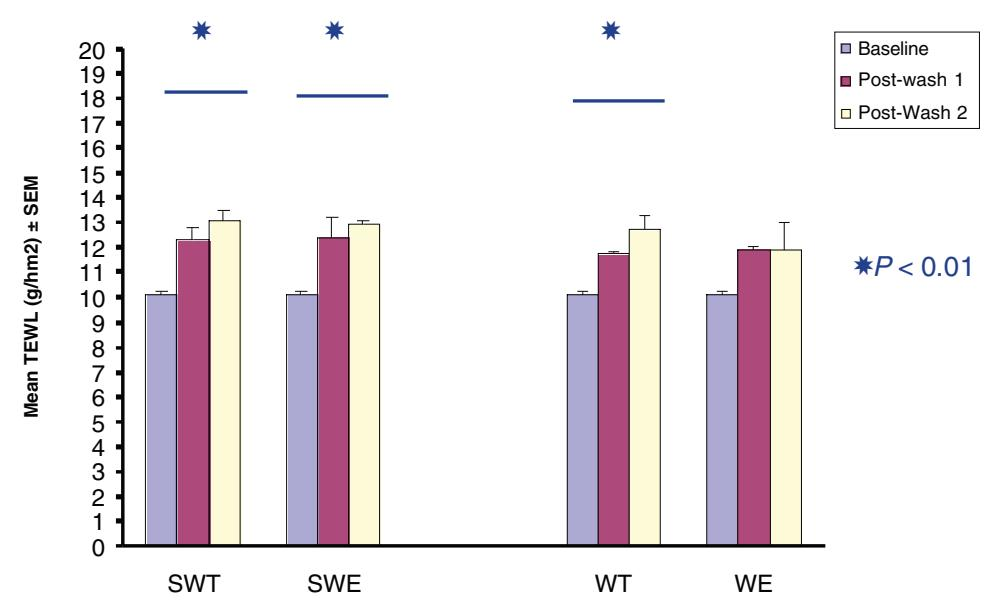
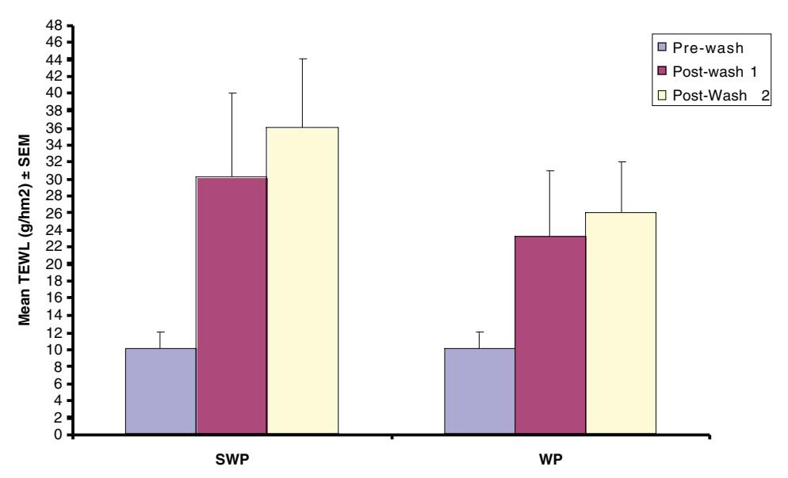
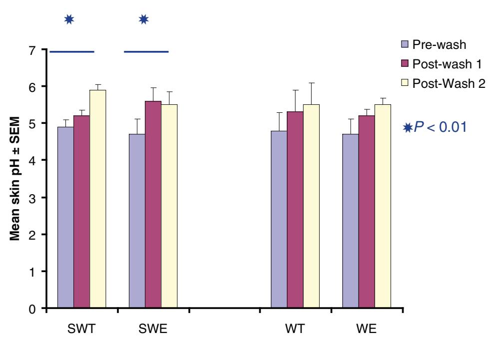
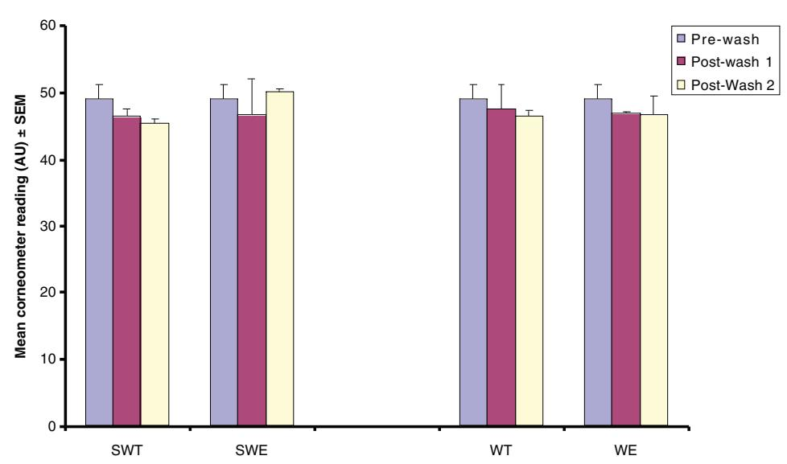

## **WOUND CARE**

# *The Effect of Washing and Drying Practices on Skin Barrier Function*

David Voegeli

**PURPOSE:** The aim of this study was to explore the potential contribution to skin damage caused by standard washing and drying techniques used in nursing.

**DESIGN:** An experimental cohort design was used, with healthy volunteers (n = 15) receiving 6 different washing and drying techniques to the volar aspect of the forearm. Subjects underwent 3 washing and drying techniques on each arm; each technique was repeated twice, separated by a 2-hour rest period.

**METHODS:** Skin integrity was assessed by measuring transepidermal water loss (TEWL), skin hydration, skin pH, and erythema. Comparisons were made between washing with soap or water alone, and drying using a towel (rubbing and patting) or evaporation. The significance of any difference was assessed by nonparametric analysis. The study was approved by the local research ethics committee, and all volunteers gave informed consent.

**RESULTS:** TEWL was seen to increase following each type of wash, and increased further following repeated washing. Drying of the skin by patting with a towel increased TEWL to give readings identical to those obtained from wet skin. There was an increase in skin pH with all washing and drying techniques, particularly when soap was used. Erythema also increased with repeated washing, particularly when soap was used. No significant changes were observed in skin hydration as measured by a corneometer, although there was a tendency for the values to decrease with washing.

**CONCLUSIONS:** These data suggest that washing with soap and water and towel drying has a significant disrupting effect on the skin's barrier function. There is tentative evidence to suggest that a cumulative effect may exist with damage increasing as washing frequency increases. Drying the skin by patting with a towel offers no advantage to conventional gentle rubbing as it leaves the skin significantly wetter and at greater risk of frictional damage.

# ■ **Introduction**

The promotion and maintenance of skin integrity remains one of the most common challenges facing healthcare professionals. Estimates suggest that basic skin care, consisting of washing and drying patients, accounts for 12% to 17% of total nursing time in a typical acute care setting.1 However,

this activity increases significantly during the care of individuals with urinary or fecal incontinence, as washing and drying forms the cornerstone of skin care for this group, in order to prevent irritation and skin breakdown. Globally it is suggested that over 200 million people suffer from significant urinary incontinence, and therefore are at risk of skin breakdown.2 In the United Kingdom alone, Durrant and Snape3 suggest that 50% of nursing home residents have urinary incontinence, and overall incidence rates of 40% to 70% in the UK elderly population are reported by the Royal College of Physicians.4 Early work by Lyder5 claimed that perineal dermatitis and skin breakdown occurs in 35% of hospitalized elderly patients with incontinence, rising to 41% of individuals in long-term care settings, demonstrating the significance of this problem.

The process of washing is designed to remove debris from the skin surface, by both a mechanical action, flushing away particles, and through a direct chemical action. However this may cause unnecessary drying of the skin by excessive removal of skin oils and accelerating transepidermal water loss (TEWL) by evaporation.6 Soap and water are frequently used due to convenience and low cost. Soaps are water-soluble sodium or potassium salts of fatty acids that are treated with a strong alkali and act as surfactants.7 Additional surfactants are often added to soaps to decrease the surface tension of the water, making it a better wetting agent, and allowing the water within the soap to gain access to organic debris. Sodium lauryl sulphate (SLS) is a synthetic surfactant that is frequently added to commercial soap preparations.8 However, anionic surfactants, such as SLS, are potent skin irritants and have been shown to induce dermatitis in the research setting.9 Surfactants may also bind to the keratin in the epidermal cells causing denaturation of cell membranes and an irritant response. These findings suggest that frequent contact with soap preparations

- **David Voegeli, PhD, BSc, RN,** Continence Technology & Skin Health Group, School of Nursing & Midwifery, University of Southampton, UK.

Corresponding author: David Voegeli, PhD, BSc, RN, Continence Technology & Skin Health Group, School of Nursing & Midwifery, University of Southampton, B Level (11) South Block, Southampton General Hospital, Tremona Road, Southampton, UK SO16 6YD (D.Voegeli@soton.ac.uk).

**84** J WOCN ■ January/February 2008 Copyright © 2008 by the Wound, Ostomy and Continence Nurses Society

may increase the risk of skin breakdown in the clinical setting, particularly among vulnerable individuals.

Soaps may adversely affect the skin by removing natural oils.10 The potentially damaging drying effect of soap in incontinent patients has been highlighted.11 Drying of the skin is significant since both excessively dry and wet skin impairs barrier function. Soaps (and some cleansers) also raise the alkalinity of the skin,12 thereby negating the protective influence of the acid mantle, and the balance of resident flora on the skin.13 Increasing the pH of the skin may enhance the risk of skin colonization by potentially pathogenic microorganisms, which may ultimately invade the skin should the barrier function be disturbed.

It is important that the skin is carefully dried after washing to avoid maceration, undue cooling, and to maintain patient comfort. The mechanical action involved in drying the skin is suggested to adversely affect barrier function and upregulate proinflammatory cytokine release,14 although the literature on this subject is limited.15 The capillary action of the towel wicks water away from the surface and various authors have suggested drying the skin gently, patting it rather than rubbing to reduce frictional damage, particularly in the case of fragile skin.16-18

Skin cleansers provide an alternative means to promote skin hygiene and have been extensively reviewed.19 They may reduce some of the adverse effects of soap, due to their chemical composition, and help to maintain a pH level that minimizes barrier disruption. Not surprisingly, due to the manufacturers' claims that these products save nursing time and reduce the incidence of skin breakdown, most studies that exist concerning skin care involve the use of proprietary cleansers. A number of studies have attempted to compare the use and effect of skin cleansers with soap and water.20-23 However, weaknesses in the design of these studies are common, such as lack of randomization, small sample sizes, inadequate controls, and poorly defined, subjective, or inappropriate outcome measures. Thus while it might appear that existing clinical evidence favors the use of cleansers versus soap and water, little robust information is available to guide practitioners in the choice of product or skin care regime, or to determine if a particular product is more suitable than another under different conditions such as fecal incontinence.24 More recent work has focused on the economic benefits of cleansers and provides another dimension to consider when choosing products or developing skin care regimes.25 Thus any protocols that do exist for skin care tend to be based on clinical experience, rather than empirically derived quality evidence.

The most common recommendation for general skin care in the nursing literature continues to be the use of gentle washing with soap and warm water and towel drying.19 However, this is less common in North American literature, where the clear distinction between routine cleansing/ hygiene regimes and protocols for the skin care of individuals with urinary or fecal incontinence exists.25,26

Because patients with urinary and/or fecal incontinence may receive skin care interventions following every incontinence episode, their skin may be subjected to as many as 12 episodes of cleansing within a 24-hour period. The objective of this study was to quantify the effect of standard soap and water skin care practices on the skin's barrier function.

# ■ **Methods**

### *Design*

An experimental cohort design was used in this study. Volunteers acted as their own controls, receiving all washing techniques to different sites on their arms. The same washing technique was received at the same site in each volunteer to minimize variation in response due to difference in anatomical site. The volar aspect of the forearm was chosen because it permits easy access and is the site most commonly used for dermatological investigation, thus facilitating direct comparison with other studies.

Skin barrier function was assessed by measuring TEWL. The TM300 instrument (Courage & Khazaka, Germany) was used to measure TEWL. This involves applying an open-chamber probe to the surface of the skin. The chamber contains 2 electrodes, and as water passes through the skin and into the chamber it is sensed by the electrodes and converted into a signal that is processed by the manufacturer's software. This technique has been used extensively in dermatological and cosmetic research, and enables an assessment of the functional efficiency of the skin (epidermal) barrier to be made. Disruption of the barrier function leads to an increase in water loss through the skin, which is detected as an increase in TEWL readings. Thus the measurement of TEWL has been demonstrated to be a reliable indicator of skin barrier function and the health of the epidermis.27,28

Skin hydration was assessed using a corneometer (model CM825, Courage & Khazaka, Germany). This instrument measures the electrical capacitance of the skin, with a reduction in hydration producing a reduction in capacitance, and has become the standard measure of skin hydration in dermatological research.29 Skin surface pH was assessed using a standard skin pH electrode (model PH905, Courage & Khazaka, Germany).

Prior to undertaking this study clinical areas were visited and samples of water and soap about to be used to wash patients were taken to ascertain water temperature, pH, and the pH of the soap used. The soap pH was measured by moistening a skin pH electrode (PH905, Courage & Khazaka, Germany) and placing it on the surface of a newly opened bar of soap, with the mean of 5 readings being used. These results were used to inform the main study. All instruments were calibrated according to the manufacturer's instructions weekly.

#### *Subjects*

Fifteen healthy female volunteers aged 18 to 65 years (Mean age ± SD = 27.5 ± 10.6 years) were recruited by advertise-

ment from the local student population. Exclusion criteria were: (1) preexisting medical conditions known to affect the dermal vasculature such as diabetes mellitus, peripheral vascular disease, Raynaud's phenomenon; (2) current or recent treatment with any vasoactive medication, including beta-blockers, nitrates, calcium channel blockers, ACE inhibitors, corticosteroids; (3) preexisting dermatological conditions; (4) self-reported sensitive skin; or (5) inability to give informed written consent. Approval for this study was obtained from the Local Research Ethics Committee (LREC no 04/Q1702/12) and all volunteers were required to give informed consent prior to their involvement.

#### *Study Protocol*

All studies were conducted within dedicated clinical research facilities enabling environmental temperature and humidity to be maintained at 21 ± 2°C and 40 ± 5% respectively. Prior to commencing the study the volunteers rested in a semisupine position to acclimatize to the surroundings for a period of 20 minutes.

Three squares (30 × 30 mm each) were marked on the volar aspect of each forearm of each volunteer, separated by a minimum distance of 20 mm. Each volunteer received 1 of 6 different washing/drying techniques in each marked area, 3 on each arm, and each technique being repeated twice, separated by a period of 2 hours (Table 1). This timescale was chosen to reflect the normal clinical practice of checking incontinent patients every 2 hours. A bar of standard issue hospital soap (NHS Supplies, United Kingdom) was used (pH 9) throughout the study, and tap water was drawn from the hospital supply and maintained at a constant temperature of 37°C using a water bath (Fisher Scientific, United Kingdom). Towel drying was completed using a standard, freshly laundered hospital-issue cotton towel. Skin integrity was assessed by measuring TEWL, skin hydration, and skin pH before any intervention (baseline) and immediately following each wash. Comparisons were made between washing with soap or water alone, and dry-

#### **TABLE 1.**

#### **Washing and Drying Techniques Used in Studya**

#### **Washing Technique**

- **1** Washing using soap and water, towel drying by gentle rubbing
- **2** Washing using soap and water, drying by evaporation
- **3** Washing using plain water, towel drying by gentle rubbing
- **4** Washing using plain water, drying by evaporation
- **5** Washing using soap and water, towel drying by patting
- **6** Washing using plain water, towel drying by patting

**a**Six washing and drying techniques were compared. Three squares (30 × 30 mm each) were marked on the volar aspect of each forearm of each volunteer. All volunteers received one of the different washing and drying techniques in each marked area.

ing using a towel (rubbing and patting) or evaporation (cool air flow).

#### *Outcome Measures*

The main outcome measures in this study were differences in biophysical measurements of skin barrier function (TEWL, corneometer, and pH) before and after each washing/drying technique. The measurement of TEWL is based on the estimation of the water vapor pressure gradient in the air layer immediately adjacent to the skin and is calculated as the amount of water vapor evaporating per unit time per unit area (g/hm2). The corneometer probe acts as a capacitor, which is a device for storing electrical charge. Its capacitance is proportional to the dielectric constant of the skin—the greater the water content, the larger the dielectric constant—and results are measured as arbitrary corneometer units.

### *Data Analysis*

Preliminary data using the measures of skin barrier function suggested that a change of 25% was detectable using 15 subjects with 80% power and significance at *P* < .05 level. A nonnormal distribution of data was assumed and therefore nonparametric tests were utilized. Between individual differences were investigated using a Mann-Whitney test and overall differences between the washing and drying techniques were examined using a Kruskall-Wallis test. Data are expressed as the mean ± SEM unless stated otherwise.

# ■ **Results**

#### *TEWL*

A significant rise in TEWL was seen following each type of washing and drying technique (*P* < .05). The initial increase in TEWL was greater when soap was used, rather than plain water, and was seen to increase further following repeated washing, particularly in combination with towel drying (Figure 1). In the case of washing with soap and water and towel drying by rubbing, TEWL rose from 10.1 ± 0.5 to 12.3 ± 0.8 g/hm2 following the first wash, and increased further to 13.1 ± 0.2 g/hm2 after the second wash (*P* < .01). A similar pattern was observed with the soap and water/ evaporation drying, with TEWL increasing to 12.4 ± 0.8 g/hm2 after the first wash and 12.9 ± 0.2 g/hm2 following the second wash (*P* < .01). Similar results were obtained with the use of plain water. In combination with towel drying, TEWL rose to 11.7 ± 0.15 g/hm2 following the first wash, and increased further to 12.7 ± 0.6 g/hm2 after the second wash (*P* < .01). An initial increase in TEWL was seen following the first wash using plain water and drying by evaporation (10.1 ± 0.5 rising to 11.9 ± 0.1 g/hm2 *P* < .01). However, no further increase was observed following the second wash. Drying of the skin by patting with a towel dramatically increased TEWL to give readings similar to those obtained from wet skin, and it was observed that these readings took 1.5 hours to return to baseline values. Pat drying caused an

**FIGURE 1. Transepidermal water loss (TEWL) measurements following repeated washing.** TEWL was measured for 1 minute at baseline, and immediately following each washing intervention. The results shown represent the mean values ± SEM. In all cases a significant increase in TEWL was seen following wash 1 (*P* < .01). The overall increase in TEWL following repeated washing was significant following the use of soap or a towel (*P* < .01).

SWT = Soap and water wash, towel drying by rubbing

SWE = Soap and water wash, drying by evaporation (cold air flow)

WT = Plain water wash, towel drying by rubbing

WE = Plain water wash, drying by evaporation (cold air flow)

increase in TEWL from a baseline of 12.1 ± 2.7 to 30.1 ± 10.0 g/hm2 for soap and water, and from 13.5 ± 3.7 to 23.2 ± 7.6 g/hm2 for water alone (Figure 2).

#### *Skin pH*

Washing with soap and water caused a significant increase in skin pH at the end of the second wash (*P* < .01). Skin pH rose from 4.9 ± 0.2 to 6.0 ± 0.15 with towel drying, and from 4.7 ± 0.4 to 6.4 ± 0.3 following drying by evaporation (Figure 3). No significant changes were seen using water alone.

#### *Skin Hydration*

No significant changes were observed in skin hydration (corneometer), although there was a tendency for the values to decrease with washing (Figure 4).

# ■ **Discussion**

The aim of this study was to investigate the effects of washing with soap and water and towel drying on skin barrier function in a group of healthy volunteers. Various combinations of washing and drying techniques were compared, consisting of the use of soap and water, water alone, and drying using a towel (rubbing and patting) or by evaporation. These methods were chosen as they represent the most common form of skin care provided in the United Kingdom, particularly in individuals with urinary incontinence.19 To date there has been little examination of this basic aspect of care and limited objective evidence on which to base or compare practice.

The use of soap disrupted skin barrier function following a single wash, as evidenced by the increase in TEWL and pH. Furthermore this disruption was seen to be extended by repeating the wash 2 hours after the initial application, and the change persisted for several hours. These results are in agreement with earlier work by Grunewald and colleagues30 who examined the effect of repeated washing of the skin on barrier function. This effect may be partly explained by the removal of the protective surface layer of lipid that helps regulate TEWL. The incremental increase in disruption seen after each wash supports the concept of a cumulative skin response to repeated irritation.30 Similarly Malten31 proposed that damage to the skin barrier can be compensated for providing there is sufficient time between insults, but that the frequent, accumulative exposure to low-grade irritants (as would occur in the care of an individual with incontinence) does not allow adequate time for barrier repair, leading to an inflammatory response and skin breakdown. The use of plain water also caused an increase in the rate of TEWL, although this was less pronounced when cold air drying was used. Water alone has been shown to be capable

**FIGURE 2. Transepidermal water loss (TEWL) measurements following towel drying using a gentle patting technique.** TEWL was measured for 1 minute at baseline, and immediately following washing with either soap and water or water alone, and then drying the area by patting with a towel until the volunteer stated their skin felt dry. The results shown represent the mean values ± SEM. The values recorded were significantly higher than those obtained in the rest of the study (*P* < .01) and show that the skin had been left wet.

**FIGURE 3. Changes in skin pH following repeated washing.** Mean skin surface pH was recorded following each washing/drying technique. Washing with soap and water caused a significant increase in skin pH at the end of the second wash (*P* < .01). No significant changes were seen using water alone.

**FIGURE 4. Measurement of skin hydration (corneometry) following washing techniques.** Stratum corneum hydration was assessed before and after each washing technique by corneometry. No significant changes in hydration were observed over the course of the study.

of eliciting irritant skin responses, particularly as the temperature of the water increases.32,33 However the changes seen when using water alone could be attributed to the physical rubbing action that occurred during the washing procedure, rather than any direct irritant effect of the water itself.

The use of soap was also shown to have a direct chemical effect on the skin, causing an increase in pH. This only occurred following the use of soap, and was unaffected by drying method. This suggests that the soap was incompletely removed following the wash, leaving alkaline residues which would contribute to the loss of the protective acid mantle of the skin.34 These changes in pH have been shown to remain for a considerable time, even with as little as 2 very short washing procedures per day.13 These changes were accompanied by a slight reduction in skin hydration, as shown by the drop in corneometer readings. Although no significance could be attributed to this, considered in the context of the other results it would suggest that if followed for a longer time period, an overall dehydrating effect would be observed, further compounding the disruption to skin health.

Towel drying using a rubbing method caused a significant increase in TEWL either with the use of soap or plain water, suggesting that this directly damages the stratum corneum and skin barrier. Drying the skin by patting with a towel would appear to offer no advantage to conventional gentle rubbing as it left the skin wet for at least 1.5 hours. This is a clinically important finding, demonstrating that the drying technique used may significantly influence the skin microclimate leading to a rise in moisture. This could potentially increase the risk of maceration and friction damage.

# ■ **Conclusion**

These data suggest that washing with soap and water and towel drying has a significant disrupting effect on skin barrier function, and that the level of disruption increases with repeated washing. Drying the skin by patting with a towel offers no particular advantage to conventional gentle rubbing, as the skin is left significantly wetter, and at greater risk of maceration and friction damage. This suggests that frequent washing of dependent patients, particularly involving towel drying, may lead to a disruption in skin barrier function and consequently to skin breakdown. Therefore the routine washing of patients following each episode of urinary incontinence needs to be reevaluated, and washing frequencies reduced where possible. Attention to accurate nursing assessment of incontinence patterns, and the effective use of absorbent products to keep the skin dry, can do much to assist this aim. Similarly the routine use of normal soap bars in skin care interventions should be discouraged. Further research is required to establish the nature of these findings in a clinical setting, and in the objective evaluation of the many nonsoap skin cleanser alternatives available.

Source of Support: This work was funded by a postdoctoral nursing research fellowship awarded by the Smith & Nephew Foundation.

# ■ **References**

- 1. Walsh B, Steiner A, Warr J, Sheron L, Pickering R. Nurse-led inpatient care: opening a black box. *Int J Nurs Stud.* 2003;40: 307-319.
- 2. Abrams P, Cardozo L, Khoury SE, Wein AJ, eds. *Incontinence: Report of the Third International Consultation.* Health Publications Ltd, Plymouth, UK. 2005.

- 3. Durrant J, Snape J. Urinary incontinence in nursing homes for older people. *Age Ageing.* 2003;31(1):12-18.
- 4. Mian S, Wagg A, Potter J. Royal College of Physicians National Audit of Continence Care for Older People. RCP, London; 2005. Available online at: www.rcplondon.ac.uk/college/ceey/ GenericHospital2005.pdf.
- 5. Lyder CH. Perineal dermatitis in the elderly: a critical review of the literature. *J Gerontol Nurs.* 1997;23(12):5-10.
- 6. Gooch J. Skin hygiene. *Prof Nurs.* 1989;5(1):13-18.
- 7. Abbas S, Weiss Goldberg J, Massaro M. Personal cleanser technology and clinical performance. *Dermatol Ther.* 2004;17:35-42.
- 8. Kirsner RS, Froelich CW. Soap and detergents: understanding their composition and effect. *Ostomy Wound Manage.* 1998; 44(3A Suppl):62s-70s.
- 9. Held E, Lund H, Agner T. Effects of different moisturizers on SLS-irritated human skin. *Contact Dermatitis.* 2001;44:229-234.
- 10. Baillie L, Arrowsmith V. Meeting elimination needs. *Developing Practical Nursing Skills,* 2nd ed. Hodder Arnold, London; 2001, p. 277-299.
- 11. Spiller J. For whose sake—patient or nurse? Ritual practices in patient washing. *Prof Nurs.* 1992;7(7):432-434.
- 12. Korting HC, Kober M, Mueller M, Braun-Falco O. Influence of repeated washings with soap and synthetic detergents on pH and resident flora of the skin of forehead and forearm. *Acta Dermato-Venerologica.* 1987;67:41-47.
- 13. Korting HC, Braun-Falco O. The effect of detergents on skin pH and its consequences. *Clin Dermatol.* 1996;14:23-27.
- 14. Nickoloff BJ, Naidu Y. Perturbation of epidermal barrier function correlates with irritation of cytokine cascade in human skin. *J Am Acad Dermatol.* 1994;30:535-546.
- 15. Huh CH, Seo KI, Kim SD, Han JH, Eun HC. Biophysical changes after mechanical injury of the stratum corneum in normal skin. *Contact Dermatitis.* 2002;46:24-28.
- 16. Le Lievre S. The management and prevention of incontinence dermatitis. *Br J Community Nurs.* 2001;6(4):180-185.
- 17. Marks R. *Sophisticated Emollients.* 2nd ed. Stuttgart: Georg Thieme Verlag; 2001.
- 18. Fiers SA. Breaking the cycle: the etiology of incontinence dermatitis and evaluating and using skin care products. *Ostomy Wound Manage.* 1996;42(3):32-34,36,38-40.
- 19. Ersser SJ, Getliffe K, Voegeli D, Regan S. A critical review of the inter-relationship between skin vulnerability and urinary incontinence and related nursing intervention. *Int J Nurs Stud.* 2005;42:823-835.

- 20. Dealey C. Pressure sores and incontinence: a study evaluating the use of topical agents in skin care. *J Wound Care.* 1995;4(3): 103-105.
- 21. Whittingham K. Cleansing regimens for continence care. *Profess Nurs.* 1998;14(3):167-172.
- 22. Cooper P. The use of clinisan in the skin care of the incontinent patient. *Br J Nurs.* 2000;9(7):445-448.
- 23. Cooper P. Gray D. Comparison of two patients in care regimens for incontinence. *Br J Nurs.* 2001;10(6):6-20.
- 24. Byers PH, Ryan PA, Regan MB, Shields A, Carta GA. Effects of incontinence care cleansing regimens on skin integrity. *J Wound Ostomy Continence Nurs.* 1995;22(4):187-192.
- 25. Bliss DZ, Zehrer C, Savik K, Smith G, Hedblom E. An economic evaluation of four skin damage prevention regimens in nursing home residents with incontinence: economics of skin damage prevention. *J Wound Ostomy Continence Nurs.* 2007;34(2):143-152.
- 26. Gray M, Bliss DZ, Doughty DB, Ermer-Seltun J, Kennedy-Evans KL, Palmer MH. Incontinence-associated dermatitis: a consensus. *J Wound Ostomy Continence Nurs.* 2007;34(1):45-54.
- 27. Fluhr JW, Feingold K, Elias P. Transepidermal water loss reflects permeability barrier status: validation in human and rodent in vivo and ex vivo models. *Expl Dermatol.* 2006;15:483-492.
- 28. Primivera G, Fluhr JW, Berardesca E. Standardization of measurements and guidelines. In: Fluhr JW, Elsner P, Berardesca E, Maibach H, eds. *Bioengineering of the Skin. Water and the Stratum Corneum.* 2nd ed. Boca Raton, FL: CRC Press; 2005.
- 29. Berardesca E, Fidelli D, Borroni G, Rabbrosi G, Maibach HI. In vivo hydration and water retention capacity of stratum corneum in clinically uninvolved skin in atopic and psoriatic patients. *Acta Dermatol Venereol.* 1990;70:400-404.
- 30. Grunewald AM, Gloor M, Gehring W, Kleesz P. Damage to the skin by repetitive washing. *Contact Dermatitis.* 1995;32: 225-232.
- 31. Malten KE. Thoughts on irritant contact dermatitis. *Contact Dermatitis.* 1981;7:238-247.
- 32. Berardesca E, Vignoli GP, Distante F, Brizzi P, Rabbiosi G. Effects of water temperature on surfactant-induced skin irritation. *Contact Dermatitis.* 1995;32:83-87.
- 33. Ramsing DW, Agner T. Preventive and therapeutic effects of a moisturizer—an experimental study of human skin. *Acta Dermato-Venereologica.* 1997;77:335-337.
- 34. Wortzman MS. Evaluation of mild skin cleansers. *Dermatol Clin.* 1991;9:35-44.

# **Call for Authors: Wound Care**

- Review articles, case studies, case series, and original research reports focusing on the potential role of unprocessed honey in wound healing
- Review articles or original research reports focusing on the antibacterial properties of silver
- Continuous Quality Improvement projects, research reports, or institutional case studies focusing on innovative approaches to reduce facility-acquired pressure ulcers
- Case studies, case series, review articles, and original research reports focusing on topical therapies for pressure ulcers, vascular ulcers, or neuropathic (diabetic foot) ulcers
- Original research reports focusing on the histologic and clinical effects of negative pressure wound therapy